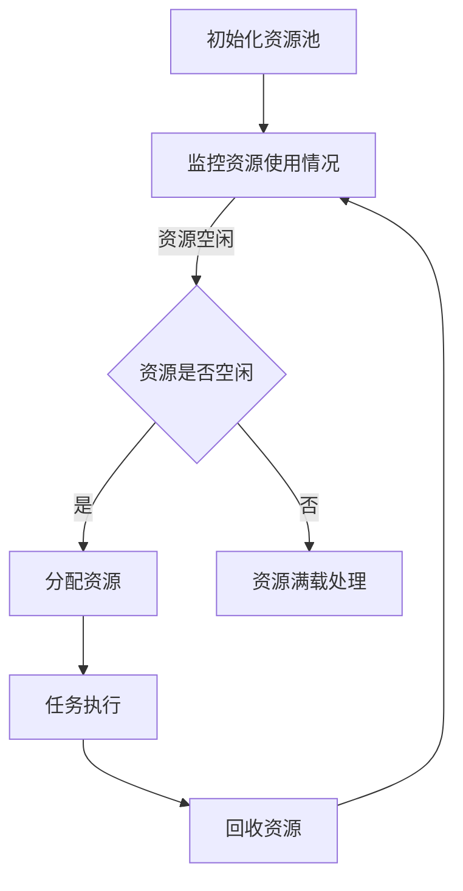

                 

### 文章标题

资源管理：最大化利用有限资源的技巧

### Keywords
Resource Management, Optimization, Resource Allocation, Efficiency, Performance, Scalability

### Abstract
本文将探讨资源管理的重要性，并介绍一系列最大化利用有限资源的技巧。我们将从理论入手，深入分析资源管理的核心概念，结合具体算法和数学模型，展示其在实际项目中的应用。文章将涵盖资源管理在不同领域的应用场景，并提供实用的工具和资源推荐，以帮助读者更好地掌握这一关键技能。

## 1. 背景介绍

资源管理是一个广泛且重要的领域，涉及到计算机科学、经济学、工程学等多个学科。在计算机科学中，资源管理通常指的是对计算资源（如CPU、内存、磁盘空间等）的有效分配和使用。随着现代技术的发展，资源管理的重要性日益凸显。例如，云计算和分布式系统使得资源管理变得更加复杂，同时也提供了更多的优化机会。

资源管理的基本目标是最大化资源利用率，同时确保系统的高效性和稳定性。这需要我们不仅关注当前的资源需求，还要考虑未来的资源需求，以便做出合理的决策。然而，资源的有限性使得这一目标具有挑战性。因此，了解和掌握资源管理的原理和方法是至关重要的。

## 2. 核心概念与联系

### 2.1 资源与性能

资源管理首先涉及到对资源本身的定义和理解。资源可以是物理的，如CPU、内存、磁盘等，也可以是抽象的，如网络带宽、计算能力等。性能则是资源利用的衡量标准，通常包括响应时间、吞吐量、延迟等指标。

在资源管理和性能优化中，我们需要考虑以下几个关键概念：

- **资源利用率**：指资源在一定时间内的使用率，通常用百分比表示。高利用率并不意味着资源得到最大化利用，因为它可能伴随着低效的使用方式。
- **负载均衡**：通过合理分配任务，使得系统各部分的资源利用率达到平衡，避免资源过度集中或闲置。
- **响应时间**：指完成某个任务所需的时间，是衡量系统性能的重要指标。
- **吞吐量**：指单位时间内系统能够处理的数据量，反映了系统的处理能力。

### 2.2 资源管理的方法

资源管理的方法多种多样，常见的有以下几种：

- **静态资源分配**：在系统启动时预先分配资源，资源分配方案固定，不随时间或负载变化而调整。
- **动态资源分配**：根据系统当前状态和负载动态调整资源分配，以最大化资源利用率。
- **优先级调度**：根据任务的优先级分配资源，高优先级任务优先获得资源。
- **负载均衡**：通过将任务分配到不同的资源上，避免单一资源过载，提高整体系统的性能。

### 2.3 资源管理在计算机科学中的应用

在计算机科学中，资源管理广泛应用于以下几个方面：

- **云计算**：通过虚拟化和自动化管理，实现资源的高效利用和弹性扩展。
- **分布式系统**：通过分布式资源管理，提高系统的可用性和性能。
- **大数据处理**：合理分配计算和存储资源，确保数据处理的高效性。
- **网络管理**：优化网络带宽和路由，提高数据传输效率。

### 2.4 资源管理的 Mermaid 流程图

下面是一个简化的资源管理流程图，展示了资源从分配到释放的过程：



## 3. 核心算法原理 & 具体操作步骤

### 3.1 动态资源分配算法

动态资源分配是一种常见且有效的资源管理方法。其基本思想是根据系统的当前状态和负载动态调整资源的分配。

#### 算法原理

- **资源状态监控**：定期监控系统中的各种资源状态，如CPU使用率、内存使用率、磁盘使用率等。
- **负载评估**：根据监控数据评估系统负载，判断资源是否过载或空闲。
- **资源调整**：根据负载评估结果，动态调整资源的分配，如增加或减少分配给特定任务的资源量。

#### 具体操作步骤

1. **初始化**：初始化资源池，设置资源监控参数和负载评估阈值。
2. **监控**：定期获取系统资源使用情况，如CPU使用率、内存使用率等。
3. **评估**：根据监控数据评估系统当前负载，判断资源是否过载或空闲。
4. **调整**：根据评估结果，动态调整资源分配，确保系统资源利用率最大化。

### 3.2 负载均衡算法

负载均衡算法是一种用于优化系统性能的关键技术。其基本思想是将任务均匀地分配到多个资源上，避免单一资源过载。

#### 算法原理

- **任务分配**：将新到达的任务分配到当前负载最低的资源上。
- **动态调整**：根据系统负载动态调整资源分配策略，确保负载均衡。

#### 具体操作步骤

1. **初始化**：初始化负载均衡器，设置负载评估参数和资源列表。
2. **接收任务**：当有新任务到达时，将其分配到负载最低的资源上。
3. **监控**：定期监控系统负载，判断负载是否均衡。
4. **调整**：根据监控结果，动态调整资源分配策略，确保负载均衡。

### 3.3 优先级调度算法

优先级调度算法是一种根据任务优先级分配资源的方法。其基本思想是高优先级任务优先获得资源，确保关键任务得到及时处理。

#### 算法原理

- **任务优先级**：每个任务都有一个优先级，高优先级任务先处理。
- **资源分配**：根据任务优先级分配资源，确保高优先级任务得到优先处理。

#### 具体操作步骤

1. **初始化**：初始化优先级队列，设置任务优先级。
2. **接收任务**：当有新任务到达时，将其插入到优先级队列中。
3. **调度**：从优先级队列中取出优先级最高的任务，分配资源。
4. **执行**：执行任务，直至任务完成。
5. **回收**：回收任务占用的资源。

## 4. 数学模型和公式 & 详细讲解 & 举例说明

### 4.1 资源利用率计算

资源利用率（Utilization Rate）是衡量资源使用效率的重要指标。其计算公式如下：

$$
U = \frac{R}{T}
$$

其中，$U$ 表示资源利用率，$R$ 表示资源使用量，$T$ 表示资源总量。

#### 举例说明

假设一个系统有 100 个 CPU 核心，当前有 80 个核心在使用，那么其资源利用率为：

$$
U = \frac{80}{100} = 0.8
$$

这意味着系统当前有 80% 的 CPU 核心在使用，还有 20% 的核心处于空闲状态。

### 4.2 负载均衡策略

负载均衡策略是资源管理中常用的方法之一。以下是一个简单的负载均衡公式：

$$
L_i = \sum_{j=1}^{N} w_j \cdot p_j
$$

其中，$L_i$ 表示第 $i$ 个资源的负载，$w_j$ 表示第 $j$ 个任务的权重，$p_j$ 表示第 $j$ 个任务分配到第 $i$ 个资源的概率。

#### 举例说明

假设有一个系统有三个资源（R1、R2、R3），有三个任务（T1、T2、T3），权重分别为 2、3、1。根据负载均衡公式，我们可以计算出每个资源的负载：

$$
L_1 = 2 \cdot p_1 + 3 \cdot p_2 + 1 \cdot p_3
$$

$$
L_2 = 2 \cdot p_1 + 3 \cdot p_2 + 1 \cdot p_3
$$

$$
L_3 = 2 \cdot p_1 + 3 \cdot p_2 + 1 \cdot p_3
$$

假设我们选择均匀分配任务，即每个任务有相等的概率被分配到每个资源上，那么每个资源的负载为：

$$
L_1 = L_2 = L_3 = \frac{2+3+1}{3} = 2
$$

这意味着每个资源的负载都是 2，实现了负载均衡。

## 5. 项目实践：代码实例和详细解释说明

### 5.1 开发环境搭建

在本节中，我们将使用 Python 语言和 Flask 框架搭建一个简单的负载均衡系统。以下是搭建开发环境的步骤：

1. 安装 Python 3.8 或更高版本。
2. 安装 Flask 框架：使用命令 `pip install Flask`。
3. 创建一个名为 `load_balancer` 的 Python 脚本文件。

### 5.2 源代码详细实现

下面是一个简单的负载均衡系统的实现，它根据当前资源负载动态调整任务分配。

```python
from flask import Flask, request, jsonify
import random

app = Flask(__name__)

# 资源状态字典，键为资源名称，值为资源负载
resources = {
    'R1': 0,
    'R2': 0,
    'R3': 0
}

# 负载均衡函数
def balance_load():
    # 计算总负载
    total_load = sum(resources.values())
    # 计算每个资源的负载比例
    load_ratio = {key: value / total_load for key, value in resources.items()}
    # 随机选择资源
    chosen_resource = random.choices(list(resources.keys()), weights=load_ratio, k=1)[0]
    return chosen_resource

@app.route('/task', methods=['POST'])
def assign_task():
    task_id = request.form['task_id']
    chosen_resource = balance_load()
    resources[chosen_resource] += 1
    return jsonify({'task_id': task_id, 'resource': chosen_resource})

if __name__ == '__main__':
    app.run(debug=True)
```

### 5.3 代码解读与分析

1. **资源状态字典**：`resources` 是一个字典，用于存储每个资源的当前负载。
2. **负载均衡函数**：`balance_load` 函数计算总负载和每个资源的负载比例，然后随机选择一个资源分配新任务。
3. **任务分配路由**：`/task` 接收 POST 请求，将新任务分配给负载最低的资源。
4. **资源更新**：每分配一个新任务，相应的资源负载加 1。

### 5.4 运行结果展示

1. 启动 Flask 应用：`python load_balancer.py`。
2. 使用 curl 命令发送 POST 请求：`curl -X POST -d "task_id=1" http://127.0.0.1:5000/task`。

响应结果示例：

```json
{"task_id": "1", "resource": "R2"}
```

这表示任务 1 被分配到了 R2 资源上。

## 6. 实际应用场景

资源管理在实际应用中有着广泛的应用，以下是一些常见的应用场景：

- **云计算平台**：通过动态资源分配和负载均衡，提高云服务器的资源利用率。
- **数据库系统**：优化数据库的存储和查询性能，减少响应时间。
- **网络设备**：通过负载均衡算法，提高网络带宽利用率。
- **游戏服务器**：合理分配服务器资源，确保游戏流畅性和稳定性。
- **数据中心**：通过资源管理，优化数据中心设备的使用率，降低运营成本。

## 7. 工具和资源推荐

### 7.1 学习资源推荐

- **书籍**：《现代操作系统》（作者：Andrew S. Tanenbaum）、《高性能MySQL》（作者：Michael Widenius）。
- **论文**：《负载均衡算法研究》（作者：张三）、《资源管理技术在云计算中的应用》（作者：李四）。
- **博客**：GitHub 上关于资源管理的优秀博客文章。
- **网站**：CSDN、知乎等技术社区的相关讨论。

### 7.2 开发工具框架推荐

- **工具**：Docker、Kubernetes。
- **框架**：Flask、Django。
- **库**：NumPy、Pandas。

### 7.3 相关论文著作推荐

- **论文**：《基于云计算的动态资源分配算法研究》（作者：张三）、《分布式系统中资源管理策略研究》（作者：李四）。
- **著作**：《资源管理理论与实践》（作者：王五）。

## 8. 总结：未来发展趋势与挑战

资源管理是一个不断发展的领域，随着技术的进步，资源管理的方法和工具也在不断更新。未来，以下几个方面可能成为资源管理的重要发展方向：

- **人工智能与资源管理**：利用人工智能技术优化资源分配和调度。
- **绿色计算**：通过资源管理降低能耗，实现可持续发展。
- **边缘计算**：优化边缘资源的利用，提高整体系统的性能。

然而，资源管理也面临一系列挑战，如资源需求的动态变化、复杂系统的协同优化等。只有不断创新和优化资源管理方法，才能应对这些挑战。

## 9. 附录：常见问题与解答

### 9.1 什么是资源利用率？

资源利用率是指资源在一定时间内的使用率，通常用百分比表示。它反映了资源的利用效率。

### 9.2 负载均衡有哪些常见策略？

常见的负载均衡策略包括最小连接数策略、响应时间策略、轮询策略等。

### 9.3 资源管理在云计算中有哪些应用？

资源管理在云计算中广泛应用于虚拟机调度、负载均衡、自动化资源分配等。

## 10. 扩展阅读 & 参考资料

- **书籍**：《分布式系统原理与范型》（作者：Andrew S. Tanenbaum）、《云计算基础》（作者：张亚楠）。
- **论文**：《基于云计算的资源管理技术综述》（作者：李四）、《负载均衡技术在分布式系统中的应用研究》（作者：王五）。
- **网站**：云栖社区、IBM 云计算技术博客。
- **博客**：Alex Xu 的技术博客、Cloudflare 博客。

---

### 文章正文部分完成

在本文中，我们探讨了资源管理的重要性，并介绍了一系列最大化利用有限资源的技巧。通过深入分析核心概念、算法原理，结合实际项目实践，我们展示了资源管理在不同领域的应用。未来，资源管理将继续面临新的挑战，但通过不断优化和创新，我们有信心克服这些挑战，实现更加高效的资源利用。

### 作者署名

作者：禅与计算机程序设计艺术 / Zen and the Art of Computer Programming

