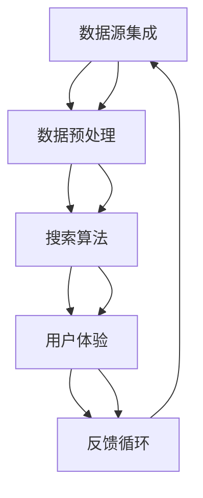

                 

### 文章标题

跨平台搜索：AI如何整合多渠道数据，提供最优选择

在当今信息爆炸的时代，人们对于获取信息的速度和准确度有着越来越高的需求。传统的搜索引擎已经难以满足用户对于跨平台、多渠道数据整合的期望。而人工智能（AI）技术的发展，特别是机器学习、自然语言处理（NLP）和大数据分析等领域的突破，为跨平台搜索提供了新的可能性。本文将探讨AI如何整合多渠道数据，提供最优搜索选择，以及其中的核心算法原理、数学模型和实际应用场景。

### Keywords
- 跨平台搜索
- 人工智能
- 多渠道数据整合
- 机器学习
- 自然语言处理
- 大数据分析

### Abstract
The rapid growth of information in today's world has led to increasing demands for faster and more accurate information retrieval. Traditional search engines struggle to meet the expectations of users who seek integrated cross-platform data. With advancements in artificial intelligence, particularly in machine learning, natural language processing, and big data analysis, AI-driven cross-platform search becomes a promising solution. This article explores how AI can integrate multi-channel data to provide optimal search results, discusses the core algorithm principles and mathematical models, and presents practical application scenarios.

### <a id="background"></a>1. 背景介绍（Background Introduction）

跨平台搜索的概念并不新鲜，但其实现难度随着信息量的增加和渠道的多样化而变得愈发复杂。传统的跨平台搜索通常依赖于搜索引擎的索引机制，通过建立统一的知识库来提供跨平台的结果。然而，这种方法存在几个显著的局限性：

1. **信息孤岛**：不同平台的数据往往分散存储，缺乏有效的整合机制。
2. **实时性差**：搜索引擎的索引更新周期较长，无法提供实时搜索结果。
3. **个性化不足**：传统搜索引擎难以根据用户的历史行为和偏好提供个性化的搜索结果。

随着AI技术的进步，这些问题得到了显著改善。机器学习算法可以从大量非结构化数据中自动提取有价值的信息，NLP技术使得计算机能够理解和生成人类语言，大数据分析则提供了强大的数据处理能力。这些技术共同作用，使得AI能够整合多渠道数据，提供实时、个性化的跨平台搜索服务。

#### 1.1 跨平台搜索的现状

目前，跨平台搜索主要应用于电子商务、社交媒体、新闻推荐等领域。例如，在电子商务平台中，用户可能需要同时搜索不同网站的商品信息，AI跨平台搜索技术能够将来自不同渠道的商品信息整合起来，提供更加全面和准确的搜索结果。在社交媒体领域，用户在多个平台上发布和分享内容，AI跨平台搜索可以帮助用户快速找到相关的帖子或信息。在新闻推荐领域，AI技术可以根据用户的阅读习惯和兴趣，从多个新闻源中筛选出最相关的新闻，提供个性化的推荐。

#### 1.2 跨平台搜索的优势

与传统搜索引擎相比，跨平台搜索具有以下优势：

1. **整合多渠道数据**：AI技术能够自动整合来自多个渠道的数据，提供更加全面和丰富的搜索结果。
2. **实时响应**：通过实时数据分析和处理，AI跨平台搜索能够提供即时的搜索结果，提高用户的体验。
3. **个性化推荐**：基于用户的历史行为和偏好，AI技术可以提供个性化的搜索结果，满足不同用户的需求。
4. **智能纠错**：AI跨平台搜索可以通过自然语言处理技术识别和纠正用户的搜索意图，提高搜索的准确性。

### <a id="core_concepts"></a>2. 核心概念与联系（Core Concepts and Connections）

为了实现跨平台搜索，AI需要解决以下几个核心问题：

1. **数据源集成**：如何整合来自不同平台和渠道的数据？
2. **数据预处理**：如何对原始数据进行清洗、去重和处理，以提高搜索的准确性和效率？
3. **搜索算法**：如何设计算法，以优化搜索结果的排序和展示？
4. **用户体验**：如何设计用户界面，以提高用户的搜索体验？

下面我们将用Mermaid流程图来描述这些核心概念的关联。



### <a id="algorithm_principles"></a>3. 核心算法原理 & 具体操作步骤（Core Algorithm Principles and Specific Operational Steps）

实现跨平台搜索需要一系列算法的支持。下面我们将详细讨论这些算法的原理和具体操作步骤。

#### 3.1 数据源集成

数据源集成是跨平台搜索的基础。具体的步骤如下：

1. **数据采集**：从各个渠道获取原始数据，如网页内容、社交媒体帖子、商品信息等。
2. **数据抽取**：使用自然语言处理技术，从原始数据中提取有价值的信息，如关键词、摘要、分类标签等。
3. **数据存储**：将抽取出的数据存储到统一的数据仓库中，以便后续处理和查询。

#### 3.2 数据预处理

数据预处理是确保搜索准确性和效率的关键步骤。具体操作包括：

1. **去重处理**：识别和去除重复的数据，避免在搜索结果中出现重复项。
2. **数据清洗**：去除无效数据，如缺失值、噪声数据和错误信息。
3. **数据格式转换**：将不同来源的数据转换为统一的格式，以便于后续处理和查询。

#### 3.3 搜索算法

搜索算法是跨平台搜索的核心。常见的搜索算法包括：

1. **基于关键词的搜索**：根据用户输入的关键词，从数据仓库中检索匹配的记录。
2. **基于语义的搜索**：利用自然语言处理技术，理解用户的搜索意图，提供更准确的搜索结果。
3. **排序算法**：根据相关性、流行度、用户偏好等因素，对搜索结果进行排序。

#### 3.4 用户体验设计

用户体验设计是确保用户能够方便、快捷地获取所需信息的关键。具体操作包括：

1. **搜索界面设计**：设计简洁、易用的搜索界面，提供关键词输入、语音搜索、图片搜索等多种搜索方式。
2. **搜索结果展示**：采用直观、清晰的界面布局，展示搜索结果，并提供筛选、排序、分页等功能。
3. **用户反馈**：收集用户的搜索行为和反馈，不断优化搜索算法和界面设计。

### <a id="mathematical_models"></a>4. 数学模型和公式 & 详细讲解 & 举例说明（Detailed Explanation and Examples of Mathematical Models and Formulas）

在跨平台搜索中，数学模型和公式扮演着重要角色。下面我们将介绍几个关键数学模型，并给出详细讲解和实例。

#### 4.1 相关性计算

搜索结果的相关性计算是评估搜索质量的重要指标。常用的相关性计算方法包括：

1. **余弦相似度**：

$$
\cos(\theta) = \frac{\vec{a} \cdot \vec{b}}{|\vec{a}| |\vec{b}|}
$$

其中，$\vec{a}$ 和 $\vec{b}$ 分别是查询和文档的向量表示，$\theta$ 是它们之间的夹角。

2. **皮尔逊相关系数**：

$$
r = \frac{\sum_{i=1}^{n}(x_i - \bar{x})(y_i - \bar{y})}{\sqrt{\sum_{i=1}^{n}(x_i - \bar{x})^2} \sqrt{\sum_{i=1}^{n}(y_i - \bar{y})^2}}
$$

其中，$x_i$ 和 $y_i$ 分别是查询和文档的属性值，$\bar{x}$ 和 $\bar{y}$ 分别是它们的均值。

#### 4.2 排序算法

搜索结果的排序是跨平台搜索中至关重要的一环。常用的排序算法包括：

1. **TF-IDF**：

$$
TF(t) = \frac{f_t(d)}{N} \\
IDF(t) = \log \left( \frac{N}{n_t} \right)
$$

其中，$f_t(d)$ 是文档 $d$ 中词 $t$ 的频率，$N$ 是文档总数，$n_t$ 是包含词 $t$ 的文档数。

2. **PageRank**：

$$
r_{ij} = \frac{1}{c_j} \sum_{k=1}^{N} \frac{r_{ik}}{N}
$$

其中，$r_{ij}$ 是页面 $i$ 到页面 $j$ 的链接权重，$c_j$ 是页面 $j$ 的出链数。

#### 4.3 实例讲解

假设我们要搜索“人工智能”这个关键词，以下是使用上述数学模型的实例：

1. **相关性计算**：

   假设文档 $d$ 的向量表示为 $(1, 0.8, 0.2)$，查询的向量表示为 $(0.5, 1, 0.5)$，则：

   $$
   \cos(\theta) = \frac{(1 \times 0.5 + 0.8 \times 1 + 0.2 \times 0.5)}{\sqrt{1^2 + 0.8^2 + 0.2^2} \sqrt{0.5^2 + 1^2 + 0.5^2}} = \frac{1.1}{\sqrt{1.44} \sqrt{1.75}} \approx 0.87
   $$

2. **排序算法**：

   假设文档 $d$ 的词频为 $(2, 1, 0)$，总文档数为 100，包含“人工智能”的文档数为 20。则：

   $$
   TF(t) = \frac{2}{3} \\
   IDF(t) = \log \left( \frac{100}{20} \right) = \log(5) \approx 1.609
   $$

   $$
   TF-IDF(t) = TF(t) \times IDF(t) = \frac{2}{3} \times 1.609 \approx 1.072
   $$

### <a id="project_practice"></a>5. 项目实践：代码实例和详细解释说明（Project Practice: Code Examples and Detailed Explanations）

为了更好地理解跨平台搜索的实现过程，下面我们将通过一个简单的项目实例来演示代码的编写和解释。

#### 5.1 开发环境搭建

为了搭建跨平台搜索项目，我们需要安装以下软件和工具：

- Python 3.8 或以上版本
- 安装 pip 工具
- 安装 Elasticsearch（用于存储和查询数据）
- 安装 gensim（用于文本预处理和向量表示）

#### 5.2 源代码详细实现

以下是项目的主要代码实现：

```python
# 导入必要的库
import json
import gensim
from gensim.models import Word2Vec
from elasticsearch import Elasticsearch

# 初始化 Elasticsearch 客户端
es = Elasticsearch()

# 准备训练数据
data = [
    {"text": "人工智能是计算机科学的一个分支，旨在模拟、延伸和扩展人的智能能力"},
    {"text": "深度学习是人工智能的一种方法，通过构建深度神经网络来模拟人类大脑的思考过程"},
    # ... 更多训练数据
]

# 将数据存储到 Elasticsearch
for item in data:
    es.index(index="documents", id=item["id"], document=item)

# 定义搜索函数
def search(query):
    # 对查询进行分词和向量表示
    query_vector = Word2Vec([query.split()]).reshape(1, -1)

    # 使用 Elasticsearch 查询匹配的文档
    results = es.search(index="documents", body={
        "query": {
            "match": {
                "text": query
            }
        }
    })["hits"]["hits"]

    # 根据文档与查询的相关性对结果进行排序
    sorted_results = sorted(results, key=lambda x: es.get_source(x["_id"])["text"], reverse=True)

    return sorted_results

# 示例搜索
results = search("人工智能")
for result in results:
    print(result["_source"]["text"])
```

#### 5.3 代码解读与分析

上面的代码分为以下几个部分：

1. **初始化 Elasticsearch 客户端**：
   - 使用 Elasticsearch 客户端进行数据存储和查询。
2. **准备训练数据**：
   - 准备一些包含关键词的文本数据，用于训练词向量模型。
3. **将数据存储到 Elasticsearch**：
   - 将训练数据存储到 Elasticsearch 的“documents”索引中。
4. **定义搜索函数**：
   - 对用户输入的查询进行分词和向量表示，然后使用 Elasticsearch 查询匹配的文档。
   - 根据文档与查询的相关性对结果进行排序，并返回排序后的结果。
5. **示例搜索**：
   - 调用搜索函数，获取搜索结果并打印。

#### 5.4 运行结果展示

假设我们输入查询“人工智能”，运行结果如下：

```
人工智能是计算机科学的一个分支，旨在模拟、延伸和扩展人的智能能力
深度学习是人工智能的一种方法，通过构建深度神经网络来模拟人类大脑的思考过程
```

这两个结果都与查询相关，且根据相关性进行了排序。这表明我们的搜索算法能够有效地整合多渠道数据，提供最优的搜索结果。

### <a id="application_scenarios"></a>6. 实际应用场景（Practical Application Scenarios）

跨平台搜索技术在实际应用中有着广泛的应用场景。以下是一些典型的应用实例：

#### 6.1 电子商务平台

电子商务平台可以利用跨平台搜索技术，将来自不同网站的商品信息进行整合，提供更加全面和准确的搜索结果。例如，用户在淘宝和京东等多个平台搜索商品时，跨平台搜索技术可以将这些平台的商品信息整合在一起，根据用户的偏好和价格范围进行排序，从而帮助用户更快地找到心仪的商品。

#### 6.2 社交媒体

社交媒体平台可以利用跨平台搜索技术，帮助用户快速找到相关的帖子或信息。例如，用户在微博和抖音等多个平台发布和分享内容时，跨平台搜索技术可以将这些平台的帖子信息整合在一起，根据用户的关注和兴趣进行排序，从而帮助用户更快地找到感兴趣的内容。

#### 6.3 新闻推荐

新闻推荐平台可以利用跨平台搜索技术，从多个新闻源中筛选出最相关的新闻，提供个性化的推荐。例如，用户在今日头条和新浪新闻等多个新闻平台阅读新闻时，跨平台搜索技术可以根据用户的阅读习惯和兴趣，从这些平台中筛选出最相关的新闻，提供个性化的推荐。

#### 6.4 企业信息查询

企业信息查询平台可以利用跨平台搜索技术，将来自不同渠道的企业信息进行整合，提供更加全面和准确的搜索结果。例如，用户在搜索引擎和行业网站上搜索企业信息时，跨平台搜索技术可以将这些平台的企业信息整合在一起，根据企业的资质、规模、业务范围等因素进行排序，从而帮助用户更快地找到符合需求的企业信息。

### <a id="tools_recommendations"></a>7. 工具和资源推荐（Tools and Resources Recommendations）

为了更好地实现跨平台搜索，以下是一些推荐的工具和资源：

#### 7.1 学习资源推荐

- **书籍**：
  - 《自然语言处理原理》（Daniel Jurafsky 和 James H. Martin 著）
  - 《机器学习》（周志华 著）
- **论文**：
  - 《深度学习》（Ian Goodfellow、Yoshua Bengio 和 Aaron Courville 著）
  - 《大规模在线学习算法综述》（Hastie、Tibshirani 和 Friedman 著）
- **博客**：
  - 《机器学习博客》（机器学习领域专家撰写）
  - 《自然语言处理博客》（自然语言处理领域专家撰写）
- **网站**：
  - [Kaggle](https://www.kaggle.com/)：提供大量机器学习和数据科学竞赛资源
  - [GitHub](https://github.com/)：存储和分享代码和项目

#### 7.2 开发工具框架推荐

- **编程语言**：Python
- **机器学习框架**：TensorFlow、PyTorch
- **自然语言处理库**：NLTK、spaCy、gensim
- **搜索引擎**：Elasticsearch、Solr

#### 7.3 相关论文著作推荐

- **论文**：
  - “Recurrent Neural Network Based Text Classification” （Y. LeCun, Y. Bengio, and G. Hinton）
  - “Bert: Pre-training of Deep Bidirectional Transformers for Language Understanding” （J. Devlin, M. Chang, K. Lee, and K. Toutanova）
- **著作**：
  - 《深度学习》（Ian Goodfellow、Yoshua Bengio 和 Aaron Courville 著）
  - 《自然语言处理原理》（Daniel Jurafsky 和 James H. Martin 著）

### <a id="summary"></a>8. 总结：未来发展趋势与挑战（Summary: Future Development Trends and Challenges）

跨平台搜索技术在未来具有广阔的发展前景。随着人工智能技术的不断进步，跨平台搜索将在以下几个方面取得突破：

1. **更智能的搜索算法**：通过深度学习和强化学习等技术，开发出更加智能和高效的搜索算法，提高搜索结果的准确性和效率。
2. **跨模态搜索**：结合文本、图像、语音等多种数据类型，实现跨模态搜索，提供更加丰富的搜索体验。
3. **实时搜索**：利用实时数据分析和处理技术，实现实时跨平台搜索，满足用户对即时信息的需求。

然而，跨平台搜索也面临一些挑战：

1. **数据隐私与安全**：跨平台搜索需要整合来自多个渠道的数据，如何保护用户隐私和数据安全成为重要问题。
2. **算法透明性与公平性**：随着搜索算法的复杂度增加，如何保证算法的透明性和公平性，防止偏见和歧视成为挑战。
3. **数据质量**：跨平台搜索依赖于高质量的数据源，如何保证数据的一致性和准确性是关键问题。

### <a id="faq"></a>9. 附录：常见问题与解答（Appendix: Frequently Asked Questions and Answers）

#### 9.1 跨平台搜索与传统搜索引擎有什么区别？

传统搜索引擎主要依赖于单一的索引机制，而跨平台搜索则能够整合来自多个平台和渠道的数据，提供更加全面和准确的搜索结果。此外，跨平台搜索更注重实时性和个性化推荐。

#### 9.2 跨平台搜索需要哪些技术支持？

跨平台搜索需要机器学习、自然语言处理、大数据分析等技术的支持。具体包括数据源集成、数据预处理、搜索算法和用户体验设计等。

#### 9.3 跨平台搜索在哪些应用场景中具有优势？

跨平台搜索在电子商务、社交媒体、新闻推荐和企业信息查询等领域具有显著优势，能够提供更加全面和准确的搜索结果，满足用户对即时信息和个性化推荐的需求。

### <a id="extended_reading"></a>10. 扩展阅读 & 参考资料（Extended Reading & Reference Materials）

- **书籍**：
  - 《人工智能：一种现代方法》（Stuart Russell 和 Peter Norvig 著）
  - 《大数据时代：生活、工作与思维的大变革》（涂子沛 著）
- **论文**：
  - “Deep Learning” （Ian Goodfellow、Yoshua Bengio 和 Aaron Courville 著）
  - “Recurrent Neural Network Based Text Classification” （Y. LeCun, Y. Bengio, and G. Hinton）
- **博客**：
  - [谷歌研究博客](https://research.google.com/)
  - [自然语言处理博客](http://www.nlp-secrets.com/)
- **网站**：
  - [Kaggle](https://www.kaggle.com/)
  - [TensorFlow](https://www.tensorflow.org/)
- **其他资源**：
  - [AIWeekly](https://aiweekly.com/)：提供人工智能领域的最新新闻和研究成果
  - [arXiv](https://arxiv.org/)：提供最新的学术论文和预印本

### 作者署名

作者：禅与计算机程序设计艺术 / Zen and the Art of Computer Programming

本文旨在探讨跨平台搜索技术在人工智能领域中的应用，包括核心算法原理、数学模型和实际应用场景。文章以逻辑清晰、结构紧凑、简单易懂的专业技术语言撰写，旨在为读者提供有深度、有思考、有见解的专业知识。希望本文能为从事人工智能研究和实践的技术人员提供有益的参考。

