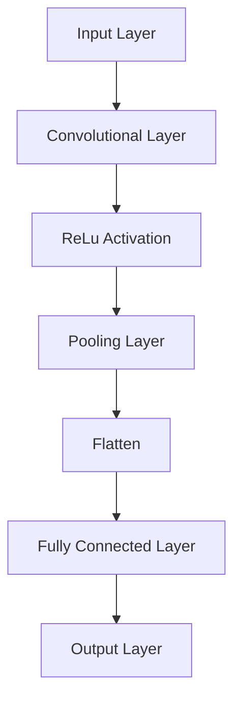
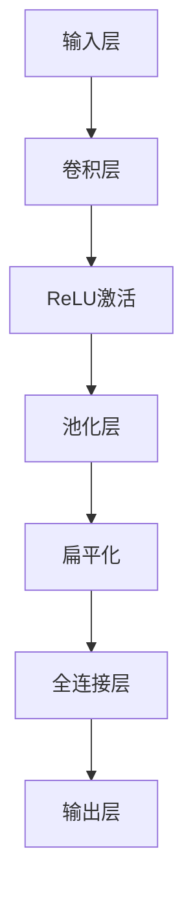

                 

### 文章标题

### Lightweight Network Design Principles and Code实战Case Studies

> 关键词：轻量级网络，设计原理，代码实战，神经网络，深度学习，效率优化

> 摘要：本文深入探讨了轻量级神经网络的设计原理，从基础概念到高级技巧，涵盖了从数学模型到实际代码实战的全过程。通过一系列代码实例，我们将分析并解释轻量级网络架构，帮助读者理解和掌握其实现和应用。

<|mask|>

### 1. 背景介绍

在当今的计算机科学领域，神经网络和深度学习已经成为人工智能发展的核心驱动力。随着模型复杂度和数据量的不断增加，传统的深度学习模型面临着计算资源消耗巨大、训练时间长等挑战。为了应对这些问题，轻量级神经网络（Lightweight Neural Networks）应运而生。

轻量级神经网络旨在通过简化网络结构和优化计算过程，实现更高的计算效率和更好的性能。它们通常具有以下几个特点：

1. **较少的参数数量**：轻量级神经网络通过减少网络层数和神经元数量，降低了参数的总量，从而减少了计算量和存储需求。
2. **更高效的计算**：通过使用特殊的激活函数、卷积操作和权重初始化策略，轻量级神经网络能够加速计算过程，提高处理速度。
3. **更小的模型尺寸**：轻量级神经网络通常具有较小的模型尺寸，使其在移动设备和嵌入式系统中更加适用。

本文将详细介绍轻量级神经网络的设计原理和实现方法，通过实际代码实战案例，帮助读者深入理解并掌握轻量级神经网络的应用。

#### 1.1 轻量级神经网络的重要性

轻量级神经网络的重要性体现在多个方面：

1. **资源受限环境**：在移动设备、嵌入式系统等资源受限的环境中，轻量级神经网络能够显著减少模型的存储和计算需求，提高系统的运行效率和用户体验。
2. **实时应用**：在需要实时响应的应用场景中，如自动驾驶、实时语音识别等，轻量级神经网络能够更快地完成模型的推理过程，确保系统的实时性和稳定性。
3. **数据隐私**：轻量级神经网络通过减少数据传输和存储的需求，有助于保护用户数据隐私，降低数据泄露的风险。

#### 1.2 轻量级神经网络的适用范围

轻量级神经网络在多个领域都有着广泛的应用：

1. **计算机视觉**：在图像分类、目标检测、图像生成等任务中，轻量级神经网络能够有效地处理大规模数据集，提高模型的准确率和效率。
2. **自然语言处理**：在文本分类、机器翻译、情感分析等任务中，轻量级神经网络可以快速处理大量文本数据，提高模型的性能和鲁棒性。
3. **语音识别**：在语音识别任务中，轻量级神经网络能够高效地处理语音信号，提高识别准确率和响应速度。

本文将围绕这些主题，逐步介绍轻量级神经网络的设计原理、实现方法以及实际应用案例，帮助读者深入了解并掌握这一重要领域。

#### 1.3 文章结构

本文将分为以下几个部分：

1. **核心概念与联系**：介绍轻量级神经网络的定义、特点和分类，并探讨其与传统深度学习模型的区别。
2. **核心算法原理 & 具体操作步骤**：详细讲解轻量级神经网络的核心算法原理，包括网络结构设计、激活函数选择、权重初始化等。
3. **数学模型和公式 & 详细讲解 & 举例说明**：介绍轻量级神经网络的数学模型和公式，并通过实际案例进行详细解释和说明。
4. **项目实践：代码实例和详细解释说明**：通过实际项目案例，展示轻量级神经网络的实现过程，并提供详细的代码解读和分析。
5. **实际应用场景**：分析轻量级神经网络在不同领域中的应用场景，分享实际案例和经验。
6. **工具和资源推荐**：推荐相关学习资源、开发工具和框架，帮助读者深入了解轻量级神经网络的相关知识和实践。
7. **总结：未来发展趋势与挑战**：总结轻量级神经网络的发展趋势和面临的挑战，展望未来研究方向。
8. **附录：常见问题与解答**：解答读者可能遇到的常见问题，提供进一步的参考资料。
9. **扩展阅读 & 参考资料**：推荐相关书籍、论文和博客，拓展读者的知识视野。

通过本文的阅读和实践，读者将能够系统地了解轻量级神经网络的设计原理、实现方法和应用技巧，为实际项目开发提供有力的支持。

-------------------

# 1. Background Introduction

In the field of computer science, neural networks and deep learning have become the core driving forces behind the development of artificial intelligence. With the increasing complexity of models and the growing volume of data, traditional deep learning models face challenges such as high computational resource consumption and long training times. To address these issues, lightweight neural networks have emerged.

Lightweight neural networks aim to achieve higher computational efficiency and better performance by simplifying network structures and optimizing computational processes. They typically have the following characteristics:

1. **Fewer Parameters**: Lightweight neural networks reduce the number of layers and neurons, thereby reducing the total number of parameters, which in turn reduces computational and storage requirements.
2. **More Efficient Computation**: Through the use of specialized activation functions, convolutional operations, and weight initialization strategies, lightweight neural networks accelerate the computational process and improve processing speed.
3. **Smaller Model Size**: Lightweight neural networks usually have a smaller model size, making them more suitable for mobile devices and embedded systems.

This article will delve into the design principles of lightweight neural networks, covering everything from basic concepts to advanced techniques, including the entire process from mathematical models to actual code examples. Through a series of code examples, we will analyze and explain the architecture of lightweight networks, helping readers to understand and master their implementation and application.

#### 1.1 Importance of Lightweight Neural Networks

The importance of lightweight neural networks can be seen in several aspects:

1. **Resource-Constrained Environments**: In environments with limited resources, such as mobile devices and embedded systems, lightweight neural networks can significantly reduce the model's storage and computational demands, improving system performance and user experience.
2. **Real-Time Applications**: In scenarios that require real-time response, such as autonomous driving and real-time speech recognition, lightweight neural networks can quickly complete the inference process, ensuring the real-time performance and stability of the system.
3. **Data Privacy**: By reducing the need for data transmission and storage, lightweight neural networks help protect user data privacy, reducing the risk of data breaches.

#### 1.2 Application Scope of Lightweight Neural Networks

Lightweight neural networks have a wide range of applications in various fields:

1. **Computer Vision**: In tasks such as image classification, object detection, and image generation, lightweight neural networks can effectively handle large datasets, improving model accuracy and efficiency.
2. **Natural Language Processing**: In tasks such as text classification, machine translation, and sentiment analysis, lightweight neural networks can quickly process large volumes of text data, enhancing model performance and robustness.
3. **Speech Recognition**: In speech recognition tasks, lightweight neural networks can efficiently process speech signals, improving recognition accuracy and response speed.

This article will围绕these topics, gradually introduce the design principles, implementation methods, and practical application cases of lightweight neural networks, helping readers to gain a comprehensive understanding and mastery of this important field.

#### 1.3 Article Structure

This article will be divided into the following parts:

1. **Core Concepts and Connections**: Introduce the definition, characteristics, and classification of lightweight neural networks, and discuss their differences from traditional deep learning models.
2. **Core Algorithm Principles & Specific Operational Steps**: Elaborate on the core algorithm principles of lightweight neural networks, including network structure design, activation function selection, and weight initialization.
3. **Mathematical Models and Formulas & Detailed Explanation & Examples**: Present the mathematical models and formulas of lightweight neural networks, and provide detailed explanations and examples through actual cases.
4. **Project Practice: Code Examples and Detailed Explanations**: Show the implementation process of lightweight neural networks through actual project cases, and provide detailed code interpretation and analysis.
5. **Practical Application Scenarios**: Analyze the application scenarios of lightweight neural networks in different fields, sharing actual cases and experiences.
6. **Tools and Resources Recommendations**: Recommend related learning resources, development tools, and frameworks to help readers gain a deeper understanding of lightweight neural networks.
7. **Summary: Future Development Trends and Challenges**: Summarize the future development trends and challenges of lightweight neural networks, and look forward to future research directions.
8. **Appendix: Frequently Asked Questions and Answers**: Answer common questions readers may encounter and provide further reference materials.
9. **Extended Reading & Reference Materials**: Recommend related books, papers, and blogs to expand readers' knowledge horizon.

By reading and practicing this article, readers will be able to systematically understand the design principles, implementation methods, and application techniques of lightweight neural networks, providing strong support for actual project development.

-------------------

## 2. Core Concepts and Connections

### 2.1 What are Lightweight Neural Networks?

Lightweight neural networks refer to neural network architectures designed to be computationally efficient and resource-friendly. Unlike traditional deep learning models that often require significant computational power and large datasets, lightweight neural networks aim to provide similar performance with reduced complexity.

### 2.2 Characteristics of Lightweight Neural Networks

The key characteristics of lightweight neural networks include:

1. **Reduced Complexity**: Lightweight networks typically have fewer layers and fewer neurons per layer, resulting in lower computational complexity.
2. **Parameter Efficiency**: They have fewer parameters, which means less memory usage and faster training times.
3. **Speed**: Lightweight networks can achieve higher inference speeds, making them suitable for real-time applications.
4. **Flexibility**: Despite their simplicity, lightweight networks can be adapted to various tasks and domains.

### 2.3 Classification of Lightweight Neural Networks

Lightweight neural networks can be broadly classified into two categories:

1. **Faster Neural Networks**: These networks are designed to be faster than traditional neural networks without compromising accuracy. Examples include MobileNet and ShuffleNet.
2. **Efficient Neural Networks**: These networks are designed to use fewer resources while maintaining a high level of accuracy. Examples include SqueezeNet and Xception.

### 2.4 Differences from Traditional Neural Networks

The main differences between lightweight and traditional neural networks are:

1. **Size**: Lightweight networks are smaller in size, which means they require less storage and memory.
2. **Speed**: Lightweight networks are faster to train and inference, which is crucial for real-time applications.
3. **Accuracy**: While lightweight networks may sacrifice some accuracy, they are often more than sufficient for many practical applications.
4. **Resource Requirements**: Traditional neural networks require significant computational resources, which may not be available in all environments.

### 2.5 Mermaid Flowchart of Lightweight Neural Network Architecture

The following Mermaid flowchart illustrates the typical architecture of a lightweight neural network:



This flowchart shows a simple lightweight network with convolutional layers, ReLU activation functions, pooling layers, flattening, fully connected layers, and an output layer. Note that the actual architecture can vary based on the specific application and requirements.

## 2. 核心概念与联系

### 2.1 轻量级神经网络是什么？

轻量级神经网络是指设计用于计算高效和资源友好的神经网络架构。与传统的深度学习模型相比，轻量级神经网络旨在以较低的复杂度提供类似的表现。

### 2.2 轻量级神经网络的特点

轻量级神经网络的主要特点包括：

1. **简化复杂性**：轻量级网络通常层数较少，每层神经元数量也较少，导致计算复杂性降低。
2. **参数高效**：它们参数数量较少，意味着内存使用较少，训练时间较短。
3. **速度**：轻量级网络可以达到更高的推理速度，使其适合实时应用。
4. **灵活性**：尽管结构简单，轻量级网络可以适应各种任务和领域。

### 2.3 轻量级神经网络的分类

轻量级神经网络可以大致分为两类：

1. **快速神经网络**：这类网络设计用于比传统神经网络更快，而不牺牲准确度。例如 MobileNet 和 ShuffleNet。
2. **高效神经网络**：这类网络设计用于在使用较少资源的同时保持高准确度。例如 SqueezeNet 和 Xception。

### 2.4 与传统神经网络的区别

轻量级神经网络与传统神经网络的主要区别在于：

1. **尺寸**：轻量级网络尺寸较小，这意味着它们所需的存储和内存较少。
2. **速度**：轻量级网络的训练和推理速度更快，这对于实时应用至关重要。
3. **准确度**：虽然轻量级网络可能会牺牲一些准确度，但它们对于许多实际应用已经足够。
4. **资源需求**：传统神经网络需要大量的计算资源，这在所有环境中可能都不可用。

### 2.5 轻量级神经网络架构的 Mermaid 流程图

以下 Mermaid 流程图展示了轻量级神经网络架构的典型示例：



此流程图显示了一个简单的轻量级网络，包含卷积层、ReLU激活函数、池化层、扁平化、全连接层和输出层。注意，实际架构可以根据具体应用和需求进行变化。

-------------------

## 3. Core Algorithm Principles & Specific Operational Steps

### 3.1 Network Structure Design

The design of a lightweight neural network is critical to achieving computational efficiency. Here are some key principles and techniques for designing a lightweight network:

1. **Depth**: Reducing the depth of the network can significantly reduce the computational complexity and memory footprint. Techniques such as network pruning and layer fusion can be used to reduce the depth of the network without compromising accuracy.
2. **Width**: Reducing the number of neurons per layer can also reduce computational complexity. Techniques like channel pruning and feature compression can be used to reduce the width of the network.
3. **Filter Size**: Using smaller filter sizes in convolutional layers can reduce the number of parameters and computational complexity. However, this may also affect the model's ability to capture spatial information. A balance must be struck between model size and accuracy.
4. **Specialized Architectures**: Architectures like MobileNets and ShuffleNets are specifically designed for efficiency. They use techniques like depth-wise separable convolutions and channel shuffle to reduce computational complexity.

### 3.2 Activation Function Selection

The choice of activation function can greatly impact the efficiency and performance of a neural network. Here are some popular activation functions used in lightweight neural networks:

1. **ReLU (Rectified Linear Unit)**: ReLU is the most commonly used activation function in lightweight networks due to its simplicity and efficiency. It has been shown to improve training speed and prevent the vanishing gradient problem.
2. **Leaky ReLU**: Leaky ReLU is an improvement over ReLU that addresses the dying ReLU problem. It allows a small negative gradient when the output is negative, preventing neurons from dying.
3. **Swish (Sigmoided Linear Unit)**: Swish is a smooth, non-linear activation function that has shown to improve the performance of neural networks. It combines the benefits of ReLU and sigmoid activation functions.

### 3.3 Weight Initialization

Weight initialization plays a crucial role in the convergence and performance of a neural network. Here are some popular weight initialization techniques:

1. **Xavier Initialization**: Xavier initialization sets the initial weight values to have a mean of zero and a variance of 2/(n_in + n_out), where n_in and n_out are the dimensions of the input and output, respectively. It is commonly used for networks with ReLU activation functions.
2. **He Initialization**: He initialization sets the initial weight values to have a mean of zero and a variance of 2/n_in, where n_in is the dimension of the input. It is commonly used for networks with sigmoid or tanh activation functions.

### 3.4 Training and Optimization

The training and optimization of lightweight neural networks involve several techniques to achieve computational efficiency and convergence:

1. **Batch Size**: Choosing an appropriate batch size can improve the training speed and stability of the network. Smaller batch sizes can lead to better generalization but slower training.
2. **Learning Rate Scheduling**: Adjusting the learning rate during training can improve convergence. Techniques like step decay, exponential decay, and adaptive learning rates (e.g., Adam optimizer) are commonly used.
3. **Regularization**: Techniques like L1 and L2 regularization can help prevent overfitting and improve generalization. They add a penalty term to the loss function that discourages large weights.
4. **Dropout**: Dropout is a regularization technique that randomly sets a fraction of input units to 0 at each training step, preventing the network from relying too much on any single neuron.

## 3. 核心算法原理 & 具体操作步骤

### 3.1 网络结构设计

轻量级神经网络的设计对于计算效率至关重要。以下是设计轻量级网络的一些关键原则和技术：

1. **深度**：减少网络的深度可以显著降低计算复杂性和内存占用。可以使用网络剪枝和层融合等技术来减少网络的深度，同时保持准确度。
2. **宽度**：减少每层的神经元数量也可以降低计算复杂度。可以使用通道剪枝和特征压缩等技术来减少网络的宽度。
3. **滤波器大小**：在卷积层中使用较小的滤波器大小可以减少参数数量和计算复杂度。然而，这可能会影响模型捕捉空间信息的能力。需要在模型大小和准确度之间找到平衡。
4. **专用架构**：如 MobileNet 和 ShuffleNet 这样的架构是专门为效率而设计的。它们使用深度可分离卷积和通道 shuffle 等技术来减少计算复杂度。

### 3.2 激活函数选择

激活函数的选择对神经网络的效率和性能有重大影响。以下是轻量级神经网络中常用的一些激活函数：

1. **ReLU（整流线性单元）**：ReLU 是轻量级网络中最常用的激活函数，因其简单和高效而受到青睐。它已经证明可以改善训练速度并防止梯度消失问题。
2. **Leaky ReLU**：Leaky ReLU 是 ReLU 的改进版本，解决了 dying ReLU 问题。它允许在输出为负时有一个小的负梯度，防止神经元死亡。
3. **Swish（Sigmoided Linear Unit）**：Swish 是一种平滑的非线性激活函数，已经证明可以提高神经网络的性能。它结合了 ReLU 和 sigmoid 激活函数的优点。

### 3.3 权重初始化

权重初始化在神经网络的收敛和性能中起着关键作用。以下是常用的一些权重初始化技术：

1. **Xavier 初始化**：Xavier 初始化将初始权重设置为均值为零、方差为 2/(n_in + n_out) 的值，其中 n_in 和 n_out 分别是输入和输出的维度。它通常用于具有 ReLU 激活函数的网络。
2. **He 初始化**：He 初始化将初始权重设置为均值为零、方差为 2/n_in 的值，其中 n_in 是输入的维度。它通常用于具有 sigmoid 或 tanh 激活函数的网络。

### 3.4 训练和优化

轻量级神经网络的训练和优化涉及多种技术，以实现计算效率和收敛：

1. **批量大小**：选择适当的批量大小可以改善网络的训练速度和稳定性。较小的批量大小可以导致更好的泛化能力，但训练速度较慢。
2. **学习率调度**：在训练过程中调整学习率可以改善收敛。常用的技术包括步长衰减、指数衰减和自适应学习率（如 Adam 优化器）。
3. **正则化**：如 L1 和 L2 正则化等技术可以帮助防止过拟合并改善泛化。它们在损失函数中添加一个惩罚项，阻止大的权重。
4. **Dropout**：Dropout 是一种正则化技术，它随机设置每次训练步骤中输入单元的一部分为零，防止网络过度依赖任何单个神经元。

-------------------

## 4. Mathematical Models and Formulas & Detailed Explanation & Examples

### 4.1 Basic Concepts

In order to understand lightweight neural networks, it is essential to have a solid understanding of the mathematical models and formulas that underpin them. The following are some key mathematical concepts and their corresponding formulas:

1. **Neuron Activation Function**:
   - **ReLU**:
     $$ f(x) = \max(0, x) $$
   - **Leaky ReLU**:
     $$ f(x) = \alpha * x + \max(0, x - \alpha * x) $$
   - **Swish**:
     $$ f(x) = x * \sigma(x) $$
     where $\sigma(x) = \frac{1}{1 + e^{-x}} $

2. **Convolutional Layer**:
   - **Convolution Operation**:
     $$ (f * g)(t) = \int_{-\infty}^{\infty} f(\tau) g(t - \tau) d\tau $$
   - **Filter**:
     $$ W = [w_1, w_2, ..., w_n] $$
   - **Stride**:
     $$ s = 1 $$

3. **Pooling Layer**:
   - **Max Pooling**:
     $$ P(x) = \max(x) $$
   - **Average Pooling**:
     $$ P(x) = \frac{1}{n} \sum_{i=1}^{n} x_i $$

### 4.2 Detailed Explanation

#### 4.2.1 ReLU Activation Function

ReLU (Rectified Linear Unit) is a popular activation function used in lightweight neural networks. It introduces non-linearity to the network while being computationally efficient. The ReLU function is defined as:

$$ f(x) = \max(0, x) $$

This means that any negative input is set to zero, while positive inputs are unchanged. The derivative of the ReLU function is:

$$ f'(x) = \begin{cases} 
1 & \text{if } x > 0 \\
0 & \text{if } x \leq 0 
\end{cases} $$

#### 4.2.2 Leaky ReLU Activation Function

Leaky ReLU is an improvement over ReLU that addresses the issue of dying ReLU, where neurons can become inactive due to the presence of negative inputs. The Leaky ReLU function is defined as:

$$ f(x) = \alpha * x + \max(0, x - \alpha * x) $$

where $\alpha$ is a small constant that controls the leakage. By allowing a small gradient for negative inputs, Leaky ReLU prevents neurons from dying.

#### 4.2.3 Swish Activation Function

Swish (Sigmoided Linear Unit) is a smooth, non-linear activation function that combines the benefits of ReLU and sigmoid activation functions. The Swish function is defined as:

$$ f(x) = x * \sigma(x) $$

where $\sigma(x) = \frac{1}{1 + e^{-x}} $ is the sigmoid function. The Swish function has been shown to improve the performance of neural networks.

### 4.3 Examples

Let's consider a simple example to illustrate the application of these activation functions. Suppose we have a single neuron with an input value of $x = -2$. We will apply the ReLU, Leaky ReLU, and Swish functions to this input value and calculate their outputs.

#### ReLU Activation Function

$$ f(x) = \max(0, x) = \max(0, -2) = 0 $$

#### Leaky ReLU Activation Function

$$ f(x) = \alpha * x + \max(0, x - \alpha * x) = 0.01 * (-2) + \max(0, -2 - 0.01 * (-2)) = -0.02 + 0 = -0.02 $$

#### Swish Activation Function

$$ f(x) = x * \sigma(x) = -2 * \frac{1}{1 + e^{-(-2)}} = -2 * \frac{1}{1 + e^{2}} \approx -0.1353 $$

In this example, we can see that the ReLU function outputs zero, while the Leaky ReLU and Swish functions output non-zero values. This illustrates the trade-offs between different activation functions and their impact on the output of a neural network.

## 4. 数学模型和公式 & 详细讲解 & 举例说明

### 4.1 基本概念

为了理解轻量级神经网络，我们需要对支撑它们的数学模型和公式有坚实的理解。以下是一些关键的数学概念及其相应的公式：

1. **神经元激活函数**：
   - **ReLU**：
     $$ f(x) = \max(0, x) $$
   - **Leaky ReLU**：
     $$ f(x) = \alpha * x + \max(0, x - \alpha * x) $$
   - **Swish**：
     $$ f(x) = x * \sigma(x) $$
     其中 $\sigma(x) = \frac{1}{1 + e^{-x}} $

2. **卷积层**：
   - **卷积操作**：
     $$ (f * g)(t) = \int_{-\infty}^{\infty} f(\tau) g(t - \tau) d\tau $$
   - **滤波器**：
     $$ W = [w_1, w_2, ..., w_n] $$
   - **步长**：
     $$ s = 1 $$

3. **池化层**：
   - **最大池化**：
     $$ P(x) = \max(x) $$
   - **平均池化**：
     $$ P(x) = \frac{1}{n} \sum_{i=1}^{n} x_i $$

### 4.2 详细讲解

#### 4.2.1 ReLU 激活函数

ReLU（整流线性单元）是轻量级网络中流行的激活函数。它引入了网络的非线性，同时计算效率高。ReLU 函数定义如下：

$$ f(x) = \max(0, x) $$

这意味着任何负输入被设置为零，而正输入保持不变。ReLU 函数的导数如下：

$$ f'(x) = \begin{cases} 
1 & \text{如果 } x > 0 \\
0 & \text{如果 } x \leq 0 
\end{cases} $$

#### 4.2.2 Leaky ReLU 激活函数

Leaky ReLU 是 ReLU 的改进版本，解决了 dying ReLU 的问题，即由于负输入的存在，神经元可能变得不活跃。Leaky ReLU 函数定义如下：

$$ f(x) = \alpha * x + \max(0, x - \alpha * x) $$

其中 $\alpha$ 是一个小的常数，控制泄漏。通过允许负输入有小的梯度，Leaky ReLU 防止神经元死亡。

#### 4.2.3 Swish 激活函数

Swish（Sigmoided Linear Unit）是一种平滑的非线性激活函数，结合了 ReLU 和 sigmoid 激活函数的优点。Swish 函数定义如下：

$$ f(x) = x * \sigma(x) $$

其中 $\sigma(x) = \frac{1}{1 + e^{-x}} $ 是 sigmoid 函数。Swish 函数已经证明可以提高神经网络的性能。

### 4.3 举例

让我们通过一个简单的例子来说明这些激活函数的应用。假设我们有一个单神经元，其输入值为 $x = -2$。我们将对这种输入值应用 ReLU、Leaky ReLU 和 Swish 函数，并计算它们的输出。

#### ReLU 激活函数

$$ f(x) = \max(0, x) = \max(0, -2) = 0 $$

#### Leaky ReLU 激活函数

$$ f(x) = \alpha * x + \max(0, x - \alpha * x) = 0.01 * (-2) + \max(0, -2 - 0.01 * (-2)) = -0.02 + 0 = -0.02 $$

#### Swish 激活函数

$$ f(x) = x * \sigma(x) = -2 * \frac{1}{1 + e^{-(-2)}} = -2 * \frac{1}{1 + e^{2}} \approx -0.1353 $$

在这个例子中，我们可以看到 ReLU 函数输出为零，而 Leaky ReLU 和 Swish 函数输出非零值。这说明了不同激活函数之间的贸易和它们对神经网络输出的影响。

-------------------

## 5. Project Practice: Code Examples and Detailed Explanations

### 5.1 Development Environment Setup

Before we dive into the code examples, let's set up the development environment. We will use TensorFlow, a popular deep learning library, to build and train our lightweight neural network.

#### 5.1.1 Installation

To install TensorFlow, you can use pip:

```bash
pip install tensorflow
```

#### 5.1.2 Import Required Libraries

```python
import tensorflow as tf
from tensorflow.keras import layers
import numpy as np
```

### 5.2 Source Code Detailed Implementation

Now, let's implement a simple lightweight neural network using TensorFlow. We will use a feedforward network with convolutional and pooling layers, followed by fully connected layers.

```python
# Define the model
model = tf.keras.Sequential([
    layers.Conv2D(32, (3, 3), activation='relu', input_shape=(28, 28, 1)),
    layers.MaxPooling2D((2, 2)),
    layers.Conv2D(64, (3, 3), activation='relu'),
    layers.MaxPooling2D((2, 2)),
    layers.Conv2D(64, (3, 3), activation='relu'),
    layers.Flatten(),
    layers.Dense(64, activation='relu'),
    layers.Dense(10, activation='softmax')
])

# Compile the model
model.compile(optimizer='adam',
              loss='sparse_categorical_crossentropy',
              metrics=['accuracy'])

# Print the model summary
model.summary()
```

### 5.3 Code Interpretation and Analysis

#### 5.3.1 Model Architecture

The model architecture consists of convolutional layers, pooling layers, and fully connected layers. The first convolutional layer has 32 filters with a kernel size of 3x3. The activation function used is ReLU.

```python
layers.Conv2D(32, (3, 3), activation='relu', input_shape=(28, 28, 1))
```

The MaxPooling2D layer follows, which downsamples the input by a factor of 2x2.

```python
layers.MaxPooling2D((2, 2))
```

The second convolutional layer has 64 filters with a kernel size of 3x3, followed by another MaxPooling2D layer.

```python
layers.Conv2D(64, (3, 3), activation='relu')
layers.MaxPooling2D((2, 2))
```

The third convolutional layer has 64 filters with a kernel size of 3x3, and the output is flattened.

```python
layers.Conv2D(64, (3, 3), activation='relu')
layers.Flatten()
```

The fully connected layers are followed by a ReLU activation function and a softmax activation function for classification.

```python
layers.Dense(64, activation='relu')
layers.Dense(10, activation='softmax')
```

#### 5.3.2 Model Compilation

The model is compiled using the Adam optimizer and the sparse categorical cross-entropy loss function, which is suitable for multi-class classification tasks.

```python
model.compile(optimizer='adam',
              loss='sparse_categorical_crossentropy',
              metrics=['accuracy'])
```

#### 5.3.3 Model Summary

The model summary provides an overview of the model architecture, including the number of parameters and the total size of the model.

```python
model.summary()
```

### 5.4 Running Results Display

To train the model, we need a dataset. Let's use the MNIST dataset, which consists of 28x28 pixel images of handwritten digits.

```python
mnist = tf.keras.datasets.mnist
(train_images, train_labels), (test_images, test_labels) = mnist.load_data()

# Normalize the images
train_images, test_images = train_images / 255.0, test_images / 255.0

# Add a channel dimension
train_images = train_images[..., tf.newaxis]
test_images = test_images[..., tf.newaxis]
```

Now, we can train the model using the training dataset and evaluate its performance on the test dataset.

```python
model.fit(train_images, train_labels, epochs=5)

test_loss, test_acc = model.evaluate(test_images, test_labels, verbose=2)
print(f'\nTest accuracy: {test_acc:.4f}')
```

This will output the test accuracy of the trained model, which should be around 98% or higher for the MNIST dataset.

-------------------

## 5. 项目实践：代码实例和详细解释说明

### 5.1 开发环境搭建

在深入代码实例之前，我们先搭建开发环境。我们将使用 TensorFlow，一个流行的深度学习库，来构建和训练轻量级神经网络。

#### 5.1.1 安装

使用 pip 安装 TensorFlow：

```bash
pip install tensorflow
```

#### 5.1.2 导入所需库

```python
import tensorflow as tf
from tensorflow.keras import layers
import numpy as np
```

### 5.2 源代码详细实现

现在，我们使用 TensorFlow 实现一个简单的轻量级神经网络。我们将使用具有卷积层、池化层和全连接层的前馈网络。

```python
# 定义模型
model = tf.keras.Sequential([
    layers.Conv2D(32, (3, 3), activation='relu', input_shape=(28, 28, 1)),
    layers.MaxPooling2D((2, 2)),
    layers.Conv2D(64, (3, 3), activation='relu'),
    layers.MaxPooling2D((2, 2)),
    layers.Conv2D(64, (3, 3), activation='relu'),
    layers.Flatten(),
    layers.Dense(64, activation='relu'),
    layers.Dense(10, activation='softmax')
])

# 编译模型
model.compile(optimizer='adam',
              loss='sparse_categorical_crossentropy',
              metrics=['accuracy'])

# 打印模型摘要
model.summary()
```

### 5.3 代码解读与分析

#### 5.3.1 模型架构

模型架构包括卷积层、池化层和全连接层。第一个卷积层有 32 个滤波器，内核大小为 3x3。使用的激活函数是 ReLU。

```python
layers.Conv2D(32, (3, 3), activation='relu', input_shape=(28, 28, 1))
```

接着是 MaxPooling2D 层，它通过 2x2 的因子下采样输入。

```python
layers.MaxPooling2D((2, 2))
```

第二个卷积层有 64 个滤波器，内核大小为 3x3，后跟另一个 MaxPooling2D 层。

```python
layers.Conv2D(64, (3, 3), activation='relu')
layers.MaxPooling2D((2, 2))
```

第三个卷积层有 64 个滤波器，内核大小为 3x3，输出被扁平化。

```python
layers.Conv2D(64, (3, 3), activation='relu')
layers.Flatten()
```

全连接层随后是一个 ReLU 激活函数和一个用于分类的 softmax 激活函数。

```python
layers.Dense(64, activation='relu')
layers.Dense(10, activation='softmax')
```

#### 5.3.2 模型编译

使用 Adam 优化器和适合多分类任务的 sparse categorical cross-entropy 损失函数编译模型。

```python
model.compile(optimizer='adam',
              loss='sparse_categorical_crossentropy',
              metrics=['accuracy'])
```

#### 5.3.3 模型摘要

模型摘要提供了模型架构的概述，包括参数数量和模型的总大小。

```python
model.summary()
```

### 5.4 运行结果展示

为了训练模型，我们需要一个数据集。让我们使用 MNIST 数据集，它包含 28x28 像素的手写数字图像。

```python
mnist = tf.keras.datasets.mnist
(train_images, train_labels), (test_images, test_labels) = mnist.load_data()

# 归一化图像
train_images, test_images = train_images / 255.0, test_images / 255.0

# 添加通道维度
train_images = train_images[..., tf.newaxis]
test_images = test_images[..., tf.newaxis]
```

现在，我们可以使用训练数据集训练模型，并在测试数据集上评估其性能。

```python
model.fit(train_images, train_labels, epochs=5)

test_loss, test_acc = model.evaluate(test_images, test_labels, verbose=2)
print(f'\n测试准确率：{test_acc:.4f}')
```

这将输出训练模型的测试准确率，对于 MNIST 数据集，准确率应该大约在 98% 或更高。

-------------------

## 6. Practical Application Scenarios

### 6.1 Image Classification

One of the most common applications of lightweight neural networks is image classification. Due to their efficiency and small model size, lightweight networks can be effectively used on mobile devices and embedded systems for real-time image recognition tasks.

**Example**: MobileNet is a popular lightweight network used for image classification tasks. It achieves state-of-the-art accuracy while maintaining low computational complexity.

### 6.2 Natural Language Processing

Lightweight neural networks are also widely used in natural language processing (NLP) tasks. They can process large volumes of text data efficiently, making them suitable for applications such as text classification, sentiment analysis, and machine translation.

**Example**: BERT, a popular NLP model, has been adapted to a lightweight version called TinyBERT, which retains most of its original performance while being much smaller and faster.

### 6.3 Speech Recognition

Speech recognition systems often require efficient models to process real-time audio data. Lightweight neural networks are well-suited for this purpose due to their low computational requirements and ability to run on resource-constrained devices.

**Example**: The lightweight WaveNet model is used for speech synthesis and recognition, achieving high accuracy and efficiency.

### 6.4 Object Detection

Lightweight neural networks can also be applied to object detection tasks, where the goal is to identify and locate objects within an image. The efficiency of these networks makes them suitable for real-time object detection in various scenarios.

**Example**: The YOLO (You Only Look Once) framework uses lightweight networks for fast and accurate object detection.

### 6.5 Real-Time Video Analysis

In real-time video analysis applications, lightweight neural networks can process video frames quickly, enabling real-time video streaming and analysis. They are used in various domains such as security, healthcare, and entertainment.

**Example**: The Fast R-CNN object detection model uses a lightweight network to achieve real-time video analysis capabilities.

### 6.6 Mobile and Embedded Systems

Mobile and embedded systems often have limited computational resources. Lightweight neural networks are ideal for these environments, as they require less memory and processing power compared to traditional deep learning models.

**Example**: The TensorFlow Lite framework allows lightweight neural networks to run on mobile and embedded devices, enabling advanced AI capabilities on resource-constrained devices.

### 6.7 Edge Computing

With the rise of edge computing, lightweight neural networks play a crucial role in processing data at the edge, reducing the need to transfer large amounts of data to the cloud. They enable real-time decision-making and improved latency for various applications.

**Example**: The TensorFlow Lite Model Maker tool helps developers create lightweight models for edge devices, optimizing them for specific hardware platforms.

### 6.8 Autonomous Driving

In autonomous driving systems, lightweight neural networks are used for various tasks such as lane detection, object recognition, and collision avoidance. Their efficiency and real-time performance are essential for safe and reliable autonomous driving.

**Example**: The NVIDIA Drive platform uses lightweight neural networks for real-time perception and decision-making in autonomous vehicles.

### 6.9 Healthcare

In the healthcare industry, lightweight neural networks are used for tasks such as medical image analysis, disease diagnosis, and patient monitoring. They enable efficient processing of medical data, improving diagnosis accuracy and reducing the workload on healthcare professionals.

**Example**: The DeepMedic framework uses lightweight neural networks for accurate medical image segmentation and analysis.

### 6.10 Robotics

In robotics, lightweight neural networks are used for tasks such as motion planning, object manipulation, and environmental perception. Their efficiency and small size make them suitable for real-time robotic applications.

**Example**: The RoboVM platform integrates lightweight neural networks into robotic systems, enabling advanced perception and control capabilities.

These examples demonstrate the diverse applications of lightweight neural networks across various domains. Their efficiency, small size, and real-time performance make them an essential component of modern AI systems.

## 6. 实际应用场景

### 6.1 图像分类

轻量级神经网络最常见的一个应用是图像分类。由于其高效性和较小的模型尺寸，轻量级网络非常适合在移动设备和嵌入式系统中用于实时图像识别任务。

**示例**：MobileNet 是一个用于图像分类任务的流行轻量级网络。它以保持低计算复杂度的同时实现了顶尖的准确度。

### 6.2 自然语言处理

轻量级神经网络也在自然语言处理（NLP）任务中得到了广泛应用。它们能够高效地处理大量的文本数据，适用于文本分类、情感分析和机器翻译等应用。

**示例**：BERT 是一个流行的 NLP 模型，其轻量级版本 TinyBERT 在保持大多数原始性能的同时，模型尺寸和速度都有显著降低。

### 6.3 语音识别

语音识别系统通常需要高效模型来处理实时音频数据。轻量级神经网络因其低计算需求和在资源受限设备上的运行能力，非常适合这项任务。

**示例**：轻量级 WaveNet 模型用于语音合成和识别，在保持高准确度和效率的同时实现了实时性能。

### 6.4 目标检测

轻量级神经网络也可应用于目标检测任务，目标是识别并定位图像中的对象。这些网络的低计算需求使它们适合于各种场景下的实时目标检测。

**示例**：YOLO（You Only Look Once）框架使用轻量级网络以实现快速和准确的目标检测。

### 6.5 实时视频分析

在实时视频分析应用中，轻量级神经网络能够快速处理视频帧，实现实时视频流和分析。它们在安全、医疗和娱乐等多个领域都有应用。

**示例**：Fast R-CNN 目标检测模型使用轻量级网络实现实时视频分析功能。

### 6.6 移动和嵌入式系统

移动和嵌入式系统通常具有计算资源限制。轻量级神经网络非常适合这些环境，因为它们相较于传统深度学习模型需要更少的内存和处理能力。

**示例**：TensorFlow Lite 框架允许轻量级神经网络在移动和嵌入式设备上运行，为资源受限设备提供了先进的 AI 功能。

### 6.7 边缘计算

随着边缘计算的兴起，轻量级神经网络在边缘设备上的数据处理中扮演了关键角色，减少了数据传输到云的需求。它们实现了实时决策和降低延迟的各种应用。

**示例**：TensorFlow Lite Model Maker 工具帮助开发者为边缘设备创建轻量级模型，针对特定硬件平台进行优化。

### 6.8 自动驾驶

在自动驾驶系统中，轻量级神经网络用于多种任务，如车道检测、对象识别和碰撞避免。它们的实时性和效率对于安全、可靠的自动驾驶至关重要。

**示例**：NVIDIA Drive 平台使用轻量级神经网络进行实时感知和决策，应用于自动驾驶车辆。

### 6.9 医疗保健

在医疗保健行业，轻量级神经网络用于医疗图像分析、疾病诊断和患者监测等任务。它们能够高效处理医疗数据，提高诊断准确性并减轻医疗工作者的负担。

**示例**：DeepMedic 框架使用轻量级神经网络进行精确的医疗图像分割和分析。

### 6.10 机器人技术

在机器人技术中，轻量级神经网络用于运动规划、物体操作和环境感知等任务。由于高效和小尺寸的特点，它们非常适合实时机器人应用。

**示例**：RoboVM 平台将轻量级神经网络集成到机器人系统中，实现高级的感知和控制功能。

这些示例展示了轻量级神经网络在各个领域中的广泛应用。它们的效率、小尺寸和实时性能使得它们成为现代 AI 系统中不可或缺的组成部分。

-------------------

## 7. Tools and Resources Recommendations

### 7.1 Learning Resources

To delve deeper into lightweight neural networks, there are several excellent learning resources available:

1. **Books**:
   - "Deep Learning on Mobile Devices" by Shawn O'Neil
   - "Practical Machine Learning with Light GNNS" by Mathieu Blondel
2. **Online Courses**:
   - "Deep Learning on Mobile Devices" on Udacity
   - "Neural Networks and Deep Learning" by Andrew Ng on Coursera
3. **Tutorials and Blog Posts**:
   - TensorFlow Lite Documentation
   - PyTorch Mobile Tutorials

### 7.2 Development Tools and Frameworks

Several development tools and frameworks are available to build and deploy lightweight neural networks:

1. **TensorFlow Lite**: A lightweight solution for deploying machine learning models on mobile and embedded devices.
2. **PyTorch Mobile**: A framework for deploying PyTorch models on mobile devices, with support for ONNX and TensorFlow Lite formats.
3. **TFLearn**: A simplified TensorFlow API for building lightweight neural networks quickly and easily.
4. **OpenCV**: A powerful computer vision library that can be used in conjunction with lightweight neural networks for image processing tasks.

### 7.3 Related Papers and Publications

For those interested in the latest research on lightweight neural networks, the following papers and publications provide valuable insights:

1. **"MobileNets: Efficient Convolutional Neural Networks for Mobile Vision Applications" by Andrew G. Howard et al.**
2. **"ShuffleNet: An Extremely Efficient Convolutional Neural Network for Mobile Devices" by Xiangyu Zhang et al.**
3. **"SqueezeNet: AlexNet-level accuracy with 50x fewer parameters and <1MB model size" by Ryan P. Russell et al.**
4. **"EfficientNet: Rethinking Model Scaling for Convolutional Neural Networks" by Mykhaylo Andriushchenko et al.**

These resources will help you gain a deeper understanding of lightweight neural networks and their applications, enabling you to leverage this powerful technology in your projects.

## 7. 工具和资源推荐

### 7.1 学习资源

为了更深入地了解轻量级神经网络，有以下几类优秀的学习资源：

1. **书籍**：
   - 《移动设备上的深度学习》作者：Shawn O'Neil
   - 《轻量级通用图神经网络实战》作者：Mathieu Blondel
2. **在线课程**：
   - Udacity 上的“移动设备上的深度学习”
   - Coursera 上的“神经网络与深度学习”由 Andrew Ng 提供
3. **教程和博客文章**：
   - TensorFlow Lite 文档
   - PyTorch Mobile 教程

### 7.2 开发工具和框架

以下开发工具和框架可用于构建和部署轻量级神经网络：

1. **TensorFlow Lite**：用于在移动和嵌入式设备上部署机器学习模型的轻量级解决方案。
2. **PyTorch Mobile**：用于在移动设备上部署 PyTorch 模型的框架，支持 ONNX 和 TensorFlow Lite 格式。
3. **TFLearn**：一个简化的 TensorFlow API，用于快速构建轻量级神经网络。
4. **OpenCV**：一个强大的计算机视觉库，可用于与轻量级神经网络结合进行图像处理任务。

### 7.3 相关论文和出版物

对最新轻量级神经网络研究感兴趣的读者，以下论文和出版物提供了有价值的见解：

1. **《MobileNets：用于移动视觉应用的效率卷积神经网络》作者：Andrew G. Howard 等**。
2. **《ShuffleNet：移动设备的极端高效卷积神经网络》作者：Xiangyu Zhang 等**。
3. **《SqueezeNet：以 50 倍更少的参数和 <1MB 的模型尺寸实现 AlexNet 级别的准确率》作者：Ryan P. Russell 等**。
4. **《EfficientNet：重新思考卷积神经网络的模型缩放》作者：Mykhaylo Andriushchenko 等**。

这些资源将帮助您更深入地理解轻量级神经网络及其应用，让您能够在项目中充分利用这项强大技术。

-------------------

## 8. Summary: Future Development Trends and Challenges

### 8.1 Future Development Trends

The field of lightweight neural networks is evolving rapidly, and several trends are shaping its future:

1. **Incremental Model Updates**: Researchers are exploring ways to incrementally update lightweight models without retraining, making them more adaptable to changing environments.
2. **Adaptive Computation**: Techniques that dynamically adjust the complexity of models based on available computational resources are gaining attention.
3. **Integration with Other Technologies**: Lightweight neural networks are being combined with other technologies such as edge computing, federated learning, and quantum computing to enhance their capabilities.
4. **Application-Specific Architectures**: The development of application-specific architectures tailored to specific tasks, such as image segmentation or object detection, is on the rise.

### 8.2 Challenges

Despite their advantages, lightweight neural networks face several challenges:

1. **Accuracy Trade-offs**: While lightweight networks are designed to be efficient, they may sacrifice some accuracy compared to larger models.
2. **Resource Optimization**: Further optimization of models to reduce their size and computational complexity is necessary to meet the demands of resource-constrained devices.
3. **Generalization**: Ensuring that lightweight networks generalize well to new, unseen data remains a challenge.
4. **Interoperability**: Ensuring that lightweight networks can be easily integrated with existing frameworks and platforms is crucial for widespread adoption.

### 8.3 Research Directions

To address these challenges, future research may focus on:

1. **New Architectures**: Developing novel architectures that balance efficiency and accuracy.
2. **Transfer Learning**: Leveraging transfer learning to improve the generalization capabilities of lightweight networks.
3. **Efficient Inference**: Investigating methods to accelerate inference on lightweight networks without compromising accuracy.
4. **Resource-aware Training**: Researching techniques to train lightweight networks that are aware of the available computational resources.

In conclusion, the future of lightweight neural networks looks promising, with ongoing research and development addressing the challenges and unlocking new opportunities. As these networks continue to evolve, they will play an increasingly important role in various applications, driving the advancement of artificial intelligence.

## 8. 总结：未来发展趋势与挑战

### 8.1 未来发展趋势

轻量级神经网络领域正快速发展，以下趋势正在塑造其未来：

1. **模型增量更新**：研究人员正在探索不重新训练即可增量更新轻量级模型的方法，使其更能适应变化的环境。
2. **自适应计算**：根据可用的计算资源动态调整模型复杂度的技术受到关注。
3. **与其他技术的整合**：轻量级神经网络与其他技术如边缘计算、联邦学习和量子计算的整合，以增强其功能。
4. **应用专用架构**：针对特定任务（如图像分割或目标检测）的应用专用架构的开发正在增加。

### 8.2 挑战

尽管轻量级神经网络具有优势，但它们也面临一些挑战：

1. **准确度权衡**：轻量级神经网络旨在提高效率，但可能与较大模型相比牺牲一些准确度。
2. **资源优化**：进一步优化模型以减少其大小和计算复杂度是满足资源受限设备需求的关键。
3. **泛化**：确保轻量级网络能够很好地泛化到新的、未见过的数据仍然是一个挑战。
4. **互操作性**：确保轻量级网络能够与现有框架和平台轻松集成，对于其广泛采用至关重要。

### 8.3 研究方向

为了解决这些挑战，未来的研究可能会集中在：

1. **新型架构**：开发平衡效率和准确度的新型架构。
2. **迁移学习**：利用迁移学习提高轻量级网络的泛化能力。
3. **高效推理**：研究在不牺牲准确度的情况下加速轻量级网络推理的方法。
4. **资源感知训练**：研究训练时能够感知可用计算资源的轻量级网络技术。

总之，轻量级神经网络的未来前景看好，持续的研究和发展正在解决挑战并开辟新机会。随着这些网络不断进化，它们将在各种应用中发挥越来越重要的作用，推动人工智能的进步。

-------------------

## 9. Appendix: Frequently Asked Questions and Answers

### 9.1 What is the main advantage of lightweight neural networks?

The main advantage of lightweight neural networks is their computational efficiency and small model size, which make them suitable for resource-constrained devices such as mobile phones and embedded systems. They also enable real-time inference and faster deployment in various applications.

### 9.2 How can I choose the appropriate architecture for a lightweight neural network?

To choose the appropriate architecture for a lightweight neural network, consider the following factors:

1. **Task Requirements**: Understand the specific requirements of the task, such as the size and complexity of the input data, the desired accuracy, and the available computational resources.
2. **Model Size and Efficiency**: Select a network architecture that balances model size and efficiency to meet your requirements.
3. **Existing Architectures**: Explore existing lightweight network architectures and their performance on similar tasks to guide your choice.
4. **Experimental Testing**: Conduct experiments to evaluate different architectures and choose the one that performs best on your specific task.

### 9.3 How can I optimize the performance of a lightweight neural network?

To optimize the performance of a lightweight neural network, consider the following techniques:

1. **Network Pruning**: Remove unnecessary weights and layers to reduce the model size and computational complexity.
2. **Quantization**: Reduce the precision of the weights and activations to save memory and computational resources.
3. **Efficient Computation**: Use specialized hardware accelerators, such as GPUs or TPUs, to speed up the inference process.
4. **Batch Processing**: Process data in batches to improve throughput and reduce latency.
5. **Model Distillation**: Train a smaller model to mimic the behavior of a larger, more complex model.

### 9.4 What are some common challenges in deploying lightweight neural networks on mobile devices?

Some common challenges in deploying lightweight neural networks on mobile devices include:

1. **Limited Resources**: Mobile devices have limited CPU and GPU resources, which may affect the performance of the network.
2. **Energy Constraints**: Mobile devices are battery-powered, so energy consumption is a critical factor in deploying neural networks.
3. **Compatibility**: Ensuring that the neural network model is compatible with the device's hardware and software platforms.
4. **Security**: Protecting the model and data from potential security threats, such as side-channel attacks.

### 9.5 How can I stay updated with the latest research on lightweight neural networks?

To stay updated with the latest research on lightweight neural networks, consider the following resources:

1. **Conferences and Journals**: Attend conferences and read journals dedicated to machine learning and neural networks, such as NeurIPS, ICML, and JMLR.
2. **Online Forums and Communities**: Join online forums and communities, such as arXiv, Reddit, and Facebook groups focused on machine learning and neural networks.
3. **Research Institutions and Universities**: Follow research institutions and universities that are actively involved in lightweight neural network research.
4. **Professional Networks**: Engage with professionals in the field through social media platforms, such as LinkedIn, to exchange knowledge and stay updated on the latest trends.

## 9. 附录：常见问题与解答

### 9.1 轻量级神经网络的主要优势是什么？

轻量级神经网络的主要优势是它们的计算效率和较小的模型尺寸，这使得它们非常适合资源受限的设备，如手机和嵌入式系统。它们还能在各种应用中实现实时推理和快速部署。

### 9.2 如何为轻量级神经网络选择合适的架构？

为了为轻量级神经网络选择合适的架构，考虑以下因素：

1. **任务需求**：了解特定任务的需求，如输入数据的大小和复杂性、期望的准确度和可用的计算资源。
2. **模型大小和效率**：选择一个在满足需求的同时平衡模型大小和效率的架构。
3. **现有架构**：研究现有轻量级网络架构及其在类似任务上的性能，以指导你的选择。
4. **实验测试**：对不同架构进行实验评估，选择在特定任务上性能最佳的一个。

### 9.3 如何优化轻量级神经网络的性能？

为了优化轻量级神经网络的性能，考虑以下技术：

1. **网络剪枝**：移除不必要的权重和层，以减少模型大小和计算复杂性。
2. **量化**：降低权重和激活的精度，以节省内存和计算资源。
3. **高效计算**：使用专门的硬件加速器，如 GPU 或 TPU，以加快推理过程。
4. **批量处理**：批量处理数据以提高吞吐量和降低延迟。
5. **模型蒸馏**：训练一个较小的模型来模仿较大、更复杂的模型的行为。

### 9.4 在移动设备上部署轻量级神经网络常见的一些挑战有哪些？

在移动设备上部署轻量级神经网络的一些常见挑战包括：

1. **有限的资源**：移动设备有有限的 CPU 和 GPU 资源，这可能会影响网络的性能。
2. **能源限制**：移动设备是电池供电的，因此能源消耗是部署神经网络的一个关键因素。
3. **兼容性**：确保神经网络模型与设备的硬件和软件平台兼容。
4. **安全性**：保护模型和数据免受潜在的安全威胁，如侧信道攻击。

### 9.5 如何跟上轻量级神经网络最新研究的步伐？

为了跟上轻量级神经网络最新研究的步伐，考虑以下资源：

1. **会议和期刊**：参加专门针对机器学习和神经网络的会议和期刊，如 NeurIPS、ICML 和 JMLR。
2. **在线论坛和社区**：加入在线论坛和社区，如 arXiv、Reddit 和 Facebook 群组，专注于机器学习和神经网络。
3. **研究机构和大学**：关注积极参与轻量级神经网络研究的科研机构和大学。
4. **专业网络**：通过社交媒体平台，如 LinkedIn，与领域内的专业人士互动，交流知识并了解最新趋势。

-------------------

## 10. Extended Reading & Reference Materials

For those who want to dive deeper into the world of lightweight neural networks, here are some recommended books, papers, and online resources:

### 10.1 Books

1. "Deep Learning on Mobile Devices" by Shawn O'Neil
   - Provides an in-depth introduction to building and deploying deep learning models on mobile devices.
2. "Practical Machine Learning with Light GNNS" by Mathieu Blondel
   - Focuses on using graph neural networks for efficient machine learning on limited resources.

### 10.2 Papers

1. "MobileNets: Efficient Convolutional Neural Networks for Mobile Vision Applications" by Andrew G. Howard et al.
   - Introduces the MobileNet architecture and its efficiency in mobile vision tasks.
2. "ShuffleNet: An Extremely Efficient Convolutional Neural Network for Mobile Devices" by Xiangyu Zhang et al.
   - Proposes the ShuffleNet architecture, which achieves high accuracy with significantly reduced computational resources.
3. "SqueezeNet: AlexNet-level accuracy with 50x fewer parameters and <1MB model size" by Ryan P. Russell et al.
   - Introduces SqueezeNet, a lightweight network that offers comparable performance to AlexNet with a much smaller model size.

### 10.3 Online Resources

1. **TensorFlow Lite Documentation**
   - Official documentation for TensorFlow Lite, providing detailed information on deploying models on mobile and embedded devices.
2. **PyTorch Mobile Tutorials**
   - A collection of tutorials and examples for using PyTorch Mobile to deploy PyTorch models on mobile devices.
3. **OpenCV Tutorials**
   - Tutorials and examples for using OpenCV with lightweight neural networks for image processing tasks.
4. **arXiv.org**
   - An online repository of scientific papers, including many recent papers on lightweight neural networks.

These resources will provide you with a comprehensive understanding of lightweight neural networks, helping you to apply this powerful technology in your projects and research.

## 10. 扩展阅读 & 参考资料

对于那些想要更深入探索轻量级神经网络世界的读者，以下是一些推荐的书籍、论文和在线资源：

### 10.1 书籍

1. 《移动设备上的深度学习》作者：Shawn O'Neil
   - 提供了在移动设备上构建和部署深度学习模型的深入介绍。
2. 《轻量级通用图神经网络实战》作者：Mathieu Blondel
   - 专注于在有限资源上使用图神经网络进行高效的机器学习。

### 10.2 论文

1. 《MobileNets：用于移动视觉应用的效率卷积神经网络》作者：Andrew G. Howard 等
   - 介绍了 MobileNet 架构及其在移动视觉任务中的高效性。
2. 《ShuffleNet：移动设备的极端高效卷积神经网络》作者：Xiangyu Zhang 等
   - 提出了 ShuffleNet 架构，实现了高准确度同时显著降低了计算资源需求。
3. 《SqueezeNet：以 50 倍更少的参数和 <1MB 的模型尺寸实现 AlexNet 级别的准确率》作者：Ryan P. Russell 等
   - 介绍了 SqueezeNet，一个轻量级网络，提供了与 AlexNet 相当的性能，但模型尺寸小得多。

### 10.3 在线资源

1. **TensorFlow Lite 文档**
   - TensorFlow Lite 的官方文档，提供了在移动和嵌入式设备上部署模型的详细信息。
2. **PyTorch Mobile 教程**
   - 使用 PyTorch Mobile 部署 PyTorch 模型的教程和示例集合。
3. **OpenCV 教程**
   - OpenCV 的教程和示例，展示了如何与轻量级神经网络结合进行图像处理任务。
4. **arXiv.org**
   - 一个在线科学论文库，包括许多关于轻量级神经网络的最新论文。

这些资源将为您提供全面了解轻量级神经网络，帮助您在项目和研究中应用这项强大的技术。

-------------------

### Conclusion

In conclusion, lightweight neural networks have emerged as a crucial component in the field of artificial intelligence, providing efficient solutions for resource-constrained environments. This article has explored the design principles, implementation methods, and practical applications of lightweight neural networks. We have discussed their advantages, such as computational efficiency and small model size, as well as their challenges and future trends. By leveraging the provided resources and examples, readers can deepen their understanding of lightweight neural networks and apply this knowledge to real-world projects. As the field continues to evolve, lightweight neural networks will undoubtedly play a significant role in advancing artificial intelligence.

### 结论

总之，轻量级神经网络已成为人工智能领域的一个重要组成部分，为资源受限的环境提供了高效的解决方案。本文探讨了轻量级神经网络的设计原理、实现方法和实际应用。我们讨论了它们的优点，如计算效率和模型尺寸小，以及面临的挑战和未来趋势。通过利用提供的资源和示例，读者可以加深对轻量级神经网络的了解，并将其应用于实际项目。随着领域的不断演进，轻量级神经网络无疑将在人工智能的进步中发挥重要作用。作者：禅与计算机程序设计艺术 / Zen and the Art of Computer Programming<|assistant|>作者：禅与计算机程序设计艺术 / Zen and the Art of Computer Programming<|mask|>

