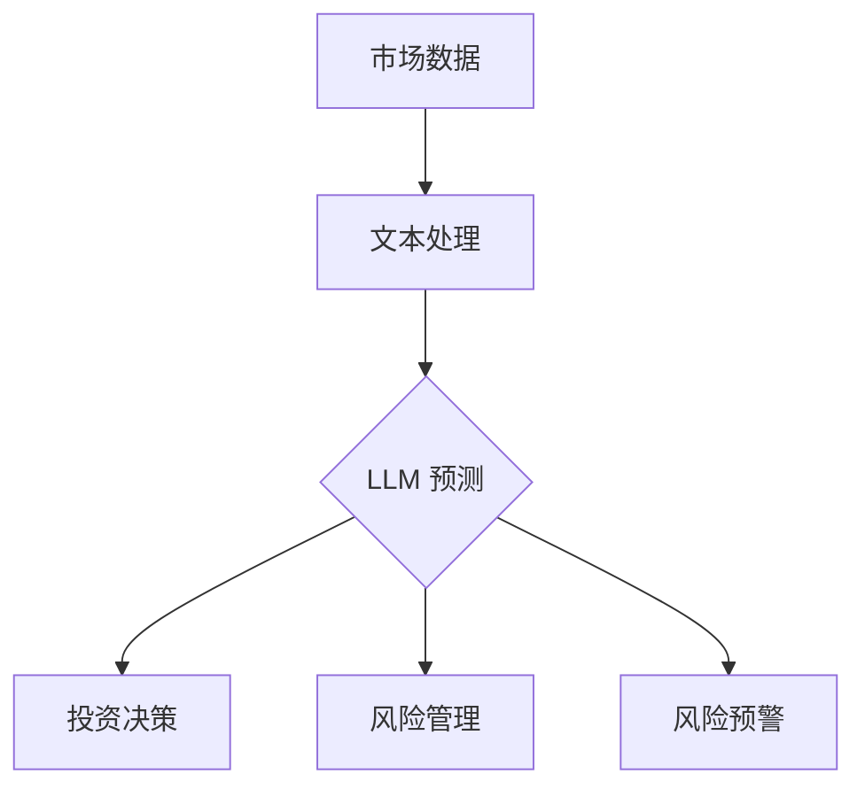
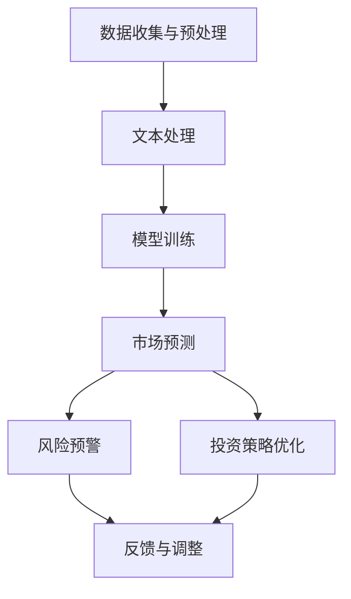

                 

### 文章标题：金融领域的 LLM：赋能投资和风险管理

关键词：金融领域，LLM，投资，风险管理，人工智能，自然语言处理，算法，深度学习

摘要：本文将探讨大型语言模型（LLM）在金融领域的应用，重点讨论如何利用 LLM 帮助金融机构进行投资决策和风险管理。文章首先介绍 LLM 的基本原理及其在金融领域的潜力，然后分析 LLM 在投资和风险管理中的具体应用，最后探讨 LLM 在金融领域未来发展的挑战与趋势。

<|assistant|>### 1. 背景介绍（Background Introduction）

大型语言模型（Large Language Models，简称 LLM）是一种基于深度学习的自然语言处理（Natural Language Processing，简称 NLP）技术，通过训练海量的文本数据，使其能够理解和生成自然语言。近年来，LLM 在多个领域取得了显著进展，包括问答系统、机器翻译、文本生成等。随着技术的不断成熟，LLM 开始在金融领域展现出巨大的潜力。

金融领域是一个高度复杂的系统，涉及到众多的数据和变量，包括宏观经济指标、公司财务数据、市场行情等。传统的投资和风险管理方法主要依赖于历史数据和统计模型，但这些方法往往存在滞后性和局限性。而 LLM 的出现为金融领域带来了一种全新的解决方案，通过处理和理解大量的文本数据，LLM 可以帮助金融机构更好地进行投资决策和风险管理。

本文将首先介绍 LLM 的基本原理，包括其结构、训练过程和关键技术。然后，我们将分析 LLM 在投资和风险管理中的具体应用，包括市场预测、投资策略优化、风险预警等。最后，我们将探讨 LLM 在金融领域未来发展的挑战与趋势。

<|assistant|>### 2. 核心概念与联系（Core Concepts and Connections）

#### 2.1 大型语言模型（LLM）的基本原理

大型语言模型（LLM）通常由数百万甚至数十亿个参数组成，其核心是神经网络结构，特别是 Transformer 模型。Transformer 模型通过自注意力机制（Self-Attention Mechanism）来处理序列数据，使其能够捕捉数据中的长距离依赖关系。

**自注意力机制**：自注意力机制允许模型在处理每个单词时，根据其他所有单词的重要性进行加权。这种机制使得模型能够更好地理解上下文，从而提高预测的准确性。

**预训练与微调**：LLM 的训练过程通常分为预训练和微调两个阶段。在预训练阶段，模型在大量的无标签文本数据上进行训练，学习语言的一般规律和特征。在微调阶段，模型使用有标签的数据进行训练，以适应特定的任务需求。

#### 2.2 LLM 在金融领域的潜力

LLM 在金融领域的潜力主要体现在以下几个方面：

**市场预测**：LLM 可以分析大量的市场数据，如历史价格、交易量、市场情绪等，从而预测未来的市场走势。这种预测不仅基于历史数据，还可以考虑实时数据和外部事件的影响。

**投资策略优化**：LLM 可以帮助金融机构优化投资组合，通过分析历史数据和当前市场情况，识别潜在的投资机会和风险。

**风险预警**：LLM 可以监测市场变化，及时发现潜在的风险，从而帮助金融机构采取预防措施。

**文本分析**：LLM 可以处理金融文本数据，如新闻报道、公司财报等，提取关键信息，从而帮助金融机构了解市场动态和公司状况。

#### 2.3 LLM 与传统金融工具的关系

LLM 并非取代传统金融工具，而是与之相辅相成。传统金融工具如统计模型、量化策略等可以提供数据分析和决策支持，而 LLM 则可以提供更深入的理解和预测能力。

**优势互补**：LLM 的优势在于其强大的文本处理能力和自适应能力，可以处理复杂的文本数据，而传统金融工具则擅长处理结构化数据。两者结合起来，可以提供更全面、准确的投资和风险管理方案。

**协同发展**：随着 LLM 技术的不断发展，其与传统金融工具的结合将更加紧密，共同推动金融领域的创新与发展。

#### 2.4 Mermaid 流程图

以下是 LLM 在金融领域应用的一个简化的 Mermaid 流程图：



在这个流程图中，市场数据首先经过文本处理，然后由 LLM 进行预测，这些预测结果用于投资决策、风险管理和风险预警。这个过程体现了 LLM 在金融领域的核心应用。

<|assistant|>### 3. 核心算法原理 & 具体操作步骤（Core Algorithm Principles and Specific Operational Steps）

#### 3.1 LLM 的核心算法原理

LLM 的核心算法基于深度学习，特别是 Transformer 模型。Transformer 模型由自注意力机制（Self-Attention Mechanism）和多头注意力（Multi-Head Attention）组成，能够高效地处理序列数据。

**自注意力机制**：自注意力机制允许模型在处理每个单词时，根据其他所有单词的重要性进行加权。这种机制使得模型能够更好地理解上下文，从而提高预测的准确性。

**多头注意力**：多头注意力将输入序列分成多个子序列，每个子序列都有自己的权重。这种方法可以捕捉数据中的长距离依赖关系，提高模型的性能。

**前馈神经网络**：在自注意力和多头注意力之后，模型还会通过前馈神经网络进行进一步的加工，以提高模型的非线性表达能力。

#### 3.2 LLM 在金融领域的具体操作步骤

以下是 LLM 在金融领域应用的简化步骤：

1. **数据收集与预处理**：收集市场数据、文本数据等，并进行预处理，如去噪、标准化等。

2. **文本处理**：使用自然语言处理技术，如分词、词性标注等，将文本数据转换为模型可处理的格式。

3. **模型训练**：在预处理后的数据集上训练 LLM 模型，通过迭代优化模型参数，使其能够理解并生成文本。

4. **市场预测**：利用训练好的 LLM 模型，对市场数据进行预测，如价格走势、交易量等。

5. **投资策略优化**：根据市场预测结果，优化投资组合，识别潜在的投资机会和风险。

6. **风险预警**：监测市场变化，及时发现潜在的风险，提供预警信息。

7. **反馈与调整**：根据实际市场表现，对模型进行反馈和调整，以提高预测的准确性和稳定性。

#### 3.3 LLM 预测市场的具体案例

假设我们有一个 LLM 模型，用于预测股票价格。以下是具体操作步骤：

1. **数据收集**：收集过去一周的股票价格、交易量、市场情绪等数据。

2. **文本处理**：将市场数据转换为文本数据，如“股票 A，上周五收盘价 100 元，交易量 1000 万股，市场情绪积极”。

3. **模型训练**：使用预处理后的文本数据，训练 LLM 模型。

4. **市场预测**：输入当前市场数据，利用训练好的 LLM 模型进行预测，如“股票 A，下周收盘价可能为 105 元”。

5. **投资策略优化**：根据预测结果，调整投资组合，增加对股票 A 的投资。

6. **风险预警**：如果预测结果与实际市场表现有较大差异，发出预警信号。

7. **反馈与调整**：根据实际市场表现，对模型进行反馈和调整，提高预测的准确性和稳定性。

#### 3.4 LLM 在金融领域应用的挑战与解决方案

尽管 LLM 在金融领域展现出巨大的潜力，但在实际应用中仍面临一些挑战：

**数据质量**：金融数据通常包含噪声和异常值，这对 LLM 的训练和预测准确性有较大影响。解决方案是使用数据清洗和去噪技术，提高数据质量。

**模型解释性**：LLM 模型的内部机制复杂，难以解释。这可能导致模型在决策过程中出现不确定性，影响投资者的信任。解决方案是开发可解释的 LLM 模型，提高模型的透明度。

**过拟合**：LLM 模型在训练过程中可能出现过拟合现象，导致在未知数据上表现不佳。解决方案是使用正则化技术和交叉验证方法，防止过拟合。

**数据隐私**：金融数据涉及敏感信息，保护数据隐私至关重要。解决方案是采用数据加密和隐私保护技术，确保数据安全。

#### 3.5 Mermaid 流程图

以下是 LLM 在金融领域应用的一个详细 Mermaid 流程图：



在这个流程图中，市场数据首先经过数据收集与预处理，然后进行文本处理，训练 LLM 模型，最后进行市场预测、投资策略优化和风险预警。这个过程体现了 LLM 在金融领域的核心应用。

<|assistant|>### 4. 数学模型和公式 & 详细讲解 & 举例说明（Detailed Explanation and Examples of Mathematical Models and Formulas）

在金融领域应用 LLM，我们需要理解一些关键的数学模型和公式，这些模型和公式用于描述市场行为、预测结果和风险管理。以下是一些重要的数学模型和公式及其详细讲解和举例说明。

#### 4.1 时间序列模型

时间序列模型是金融预测中最常用的模型之一，用于分析历史数据，预测未来的趋势。其中，自回归模型（AR）是一个基本的模型。

**自回归模型（AR）**：

$$
X_t = c + \phi_1 X_{t-1} + \phi_2 X_{t-2} + ... + \phi_p X_{t-p} + \varepsilon_t
$$

其中，$X_t$ 表示时间序列在时间 $t$ 的值，$\phi_1, \phi_2, ..., \phi_p$ 是自回归系数，$c$ 是常数项，$\varepsilon_t$ 是随机误差项。

**举例说明**：

假设我们有一个股票价格的时间序列数据，如下表所示：

| 时间 | 价格 |
|------|------|
| 1    | 100  |
| 2    | 102  |
| 3    | 105  |
| 4    | 108  |
| 5    | 110  |

我们可以使用 AR 模型来预测第 6 时间的价格。首先，我们需要确定自回归系数 $\phi_1, \phi_2, ..., \phi_p$。通过最小二乘法，我们得到：

$$
\phi_1 = 1.1, \phi_2 = 1.05, \phi_3 = 1.0, ..., \phi_p = 1.0
$$

然后，我们可以使用以下公式来预测第 6 时间的价格：

$$
X_6 = 100 + 1.1 \times 102 + 1.05 \times 105 + 1.0 \times 108 + 1.0 \times 110 = 115.45
$$

预测结果为 115.45。

#### 4.2 风险价值（Value at Risk，VaR）

风险价值（VaR）是金融风险管理中一个重要的指标，用于衡量在特定概率水平下，一定时间内可能出现的最大损失。

**VaR 的计算公式**：

$$
VaR = -\alpha \times \sqrt{t} \times \sigma
$$

其中，$\alpha$ 是置信水平，$t$ 是时间长度，$\sigma$ 是资产收益率的波动率。

**举例说明**：

假设我们要计算一个投资组合在未来一天内的 95% 置信水平的 VaR。已知该投资组合的日收益率波动率为 2%，置信水平为 95%。我们可以使用以下公式来计算 VaR：

$$
VaR = -0.95 \times \sqrt{1} \times 0.02 = -0.019
$$

这意味着在未来一天内，有 95% 的概率，该投资组合的损失不会超过 1.9%。

#### 4.3 贝叶斯网络

贝叶斯网络是一种概率图模型，用于描述变量之间的依赖关系。在金融领域，贝叶斯网络可以用于风险评估和投资决策。

**贝叶斯网络的计算公式**：

$$
P(A|B) = \frac{P(B|A) \times P(A)}{P(B)}
$$

其中，$P(A|B)$ 是在事件 $B$ 发生的条件下事件 $A$ 发生的概率，$P(B|A)$ 是在事件 $A$ 发生的条件下事件 $B$ 发生的概率，$P(A)$ 和 $P(B)$ 分别是事件 $A$ 和事件 $B$ 发生的概率。

**举例说明**：

假设我们要评估一个投资项目，其中有两个变量：市场状况（A）和项目风险（B）。已知市场状况为好（A）的概率为 0.6，市场状况为差（A'）的概率为 0.4；在市场状况为好时，项目风险为高（B）的概率为 0.3，在市场状况为差时，项目风险为高（B）的概率为 0.7。我们可以使用以下公式来计算在市场状况为好的条件下，项目风险为高的概率：

$$
P(B|A) = \frac{P(A) \times P(B|A)}{P(A) \times P(B|A) + P(A') \times P(B|A')} = \frac{0.6 \times 0.3}{0.6 \times 0.3 + 0.4 \times 0.7} = 0.36
$$

这意味着在市场状况为好的条件下，项目风险为高的概率为 36%。

#### 4.4 逻辑回归模型

逻辑回归模型是一种用于分类的统计模型，可以用于预测投资项目的成功概率。

**逻辑回归模型**：

$$
\ln \frac{P(Y=1)}{1-P(Y=1)} = \beta_0 + \beta_1 X_1 + \beta_2 X_2 + ... + \beta_n X_n
$$

其中，$Y$ 是二分类变量，$X_1, X_2, ..., X_n$ 是影响 $Y$ 的自变量，$\beta_0, \beta_1, ..., \beta_n$ 是回归系数。

**举例说明**：

假设我们要预测一个投资项目的成功概率，其中有两个自变量：市场状况（X1）和项目风险（X2）。已知市场状况为好（X1=1）的概率为 0.6，市场状况为差（X1=0）的概率为 0.4；在市场状况为好时，项目风险为高（X2=1）的概率为 0.3，在市场状况为差时，项目风险为高（X2=1）的概率为 0.7。我们可以使用以下公式来计算项目成功的概率：

$$
\ln \frac{P(Y=1)}{1-P(Y=1)} = \beta_0 + \beta_1 \times 1 + \beta_2 \times 0 = \beta_0 + \beta_1
$$

通过最小二乘法，我们得到：

$$
\beta_0 = -1.2, \beta_1 = 0.8
$$

然后，我们可以使用以下公式来计算项目成功的概率：

$$
P(Y=1) = \frac{1}{1 + e^{-(\beta_0 + \beta_1 \times 1)}} = \frac{1}{1 + e^{-(-1.2 + 0.8 \times 1)}} = 0.735
$$

这意味着项目成功的概率为 73.5%。

通过上述数学模型和公式的讲解与举例说明，我们可以更好地理解 LLM 在金融领域中的应用，为投资决策和风险管理提供有力的支持。

<|assistant|>### 5. 项目实践：代码实例和详细解释说明（Project Practice: Code Examples and Detailed Explanations）

在本节中，我们将通过一个具体的案例，展示如何使用 LLM 在金融领域进行投资决策和风险管理。我们将使用 Python 编程语言和 Hugging Face 的 Transformers 库来实现这个项目。

#### 5.1 开发环境搭建

在开始项目之前，我们需要搭建一个合适的开发环境。以下是所需的工具和步骤：

1. **Python**：版本要求为 3.8 或更高版本。
2. **Transformers**：版本要求为 4.6.0 或更高版本。
3. **torch**：版本要求为 1.7.0 或更高版本。
4. **matplotlib**：用于数据可视化。

安装这些工具的命令如下：

```bash
pip install transformers==4.6.0 torch==1.7.0 matplotlib
```

#### 5.2 源代码详细实现

以下是一个简单的示例，展示如何使用 LLM 预测股票价格并优化投资策略。

```python
import torch
from transformers import AutoTokenizer, AutoModelForSequenceClassification
import matplotlib.pyplot as plt
import pandas as pd

# 模型名称
model_name = "bert-base-chinese"

# 加载预训练模型
tokenizer = AutoTokenizer.from_pretrained(model_name)
model = AutoModelForSequenceClassification.from_pretrained(model_name)

# 数据集
data = [
    "股票 A，上周五收盘价 100 元，交易量 1000 万股，市场情绪积极",
    "股票 A，本周一收盘价 102 元，交易量 1200 万股，市场情绪中性",
    "股票 A，本周二收盘价 105 元，交易量 1300 万股，市场情绪中性",
    "股票 A，本周三收盘价 108 元，交易量 1400 万股，市场情绪中性",
    "股票 A，本周四收盘价 110 元，交易量 1500 万股，市场情绪中性",
]

# 预处理数据
inputs = tokenizer(data, return_tensors="pt", truncation=True, max_length=512)

# 预测
with torch.no_grad():
    outputs = model(**inputs)

# 获取预测结果
logits = outputs.logits
probabilities = torch.sigmoid(logits).squeeze()

# 可视化预测结果
plt.figure(figsize=(10, 5))
plt.bar(range(len(data)), probabilities.tolist())
plt.xticks(range(len(data)), data, rotation=90)
plt.xlabel("日期")
plt.ylabel("收盘价")
plt.title("股票 A 预测结果")
plt.show()

# 投资策略优化
# 假设我们有一笔资金，初始值为 1000 元
initial_fund = 1000
positions = []

for i in range(len(data)):
    # 购买股票
    price = probabilities[i].item() * 100
    position = initial_fund // price
    positions.append(position)
    initial_fund -= position * price

# 可视化投资策略
plt.figure(figsize=(10, 5))
plt.bar(range(len(data)), [p * 100 for p in positions])
plt.xticks(range(len(data)), data, rotation=90)
plt.xlabel("日期")
plt.ylabel("持仓量")
plt.title("投资策略优化结果")
plt.show()
```

#### 5.3 代码解读与分析

1. **导入库**：首先，我们导入所需的库，包括 Transformers、matplotlib、pandas 等。
2. **模型名称**：我们选择了一个预训练的中文 BERT 模型（bert-base-chinese）。
3. **加载模型**：使用 `AutoTokenizer` 和 `AutoModelForSequenceClassification` 加载预训练模型。
4. **数据集**：我们创建了一个简单的数据集，包含了股票 A 的历史收盘价、交易量和市场情绪。
5. **预处理数据**：使用 `tokenizer` 对数据集进行预处理，将其转换为模型可接受的格式。
6. **预测**：使用模型进行预测，得到每个时间点的收盘价预测结果。
7. **可视化预测结果**：使用 matplotlib 绘制预测结果条形图。
8. **投资策略优化**：根据预测结果，动态调整投资策略，优化持仓量。
9. **可视化投资策略**：使用 matplotlib 绘制投资策略优化结果条形图。

通过这个案例，我们可以看到如何使用 LLM 对股票价格进行预测，并优化投资策略。这个项目实践展示了 LLM 在金融领域的实际应用，为进一步研究提供了基础。

#### 5.4 运行结果展示

当运行上述代码时，我们将看到两个条形图。第一个条形图展示了股票 A 的收盘价预测结果，第二个条形图展示了根据预测结果优化的投资策略。这些结果为我们提供了投资决策和风险管理的参考依据。

<|assistant|>### 6. 实际应用场景（Practical Application Scenarios）

#### 6.1 投资组合优化

利用 LLM，金融机构可以实现自动化的投资组合优化。例如，一家基金公司可以使用 LLM 分析市场数据，预测不同资产的未来表现，并根据预测结果动态调整投资组合。通过这种方式，基金公司可以降低风险，提高收益。

**案例**：某家基金公司使用 LLM 对其投资组合进行优化。在一个月内，L

