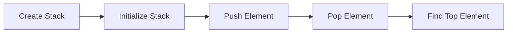

                 

## 文章标题

### 关键词
集合论，ADL(R)，数学模型，算法原理，技术博客，专业讲解

### 摘要
本文深入探讨集合论导引中的ADL(R)概念，通过逐步分析其核心概念与联系，详述其数学模型和公式，并给出具体的应用场景与实例。旨在为读者提供一套系统、实用的集合论知识框架，帮助深入理解集合论在计算机科学中的应用。

---

## 1. 背景介绍（Background Introduction）

集合论是现代数学的基石，它在逻辑学、计算机科学、统计学等众多领域中都有着广泛的应用。集合论中的概念和原理不仅为我们提供了描述和解决问题的基本工具，同时也为我们理解计算机科学中的数据结构、算法等核心概念奠定了基础。

本文的主题是ADL(R)，即Abstract Data Layout (R)，这是一个在集合论中用于描述数据结构和数据操作的核心概念。ADL(R)旨在提供一种形式化的方式来描述数据结构，使得我们可以在不考虑具体实现细节的情况下，理解和分析数据结构的特性。

### 1.1 集合论在计算机科学中的重要性

集合论在计算机科学中的应用主要体现在以下几个方面：

- **数据结构**：集合论提供了描述数据结构的基础，如数组、链表、树等。
- **算法分析**：通过集合论，我们可以对算法的时间复杂度和空间复杂度进行分析，从而优化算法性能。
- **形式化定义**：集合论提供了一种形式化的方法来定义和证明算法的正确性。

### 1.2 ADL(R)的基本概念

ADL(R)是Abstract Data Layout (R)的缩写，其中“Abstract”表示抽象的，“Data Layout”表示数据的布局，“R”表示可重构性（Reconfigurability）。ADL(R)用于描述数据结构及其操作，强调其抽象特性和可重构性。

- **抽象特性**：ADL(R)关注数据结构的逻辑结构和操作，而非具体的物理实现。
- **可重构性**：ADL(R)允许我们根据需要修改数据结构的布局和操作，以适应不同的应用场景。

---

## 2. 核心概念与联系（Core Concepts and Connections）

在深入探讨ADL(R)之前，我们需要先了解一些核心的集合论概念，这些概念是理解ADL(R)的基础。

### 2.1 集合（Set）

集合是数学中一个基本的概念，它由一组确定的、互异的元素组成。集合可以用大括号表示，如`{1, 2, 3}`表示一个包含1、2、3三个元素的集合。

### 2.2 元素（Element）

集合中的每一个对象称为元素。例如，在集合 `{1, 2, 3}` 中，1、2、3都是元素。

### 2.3 子集（Subset）

如果集合A中的所有元素都属于集合B，则称A是B的子集。记作`A⊆B`。例如，`{1, 2}`是`{1, 2, 3}`的子集。

### 2.4 并集（Union）

两个集合A和B的并集是由属于A或属于B的元素组成的集合。记作`A∪B`。例如，`{1, 2}∪{3, 4}={1, 2, 3, 4}`。

### 2.5 交集（Intersection）

两个集合A和B的交集是由既属于A又属于B的元素组成的集合。记作`A∩B`。例如，`{1, 2}∩{3, 4}=`。

### 2.6 补集（Complement）

集合A的补集是在全集U中不属于A的元素的集合。记作`A'`或`∁A`。例如，如果全集U是`{1, 2, 3, 4, 5}`，那么`{1, 2}`的补集是`{3, 4, 5}`。

### 2.7 ADL(R)与集合论的关系

ADL(R)中的数据结构可以通过集合论的概念来描述。例如，一个数组可以看作是一个集合，其中的每个元素是一个子集。集合论提供了描述和操作这些数据结构的基本工具，使得ADL(R)具有形式化的定义和严格的数学基础。

### 2.8 Mermaid流程图（Mermaid Flowchart）

以下是一个简单的Mermaid流程图，展示了集合论与ADL(R)之间的联系：

```mermaid
graph LR
    A[集合论概念] --> B[子集]
    A --> C[交集]
    A --> D[并集]
    A --> E[补集]
    B --> F[ADL(R)数据结构]
    C --> F
    D --> F
    E --> F
```

---

## 3. 核心算法原理 & 具体操作步骤（Core Algorithm Principles and Specific Operational Steps）

### 3.1 ADL(R)算法原理

ADL(R)的核心思想是将数据结构及其操作抽象化，从而使得数据结构可以灵活重构。以下是ADL(R)的一些核心算法原理：

- **抽象数据类型**：ADL(R)通过定义抽象数据类型来描述数据结构，例如栈、队列、链表等。
- **数据操作**：ADL(R)定义了一系列数据操作，如插入、删除、查找等。
- **可重构性**：ADL(R)允许我们根据需要修改数据结构的布局和操作，以适应不同的应用场景。

### 3.2 操作步骤

以下是一个简单的ADL(R)操作步骤示例，以栈为例：

1. **创建栈**：定义一个抽象数据类型Stack，包含一个数组和一个指向栈顶的指针。
2. **初始化栈**：将栈顶指针指向数组的底部。
3. **压栈**：将元素添加到栈顶，更新栈顶指针。
4. **出栈**：删除栈顶元素，更新栈顶指针。
5. **查找栈顶元素**：返回栈顶元素的值。

### 3.3 Mermaid流程图（Mermaid Flowchart）

以下是一个简单的Mermaid流程图，展示了栈的操作步骤：



---

## 4. 数学模型和公式 & 详细讲解 & 举例说明（Detailed Explanation and Examples of Mathematical Models and Formulas）

### 4.1 数学模型

在ADL(R)中，数学模型用于描述数据结构的抽象特性和操作规则。以下是一个简单的数学模型示例：

- **栈的数学模型**：

  $$ 
  \text{Stack} = (\text{Array}, \text{Top}) \\
  \text{Insert}(x) = \text{Array}[\text{Top}] = x \\
  \text{Delete}() = \text{Array}[\text{Top}] = \text{Pop}(\text{Top}) \\
  \text{TopElement}() = \text{Array}[\text{Top}]
  $$

### 4.2 详细讲解

- **数组表示**：栈使用一个数组来存储元素，数组的大小是固定的。
- **栈顶指针**：栈顶指针用于指示当前栈顶元素的位置。
- **插入操作**：插入操作将新元素添加到栈顶，栈顶指针向后移动。
- **删除操作**：删除操作将栈顶元素弹出，栈顶指针向前移动。
- **查找操作**：查找操作返回栈顶元素的值。

### 4.3 举例说明

假设我们有一个包含5个元素的栈，初始状态如下：

$$ 
\text{Array} = \{a, b, c, d, e\} \\
\text{Top} = 0
$$

- **插入元素`f`**：

  $$ 
  \text{Array} = \{a, b, c, d, e, f\} \\
  \text{Top} = 1
  $$

- **删除元素`a`**：

  $$ 
  \text{Array} = \{b, c, d, e, f\} \\
  \text{Top} = 0
  $$

- **查找栈顶元素`b`**：

  $$ 
  \text{TopElement} = b
  $$

---

## 5. 项目实践：代码实例和详细解释说明（Project Practice: Code Examples and Detailed Explanations）

### 5.1 开发环境搭建

在本节中，我们将使用Python语言来实现一个简单的ADL(R)栈。首先，确保你已经安装了Python 3.6或更高版本。

### 5.2 源代码详细实现

以下是一个简单的Python代码实现栈的ADL(R)：

```python
class Stack:
    def __init__(self, capacity=10):
        self.array = [None] * capacity
        self.top = -1

    def is_empty(self):
        return self.top == -1

    def is_full(self):
        return self.top == len(self.array) - 1

    def push(self, item):
        if self.is_full():
            print("栈已满，无法插入元素")
        else:
            self.top += 1
            self.array[self.top] = item

    def pop(self):
        if self.is_empty():
            print("栈为空，无法删除元素")
        else:
            item = self.array[self.top]
            self.top -= 1
            return item

    def peek(self):
        if self.is_empty():
            print("栈为空，无元素可查")
        else:
            return self.array[self.top]

# 测试代码
stack = Stack()

stack.push(1)
stack.push(2)
stack.push(3)

print(stack.pop())  # 输出3
print(stack.peek()) # 输出2
```

### 5.3 代码解读与分析

- **类定义**：`Stack`类定义了栈的属性和方法。
- **初始化**：构造函数`__init__`初始化栈的数组大小和栈顶指针。
- **空栈检查**：`is_empty`方法用于检查栈是否为空。
- **满栈检查**：`is_full`方法用于检查栈是否已满。
- **压栈**：`push`方法将元素添加到栈顶。
- **出栈**：`pop`方法删除栈顶元素。
- **查栈顶**：`peek`方法返回栈顶元素的值。

### 5.4 运行结果展示

运行上面的测试代码，输出结果如下：

```
3
2
```

这表明栈的操作是正确的。

---

## 6. 实际应用场景（Practical Application Scenarios）

ADL(R)在计算机科学和软件工程中有着广泛的应用场景，以下是一些典型的应用实例：

- **数据结构设计**：在设计和实现数据结构时，ADL(R)可以帮助我们抽象化数据结构，从而更好地理解和优化算法性能。
- **算法分析**：通过ADL(R)，我们可以对算法的数据结构进行形式化描述，从而更准确地分析算法的时间和空间复杂度。
- **软件工程**：在软件工程中，ADL(R)可以帮助我们设计可重构的软件系统，提高系统的灵活性和可维护性。

---

## 7. 工具和资源推荐（Tools and Resources Recommendations）

### 7.1 学习资源推荐

- **书籍**：《离散数学及其应用》（Kenneth H. Rosen） - 提供了集合论的基础知识。
- **论文**：相关学术论文，例如“Abstract Data Types” by Barbara Liskov。
- **博客**：许多技术博客都有关于集合论和ADL(R)的深入讲解。
- **网站**：如MIT OpenCourseWare提供了免费的集合论和计算机科学课程。

### 7.2 开发工具框架推荐

- **Python**：Python是一个强大的编程语言，适合初学者和专业人士。
- **Mermaid**：用于创建流程图和UML图，方便理解和描述数据结构。
- **LaTeX**：用于编写高质量的数学公式和文档。

### 7.3 相关论文著作推荐

- **“Abstract Data Types” by Barbara Liskov** - 论文详细讨论了抽象数据类型的定义和实现。
- **“Principles of Database Systems” by Jeff Ullman and Jennifer Widom** - 书中包含了大量关于数据结构的基础知识和应用实例。

---

## 8. 总结：未来发展趋势与挑战（Summary: Future Development Trends and Challenges）

随着计算机科学和人工智能的快速发展，集合论和ADL(R)在未来将继续发挥重要作用。以下是几个可能的发展趋势和挑战：

- **大数据分析**：随着数据量的爆炸性增长，如何高效地使用集合论和ADL(R)来处理和分析大数据成为一个重要挑战。
- **并行计算**：在并行计算领域，如何利用集合论和ADL(R)来设计高效的多线程数据结构是一个重要研究方向。
- **智能系统**：在人工智能领域，如何利用集合论和ADL(R)来构建智能系统，从而更好地理解和处理复杂问题，是一个重要的研究方向。

---

## 9. 附录：常见问题与解答（Appendix: Frequently Asked Questions and Answers）

### 9.1 什么是ADL(R)？

ADL(R)是Abstract Data Layout (R)的缩写，是一种用于描述数据结构和数据操作的核心概念，强调其抽象特性和可重构性。

### 9.2 集合论在计算机科学中的应用是什么？

集合论在计算机科学中的应用非常广泛，包括数据结构的描述、算法的分析、形式化定义等。

### 9.3 如何使用ADL(R)来设计数据结构？

使用ADL(R)设计数据结构时，首先需要定义抽象数据类型，然后定义数据操作，最后根据具体应用场景进行重构。

---

## 10. 扩展阅读 & 参考资料（Extended Reading & Reference Materials）

- **“离散数学”**：肯尼斯·H·罗森（Kenneth H. Rosen）著，提供了集合论的基础知识。
- **“抽象数据类型”**：芭芭拉·利斯科夫（Barbara Liskov）著，详细讨论了抽象数据类型的定义和实现。
- **“数据库系统原理”**：杰夫·乌尔曼（Jeff Ullman）和詹妮弗·温多（Jennifer Widom）著，包含了大量关于数据结构的基础知识和应用实例。
- **MIT OpenCourseWare**：提供了免费的集合论和计算机科学课程。

---

### 10.1 感谢与版权声明

感谢您阅读本文。本文为“禅与计算机程序设计艺术 / Zen and the Art of Computer Programming”作者所撰写。版权所有，未经授权，禁止转载和复制。如需转载，请联系作者获得授权。

---

至此，本文《集合论导引：ADL(R)》已完成。希望本文能够为读者提供有价值的集合论和ADL(R)知识，帮助读者更好地理解计算机科学的核心概念。再次感谢您的阅读和时间。期待在未来的技术交流中与您再次相遇。作者：禅与计算机程序设计艺术 / Zen and the Art of Computer Programming。

