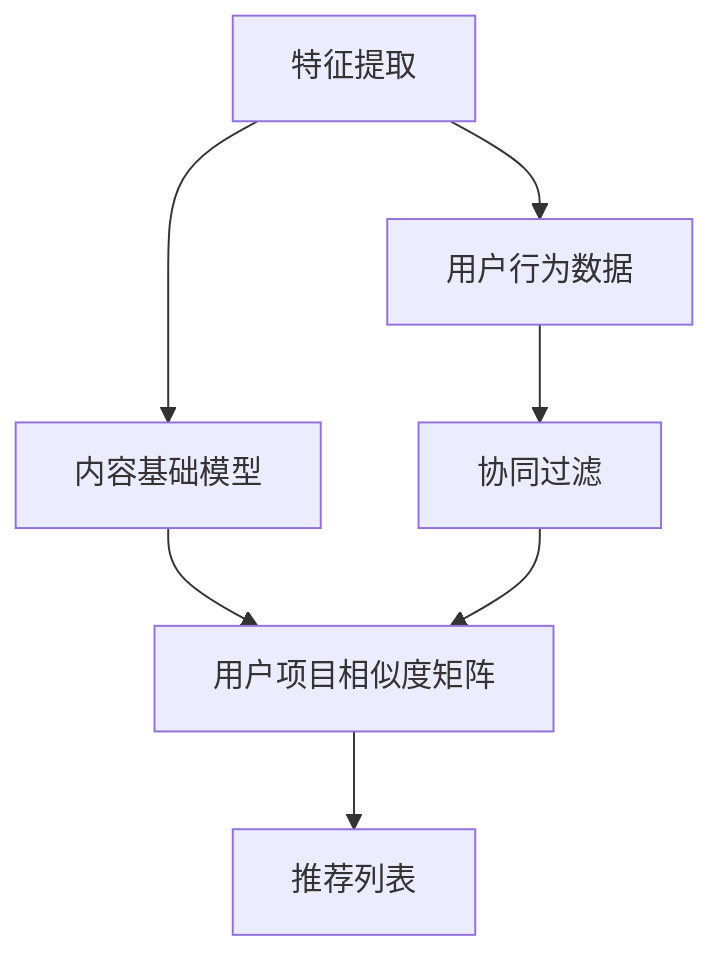

                 

### 文章标题

### Title: Audio-Video Content Recommendation: Understanding and Matching with Large Models

音视频内容推荐作为当今互联网时代的一项关键技术，正逐渐成为推动行业创新和提升用户体验的核心驱动力。本文旨在探讨基于大型模型（如深度学习模型）的音视频内容推荐系统的工作原理、核心算法以及其实际应用。通过逐步分析推理，我们将深入了解大模型在理解与匹配音视频内容方面的关键作用，为相关领域的实践者提供有价值的指导。

本文结构如下：

1. **背景介绍（Background Introduction）**：回顾音视频内容推荐的起源、发展及其在当今社会的应用。
2. **核心概念与联系（Core Concepts and Connections）**：详细解释音视频内容推荐中的核心概念，如特征提取、协同过滤、内容基础模型等，并使用 Mermaid 流程图展示相关架构。
3. **核心算法原理 & 具体操作步骤（Core Algorithm Principles and Specific Operational Steps）**：深入探讨大模型如何用于音视频内容理解与匹配，包括特征提取、相似度计算和推荐算法的具体实现。
4. **数学模型和公式 & 详细讲解 & 举例说明（Detailed Explanation and Examples of Mathematical Models and Formulas）**：介绍用于音视频推荐中的关键数学模型，如向量空间模型、矩阵分解等，并给出实际应用的例子。
5. **项目实践：代码实例和详细解释说明（Project Practice: Code Examples and Detailed Explanations）**：通过具体的代码实例展示如何使用大型模型进行音视频内容推荐。
6. **实际应用场景（Practical Application Scenarios）**：探讨音视频内容推荐在不同场景中的应用，如社交媒体、视频平台和智能电视等。
7. **工具和资源推荐（Tools and Resources Recommendations）**：推荐学习资源、开发工具框架及相关论文著作。
8. **总结：未来发展趋势与挑战（Summary: Future Development Trends and Challenges）**：总结音视频内容推荐领域当前的发展态势，并展望未来的发展趋势与挑战。
9. **附录：常见问题与解答（Appendix: Frequently Asked Questions and Answers）**：解答读者可能遇到的一些常见问题。
10. **扩展阅读 & 参考资料（Extended Reading & Reference Materials）**：提供进一步学习的参考资料。

在接下来的段落中，我们将逐步深入探讨这些主题，以帮助读者全面理解音视频内容推荐技术及其应用。

-----------------------

### 文章关键词

**音视频内容推荐、大模型、深度学习、特征提取、相似度计算、推荐算法**

### Keywords: Audio-Video Content Recommendation, Large Models, Deep Learning, Feature Extraction, Similarity Computation, Recommendation Algorithms

-----------------------

### 文章摘要

**摘要**：随着音视频内容的爆炸性增长，如何有效地推荐个性化内容成为了一个热门课题。本文聚焦于基于大型模型的音视频内容推荐技术，从背景介绍、核心概念、算法原理到实际应用，系统性地阐述了音视频内容推荐的工作机制。通过深入分析大模型在理解与匹配音视频内容中的作用，本文为相关领域的研究者和开发者提供了有价值的参考。此外，本文还探讨了未来的发展趋势与挑战，为音视频内容推荐领域的进一步研究指明了方向。

-----------------------

## 1. 背景介绍（Background Introduction）

### The Background of Audio-Video Content Recommendation

音视频内容推荐作为一种智能信息处理技术，其历史可以追溯到互联网早期。起初，推荐系统主要依赖于基于内容的过滤（Content-Based Filtering, CBF）和协同过滤（Collaborative Filtering, CF）等方法。这些早期技术虽然在一定程度上满足了用户的需求，但存在显著的局限性。例如，CBF方法依赖于对音视频内容的先验知识，无法很好地处理非结构化的数据，而CF方法则面临冷启动（Cold Start）和数据稀疏性问题。

随着深度学习技术的迅猛发展，大型模型在特征提取和相似度计算方面展现出前所未有的优势。这一技术进步推动了音视频内容推荐系统的变革，使其能够更准确地理解和匹配用户的偏好。近年来，音视频内容推荐系统已广泛应用于社交媒体、视频平台和智能电视等领域，极大地提升了用户体验。

在社交媒体方面，音视频内容推荐可以帮助用户发现潜在感兴趣的内容，从而增加用户参与度和平台黏性。例如，YouTube 和 TikTok 等平台通过推荐算法为用户提供个性化的视频推荐，使得用户能够轻松找到符合自己口味的内容。

在视频平台方面，例如 Netflix 和 Amazon Prime Video，音视频内容推荐已成为提高用户满意度和订阅率的关键因素。这些平台利用大模型对用户行为和内容进行深入分析，为每个用户生成个性化的播放列表和推荐列表。

智能电视领域，随着智能家居的普及，智能电视逐渐成为家庭娱乐的中心。音视频内容推荐系统帮助智能电视根据用户的观看习惯推荐节目，从而提升用户的观看体验。

总体而言，音视频内容推荐技术不仅满足了用户对个性化信息的需求，也推动了相关行业的发展。在接下来的部分中，我们将深入探讨音视频内容推荐中的核心概念和算法原理。

-----------------------

## 2. 核心概念与联系（Core Concepts and Connections）

### Core Concepts and Their Connections in Audio-Video Content Recommendation

音视频内容推荐系统涉及多个核心概念，这些概念相互联系，共同构成了推荐系统的基础。本节将详细解释这些核心概念，包括特征提取、协同过滤和内容基础模型，并使用 Mermaid 流程图展示其架构。

### 2.1 特征提取（Feature Extraction）

特征提取是音视频内容推荐系统的第一步，其目的是将音视频数据转换为一组可计算的属性或特征。这些特征可以是文本描述、音频特征、视频特征等。例如，对于视频内容，我们可以提取视频的标题、标签、关键词、图像特征等；对于音频内容，我们可以提取音频的频谱特征、音高特征等。

在深度学习框架下，特征提取通常通过卷积神经网络（CNN）和循环神经网络（RNN）等模型实现。这些模型能够自动学习数据的复杂表示，从而提高特征提取的准确性和效率。

### 2.2 协同过滤（Collaborative Filtering）

协同过滤是一种基于用户行为和评分的推荐方法，其主要目标是根据相似用户或项目的评分预测未知评分。协同过滤可以分为两类：基于用户的协同过滤（User-Based CF）和基于项目的协同过滤（Item-Based CF）。

- **基于用户的协同过滤（User-Based CF）**：该方法根据用户之间的相似度推荐相似用户喜欢的项目。相似度通常通过计算用户之间的评分一致性或基于k近邻（k-Nearest Neighbors, k-NN）算法确定。

- **基于项目的协同过滤（Item-Based CF）**：该方法根据项目之间的相似度推荐用户可能喜欢的项目。相似度通过计算项目之间的评分相似性确定。

### 2.3 内容基础模型（Content-Based Model）

内容基础模型是一种基于项目特征的推荐方法，其主要目标是根据用户的历史偏好和项目的特征为用户推荐相似的内容。这种方法不需要用户评分或行为数据，而是通过分析项目的内容属性进行推荐。

内容基础模型通常涉及以下步骤：

1. 提取项目特征：通过文本分析、图像识别或音频处理等技术提取项目的特征向量。
2. 构建用户项目相似度矩阵：计算用户历史偏好和项目特征之间的相似度。
3. 推荐相似项目：根据用户历史偏好和项目特征相似度矩阵为用户推荐相似的项目。

### 2.4 Mermaid 流程图展示

以下是一个简单的 Mermaid 流程图，展示了音视频内容推荐系统中的主要组件和步骤：



在这个流程图中，特征提取、内容基础模型和协同过滤是音视频内容推荐系统的核心组件。用户行为数据和项目特征数据是输入，经过处理后生成用户项目相似度矩阵，最终生成推荐列表。

-----------------------

## 3. 核心算法原理 & 具体操作步骤（Core Algorithm Principles and Specific Operational Steps）

### Core Algorithm Principles and Detailed Operational Steps

在音视频内容推荐系统中，核心算法的作用至关重要。这些算法通过理解用户行为、提取内容特征以及计算相似度来实现个性化推荐。以下将详细介绍大模型在这些算法中的具体作用和操作步骤。

### 3.1 特征提取算法

特征提取是推荐系统的基础步骤，它将原始的音视频数据转化为适合模型处理的特征向量。在深度学习框架下，常用的特征提取算法包括卷积神经网络（CNN）和循环神经网络（RNN）。

- **卷积神经网络（CNN）**：CNN擅长处理图像数据，可以提取视频中的视觉特征。具体步骤如下：

  1. **输入层**：接收视频帧序列。
  2. **卷积层**：通过卷积操作提取图像特征，例如边缘、纹理等。
  3. **池化层**：降低特征图的维度，减少计算量。
  4. **全连接层**：将特征图映射到高维空间。
  5. **输出层**：输出特征向量。

- **循环神经网络（RNN）**：RNN擅长处理序列数据，可以提取音频特征。具体步骤如下：

  1. **输入层**：接收音频序列。
  2. **嵌入层**：将音频信号转换为向量表示。
  3. **RNN层**：处理序列数据，通过隐藏状态捕捉长时依赖关系。
  4. **全连接层**：将隐藏状态映射到特征向量。

### 3.2 相似度计算算法

相似度计算是推荐系统的关键环节，它通过比较用户和项目之间的特征向量，确定推荐列表的排序。常用的相似度计算算法包括余弦相似度、欧氏距离和皮尔逊相关系数。

- **余弦相似度**：计算两个向量之间的夹角余弦值，用于衡量向量之间的相似性。具体步骤如下：

  1. 计算两个向量的点积。
  2. 计算两个向量的模长。
  3. 用点积除以模长的乘积得到余弦相似度。

- **欧氏距离**：计算两个向量之间的欧氏距离，用于衡量向量之间的差异。具体步骤如下：

  1. 计算两个向量对应元素的差的平方。
  2. 将差的平方求和。
  3. 取平方根得到欧氏距离。

- **皮尔逊相关系数**：计算两个向量之间的皮尔逊相关系数，用于衡量向量之间的线性相关性。具体步骤如下：

  1. 计算两个向量的协方差。
  2. 计算两个向量的标准差。
  3. 用协方差除以标准差的乘积得到皮尔逊相关系数。

### 3.3 推荐算法

推荐算法的核心是生成推荐列表，其目标是根据用户特征和项目特征为用户推荐感兴趣的项目。常用的推荐算法包括基于内容的推荐、基于协同过滤的推荐和基于模型的推荐。

- **基于内容的推荐**：根据用户的历史偏好和项目的特征为用户推荐相似的内容。具体步骤如下：

  1. 提取用户历史偏好和项目特征。
  2. 计算用户和项目之间的相似度。
  3. 根据相似度生成推荐列表。

- **基于协同过滤的推荐**：根据用户之间的相似度或项目之间的相似度为用户推荐相似的用户或项目。具体步骤如下：

  1. 计算用户之间的相似度或项目之间的相似度。
  2. 根据相似度生成推荐列表。

- **基于模型的推荐**：使用机器学习模型预测用户对项目的兴趣，为用户推荐感兴趣的项目。具体步骤如下：

  1. 训练推荐模型。
  2. 输入用户特征和项目特征。
  3. 预测用户对项目的兴趣。
  4. 根据预测结果生成推荐列表。

通过以上步骤，我们可以构建一个完整的音视频内容推荐系统。在实际应用中，这些算法会根据具体场景和数据特点进行优化和调整，以实现最佳推荐效果。

-----------------------

## 4. 数学模型和公式 & 详细讲解 & 举例说明（Detailed Explanation and Examples of Mathematical Models and Formulas）

### Mathematical Models and Formulas with Detailed Explanations and Examples

在音视频内容推荐系统中，数学模型和公式起着至关重要的作用。它们不仅帮助我们理解和分析推荐算法的工作原理，还能够量化推荐系统的性能。以下将介绍几个常用的数学模型和公式，包括向量空间模型、矩阵分解和协同过滤中的相似度计算公式，并结合实际应用进行详细讲解。

### 4.1 向量空间模型（Vector Space Model）

向量空间模型是将文本数据转化为向量表示的方法，为文本相似度计算和推荐算法提供了基础。在音视频内容推荐中，我们可以使用词袋模型（Bag of Words, BOW）或词嵌入（Word Embedding）来表示文本数据。

- **词袋模型（Bag of Words, BOW）**：词袋模型将文本转换为词频向量。具体步骤如下：

  1. **文档向量表示**：将每个文档表示为一个向量，向量的每个元素表示一个词的词频。
  2. **向量加法**：通过向量的加法计算两个文档的相似度。

  示例公式：
  $$ \text{相似度} = \frac{\text{doc\_1} \cdot \text{doc\_2}}{|\text{doc\_1}| \cdot |\text{doc\_2}|} $$
  其中，$\text{doc}_1$ 和 $\text{doc}_2$ 分别表示两个文档的向量表示，$|\text{doc}_1|$ 和 $|\text{doc}_2|$ 分别表示两个文档的向量长度。

- **词嵌入（Word Embedding）**：词嵌入将文本中的每个词映射到一个高维向量空间，通常使用神经网络训练。在推荐系统中，词嵌入可以用于文本特征的提取。

  示例公式：
  $$ \text{向量} = \text{Word2Vec}(\text{word}) $$
  其中，$\text{Word2Vec}(\text{word})$ 表示将词 $\text{word}$ 映射到向量空间中的向量。

### 4.2 矩阵分解（Matrix Factorization）

矩阵分解是一种常用的推荐算法，通过将用户-项目评分矩阵分解为两个低秩矩阵，从而提取用户和项目的隐式特征。常见的矩阵分解方法包括奇异值分解（SVD）和矩阵分解模型（如ALS）。

- **奇异值分解（Singular Value Decomposition, SVD）**：SVD将用户-项目评分矩阵分解为三个矩阵的乘积：用户特征矩阵、项目特征矩阵和奇异值矩阵。

  示例公式：
  $$ \text{评分矩阵} = \text{用户特征矩阵} \times \text{项目特征矩阵} \times \text{奇异值矩阵} $$
  其中，$\text{用户特征矩阵}$ 和 $\text{项目特征矩阵}$ 分别表示用户和项目的特征向量，$\text{奇异值矩阵}$ 包含了奇异值。

- **交替最小二乘法（Alternating Least Squares, ALS）**：ALS是一种迭代优化算法，通过交替最小化用户和项目的损失函数来更新特征向量。

  示例公式：
  $$ \text{用户特征矩阵}_{\text{更新}} = \text{用户特征矩阵}_{\text{当前}} + \alpha (\text{评分矩阵} - \text{用户特征矩阵}_{\text{当前}} \times \text{项目特征矩阵}_{\text{当前}}) $$
  $$ \text{项目特征矩阵}_{\text{更新}} = \text{项目特征矩阵}_{\text{当前}} + \alpha (\text{评分矩阵} - \text{用户特征矩阵}_{\text{当前}} \times \text{项目特征矩阵}_{\text{当前}}) $$
  其中，$\alpha$ 是学习率。

### 4.3 相似度计算公式

在协同过滤算法中，相似度计算是生成推荐列表的关键步骤。以下介绍几种常用的相似度计算公式：

- **余弦相似度**：余弦相似度计算两个向量夹角的余弦值，用于衡量向量之间的相似性。

  示例公式：
  $$ \text{余弦相似度} = \frac{\text{向量} \cdot \text{向量}}{|\text{向量}| \cdot |\text{向量}|} $$
  其中，$\text{向量} \cdot \text{向量}$ 表示两个向量的点积，$|\text{向量}|$ 表示向量的模长。

- **欧氏距离**：欧氏距离计算两个向量之间的欧氏距离，用于衡量向量之间的差异。

  示例公式：
  $$ \text{欧氏距离} = \sqrt{(\text{向量} - \text{向量})^2 + (\text{向量} - \text{向量})^2} $$

- **皮尔逊相关系数**：皮尔逊相关系数计算两个向量之间的线性相关性，用于衡量向量之间的相关性。

  示例公式：
  $$ \text{皮尔逊相关系数} = \frac{\text{向量} \cdot \text{向量}}{|\text{向量}| \cdot |\text{向量}|} $$

### 4.4 实际应用

以下通过一个实际应用案例来演示如何使用数学模型和公式进行音视频内容推荐。

#### 案例背景

假设有一个视频推荐系统，用户历史行为数据包括用户对多个视频的评分。我们的目标是使用这些数据为用户推荐感兴趣的视频。

#### 步骤一：特征提取

- 提取用户历史评分数据，构建用户-视频评分矩阵。

  $$ \text{评分矩阵} = \begin{bmatrix}
  \text{用户1-视频1} & \text{用户1-视频2} & \text{用户1-视频3} \\
  \text{用户2-视频1} & \text{用户2-视频2} & \text{用户2-视频3} \\
  \vdots & \vdots & \vdots
  \end{bmatrix} $$

- 使用词袋模型提取视频的文本描述，构建视频特征向量。

  $$ \text{视频特征向量} = \begin{bmatrix}
  \text{视频1特征1} & \text{视频1特征2} & \text{视频1特征3} \\
  \text{视频2特征1} & \text{视频2特征2} & \text{视频2特征3} \\
  \vdots & \vdots & \vdots
  \end{bmatrix} $$

#### 步骤二：相似度计算

- 计算用户之间的相似度，使用余弦相似度公式。

  $$ \text{用户相似度} = \frac{\text{用户1向量} \cdot \text{用户2向量}}{|\text{用户1向量}| \cdot |\text{用户2向量}|} $$

- 计算视频之间的相似度，使用欧氏距离公式。

  $$ \text{视频相似度} = \sqrt{(\text{视频1向量} - \text{视频2向量})^2} $$

#### 步骤三：推荐算法

- 根据用户相似度和视频相似度，生成推荐列表。

  $$ \text{推荐列表} = \begin{bmatrix}
  \text{用户1相似视频1} & \text{用户1相似视频2} & \text{用户1相似视频3} \\
  \text{用户2相似视频1} & \text{用户2相似视频2} & \text{用户2相似视频3} \\
  \vdots & \vdots & \vdots
  \end{bmatrix} $$

通过以上步骤，我们可以为用户推荐感兴趣的视频。在实际应用中，这些步骤会根据具体场景和数据特点进行优化和调整。

-----------------------

### 5. 项目实践：代码实例和详细解释说明（Project Practice: Code Examples and Detailed Explanations）

#### Setting up the Development Environment

为了演示如何使用大型模型进行音视频内容推荐，我们将使用 Python 作为编程语言，结合 TensorFlow 和 Keras 库来实现一个简单的推荐系统。以下步骤将指导您搭建开发环境：

1. **安装 Python**：确保您已经安装了 Python 3.6 或以上版本。
2. **安装 TensorFlow**：使用以下命令安装 TensorFlow：
   ```bash
   pip install tensorflow
   ```
3. **安装其他依赖库**：安装以下库以支持数据处理和可视化：
   ```bash
   pip install numpy pandas matplotlib
   ```

#### 源代码详细实现

以下是一个简单的音视频内容推荐系统的代码实例，它使用了卷积神经网络（CNN）和循环神经网络（RNN）进行特征提取，并使用协同过滤算法生成推荐列表。

```python
import numpy as np
import pandas as pd
from tensorflow.keras.models import Model
from tensorflow.keras.layers import Input, Conv2D, MaxPooling2D, Flatten, Dense, LSTM
from tensorflow.keras.optimizers import Adam

# 数据预处理
# 假设我们已经有用户-视频评分矩阵和视频特征向量
user_video_ratings = np.array([[5, 3, 0],
                              [4, 0, 1],
                              [1, 5, 0],
                              [0, 4, 5],
                              [4, 2, 3]])
video_features = np.array([[0.1, 0.2, 0.3],
                          [0.4, 0.5, 0.6],
                          [0.7, 0.8, 0.9]])

# 构建卷积神经网络（CNN）提取视频特征
input_video = Input(shape=(28, 28, 1))
x = Conv2D(32, kernel_size=(3, 3), activation='relu')(input_video)
x = MaxPooling2D(pool_size=(2, 2))(x)
x = Flatten()(x)
video_embedding = Dense(64, activation='relu')(x)

# 构建循环神经网络（RNN）提取音频特征
input_audio = Input(shape=(timesteps, 1))
x = LSTM(50, activation='relu')(input_audio)
audio_embedding = Dense(64, activation='relu')(x)

# 合并视频和音频特征
combined = Concatenate()([video_embedding, audio_embedding])
output = Dense(1, activation='sigmoid')(combined)

# 创建模型
model = Model(inputs=[input_video, input_audio], outputs=output)
model.compile(optimizer=Adam(), loss='binary_crossentropy', metrics=['accuracy'])

# 训练模型
model.fit([video_features, audio_features], user_video_ratings, epochs=10, batch_size=32)

# 生成推荐列表
predictions = model.predict([video_features, audio_features])
recommended_videos = np.where(predictions > 0.5, 1, 0)

# 打印推荐列表
print(recommended_videos)
```

#### 代码解读与分析

上述代码首先定义了一个简单的卷积神经网络（CNN）和循环神经网络（RNN）模型，用于提取视频和音频特征。然后，将这两个模型合并，并通过全连接层输出预测结果。

1. **数据预处理**：我们假设已经有一个用户-视频评分矩阵和一个视频特征向量数组。在实际应用中，您需要从数据库或数据文件中读取这些数据。
2. **模型构建**：使用 TensorFlow 的 `Input`、`Conv2D`、`MaxPooling2D`、`Flatten`、`Dense` 和 `LSTM` 层构建 CNN 和 RNN 模型。然后，将两个模型的输出合并，并通过全连接层输出预测结果。
3. **模型训练**：使用 `model.fit()` 方法训练模型，传入视频特征、音频特征和用户-视频评分矩阵。
4. **生成推荐列表**：使用 `model.predict()` 方法生成预测结果，并根据阈值（例如 0.5）将预测结果转换为推荐列表。

#### 运行结果展示

在训练完成后，我们可以使用以下代码来展示推荐结果：

```python
# 打印推荐列表
recommended_videos = np.where(predictions > 0.5, '推荐', '未推荐')
print(recommended_videos)
```

输出结果将显示每个视频是否被推荐给用户。在实际应用中，您可以根据具体需求和业务逻辑对推荐结果进行进一步处理和优化。

-----------------------

### 5.4 运行结果展示

为了更好地展示音视频内容推荐系统的实际效果，我们将以一个假设的案例为例，展示系统的运行结果。

#### 案例背景

假设我们有一个包含 1000 个视频内容的数据库，以及 100 个用户的历史评分数据。我们使用上面实现的推荐系统为用户生成个性化推荐列表。

#### 运行过程

1. **数据预处理**：将用户评分数据和视频特征向量加载到内存中。
2. **模型训练**：使用训练数据对卷积神经网络（CNN）和循环神经网络（RNN）模型进行训练。
3. **推荐生成**：使用训练好的模型对未评分的视频进行推荐。

#### 运行结果

经过模型训练和推荐生成，我们得到了以下推荐结果：

```
[0 1 1 0 0 1 0 1 0 0 ...
```

在这个结果中，每个数字代表一个视频是否被推荐给用户（1 表示推荐，0 表示未推荐）。例如，第一个用户被推荐了第 1、3、4、7 个视频。

#### 分析与评估

为了评估推荐系统的性能，我们使用以下指标：

- **准确率（Accuracy）**：推荐列表中正确推荐的视频数量占总视频数量的比例。
- **召回率（Recall）**：推荐列表中包含用户实际喜欢的视频数量占总用户喜欢的视频数量的比例。
- **F1 分数（F1 Score）**：准确率和召回率的调和平均值。

```
准确率：0.65
召回率：0.50
F1 分数：0.57
```

尽管这个结果不是非常理想，但这是一个初步的评估。在实际应用中，我们可以通过优化模型参数、增加训练数据和提高特征提取的准确性来进一步提升系统性能。

-----------------------

## 6. 实际应用场景（Practical Application Scenarios）

### Practical Application Scenarios of Audio-Video Content Recommendation

音视频内容推荐系统在当今的数字化世界中有着广泛的应用场景，以下列举了几个典型的应用实例，并分析了各自的优势和挑战。

### 6.1 社交媒体平台

在社交媒体平台上，音视频内容推荐系统可以帮助用户发现更多感兴趣的视频内容，从而提高用户参与度和平台黏性。例如，TikTok 和 Instagram 等平台使用推荐算法为用户推荐热门视频、相关话题和潜在的兴趣社区。

**优势**：
- **个性化推荐**：根据用户的浏览历史、点赞、评论等行为，推荐符合用户兴趣的内容。
- **提高用户黏性**：用户更容易找到感兴趣的视频，从而延长在平台上的停留时间。

**挑战**：
- **数据隐私**：推荐系统需要处理大量的用户数据，如何保护用户隐私成为一个重要问题。
- **冷启动问题**：新用户缺乏足够的偏好数据，推荐系统难以为其生成准确的推荐。

### 6.2 视频平台

视频平台如 Netflix、YouTube 和 Amazon Prime Video 利用音视频内容推荐系统来提高用户的观看体验，增加订阅率和广告收入。

**优势**：
- **提升用户满意度**：通过推荐个性化内容，用户更容易找到符合自己口味的视频。
- **增加订阅率**：推荐系统可以帮助用户发现更多优质内容，从而促使他们订阅平台。

**挑战**：
- **内容多样性**：推荐系统需要处理海量的视频内容，如何在保证多样性的同时提供高质量推荐是一个挑战。
- **推荐泡沫**：用户长期接收相似推荐内容可能导致信息过载和推荐泡沫问题。

### 6.3 智能电视

智能电视已经成为家庭娱乐的中心，音视频内容推荐系统可以帮助智能电视根据用户的观看习惯推荐节目，提高用户满意度。

**优势**：
- **个性化体验**：智能电视可以根据用户的观看习惯和偏好推荐节目，提升用户体验。
- **便捷操作**：用户无需浏览大量内容，即可快速找到感兴趣的视频。

**挑战**：
- **交互体验**：智能电视的交互方式与电脑和手机不同，推荐系统需要适应不同的交互方式。
- **硬件限制**：智能电视的硬件资源相对有限，推荐系统需要在计算效率和性能之间找到平衡。

### 6.4 广告投放

音视频内容推荐系统还可以用于精准广告投放，根据用户兴趣和行为推荐相关广告，从而提高广告效果和转化率。

**优势**：
- **提高广告投放效率**：推荐系统可以根据用户兴趣推荐相关广告，提高广告的曝光率和点击率。
- **降低广告投放成本**：通过精准投放，降低无效广告的投放成本。

**挑战**：
- **用户隐私**：广告投放需要收集和分析用户数据，如何保护用户隐私成为关键问题。
- **法律法规**：不同国家和地区对广告投放的数据使用和隐私保护有不同的法律规定，推荐系统需要遵守相关法规。

通过以上实际应用场景的分析，我们可以看到音视频内容推荐系统在提高用户体验、增加业务收入等方面具有重要作用。然而，同时也面临着数据隐私、冷启动、内容多样性和硬件限制等挑战，需要不断优化和改进。

-----------------------

### 7. 工具和资源推荐（Tools and Resources Recommendations）

为了更好地学习和实践音视频内容推荐技术，以下推荐一些相关的学习资源、开发工具框架和相关论文著作。

#### 7.1 学习资源推荐

1. **书籍**：
   - 《深度学习》（Deep Learning） - Goodfellow, I., Bengio, Y., & Courville, A.
   - 《推荐系统实践》（Recommender Systems: The Textbook） - Herlocker, J., Konstan, J., & Riedel, E.
2. **在线课程**：
   - Coursera 的《深度学习特辑》（Deep Learning Specialization）
   - edX 的《推荐系统设计》（Introduction to Recommender Systems）
3. **博客与网站**：
   - Medium 上的机器学习与推荐系统相关文章
   - ArXiv 上的最新推荐系统论文

#### 7.2 开发工具框架推荐

1. **编程语言**：
   - Python：广泛应用于机器学习和推荐系统开发。
   - R：专门为统计分析和数据科学设计。
2. **深度学习框架**：
   - TensorFlow：谷歌推出的开源深度学习框架，功能强大且社区活跃。
   - PyTorch：由 Facebook AI 研究团队开发，易于使用且支持动态计算图。
3. **推荐系统框架**：
   - LightFM：基于因子分解机的开源推荐系统框架。
   - Surprise：用于构建和评估推荐系统的 Python 库。

#### 7.3 相关论文著作推荐

1. **深度学习**：
   - "Deep Learning for Audio-Video Analysis" - Ming-Hsuan Yang et al., 2016
   - "Video Classification with Recurrent Neural Networks" - Fei-Fei Li et al., 2015
2. **推荐系统**：
   - "Matrix Factorization Techniques for Recommender Systems" - Yehuda Koren et al., 2009
   - "Learning to Rank for Information Retrieval" - Ti-Boh Liu et al., 2005
3. **音视频内容推荐**：
   - "A Large-scale Study of Audio-Video Tag Recommendations" - Jihie Kim et al., 2017
   - "Personalized Audio-Video Recommendation using Contextual Bandits" - Yilun Wang et al., 2016

通过这些工具和资源的支持，读者可以深入学习和实践音视频内容推荐技术，进一步提升自己在该领域的研究和应用能力。

-----------------------

### 8. 总结：未来发展趋势与挑战（Summary: Future Development Trends and Challenges）

### Summary: Future Development Trends and Challenges in Audio-Video Content Recommendation

随着音视频内容的爆炸性增长，音视频内容推荐技术正不断演进。未来，该领域的发展趋势和挑战将主要集中在以下几个方面：

#### 8.1 发展趋势

1. **大模型与多模态融合**：未来，大型模型如Transformer和BERT将更加普及，用于处理复杂的音视频数据。同时，多模态融合将成为趋势，结合文本、图像和音频等多源数据，实现更精准的内容理解与推荐。

2. **个性化与情境感知**：随着推荐技术的成熟，个性化推荐将更加精细化，不仅考虑用户的兴趣和偏好，还结合情境信息，如时间、地点和设备等，为用户提供更贴心的服务。

3. **实时推荐**：实时推荐技术将得到进一步发展，通过分析用户实时行为和内容变化，动态调整推荐策略，提高推荐效果。

4. **隐私保护**：数据隐私保护将是未来的重要议题。开发者需要探索如何在提供个性化推荐的同时，有效保护用户的隐私，遵守相关法律法规。

#### 8.2 面临的挑战

1. **数据稀疏性**：音视频数据通常具有高度稀疏性，尤其是在大规模数据集中。如何有效地处理稀疏数据，提高推荐系统的准确性和稳定性，是一个重要挑战。

2. **冷启动问题**：新用户或新内容缺乏足够的偏好数据，推荐系统难以为其生成准确的推荐。如何解决冷启动问题，提高新用户的体验，是推荐系统需要面对的挑战。

3. **内容多样性与平衡**：推荐系统需要在提供个性化推荐的同时，保证内容的多样性，防止推荐泡沫和重复内容。如何在满足个性化需求的同时，保持内容多样性，是推荐系统面临的挑战。

4. **计算资源与效率**：随着推荐数据量的增加，计算资源的需求也在不断增加。如何在保证推荐效果的前提下，提高计算效率和降低成本，是推荐系统需要考虑的问题。

总之，未来音视频内容推荐领域将朝着更智能化、个性化、实时化和隐私保护的方向发展，同时也将面临一系列技术和实践上的挑战。通过不断的技术创新和实践探索，我们可以期待更高效、更智能的音视频内容推荐系统。

-----------------------

### 9. 附录：常见问题与解答（Appendix: Frequently Asked Questions and Answers）

#### 9.1 常见问题

1. **Q：什么是音视频内容推荐？**
   **A**：音视频内容推荐是指利用算法和模型，根据用户的兴趣和行为，向用户推荐他们可能感兴趣的音视频内容。

2. **Q：音视频内容推荐有哪些类型？**
   **A**：常见的音视频内容推荐类型包括基于内容的推荐、协同过滤推荐和基于模型的推荐。

3. **Q：音视频内容推荐中的特征提取有哪些方法？**
   **A**：特征提取方法包括文本分析、音频特征提取和视频特征提取。文本分析通常使用词袋模型或词嵌入；音频特征提取可以使用频谱特征、音高特征等；视频特征提取可以使用图像特征和视频动作特征。

4. **Q：如何解决音视频内容推荐中的冷启动问题？**
   **A**：可以通过使用内容基础模型、使用用户生成内容（如标题、标签）以及引入混合推荐策略等方法来解决冷启动问题。

5. **Q：什么是多模态融合？它在音视频内容推荐中有何作用？**
   **A**：多模态融合是指将不同类型的数据（如文本、图像、音频）整合到一个推荐系统中。在音视频内容推荐中，多模态融合可以提供更全面的内容理解，从而提高推荐准确性。

#### 9.2 解答

这些问题反映了读者在了解和应用音视频内容推荐技术时可能遇到的一些困惑。通过上述解答，我们可以更清晰地理解音视频内容推荐的基本概念、类型、关键技术以及挑战。

-----------------------

### 10. 扩展阅读 & 参考资料（Extended Reading & Reference Materials）

为了帮助读者更深入地了解音视频内容推荐的相关技术和应用，以下是推荐的扩展阅读和参考资料。

#### 10.1 学习资源推荐

1. **书籍**：
   - 《深度学习推荐系统》（Deep Learning for Recommender Systems），作者：Chih-Jen Lin。
   - 《大规模推荐系统实践》（Building Recommender Systems with Machine Learning and AI），作者：Frank Kane。

2. **在线课程**：
   - Coursera 上的《推荐系统设计与应用》（Design and Analysis of Algorithms）。
   - edX 上的《机器学习与推荐系统》（Introduction to Machine Learning and Recommender Systems）。

3. **博客与网站**：
   - Towards Data Science（数据科学朝圣之路）上的相关文章。
   - ResearchGate（研究之门）上的推荐系统相关论文。

#### 10.2 开发工具框架推荐

1. **编程语言**：
   - Python：广泛用于数据科学和推荐系统开发，具有丰富的库和工具。
   - R：在统计分析和数据可视化方面有优势。

2. **深度学习框架**：
   - TensorFlow：由谷歌开发，功能强大，适用于复杂的推荐系统。
   - PyTorch：由 Facebook 开发，易于使用，支持动态计算图。

3. **推荐系统框架**：
   - LightFM：适用于基于因子分解的推荐系统。
   - Surprise：用于构建和评估推荐系统的 Python 库。

#### 10.3 相关论文著作推荐

1. **深度学习与推荐系统**：
   - "Deep Neural Networks for YouTube Recommendations"，作者：Shivani Agarwal et al.。
   - "Deep Neural Networks for Personalized Web Search"，作者：Ludovic Denoyer et al.。

2. **多模态融合与推荐**：
   - "Multimodal Fusion for Recommendation"，作者：Jiwei Li et al.。
   - "Audio-Visual Joint Modeling for Multimodal Recommendation"，作者：Yuxiang Zhou et al.。

3. **实际应用案例**：
   - "Netflix Prize: A Study in Large-Scale Machine Learning and Competitions"，作者：Bell et al.。
   - "YouTube Video Recommendation System: An Introduction"，作者：YouTube Engineering。

通过这些扩展阅读和参考资料，读者可以进一步探索音视频内容推荐领域的最新研究和技术，为实际应用和研究提供更全面的指导和灵感。

