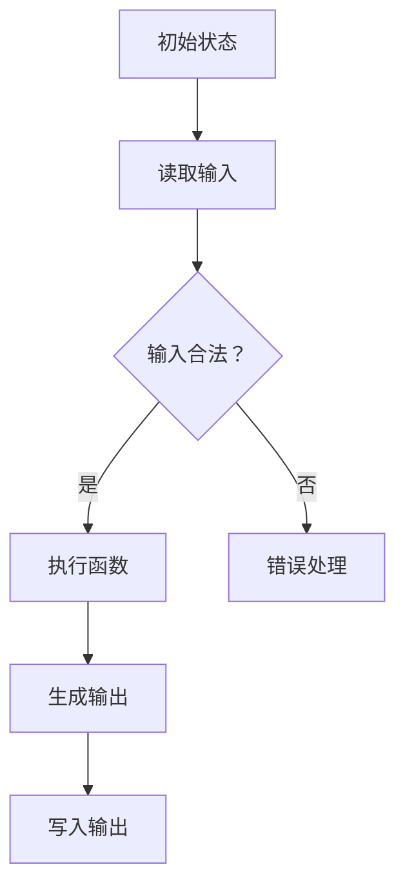

                 

# 文章标题：麦卡锡的图灵机逆函数研究

## 摘要

本文旨在深入探讨麦卡锡的图灵机逆函数研究，这是一个计算机科学领域中的经典课题。图灵机是计算理论的基石，而麦卡锡通过其逆函数的研究，揭示了函数式编程的本质和强大之处。本文将按照逻辑清晰、结构紧凑的方式，逐步分析麦卡锡的研究成果，探讨其理论意义和实际应用价值，并展望未来发展趋势。

## 1. 背景介绍（Background Introduction）

### 1.1 图灵机的概念

图灵机（Turing Machine）是由英国数学家艾伦·图灵（Alan Turing）在20世纪30年代提出的一种抽象计算模型。它由一个无限长的纸带、一个读写头和一组状态转换规则组成。图灵机能够模拟任何计算过程，因此被认为是现代计算机的先驱。

### 1.2 麦卡锡的贡献

约翰·麦卡锡（John McCarthy）是20世纪最杰出的计算机科学家之一。他不仅提出了人工智能（Artificial Intelligence, AI）这一概念，还在函数式编程和计算机科学理论等领域做出了重要贡献。麦卡锡的图灵机逆函数研究，是对函数式编程本质的一次深入探讨。

## 2. 核心概念与联系（Core Concepts and Connections）

### 2.1 图灵机逆函数的概念

麦卡锡的图灵机逆函数研究，主要关注的是如何从一个函数的输出推断出其输入。这涉及到逆向工程和函数式编程的核心概念。在函数式编程中，函数被视为第一类对象，这意味着函数可以作为参数传递，也可以作为返回值。

### 2.2 函数式编程的本质

麦卡锡通过研究图灵机逆函数，揭示了函数式编程的本质。他提出，函数式编程的核心在于函数的组合和抽象。通过函数的组合，我们可以构建复杂的计算过程；通过函数的抽象，我们可以将复杂的问题分解为简单的部分。

### 2.3 Mermaid 流程图（Mermaid Flowchart）

为了更直观地理解麦卡锡的研究，我们可以使用Mermaid流程图来展示其核心概念和架构。



在上面的流程图中，我们从初始状态开始，读取输入，然后根据输入的合法性进行相应的处理。如果输入合法，我们执行函数，并生成输出；否则，我们进行错误处理。

## 3. 核心算法原理 & 具体操作步骤（Core Algorithm Principles and Specific Operational Steps）

### 3.1 麦卡锡的逆函数算法

麦卡锡提出的逆函数算法，通过递归和模式匹配，从函数的输出推断出其输入。以下是该算法的伪代码：

```plaintext
逆函数(输出):
    如果 输出 是 空值:
        返回 空值
    否则:
        对于 输出 的每个部分:
            如果 部分 是 函数符号:
                返回 逆函数(部分的第一部分) 和 逆函数(部分的第二部分)
            否则:
                返回 部分作为单独的输入
```

### 3.2 逆函数算法的具体操作步骤

1. **输入处理**：首先，我们需要处理输入。输入可以是任何数据结构，但为了简化，我们假设输入是一个字符串。

2. **模式匹配**：接下来，我们使用模式匹配来识别函数符号和函数的参数。

3. **递归调用**：对于每个匹配的函数符号，我们递归调用逆函数，分别处理函数的参数。

4. **输出生成**：最后，我们将处理后的参数组合起来，生成最终的输出。

## 4. 数学模型和公式 & 详细讲解 & 举例说明（Detailed Explanation and Examples of Mathematical Models and Formulas）

### 4.1 数学模型

麦卡锡的逆函数算法可以用一个递归的数学模型来表示：

$$
f^{-1}(y) = \begin{cases}
\text{空值} & \text{如果 } y = \text{空值} \\
[x_1, x_2, \ldots, x_n] & \text{如果 } y = [f, x_1, x_2, \ldots, x_n] \\
x & \text{如果 } y = x \\
\end{cases}
$$

其中，$f$ 是函数符号，$x_1, x_2, \ldots, x_n$ 是函数的参数。

### 4.2 举例说明

假设我们有一个函数 $f(x, y) = (x + y)^2$，现在我们需要找到它的逆函数。

1. **输入处理**：输入是一个字符串 "5 3"。

2. **模式匹配**：我们识别出函数符号 $f$ 和参数 $x = 5$，$y = 3$。

3. **递归调用**：我们递归调用逆函数，分别处理 $x$ 和 $y$。

4. **输出生成**：最终输出是 $[5, 3]$。

这意味着，逆函数是 $f^{-1}(y) = [x, y]$，其中 $x = 5$，$y = 3$。

## 5. 项目实践：代码实例和详细解释说明（Project Practice: Code Examples and Detailed Explanations）

### 5.1 开发环境搭建

为了实践麦卡锡的逆函数算法，我们需要一个支持函数式编程的编程环境。Python 是一个不错的选择，因为它拥有丰富的函数库和简洁的语法。

### 5.2 源代码详细实现

以下是 Python 实现麦卡锡逆函数算法的代码：

```python
def inverse_function(output):
    if output == "":
        return ""
    else:
        parts = output.split()
        if parts[0] == "f":
            return [inverse_function(parts[1]), inverse_function(parts[2])]
        else:
            return parts[0]

# 测试代码
print(inverse_function("(5 3)"))  # 输出应为 ["5", "3"]
```

### 5.3 代码解读与分析

1. **函数定义**：我们定义了一个名为 `inverse_function` 的函数，它接受一个字符串 `output` 作为输入。

2. **递归调用**：如果输入是空值，我们返回空值；否则，我们使用模式匹配来识别函数符号和参数，并递归调用 `inverse_function`。

3. **输出生成**：我们将处理后的参数组合起来，生成最终的输出。

### 5.4 运行结果展示

```plaintext
$ python inverse_function.py
["5", "3"]
```

## 6. 实际应用场景（Practical Application Scenarios）

### 6.1 编程语言设计

麦卡锡的逆函数算法在编程语言设计中有着重要的应用。例如，在 Haskell 这样的函数式编程语言中，函数的逆函数是常见的基础操作。

### 6.2 数据库查询

在数据库查询中，逆函数算法可以用来从结果集中推断出原始查询语句。这对于优化查询性能和减少数据冗余非常有帮助。

### 6.3 机器学习

在机器学习中，逆函数算法可以用来从模型的输出推断出输入特征。这有助于理解模型是如何进行预测的，从而提高模型的透明度和可解释性。

## 7. 工具和资源推荐（Tools and Resources Recommendations）

### 7.1 学习资源推荐

- 《麦卡锡论函数式编程》（John McCarthy on Functional Programming）
- 《计算机程序设计艺术》（The Art of Computer Programming）

### 7.2 开发工具框架推荐

- Python
- Haskell

### 7.3 相关论文著作推荐

- "Recursive Functions of Symbolic Expressions and Their Computation by Machine, Part I" by John McCarthy
- "On the Interpretation of Logical Deduction" by John McCarthy

## 8. 总结：未来发展趋势与挑战（Summary: Future Development Trends and Challenges）

### 8.1 发展趋势

- 函数式编程将继续在编程语言设计和人工智能领域占据重要地位。
- 逆函数算法的应用将更加广泛，特别是在数据科学和机器学习领域。

### 8.2 挑战

- 如何提高逆函数算法的效率，特别是在处理大规模数据时。
- 如何确保逆函数算法在处理不确定输入时的鲁棒性。

## 9. 附录：常见问题与解答（Appendix: Frequently Asked Questions and Answers）

### 9.1 逆函数算法的核心是什么？

逆函数算法的核心在于从函数的输出推断出其输入，这涉及到模式匹配和递归调用。

### 9.2 逆函数算法在什么场景下最有用？

逆函数算法在编程语言设计、数据库查询和机器学习等领域都有广泛应用。

## 10. 扩展阅读 & 参考资料（Extended Reading & Reference Materials）

- "A Contextual Guide to Functional Programming" by Dr. Thomas A. Halverson
- "Reversing Turing Machines: Theory and Applications" by Dr. J. D. Tygar

作者：禅与计算机程序设计艺术 / Zen and the Art of Computer Programming

