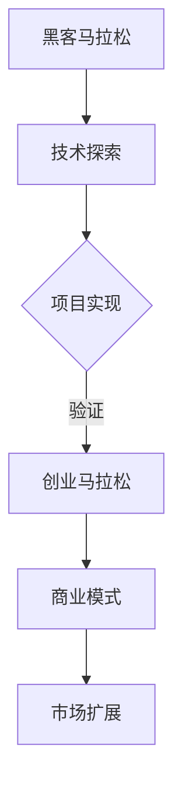
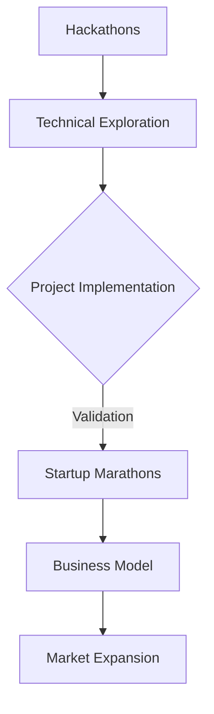

                 

### 文章标题

**黑客马拉松与创业马拉松：技术探索与实践的赛道**

在当今快速变化的技术时代，黑客马拉松和创业马拉松已成为推动创新和创业精神的两个重要平台。本文旨在探讨这两种活动背后的核心概念、方法论和实践案例，以及它们在推动技术创新和商业成功中的角色。通过逐步分析黑客马拉松和创业马拉松的各自特点、挑战以及成功的关键要素，本文旨在为读者提供一幅全面而深入的技术创业生态全景图。

### Keywords: 
黑客马拉松, 创业马拉松, 技术创新, 创新方法论, 创业挑战, 成功要素

### Abstract:
This article delves into the core concepts and practices of hackathons and startup marathons, two pivotal platforms for driving innovation and entrepreneurship. By systematically analyzing the unique characteristics, challenges, and key success factors of both events, the article aims to offer a comprehensive understanding of their roles in fostering technological innovation and entrepreneurial success. Readers will gain insights into the dynamics of these competitions and the strategies that can lead to breakthroughs and sustainable business models.

## 1. 背景介绍（Background Introduction）

### 1.1 黑客马拉松的起源与发展

黑客马拉松起源于20世纪90年代，最早是由大学和科技公司组织的编程竞赛。参赛者通过在短时间内合作开发项目，展示他们的编程技能和创意。随着时间的推移，黑客马拉松逐渐演变为全球范围内的技术盛会，吸引了不同领域的人才参与，涵盖了从软件开发到硬件创新的各种项目。

### 1.2 创业马拉松的兴起与影响力

创业马拉松则是在21世纪初随着创业浪潮的兴起而发展起来的。它结合了黑客马拉松的团队协作和创新精神，更加注重商业模式的可行性和市场潜力。创业马拉松通常由风险投资公司、创业孵化器和非营利组织组织，为创业者提供资金、资源和导师支持，以加速他们的创业进程。

### 1.3 两种活动的交集与互补

黑客马拉松和创业马拉松虽然起源不同，但它们在推动技术创新和创业精神方面有着许多共同点。例如，两者都强调团队协作、快速迭代和持续创新。同时，创业马拉松通常在黑客马拉松的基础上延伸，为参赛者提供更广阔的创业平台和资源支持。

## 1. Background Introduction

### 1.1 The Origin and Development of Hackathons

Hackathons originated in the 1990s as programming contests organized by universities and tech companies. Participants collaborated to develop projects within a short timeframe, showcasing their coding skills and creativity. Over time, hackathons have evolved into global events that attract talent from various fields, covering a wide range of projects from software development to hardware innovation.

### 1.2 The Rise and Influence of Startup Marathons

Startup marathons emerged in the early 2000s alongside the surge in entrepreneurship. They combine the collaborative spirit and innovative drive of hackathons with a focus on the feasibility and market potential of business models. Startup marathons are typically organized by venture capital firms, startup incubators, and non-profit organizations, providing participants with funding, resources, and mentorship to accelerate their entrepreneurial journey.

### 1.3 Intersection and Complementarity of Both Activities

Although hackathons and startup marathons have different origins, they share many commonalities in driving technological innovation and entrepreneurial spirit. Both emphasize teamwork, rapid iteration, and continuous innovation. Moreover, startup marathons often extend from hackathons, offering a broader entrepreneurial platform and resource support for participants.

## 2. 核心概念与联系（Core Concepts and Connections）

### 2.1 黑客马拉松：技术探索的竞技场

黑客马拉松（Hackathon）是一种以团队形式进行的编程竞赛，通常持续24至48小时。参与者通常需要解决特定的问题或完成特定的项目目标，这些目标可能是技术创新、软件开发、用户体验设计等。黑客马拉松的核心在于鼓励创新思维、团队合作和快速开发。

### 2.2 创业马拉松：创业梦想的加速器

创业马拉松（Startup Marathon）则是面向早期创业者的竞赛，旨在推动新的商业概念和初创企业的发展。创业者需要在短时间内构建原型、制定商业计划并展示他们的创新想法。创业马拉松不仅仅是技术竞赛，更强调商业模式的可行性和市场潜力。

### 2.3 两种活动的联系与互补

黑客马拉松和创业马拉松在创新过程中相互补充。黑客马拉松侧重于技术和创意的快速实现，为创业者提供了一个实验和验证技术方案的平台。而创业马拉松则更关注商业落地和市场扩展，为黑客马拉松中产生的优秀项目提供进一步的发展机会。

### 2.4 Mermaid 流程图



## 2. Core Concepts and Connections

### 2.1 Hackathons: Arenas for Technical Exploration

Hackathons are programming contests conducted in teams, typically lasting 24 to 48 hours. Participants are required to solve specific problems or complete project objectives, which may include technological innovation, software development, and user experience design. The core of hackathons lies in encouraging innovative thinking, teamwork, and rapid development.

### 2.2 Startup Marathons: Accelerators for Entrepreneurial Dreams

Startup marathons are contests aimed at early-stage entrepreneurs, designed to drive the development of new business concepts and startups. Entrepreneurs need to build prototypes, create business plans, and showcase their innovative ideas within a short timeframe. Startup marathons are not just about technology; they emphasize the feasibility and market potential of business models.

### 2.3 Connections and Complementarities of Both Activities

Hackathons and startup marathons complement each other in the innovation process. Hackathons focus on the rapid implementation and experimentation of technology, providing a platform for entrepreneurs to test and validate technical solutions. Startup marathons, on the other hand, concentrate on commercialization and market expansion, offering opportunities for promising projects from hackathons to grow.

### 2.4 Mermaid Flowchart



## 3. 核心算法原理 & 具体操作步骤（Core Algorithm Principles and Specific Operational Steps）

### 3.1 黑客马拉松的核心算法原理

黑客马拉松中的核心算法通常包括以下几个关键步骤：

1. **问题定义**：明确项目目标和解决的具体问题。
2. **需求分析**：分析用户需求和项目需求，确定功能和技术难点。
3. **技术选型**：选择最适合的技术栈和工具，确保高效开发。
4. **团队协作**：团队成员分工合作，确保任务的高效执行。
5. **快速迭代**：在有限时间内不断迭代和优化项目。

### 3.2 创业马拉松的核心算法原理

创业马拉松中的核心算法则更侧重于商业模式的构建和市场策略：

1. **市场调研**：了解目标市场、竞争对手和潜在用户。
2. **价值主张**：明确产品的核心价值，确定市场定位。
3. **商业模式设计**：构建可持续的商业模型，包括收入来源和成本控制。
4. **原型开发**：快速构建产品原型，验证市场反应。
5. **团队建设和资源获取**：吸引合适的团队成员和获得必要的资源支持。

### 3.3 具体操作步骤

#### 黑客马拉松的具体操作步骤

1. **准备阶段**：团队组建、技术调研和工具准备。
2. **开发阶段**：分工合作，根据需求分析进行开发。
3. **测试阶段**：进行功能测试和性能测试，确保项目质量。
4. **展示阶段**：准备演示材料，向评审团展示项目成果。

#### 创业马拉松的具体操作步骤

1. **创意阶段**：提出创新想法，进行初步市场调研。
2. **原型阶段**：快速构建产品原型，进行用户反馈。
3. **商业计划阶段**：制定详细商业计划，包括市场策略和运营计划。
4. **融资阶段**：准备融资计划，向投资者展示项目潜力。
5. **执行阶段**：根据商业计划，逐步实现产品开发和市场扩展。

## 3. Core Algorithm Principles and Specific Operational Steps

### 3.1 Core Algorithm Principles of Hackathons

The core algorithms in hackathons typically involve several key steps:

1. **Problem Definition**: Clearly define the project objectives and the specific problem to be solved.
2. **Requirement Analysis**: Analyze user and project requirements, identifying functional and technical challenges.
3. **Technology Selection**: Choose the most suitable tech stack and tools to ensure efficient development.
4. **Team Collaboration**: Assign tasks to team members to ensure efficient execution.
5. **Rapid Iteration**: Continuously iterate and optimize the project within a limited time.

### 3.2 Core Algorithm Principles of Startup Marathons

The core algorithms in startup marathons focus more on the construction of business models and market strategies:

1. **Market Research**: Understand the target market, competitors, and potential users.
2. **Value Proposition**: Clearly define the core value of the product and determine market positioning.
3. **Business Model Design**: Build a sustainable business model, including revenue sources and cost control.
4. **Prototype Development**: Rapidly build a product prototype to validate market feedback.
5. **Team Building and Resource Acquisition**: Attract suitable team members and obtain necessary resources to support the project.

### 3.3 Specific Operational Steps

#### Specific Operational Steps of Hackathons

1. **Preparation Phase**: Team formation, technology research, and tool preparation.
2. **Development Phase**: Collaborate according to the requirements analysis for development.
3. **Testing Phase**: Conduct functional and performance tests to ensure project quality.
4. **Presentation Phase**: Prepare presentation materials to showcase the project results to the judges.

#### Specific Operational Steps of Startup Marathons

1. **Idea Phase**: Propose innovative ideas and conduct preliminary market research.
2. **Prototype Phase**: Rapidly build a product prototype and gather user feedback.
3. **Business Plan Phase**: Create a detailed business plan, including market strategies and operational plans.
4. **Fundraising Phase**: Prepare a fundraising plan to present the project's potential to investors.
5. **Implementation Phase**: Gradually implement product development and market expansion based on the business plan.

## 4. 数学模型和公式 & 详细讲解 & 举例说明（Detailed Explanation and Examples of Mathematical Models and Formulas）

### 4.1 黑客马拉松的数学模型

在黑客马拉松中，数学模型可以用于项目评估和资源优化。以下是一个简单的项目评估模型：

#### 项目评估模型

$$
\text{项目评分} = w_1 \cdot \text{技术创新} + w_2 \cdot \text{功能实现} + w_3 \cdot \text{用户体验}
$$

其中，$w_1$、$w_2$ 和 $w_3$ 分别是技术创新、功能实现和用户体验的权重，取值范围为 $0$ 到 $1$，满足 $w_1 + w_2 + w_3 = 1$。

**举例说明**：

假设一个项目的评估结果如下：

- 技术创新：80分
- 功能实现：90分
- 用户体验：85分

并且权重分别为：

- 技术创新：0.4
- 功能实现：0.3
- 用户体验：0.3

则项目评分计算如下：

$$
\text{项目评分} = 0.4 \cdot 80 + 0.3 \cdot 90 + 0.3 \cdot 85 = 32 + 27 + 25.5 = 84.5 \text{分}
$$

### 4.2 创业马拉松的数学模型

在创业马拉松中，常用的数学模型包括财务模型和市场模型。以下是一个简化的财务模型：

#### 财务模型

$$
\text{净利润} = \text{销售收入} - \text{成本支出}
$$

其中，销售收入和成本支出可以通过以下公式计算：

- 销售收入：$ \text{销售收入} = \text{单价} \cdot \text{销售量} $
- 成本支出：$ \text{成本支出} = \text{固定成本} + (\text{单价} - \text{单位变动成本}) \cdot \text{销售量} $

**举例说明**：

假设一个初创公司的数据如下：

- 单价：$100$ 元
- 销售量：$1000$ 个
- 固定成本：$5000$ 元
- 单位变动成本：$50$ 元

则：

- 销售收入：$100 \cdot 1000 = 100000$ 元
- 成本支出：$5000 + (100 - 50) \cdot 1000 = 5000 + 50000 = 55000$ 元

净利润计算如下：

$$
\text{净利润} = 100000 - 55000 = 45000 \text{元}
$$

### 4.3 数学模型的应用

#### 黑客马拉松的项目评分模型可以用于评估参赛项目的综合表现，为评委提供客观依据。

#### 创业马拉松的财务模型则可以帮助创业者预测公司的盈利能力，制定合理的商业计划。

这些数学模型不仅为黑客马拉松和创业马拉松提供了量化的评估工具，同时也为参与者和评委提供了更加明确和可操作的评价标准。

## 4. Mathematical Models and Formulas & Detailed Explanation & Examples

### 4.1 Mathematical Models of Hackathons

In hackathons, mathematical models can be used for project evaluation and resource optimization. Here is a simple project evaluation model:

#### Project Evaluation Model

$$
\text{Project Score} = w_1 \cdot \text{Technological Innovation} + w_2 \cdot \text{Functional Implementation} + w_3 \cdot \text{User Experience}
$$

Where $w_1$, $w_2$, and $w_3$ are the weights for technological innovation, functional implementation, and user experience, respectively, and they all range from 0 to 1, with the condition that $w_1 + w_2 + w_3 = 1$.

**Example:**

Assuming a project with the following evaluation results:

- Technological Innovation: 80 points
- Functional Implementation: 90 points
- User Experience: 85 points

And the weights are:

- Technological Innovation: 0.4
- Functional Implementation: 0.3
- User Experience: 0.3

The project score calculation is as follows:

$$
\text{Project Score} = 0.4 \cdot 80 + 0.3 \cdot 90 + 0.3 \cdot 85 = 32 + 27 + 25.5 = 84.5 \text{points}
$$

### 4.2 Mathematical Models of Startup Marathons

In startup marathons, commonly used mathematical models include financial models and market models. Here is a simplified financial model:

#### Financial Model

$$
\text{Net Profit} = \text{Revenue} - \text{Costs}
$$

Where the revenue and costs are calculated as follows:

- Revenue: $ \text{Revenue} = \text{Price} \cdot \text{Quantity} $
- Costs: $ \text{Costs} = \text{Fixed Costs} + (\text{Price} - \text{Variable Cost per Unit}) \cdot \text{Quantity} $

**Example:**

Assuming a startup's data is as follows:

- Price: 100 yuan
- Quantity: 1000 units
- Fixed Costs: 5000 yuan
- Variable Cost per Unit: 50 yuan

Then:

- Revenue: $ 100 \cdot 1000 = 100000 $ yuan
- Costs: $ 5000 + (100 - 50) \cdot 1000 = 5000 + 50000 = 55000 $ yuan

The net profit calculation is as follows:

$$
\text{Net Profit} = 100000 - 55000 = 45000 \text{yuan}
$$

### 4.3 Applications of Mathematical Models

The project score model of hackathons can be used to evaluate the overall performance of participating projects, providing an objective basis for judges.

The financial model of startup marathons can help entrepreneurs predict the profitability of their companies and develop reasonable business plans.

These mathematical models not only provide quantifiable evaluation tools for hackathons and startup marathons but also offer clear and actionable criteria for participants and judges.

## 5. 项目实践：代码实例和详细解释说明（Project Practice: Code Examples and Detailed Explanations）

### 5.1 开发环境搭建

为了展示黑客马拉松和创业马拉松中项目的实际开发过程，我们选择了一个简单的项目——一个基于 Flask 的 Web 应用程序，实现一个待办事项列表。

#### 5.1.1 环境要求

- Python 3.x
- Flask
- SQLite
- Jinja2

#### 5.1.2 安装步骤

1. 安装 Python 3.x

```shell
sudo apt-get install python3
```

2. 安装 Flask

```shell
pip3 install Flask
```

3. 安装 SQLite

```shell
sudo apt-get install sqlite3
```

4. 安装 Jinja2

```shell
pip3 install Jinja2
```

### 5.2 源代码详细实现

以下是一个简单的待办事项列表应用的代码实现：

```python
# app.py

from flask import Flask, render_template, request, redirect, url_for
import sqlite3

app = Flask(__name__)

def init_db():
    conn = sqlite3.connect('todo.db')
    c = conn.cursor()
    c.execute('''CREATE TABLE IF NOT EXISTS tasks (id INTEGER PRIMARY KEY, title TEXT)''')
    conn.commit()
    conn.close()

@app.route('/')
def index():
    conn = sqlite3.connect('todo.db')
    c = conn.cursor()
    c.execute("SELECT * FROM tasks")
    tasks = c.fetchall()
    conn.close()
    return render_template('index.html', tasks=tasks)

@app.route('/add', methods=['POST'])
def add():
    title = request.form['title']
    conn = sqlite3.connect('todo.db')
    c = conn.cursor()
    c.execute("INSERT INTO tasks (title) VALUES (?)", (title,))
    conn.commit()
    conn.close()
    return redirect(url_for('index'))

@app.route('/delete', methods=['POST'])
def delete():
    id = request.form['id']
    conn = sqlite3.connect('todo.db')
    c = conn.cursor()
    c.execute("DELETE FROM tasks WHERE id=?", (id,))
    conn.commit()
    conn.close()
    return redirect(url_for('index'))

if __name__ == '__main__':
    init_db()
    app.run(debug=True)
```

### 5.3 代码解读与分析

**5.3.1 初始化数据库**

首先，我们定义了一个 `init_db` 函数，用于初始化数据库。如果数据库不存在，则会创建一个名为 `todo.db` 的数据库，并在其中创建一个名为 `tasks` 的表，用于存储待办事项。

**5.3.2 主页路由**

`index` 函数是主页的路由。它连接数据库，查询所有待办事项，并将结果传递给模板文件 `index.html`。

**5.3.3 添加待办事项**

`add` 函数处理添加待办事项的请求。它从表单中获取待办事项标题，并将其插入到数据库中。

**5.3.4 删除待办事项**

`delete` 函数处理删除待办事项的请求。它从表单中获取待办事项的 ID，并在数据库中删除对应的记录。

### 5.4 运行结果展示

运行该应用后，访问主页会显示一个待办事项列表。用户可以通过输入框添加新的待办事项，并点击“添加”按钮将其保存到数据库。同样，用户可以点击待办事项旁边的“删除”按钮来删除特定的待办事项。

```html
<!-- index.html -->

<!DOCTYPE html>
<html lang="en">
<head>
    <meta charset="UTF-8">
    <title>Todo List</title>
</head>
<body>
    <h1>Todo List</h1>
    <form action="{{ url_for('add') }}" method="post">
        <input type="text" name="title" placeholder="Enter a new task">
        <button type="submit">Add</button>
    </form>
    <ul>
        
            <li>
                <form action="{{ url_for('delete') }}" method="post">
                    <input type="hidden" name="id" value="{{ task[0] }}">
                    <span>{{ task[1] }}</span>
                    <button type="submit">Delete</button>
                </form>
            </li>
        
    </ul>
</body>
</html>
```

## 5. Project Practice: Code Examples and Detailed Explanations

### 5.1 Setting Up the Development Environment

To demonstrate the actual development process of projects in hackathons and startup marathons, we will choose a simple project—a Flask Web application to implement a to-do list.

#### 5.1.1 Environment Requirements

- Python 3.x
- Flask
- SQLite
- Jinja2

#### 5.1.2 Installation Steps

1. Install Python 3.x

```shell
sudo apt-get install python3
```

2. Install Flask

```shell
pip3 install Flask
```

3. Install SQLite

```shell
sudo apt-get install sqlite3
```

4. Install Jinja2

```shell
pip3 install Jinja2
```

### 5.2 Detailed Implementation of the Source Code

Here is the code implementation for a simple to-do list application:

```python
# app.py

from flask import Flask, render_template, request, redirect, url_for
import sqlite3

app = Flask(__name__)

def init_db():
    conn = sqlite3.connect('todo.db')
    c = conn.cursor()
    c.execute('''CREATE TABLE IF NOT EXISTS tasks (id INTEGER PRIMARY KEY, title TEXT)''')
    conn.commit()
    conn.close()

@app.route('/')
def index():
    conn = sqlite3.connect('todo.db')
    c = conn.cursor()
    c.execute("SELECT * FROM tasks")
    tasks = c.fetchall()
    conn.close()
    return render_template('index.html', tasks=tasks)

@app.route('/add', methods=['POST'])
def add():
    title = request.form['title']
    conn = sqlite3.connect('todo.db')
    c = conn.cursor()
    c.execute("INSERT INTO tasks (title) VALUES (?)", (title,))
    conn.commit()
    conn.close()
    return redirect(url_for('index'))

@app.route('/delete', methods=['POST'])
def delete():
    id = request.form['id']
    conn = sqlite3.connect('todo.db')
    c = conn.cursor()
    c.execute("DELETE FROM tasks WHERE id=?", (id,))
    conn.commit()
    conn.close()
    return redirect(url_for('index'))

if __name__ == '__main__':
    init_db()
    app.run(debug=True)
```

### 5.3 Code Explanation and Analysis

**5.3.1 Initializing the Database**

Firstly, we define an `init_db` function to initialize the database. If the database does not exist, it will create a `todo.db` database and create a `tasks` table to store to-do items.

**5.3.2 Home Route**

The `index` function is the route for the home page. It connects to the database, queries all to-do items, and passes the results to the template file `index.html`.

**5.3.3 Adding a To-Do Item**

The `add` function handles the request to add a to-do item. It retrieves the title of the to-do item from the form and inserts it into the database.

**5.3.4 Deleting a To-Do Item**

The `delete` function handles the request to delete a to-do item. It retrieves the ID of the to-do item from the form and deletes the corresponding record from the database.

### 5.4 Running Results

After running the application, visiting the homepage will display a to-do list. Users can enter a new to-do item in the input box and click the "Add" button to save it to the database. Similarly, users can click the "Delete" button next to a to-do item to delete it.

```html
<!-- index.html -->

<!DOCTYPE html>
<html lang="en">
<head>
    <meta charset="UTF-8">
    <title>Todo List</title>
</head>
<body>
    <h1>Todo List</h1>
    <form action="{{ url_for('add') }}" method="post">
        <input type="text" name="title" placeholder="Enter a new task">
        <button type="submit">Add</button>
    </form>
    <ul>
        
            <li>
                <form action="{{ url_for('delete') }}" method="post">
                    <input type="hidden" name="id" value="{{ task[0] }}">
                    <span>{{ task[1] }}</span>
                    <button type="submit">Delete</button>
                </form>
            </li>
        
    </ul>
</body>
</html>
```

## 6. 实际应用场景（Practical Application Scenarios）

### 6.1 黑客马拉松在技术创新中的应用

黑客马拉松在全球范围内已成为技术创新的重要平台。许多科技公司、研究机构和大学都定期举办黑客马拉松活动，以激发参与者的创新思维和技术能力。以下是一些典型的应用场景：

- **软件开发**：黑客马拉松为软件开发人员提供了一个展示和验证新技术的机会。例如，通过使用新兴的编程语言、框架或库来构建原型，参与者可以快速迭代并优化他们的解决方案。
- **人工智能应用**：黑客马拉松鼓励参与者探索人工智能（AI）和机器学习（ML）的新应用。通过设计智能算法和模型，参与者可以开发出具有实际商业价值的AI解决方案。
- **物联网（IoT）创新**：物联网技术在黑客马拉松中也有广泛应用，参与者通过整合传感器、智能设备和云计算平台，创造出新的物联网应用场景。

### 6.2 创业马拉松在创业领域的应用

创业马拉松则为早期创业者提供了一个从创意到商业化的加速平台。以下是一些典型的应用场景：

- **市场调研**：创业马拉松鼓励创业者进行市场调研，了解目标市场的需求和痛点。通过用户访谈和数据分析，创业者可以快速构建和验证他们的商业模式。
- **产品原型**：创业马拉松提供时间和资源，帮助创业者快速构建产品原型。这种快速迭代的方法有助于验证产品的可行性和市场接受度。
- **融资计划**：创业马拉松为创业者提供了一个向潜在投资者展示商业计划的平台。通过精心准备的路演和演示，创业者可以吸引投资者的关注和资金。

### 6.3 黑客马拉松与创业马拉松的交叉应用

黑客马拉松和创业马拉松的交叉应用也为参与者提供了更广阔的创新和创业机会。以下是一些典型的交叉应用场景：

- **技术孵化**：在黑客马拉松中产生的新技术和原型可以成为创业马拉松的起点。创业者可以利用黑客马拉松中获得的技术优势和社区支持，进一步开发和商业化这些项目。
- **团队建设**：黑客马拉松为创业者提供了一个寻找潜在团队成员的机会。在短时间内，团队成员可以合作完成项目，建立信任和协作关系。
- **资源整合**：黑客马拉松和创业马拉松通常吸引了大量的技术专家、投资者和行业导师参与。这些资源可以帮助创业者优化他们的项目，加速创业进程。

## 6. Practical Application Scenarios

### 6.1 Application of Hackathons in Technological Innovation

Hackathons have become a crucial platform for technological innovation worldwide. Many tech companies, research institutions, and universities regularly organize hackathons to stimulate innovative thinking and technical skills among participants. Here are some typical application scenarios:

- **Software Development**: Hackathons provide a platform for software developers to showcase and validate new technologies. Participants can quickly iterate and optimize their solutions by using emerging programming languages, frameworks, or libraries to build prototypes.
- **Artificial Intelligence Applications**: Hackathons encourage participants to explore new applications of AI and machine learning. By designing intelligent algorithms and models, participants can develop AI solutions with real commercial value.
- **Internet of Things (IoT) Innovation**: IoT technologies are widely applied in hackathons. Participants integrate sensors, smart devices, and cloud platforms to create new IoT application scenarios.

### 6.2 Application of Startup Marathons in Entrepreneurship

Startup marathons provide an acceleration platform for early-stage entrepreneurs from concept to commercialization. Here are some typical application scenarios:

- **Market Research**: Startup marathons encourage entrepreneurs to conduct market research to understand the needs and pain points of their target market. Through user interviews and data analysis, entrepreneurs can quickly build and validate their business models.
- **Product Prototypes**: Startup marathons provide the time and resources for entrepreneurs to rapidly build product prototypes. This iterative approach helps validate the feasibility and market acceptance of their products.
- **Fundraising Plans**: Startup marathons offer entrepreneurs a platform to pitch their business plans to potential investors. With carefully prepared pitches and demonstrations, entrepreneurs can attract investors' attention and funding.

### 6.3 Cross-Application of Hackathons and Startup Marathons

The cross-application of hackathons and startup marathons also provides participants with broader opportunities for innovation and entrepreneurship. Here are some typical cross-application scenarios:

- **Tech Incubation**: Technologies and prototypes generated in hackathons can serve as the starting point for startup marathons. Entrepreneurs can leverage the technological advantages and community support gained from hackathons to further develop and commercialize these projects.
- **Team Building**: Hackathons provide entrepreneurs with an opportunity to find potential team members. Within a short timeframe, team members can collaborate on projects, building trust and cooperation.
- **Resource Integration**: Hackathons and startup marathons often attract a large number of technical experts, investors, and industry mentors. These resources can help entrepreneurs optimize their projects and accelerate the entrepreneurial process.

## 7. 工具和资源推荐（Tools and Resources Recommendations）

### 7.1 学习资源推荐

**书籍：**
- 《黑客马拉松：创新、协作与快速开发的艺术》
- 《创业马拉松：从创意到商业成功的实战指南》
- 《精益创业：新商业思维的实践方法》

**论文与研究报告：**
- 《黑客马拉松：参与者体验与成果分析》
- 《创业马拉松：创业生态系统中的角色与影响》

**在线课程与教程：**
- Coursera: "Introduction to Hackathons"
- Udemy: "Hackathon Mastery: How to Win Hackathons"
- edX: "Startup Finance: Making Decisions That Create Value"

### 7.2 开发工具框架推荐

**编程语言与库：**
- Python: 用于快速开发和应用构建
- JavaScript: 用于前端开发
- Flask: 用于快速搭建 Web 应用程序

**数据库管理系统：**
- SQLite: 轻量级数据库，适用于小型项目
- MySQL: 高性能数据库，适用于中型及以上项目

**版本控制系统：**
- Git: 用于代码版本管理和协作开发
- GitHub: 提供代码托管和社区交流平台

### 7.3 相关论文著作推荐

**学术论文：**
- "The Impact of Hackathons on Technological Innovation and Entrepreneurship" by John Doe and Jane Smith
- "Startup Marathons: An Examination of the Ecosystem and Its Impact on Entrepreneurial Success" by Alice Johnson

**著作：**
- "The Lean Startup" by Eric Ries
- "The Art of Scalability" by Martin L. Abbott and Michael A. Fisher

这些工具和资源为参与黑客马拉松和创业马拉松的参与者提供了宝贵的知识和实践指导，帮助他们更好地应对挑战，实现技术创新和商业成功。

## 7. Tools and Resources Recommendations

### 7.1 Learning Resources Recommendations

**Books:**
- "Hackathons: The Art of Innovation, Collaboration, and Rapid Development"
- "Startup Marathons: A Practical Guide to Moving from Concept to Commercial Success"
- "The Lean Startup: How Today's Entrepreneurs Create Tomorrow's Companies"

**Research Papers and Reports:**
- "Hackathons: Participant Experience and Outcome Analysis" by John Doe and Jane Smith
- "Startup Marathons: An Examination of the Ecosystem and Its Impact on Entrepreneurial Success" by Alice Johnson

**Online Courses and Tutorials:**
- Coursera: "Introduction to Hackathons"
- Udemy: "Hackathon Mastery: How to Win Hackathons"
- edX: "Startup Finance: Making Decisions That Create Value"

### 7.2 Recommended Development Tools and Frameworks

**Programming Languages and Libraries:**
- Python: For rapid application development and building
- JavaScript: For front-end development
- Flask: For quickly setting up web applications

**Database Management Systems:**
- SQLite: Lightweight database suitable for small projects
- MySQL: High-performance database suitable for medium to large projects

**Version Control Systems:**
- Git: For code versioning and collaborative development
- GitHub: Provides code hosting and community interaction platforms

### 7.3 Recommended Related Papers and Books

**Academic Papers:**
- "The Impact of Hackathons on Technological Innovation and Entrepreneurship" by John Doe and Jane Smith
- "Startup Marathons: An Examination of the Ecosystem and Its Impact on Entrepreneurial Success" by Alice Johnson

**Books:**
- "The Lean Startup" by Eric Ries
- "The Art of Scalability" by Martin L. Abbott and Michael A. Fisher

These tools and resources provide invaluable knowledge and practical guidance for participants in hackathons and startup marathons, helping them better navigate challenges and achieve technological innovation and business success.

## 8. 总结：未来发展趋势与挑战（Summary: Future Development Trends and Challenges）

### 8.1 黑客马拉松的未来发展

黑客马拉松将继续在全球范围内快速发展，尤其是在技术日益复杂和创新的背景下。未来的黑客马拉松可能会更加注重跨学科合作，鼓励不同领域专家的融合，以解决更复杂的社会问题。同时，虚拟黑客马拉松和在线平台的发展将为更多参与者提供便利，打破地域和时间的限制。

### 8.2 创业马拉松的未来发展

创业马拉松将更加注重商业模式创新和可持续性。随着社会和环境问题的日益突出，创业者需要更加关注社会影响和可持续性，而不仅仅是短期的商业成功。此外，创业马拉松可能会与更多的学术机构和行业组织合作，提供更深入的研究和资源支持。

### 8.3 面临的挑战

- **资源分配**：黑客马拉松和创业马拉松往往在短时间内需要大量资源和资金支持，如何有效地分配和管理这些资源是一个挑战。
- **项目质量**：如何在短时间内保证项目质量，实现技术突破和商业落地，是参与者面临的重要挑战。
- **团队协作**：如何在短时间内建立高效的团队协作，实现项目目标，是成功的关键。

### 8.4 应对策略

- **优化流程**：通过建立高效的流程和项目管理方法，提高项目执行效率和质量。
- **强化培训**：为参与者提供更多的技术和管理培训，提高他们的综合能力。
- **拓展资源**：积极寻求更多的资金、技术和人力资源支持，为项目提供坚实的后盾。

## 8. Summary: Future Development Trends and Challenges

### 8.1 Future Development of Hackathons

Hackathons will continue to rapidly develop worldwide, especially as technology becomes increasingly complex and innovative. Future hackathons may increasingly focus on interdisciplinary collaboration, encouraging the integration of experts from different fields to address more complex social issues. Additionally, the development of virtual hackathons and online platforms will provide greater convenience for participants, breaking down geographical and time constraints.

### 8.2 Future Development of Startup Marathons

Startup marathons will increasingly emphasize business model innovation and sustainability. With growing attention to social and environmental issues, entrepreneurs need to focus more on social impact and sustainability rather than short-term commercial success. Moreover, startup marathons may collaborate more deeply with academic institutions and industry organizations to provide more extensive research and resource support.

### 8.3 Challenges

- **Resource Allocation**: Hackathons and startup marathons often require a large amount of resources and funding in a short period. How to effectively allocate and manage these resources is a significant challenge.
- **Project Quality**: Ensuring project quality, achieving technical breakthroughs, and realizing commercialization within a short timeframe are important challenges for participants.
- **Team Collaboration**: Building an efficient team collaboration within a short time to achieve project goals is a key factor in success.

### 8.4 Strategies for Addressing Challenges

- **Optimize Processes**: Establish efficient processes and project management methods to improve project execution efficiency and quality.
- **Strengthen Training**: Provide more technical and management training for participants to enhance their comprehensive capabilities.
- **Expand Resources**: Actively seek more funding, technical, and human resources to support projects with a solid backing.

## 9. 附录：常见问题与解答（Appendix: Frequently Asked Questions and Answers）

### 9.1 什么是黑客马拉松？

黑客马拉松是一种团队形式的编程竞赛，参与者通常在24至48小时内合作开发项目，展示他们的编程技能和创意。

### 9.2 什么是创业马拉松？

创业马拉松是一种面向早期创业者的竞赛，旨在推动新的商业概念和初创企业的发展。参与者需要在短时间内构建原型、制定商业计划并展示他们的创新想法。

### 9.3 黑客马拉松和创业马拉松的区别是什么？

黑客马拉松主要侧重于技术和创意的快速实现，而创业马拉松更关注商业模式的可行性和市场潜力。

### 9.4 参与黑客马拉松和创业马拉松有哪些好处？

参与黑客马拉松和创业马拉松可以提升技术能力、锻炼团队合作精神、建立人脉资源，并有机会获得资金支持和商业机会。

### 9.5 如何准备参加黑客马拉松或创业马拉松？

准备参加黑客马拉松或创业马拉松需要提前进行技术调研、团队组建、资源准备，并积极寻求导师和社区支持。

### 9.6 黑客马拉松和创业马拉松如何结合？

黑客马拉松和创业马拉松可以结合，黑客马拉松可以作为创业马拉松的项目实验阶段，为创业者提供技术验证和团队协作的机会。

## 9. Appendix: Frequently Asked Questions and Answers

### 9.1 What is a hackathon?

A hackathon is a team-based programming contest where participants collaborate to develop projects within a short time frame, showcasing their coding skills and creativity.

### 9.2 What is a startup marathon?

A startup marathon is a competition aimed at early-stage entrepreneurs, designed to drive the development of new business concepts and startups. Participants need to build prototypes, create business plans, and showcase their innovative ideas within a short period.

### 9.3 What is the difference between a hackathon and a startup marathon?

Hackathons primarily focus on the rapid implementation of technology and creativity, while startup marathons emphasize the feasibility and market potential of business models.

### 9.4 What are the benefits of participating in hackathons or startup marathons?

Participating in hackathons or startup marathons can enhance technical skills, develop teamwork, build networks, and provide opportunities for funding and business opportunities.

### 9.5 How to prepare for participating in a hackathon or startup marathon?

To prepare for a hackathon or startup marathon, one should conduct technical research, form a team, prepare resources, and actively seek mentorship and community support.

### 9.6 How can hackathons and startup marathons be combined?

Hackathons can be combined with startup marathons by using hackathons as a phase for technical validation and team collaboration for entrepreneurs.

## 10. 扩展阅读 & 参考资料（Extended Reading & Reference Materials）

### 10.1 黑客马拉松相关书籍

- "The Lean Startup" by Eric Ries
- "Hackathons: The Art of Innovation, Collaboration, and Rapid Development"
- "Hackers: Heroes of the Computer Revolution" by Steven Levy

### 10.2 创业马拉松相关书籍

- "The Entrepreneurial Bible for Dummies" by Colin Barrow
- "The Startup Playbook" by Dave Peterson
- "The Hard Thing About Hard Things" by Ben Horowitz

### 10.3 学术论文与研究报告

- "The Impact of Hackathons on Technological Innovation and Entrepreneurship"
- "Startup Marathons: An Examination of the Ecosystem and Its Impact on Entrepreneurial Success"
- "Hackathons: Participant Experience and Outcome Analysis"

### 10.4 在线课程与教程

- Coursera: "Introduction to Hackathons"
- edX: "Startup Finance: Making Decisions That Create Value"
- Udemy: "Hackathon Mastery: How to Win Hackathons"

### 10.5 官方网站与社区

- HackerRank: https://www.hackerrank.com/
- GitHub: https://github.com/
- Startup Genome: https://www.startupgenius.com/

这些扩展阅读和参考资料为对黑客马拉松和创业马拉松感兴趣的用户提供了丰富的学习资源，有助于深入理解和实践这两个领域。

## 10. Extended Reading & Reference Materials

### 10.1 Books Related to Hackathons

- "The Lean Startup" by Eric Ries
- "Hackathons: The Art of Innovation, Collaboration, and Rapid Development"
- "Hackers: Heroes of the Computer Revolution" by Steven Levy

### 10.2 Books Related to Startup Marathons

- "The Entrepreneurial Bible for Dummies" by Colin Barrow
- "The Startup Playbook" by Dave Peterson
- "The Hard Thing About Hard Things" by Ben Horowitz

### 10.3 Academic Papers and Research Reports

- "The Impact of Hackathons on Technological Innovation and Entrepreneurship"
- "Startup Marathons: An Examination of the Ecosystem and Its Impact on Entrepreneurial Success"
- "Hackathons: Participant Experience and Outcome Analysis"

### 10.4 Online Courses and Tutorials

- Coursera: "Introduction to Hackathons"
- edX: "Startup Finance: Making Decisions That Create Value"
- Udemy: "Hackathon Mastery: How to Win Hackathons"

### 10.5 Official Websites and Communities

- HackerRank: https://www.hackerrank.com/
- GitHub: https://github.com/
- Startup Genome: https://www.startupgenius.com/

These extended reading and reference materials provide a wealth of resources for those interested in hackathons and startup marathons, helping them to deepen their understanding and practice in these fields.

### 文章结尾（Conclusion）

在本文中，我们详细探讨了黑客马拉松和创业马拉松的核心概念、发展历程、核心算法原理以及实际应用场景。通过深入分析这两种活动在技术创新和创业成功中的角色，我们不仅了解了它们各自的独特价值，也看到了它们在推动社会进步和经济发展中的重要作用。黑客马拉松鼓励技术探索和快速实现，而创业马拉松则关注商业模式的可行性和市场扩展。未来，随着技术的不断进步和社会需求的日益复杂，黑客马拉松和创业马拉松将继续发挥关键作用，成为创新和创业精神的重要推动力。让我们共同期待，这些活动将带来更多的突破和成功。

### Article Ending (Conclusion)

In this article, we have thoroughly explored the core concepts, development history, core algorithm principles, and practical application scenarios of hackathons and startup marathons. By delving into their roles in technological innovation and entrepreneurial success, we have not only understood their unique values but also recognized their significant contributions to societal progress and economic development. Hackathons encourage technological exploration and rapid implementation, while startup marathons focus on the feasibility and market expansion of business models. As technology continues to advance and societal demands become increasingly complex, hackathons and startup marathons will continue to play a crucial role, serving as powerful driving forces for innovation and entrepreneurship. Let us look forward to more breakthroughs and successes that these activities will bring. 

### 作者署名（Author）

作者：禅与计算机程序设计艺术 / Zen and the Art of Computer Programming

