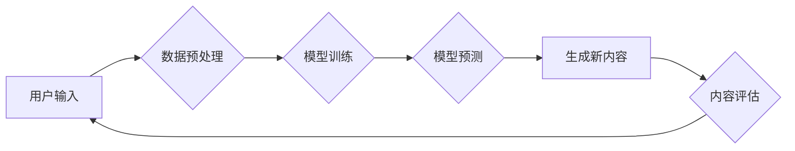

## 生成式AIGC：智能时代的商业新模式

> 关键词：生成式AI、AIGC、深度学习、Transformer、文本生成、图像生成、商业应用

### 1. 背景介绍

人工智能（AI）技术近年来发展迅速，特别是深度学习的突破性进展，为生成式人工智能（AIGC）的兴起提供了强有力的技术支撑。AIGC是指利用人工智能技术，从已有的数据中学习模式，并生成新的、原创的内容，例如文本、图像、音频、视频等。与传统的AI应用相比，AIGC更注重创造性和想象力，能够帮助人类更高效地完成创作任务，并开拓新的应用场景。

AIGC技术的出现，标志着人工智能进入了一个新的时代。它不仅改变了人们获取信息和娱乐的方式，也深刻地影响着各个行业的发展。从内容创作、营销推广到产品设计、教育培训，AIGC都展现出巨大的应用潜力。

### 2. 核心概念与联系

**2.1  生成式AI**

生成式AI是指能够根据输入数据生成新数据的AI模型。它不同于传统的AI模型，例如分类、识别等，它更注重创造性和想象力。

**2.2  AIGC**

AIGC是生成式AI在内容创作领域的应用。它利用AI技术，从海量数据中学习内容创作规律，并生成新的文本、图像、音频、视频等内容。

**2.3  核心技术**

AIGC的核心技术主要包括：

* **深度学习:** 深度学习是AIGC的基础，它利用多层神经网络学习数据特征，并生成新的数据。
* **Transformer:** Transformer是一种新型的神经网络架构，它能够处理长序列数据，在自然语言处理领域取得了突破性进展。
* **生成对抗网络 (GAN):** GAN是一种生成模型，它由两个网络组成：生成器和鉴别器。生成器生成数据，鉴别器判断数据是否真实。两者相互竞争，最终生成逼真的数据。

**2.4  Mermaid 流程图**



### 3. 核心算法原理 & 具体操作步骤

**3.1  算法原理概述**

AIGC的核心算法原理是利用深度学习模型学习数据特征，并根据学习到的特征生成新的数据。常见的AIGC算法包括：

* **Transformer模型:** Transformer模型能够处理长序列数据，在文本生成、机器翻译等领域取得了优异的性能。
* **GAN模型:** GAN模型通过生成器和鉴别器的对抗训练，生成逼真的数据。

**3.2  算法步骤详解**

**3.2.1  Transformer模型**

1. **数据预处理:** 将文本数据进行清洗、分词、词嵌入等预处理操作。
2. **模型训练:** 利用Transformer模型训练，学习文本数据之间的关系和模式。
3. **模型预测:** 将新的文本输入到训练好的模型中，模型会根据学习到的模式生成新的文本。

**3.2.2  GAN模型**

1. **数据预处理:** 将数据进行清洗、格式化等预处理操作。
2. **生成器训练:** 生成器网络学习生成逼真的数据，并将其与真实数据进行比较。
3. **鉴别器训练:** 鉴别器网络学习区分真实数据和生成数据，并反馈给生成器网络。
4. **对抗训练:** 生成器和鉴别器网络相互竞争，最终生成逼真的数据。

**3.3  算法优缺点**

**3.3.1  Transformer模型**

* **优点:** 能够处理长序列数据，生成流畅自然的文本。
* **缺点:** 训练成本高，需要大量的计算资源。

**3.3.2  GAN模型**

* **优点:** 可以生成逼真的数据，应用范围广泛。
* **缺点:** 训练过程复杂，容易陷入局部最优解。

**3.4  算法应用领域**

* **文本生成:** 自动写作、机器翻译、聊天机器人等。
* **图像生成:** 图片合成、图像修复、艺术创作等。
* **音频生成:** 语音合成、音乐创作、音效制作等。
* **视频生成:** 视频剪辑、视频特效、虚拟主播等。

### 4. 数学模型和公式 & 详细讲解 & 举例说明

**4.1  数学模型构建**

AIGC算法通常基于深度学习模型，例如Transformer模型。Transformer模型的核心是注意力机制，它能够学习文本数据之间的关系和模式。

**4.2  公式推导过程**

注意力机制的计算公式如下：

$$
Attention(Q, K, V) = softmax(\frac{QK^T}{\sqrt{d_k}})V
$$

其中：

* $Q$：查询矩阵
* $K$：键矩阵
* $V$：值矩阵
* $d_k$：键向量的维度
* $softmax$：softmax函数

**4.3  案例分析与讲解**

例如，在机器翻译任务中，Transformer模型会将源语言文本作为查询矩阵，目标语言文本作为键矩阵和值矩阵。通过注意力机制，模型能够学习源语言文本与目标语言文本之间的对应关系，并生成准确的翻译结果。

### 5. 项目实践：代码实例和详细解释说明

**5.1  开发环境搭建**

AIGC项目开发通常需要以下环境：

* Python编程语言
* 深度学习框架，例如TensorFlow或PyTorch
* GPU加速器

**5.2  源代码详细实现**

以下是一个使用PyTorch实现文本生成的简单代码示例：

```python
import torch
import torch.nn as nn

class TextGenerator(nn.Module):
    def __init__(self, vocab_size, embedding_dim, hidden_dim):
        super(TextGenerator, self).__init__()
        self.embedding = nn.Embedding(vocab_size, embedding_dim)
        self.lstm = nn.LSTM(embedding_dim, hidden_dim)
        self.fc = nn.Linear(hidden_dim, vocab_size)

    def forward(self, x):
        embedded = self.embedding(x)
        output, (hidden, cell) = self.lstm(embedded)
        output = self.fc(output[:, -1, :])
        return output

#... 模型训练和使用代码...
```

**5.3  代码解读与分析**

该代码实现了一个简单的文本生成模型，它使用LSTM网络来学习文本序列的上下文信息，并使用全连接层来预测下一个词。

**5.4  运行结果展示**

训练好的模型可以用于生成新的文本序列。例如，可以输入一个起始词，模型会根据学习到的模式生成后续的词，最终生成一段完整的文本。

### 6. 实际应用场景

**6.1  内容创作**

* **自动写作:** 生成新闻报道、产品描述、广告文案等。
* **创意写作:** 生成诗歌、小说、剧本等。
* **社交媒体内容:** 生成微博、朋友圈、抖音视频等内容。

**6.2  营销推广**

* **个性化推荐:** 根据用户的兴趣爱好生成个性化的产品推荐。
* **精准营销:** 根据用户的行为数据生成精准的广告文案。
* **虚拟形象:** 创建虚拟主播、虚拟客服等。

**6.3  教育培训**

* **智能辅导:** 为学生提供个性化的学习辅导。
* **自动生成练习题:** 根据教材内容自动生成练习题。
* **虚拟课堂:** 创建虚拟课堂环境，提供沉浸式的学习体验。

**6.4  未来应用展望**

AIGC技术的发展将进一步推动智能时代的到来，它将在更多领域发挥重要作用，例如：

* **医疗保健:** 生成医学报告、辅助诊断等。
* **金融服务:** 生成财务报表、风险评估等。
* **科学研究:** 生成科研论文、辅助实验设计等。

### 7. 工具和资源推荐

**7.1  学习资源推荐**

* **书籍:** 《深度学习》、《自然语言处理》
* **在线课程:** Coursera、edX、Udacity等平台上的深度学习课程
* **博客:** TensorFlow博客、PyTorch博客等

**7.2  开发工具推荐**

* **深度学习框架:** TensorFlow、PyTorch、Keras等
* **文本处理工具:** NLTK、spaCy等
* **图像处理工具:** OpenCV、Pillow等

**7.3  相关论文推荐**

* **Transformer:** Attention Is All You Need
* **GAN:** Generative Adversarial Networks
* **BERT:** BERT: Pre-training of Deep Bidirectional Transformers for Language Understanding

### 8. 总结：未来发展趋势与挑战

**8.1  研究成果总结**

AIGC技术取得了显著的进展，能够生成高质量的文本、图像、音频等内容。

**8.2  未来发展趋势**

* **模型能力提升:** 模型将更加强大，能够生成更加逼真、多样化的内容。
* **应用场景拓展:** AIGC将应用于更多领域，例如医疗、金融、教育等。
* **伦理与安全问题:** 需要关注AIGC技术的伦理和安全问题，例如内容虚假、版权侵权等。

**8.3  面临的挑战**

* **数据获取和标注:** AIGC模型需要大量的训练数据，数据获取和标注成本较高。
* **模型训练效率:** AIGC模型训练时间长，计算资源消耗大。
* **模型解释性和可控性:** AIGC模型的决策过程难以解释，缺乏可控性。

**8.4  研究展望**

未来研究将重点关注以下方面：

* **高效的训练方法:** 开发更加高效的训练方法，降低训练成本。
* **可解释性和可控性:** 研究AIGC模型的决策过程，提高模型的可解释性和可控性。
* **伦理与安全问题:** 制定AIGC技术的伦理规范，保障其安全使用。

### 9. 附录：常见问题与解答

**9.1  AIGC技术与传统AI技术有什么区别？**

传统AI技术主要侧重于数据分析和预测，而AIGC技术则更注重创造性和想象力，能够生成新的数据。

**9.2  AIGC技术有哪些应用场景？**

AIGC技术应用场景广泛，例如内容创作、营销推广、教育培训等。

**9.3  AIGC技术的未来发展趋势是什么？**

AIGC技术的未来发展趋势是模型能力提升、应用场景拓展、伦理与安全问题关注。


作者：禅与计算机程序设计艺术 / Zen and the Art of Computer Programming 
