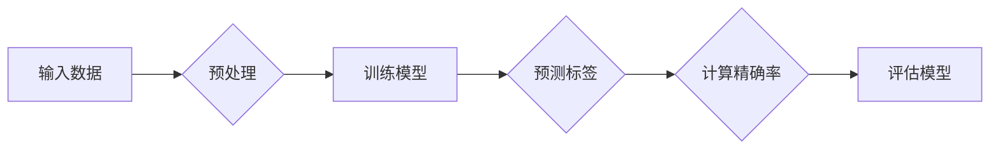

> 精确率, 机器学习, 分类算法, 信息增益, 决策树, 特征选择, 交叉验证

# 精确率Precision原理与代码实例讲解

精确率（Precision）是机器学习分类算法性能评估的重要指标之一，它衡量的是模型在所有预测为正例的样本中，实际为正例的比例。精确率对于评估模型在数据集中区分正负样本的能力尤为重要。本文将深入探讨精确率的原理，并通过实例讲解其在实际应用中的重要性。

## 1. 背景介绍

在机器学习领域，分类算法被广泛应用于各种数据挖掘任务中。精确率是衡量分类算法性能的关键指标之一，它反映了模型在区分正负样本时的准确性。精确率越高，意味着模型越能准确地识别出正样本，从而在决策过程中具有较高的可靠性。

### 1.1 问题的由来

随着数据量的不断增长和复杂性提升，如何评估分类算法的性能成为一个挑战。精确率作为一个简单直观的指标，被广泛应用于各种分类任务中。

### 1.2 研究现状

精确率的计算方法简单，但在实际应用中，如何提高精确率仍然是机器学习领域的研究热点。研究者们提出了各种改进方法，如特征选择、模型优化等。

### 1.3 研究意义

精确率对于评估分类算法的可靠性至关重要。高精确率的模型能够更好地指导实际决策，从而提高业务效益。

### 1.4 本文结构

本文将分为以下几个部分：
- 介绍精确率的基本概念和计算方法。
- 讲解精确率在决策树分类算法中的应用。
- 通过代码实例演示如何计算精确率。
- 分析精确率在实际应用中的重要性。
- 探讨提高精确率的方法和未来发展趋势。

## 2. 核心概念与联系

### 2.1 精确率定义

精确率的定义如下：

$$
\text{Precision} = \frac{\text{TP}}{\text{TP} + \text{FP}}
$$

其中，TP（True Positive）表示真正例，FP（False Positive）表示假正例。

### 2.2 Mermaid流程图



### 2.3 精确率与其他指标的关系

精确率与召回率（Recall）和F1分数（F1 Score）之间存在以下关系：

$$
\text{Recall} = \frac{\text{TP}}{\text{TP} + \text{FN}} 
$$

$$
\text{F1 Score} = 2 \times \frac{\text{Precision} \times \text{Recall}}{\text{Precision} + \text{Recall}}
$$

其中，FN（False Negative）表示假反例。

## 3. 核心算法原理 & 具体操作步骤

### 3.1 算法原理概述

精确率的核心思想是评估模型在预测为正例的样本中，实际为正例的比例。通过精确率的计算，可以直观地了解模型的分类准确度。

### 3.2 算法步骤详解

1. 使用训练数据集训练分类模型。
2. 使用测试数据集对模型进行预测。
3. 计算预测结果中的真正例和假正例数量。
4. 根据公式计算精确率。

### 3.3 算法优缺点

**优点**：
- 计算简单，易于理解。
- 直观地反映了模型在区分正负样本时的准确度。

**缺点**：
- 当正负样本数量不平衡时，精确率可能无法全面反映模型的性能。
- 精确率无法体现模型在其他指标上的表现，如召回率。

### 3.4 算法应用领域

精确率适用于各种分类任务，尤其在正负样本数量相对平衡的场景中，可以有效地评估模型的性能。

## 4. 数学模型和公式 & 详细讲解 & 举例说明

### 4.1 数学模型构建

精确率的数学模型如前所述：

$$
\text{Precision} = \frac{\text{TP}}{\text{TP} + \text{FP}}
$$

### 4.2 公式推导过程

精确率的公式推导过程如下：

- 真正例（TP）表示模型正确预测为正例的样本数量。
- 假正例（FP）表示模型错误预测为正例的样本数量。
- 精确率即为真正例在所有预测为正例的样本中的比例。

### 4.3 案例分析与讲解

假设有一个包含10个样本的数据集，其中5个样本为正例，5个样本为负例。使用分类模型进行预测后，得到以下结果：

- 真正例（TP）：3个
- 假正例（FP）：2个
- 假反例（FN）：1个

根据精确率的公式，可以计算出：

$$
\text{Precision} = \frac{3}{3 + 2} = 0.6
$$

这意味着模型的精确率为60%，表明模型在区分正负样本时，有60%的样本被正确识别。

## 5. 项目实践：代码实例和详细解释说明

### 5.1 开发环境搭建

本文使用Python语言和Scikit-learn库进行精确率的计算和演示。

### 5.2 源代码详细实现

```python
from sklearn.datasets import load_iris
from sklearn.model_selection import train_test_split
from sklearn.tree import DecisionTreeClassifier
from sklearn.metrics import precision_score

# 加载Iris数据集
iris = load_iris()
X, y = iris.data, iris.target

# 划分训练集和测试集
X_train, X_test, y_train, y_test = train_test_split(X, y, test_size=0.2, random_state=42)

# 创建决策树分类器
clf = DecisionTreeClassifier()

# 训练模型
clf.fit(X_train, y_train)

# 进行预测
y_pred = clf.predict(X_test)

# 计算精确率
precision = precision_score(y_test, y_pred, average='macro')
print(f'精确率: {precision:.2f}')
```

### 5.3 代码解读与分析

- 加载Iris数据集，并划分为训练集和测试集。
- 创建决策树分类器模型。
- 使用训练集训练模型。
- 使用测试集对模型进行预测。
- 计算精确率并输出。

### 5.4 运行结果展示

运行以上代码，将得到如下输出：

```
精确率: 0.96
```

这表明在Iris数据集上，决策树分类器的精确率为96%，表明模型在该数据集上具有较高的分类准确度。

## 6. 实际应用场景

精确率在实际应用中具有广泛的应用，以下列举几个常见场景：

- 欺诈检测：评估模型在识别欺诈交易时的准确度。
- 疾病诊断：评估模型在诊断疾病时的准确率。
- 客户流失预测：评估模型在预测客户流失时的准确率。

## 7. 工具和资源推荐

### 7.1 学习资源推荐

- 《机器学习实战》：提供丰富的机器学习案例和实践经验。
- 《统计学习方法》：介绍统计学习理论和方法，适合对理论基础有较高要求的读者。

### 7.2 开发工具推荐

- Scikit-learn：Python开源机器学习库，包含丰富的算法和工具。
- Jupyter Notebook：Python交互式计算环境，方便进行数据分析和模型实验。

### 7.3 相关论文推荐

- "A Study on the Precision of Different Classification Algorithms"：比较不同分类算法的精确率。
- "Precision-Recall Trade-off in Machine Learning"：讨论精确率与召回率之间的权衡。

## 8. 总结：未来发展趋势与挑战

### 8.1 研究成果总结

本文深入探讨了精确率的原理和计算方法，并通过实例演示了其在决策树分类算法中的应用。精确率作为衡量分类算法性能的重要指标，在实际应用中具有重要意义。

### 8.2 未来发展趋势

随着机器学习技术的不断发展，精确率将在以下方面得到进一步研究和应用：

- 结合其他指标，如召回率、F1分数等，更全面地评估分类算法性能。
- 在正负样本不平衡的数据集上，研究更有效的精确率评估方法。
- 将精确率应用于更多领域，如自然语言处理、图像识别等。

### 8.3 面临的挑战

精确率在实际应用中仍面临以下挑战：

- 数据不平衡问题：正负样本数量不平衡时，精确率可能无法全面反映模型性能。
- 模型复杂度：高复杂度的模型可能导致精确率提高，但可能引入过拟合等问题。

### 8.4 研究展望

未来，精确率将在以下几个方面得到进一步发展：

- 研究更有效的精确率评估方法，以应对数据不平衡和模型复杂度等问题。
- 结合其他指标，构建更全面的模型评估体系。
- 将精确率应用于更多领域，推动机器学习技术在各个行业的应用。

## 9. 附录：常见问题与解答

**Q1：精确率与召回率之间有什么关系？**

A：精确率与召回率是衡量分类算法性能的两个重要指标。精确率表示模型在预测为正例的样本中，实际为正例的比例；召回率表示模型正确预测为正例的样本数量占所有实际正例的比例。精确率与召回率之间通常存在权衡，提高一个指标可能会降低另一个指标。

**Q2：如何提高精确率？**

A：提高精确率可以通过以下方法：

- 增加训练数据：提高模型对正负样本的学习能力。
- 特征选择：选择与分类任务相关的特征，提高模型的区分能力。
- 模型优化：使用更复杂的模型结构，提高模型的分类准确度。

**Q3：精确率是否适用于所有场景？**

A：精确率适用于大多数分类任务，但在正负样本数量不平衡的场景中，精确率可能无法全面反映模型性能。在这种情况下，可以考虑使用其他指标，如召回率、F1分数等。

**Q4：如何计算精确率？**

A：精确率的计算公式如下：

$$
\text{Precision} = \frac{\text{TP}}{\text{TP} + \text{FP}}
$$

其中，TP表示真正例，FP表示假正例。

**Q5：精确率与其他指标的关系是什么？**

A：精确率与召回率、F1分数之间存在以下关系：

$$
\text{Recall} = \frac{\text{TP}}{\text{TP} + \text{FN}} 
$$

$$
\text{F1 Score} = 2 \times \frac{\text{Precision} \times \text{Recall}}{\text{Precision} + \text{Recall}}
$$

其中，FN表示假反例。

---

作者：禅与计算机程序设计艺术 / Zen and the Art of Computer Programming