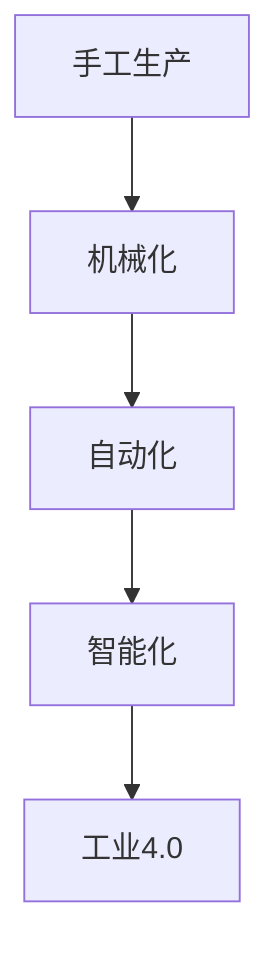

# 纺织业的手工与机械化转变

> 关键词：纺织业，手工生产，机械化，自动化，智能化，工业4.0，供应链优化，数字孪生

## 1. 背景介绍

纺织业，作为世界上最古老的制造业之一，经历了从手工生产到机械化的漫长演变。在过去的几个世纪中，纺织业的技术革新推动了全球经济的发展，改变了人们的生活方式和消费习惯。随着信息技术的飞速发展，纺织业正迎来新一轮的变革，即从机械化向智能化的转变。本文将探讨纺织业手工与机械化转变的历史、现状和未来趋势。

### 1.1 纺织业手工生产的历史

在纺织业的早期，生产过程完全依靠手工完成。从采摘棉花、纺纱、织布到后期整理，每个环节都需要大量的人工操作。这种手工生产方式效率低下，产品质量参差不齐，且劳动强度大。

### 1.2 机械化的兴起

18世纪末，工业革命的到来标志着纺织业机械化的开始。发明家们设计出了一系列自动化机器，如纺车、织布机等，极大地提高了生产效率。随后，纺织机械不断改进，从蒸汽动力到电力驱动，再到自动化生产线，纺织业的机械化水平得到了显著提升。

### 1.3 纺织业的现状

如今，纺织业已经进入了一个全新的阶段，即智能化时代。随着互联网、物联网、大数据、人工智能等技术的快速发展，纺织业的生产方式正在发生深刻变革。从原料采购到产品设计、生产制造、物流配送，再到销售和售后服务，整个产业链都在向智能化方向发展。

## 2. 核心概念与联系

### 2.1 核心概念

- **手工生产**：指完全依靠人工操作完成的生产方式，效率低，质量参差不齐。
- **机械化**：指使用机械设备替代人工操作，提高生产效率和产品质量。
- **自动化**：指在无人或少人干预的情况下，通过机器自动完成生产过程。
- **智能化**：指在自动化基础上，利用人工智能、大数据等技术，实现生产过程的智能化决策和优化。
- **工业4.0**：德国提出的第四次工业革命概念，旨在通过智能化、网络化、数字化等手段，实现工业生产过程的全面升级。

### 2.2 核心概念原理和架构的 Mermaid 流程图



### 2.3 核心概念联系

从手工生产到智能化，纺织业的发展经历了四个阶段。每个阶段都是在前一个阶段基础上，通过技术创新和产业升级实现的。手工生产是基础，机械化是关键，自动化是手段，智能化是目标，工业4.0则是这一过程的终极形态。

## 3. 核心算法原理 & 具体操作步骤

### 3.1 算法原理概述

纺织业智能化转型的核心算法包括：

- **图像识别算法**：用于识别织物图案、颜色、质量等。
- **机器学习算法**：用于预测市场需求、优化生产计划、提高产品质量等。
- **深度学习算法**：用于实现智能决策、自动化控制等。

### 3.2 算法步骤详解

1. **数据收集**：收集生产过程中的各种数据，如原料质量、生产设备状态、生产效率等。
2. **数据预处理**：对收集到的数据进行清洗、转换、归一化等处理，以便进行后续分析。
3. **特征提取**：从预处理后的数据中提取关键特征，用于后续的算法训练和决策。
4. **模型训练**：利用机器学习或深度学习算法，对提取的特征进行训练，建立预测模型。
5. **模型评估**：使用测试数据评估模型的性能，并调整参数以优化模型。
6. **模型部署**：将训练好的模型部署到生产环境中，实现自动化控制、智能决策等功能。

### 3.3 算法优缺点

**优点**：

- 提高生产效率
- 提高产品质量
- 降低生产成本
- 实现生产过程的智能化管理

**缺点**：

- 技术门槛高
- 成本投入大
- 需要专业人才

### 3.4 算法应用领域

纺织业智能化算法广泛应用于以下几个方面：

- 原料质量控制
- 生产过程监控
- 产品质量检测
- 生产调度优化
- 能源管理

## 4. 数学模型和公式 & 详细讲解 & 举例说明

### 4.1 数学模型构建

纺织业智能化算法的数学模型主要包括：

- **线性回归模型**：用于预测市场需求、生产量等。
- **逻辑回归模型**：用于预测产品质量、设备故障等。
- **支持向量机模型**：用于分类、回归等任务。
- **神经网络模型**：用于复杂决策、自动化控制等。

### 4.2 公式推导过程

以线性回归模型为例，其目标是最小化预测值与真实值之间的误差。假设输入特征为 $x$，输出为 $y$，则线性回归模型可以表示为：

$$
y = \beta_0 + \beta_1 x_1 + \beta_2 x_2 + \ldots + \beta_n x_n + \epsilon
$$

其中，$\beta_0, \beta_1, \beta_2, \ldots, \beta_n$ 为模型参数，$\epsilon$ 为误差项。

通过最小化均方误差，可以得到：

$$
\hat{\beta} = (X^T X)^{-1} X^T y
$$

其中，$X$ 为输入特征矩阵，$y$ 为真实值向量。

### 4.3 案例分析与讲解

以下是一个简单的线性回归模型案例：

假设某纺织厂想预测下个月的生产量 $y$，输入特征包括上个月的生产量 $x_1$、原材料价格 $x_2$ 和工人数量 $x_3$。根据历史数据，我们可以建立如下线性回归模型：

$$
y = \beta_0 + \beta_1 x_1 + \beta_2 x_2 + \beta_3 x_3
$$

通过收集历史数据，我们可以使用最小二乘法求解模型参数：

$$
\hat{\beta} = (X^T X)^{-1} X^T y
$$

得到模型参数后，我们可以用下个月的特征值 $x_1, x_2, x_3$ 来预测生产量 $y$。

## 5. 项目实践：代码实例和详细解释说明

### 5.1 开发环境搭建

由于纺织业智能化算法涉及多种技术，包括机器学习、深度学习、图像识别等，因此需要搭建以下开发环境：

- 编程语言：Python
- 机器学习库：scikit-learn
- 深度学习库：TensorFlow或PyTorch
- 图像处理库：OpenCV或PIL

### 5.2 源代码详细实现

以下是一个简单的图像识别算法案例，使用OpenCV库识别织物图案：

```python
import cv2

def identify_pattern(image_path):
    # 加载图像
    image = cv2.imread(image_path)
    # 转换为灰度图
    gray_image = cv2.cvtColor(image, cv2.COLOR_BGR2GRAY)
    # 应用二值化
    _, binary_image = cv2.threshold(gray_image, 127, 255, cv2.THRESH_BINARY)
    # 查找轮廓
    contours, _ = cv2.findContours(binary_image, cv2.RETR_EXTERNAL, cv2.CHAIN_APPROX_SIMPLE)
    # 计算轮廓面积
    areas = [cv2.contourArea(contour) for contour in contours]
    # 获取面积最大的轮廓
    max_contour = contours[areas.index(max(areas))]
    # 获取轮廓轮廓信息
    x, y, w, h = cv2.boundingRect(max_contour)
    # 在原图上绘制轮廓
    cv2.rectangle(image, (x, y), (x+w, y+h), (0, 255, 0), 2)
    # 显示结果
    cv2.imshow('Pattern Recognition', image)
    cv2.waitKey(0)
    cv2.destroyAllWindows()

# 示例用法
identify_pattern('fabric_pattern.jpg')
```

### 5.3 代码解读与分析

以上代码实现了以下功能：

1. 加载图像并转换为灰度图。
2. 应用二值化操作，将图像转换为黑白二值图像。
3. 使用OpenCV库的findContours函数查找图像中的轮廓。
4. 计算所有轮廓的面积，并获取面积最大的轮廓。
5. 获取面积最大的轮廓的边界框信息。
6. 在原图上绘制边界框，显示识别结果。

### 5.4 运行结果展示

运行上述代码，将显示识别出的织物图案。

## 6. 实际应用场景

### 6.1 原料质量控制

通过图像识别算法，可以对棉花、化纤等原料进行质量检测，判断原料的颜色、纤维长度、杂质含量等指标，从而确保原料质量。

### 6.2 生产过程监控

通过传感器和图像识别技术，可以实时监测生产设备的状态，及时发现故障和异常，避免生产中断。

### 6.3 产品质量检测

通过图像识别算法，可以对织出的织物进行质量检测，判断织物的图案、颜色、密度等指标，从而确保产品质量。

### 6.4 生产调度优化

通过机器学习算法，可以预测市场需求，优化生产计划，提高生产效率。

### 6.5 能源管理

通过物联网技术，可以实时监测工厂的能源消耗情况，优化能源使用效率。

## 7. 工具和资源推荐

### 7.1 学习资源推荐

- 《深度学习》
- 《机器学习实战》
- 《Python编程：从入门到实践》
- 《OpenCV计算机视觉编程实战》

### 7.2 开发工具推荐

- Python编程语言
- OpenCV图像处理库
- TensorFlow或PyTorch深度学习框架
- scikit-learn机器学习库

### 7.3 相关论文推荐

- 《Deep Learning for Image Processing》
- 《Learning Deep Features for Image Recognition》
- 《Deep Learning with Python》

## 8. 总结：未来发展趋势与挑战

### 8.1 研究成果总结

纺织业从手工生产到智能化的转变，得益于信息技术的快速发展。通过机器学习、深度学习、图像识别等技术的应用，纺织业的生产效率、产品质量和能源效率得到了显著提高。

### 8.2 未来发展趋势

- **智能制造**：通过引入人工智能、机器人等技术，实现生产过程的自动化、智能化。
- **个性化定制**：根据客户需求，实现个性化产品设计、生产和服务。
- **绿色制造**：通过优化生产过程，降低能耗和污染物排放。

### 8.3 面临的挑战

- **技术挑战**：人工智能、机器人等技术在纺织业的实际应用仍存在一定挑战，如算法精度、设备可靠性、系统集成等。
- **人才挑战**：纺织业需要大量具备信息技术和纺织知识的专业人才。

### 8.4 研究展望

未来，纺织业将继续向着智能化、绿色化、个性化方向发展。通过技术创新和产业升级，纺织业将为人类创造更加美好的生活。

## 9. 附录：常见问题与解答

**Q1：纺织业智能化转型的关键是什么？**

A：纺织业智能化转型的关键是技术创新和产业升级。通过引入人工智能、机器人、物联网等新技术，实现生产过程的自动化、智能化，提高生产效率和质量。

**Q2：纺织业智能化转型有哪些优势？**

A：纺织业智能化转型可以带来以下优势：
- 提高生产效率
- 提高产品质量
- 降低生产成本
- 优化资源配置
- 提升企业管理水平

**Q3：纺织业智能化转型面临哪些挑战？**

A：纺织业智能化转型面临以下挑战：
- 技术挑战：人工智能、机器人等技术在纺织业的实际应用仍存在一定挑战。
- 人才挑战：纺织业需要大量具备信息技术和纺织知识的专业人才。
- 成本挑战：智能化转型需要投入大量资金和人力资源。

**Q4：纺织业智能化转型的未来发展趋势是什么？**

A：纺织业智能化转型的未来发展趋势是：
- 智能制造
- 个性化定制
- 绿色制造
- 产业链整合

---

作者：禅与计算机程序设计艺术 / Zen and the Art of Computer Programming