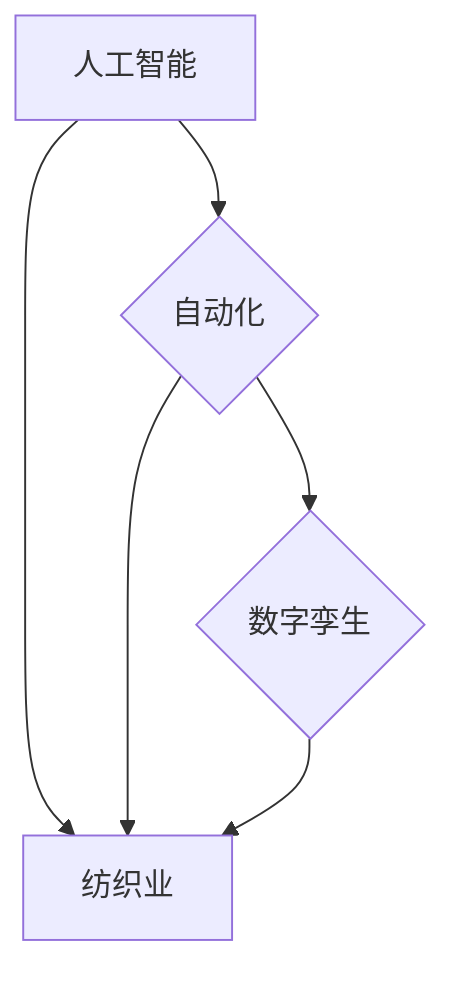

## 纺织工人的就业结构变化

> 关键词：人工智能、自动化、纺织业、就业结构、未来趋势、数字孪生、机器学习、数据分析

## 1. 背景介绍

纺织业作为人类文明发展的重要组成部分，经历了从手工纺织到机械化生产，再到现代智能化生产的演变。随着人工智能（AI）、自动化技术和数字孪生技术的快速发展，纺织业正在经历一场深刻的变革，这将对纺织工人的就业结构产生深远影响。

传统纺织业主要依赖人工操作，纺织工人承担着从原料整理到布匹加工的各个环节。然而，随着自动化技术的进步，许多重复性劳动和体力劳动正在被机器取代。例如，智能机器人可以完成织布、染色、裁剪等操作，大幅提高生产效率和降低人工成本。

## 2. 核心概念与联系

### 2.1  人工智能（AI）

人工智能是指模拟人类智能行为的计算机系统。在纺织业，AI技术主要应用于以下几个方面：

* **智能预测:** 利用机器学习算法分析历史数据，预测市场需求、原材料价格等，帮助企业优化生产计划和库存管理。
* **质量控制:** 利用计算机视觉技术识别布匹上的缺陷，提高产品质量和降低返工率。
* **个性化定制:** 利用AI算法根据客户需求生成个性化的设计方案，满足消费者对个性化产品的需求。

### 2.2  自动化

自动化是指利用机器和程序代替人工完成生产过程中的某些操作。在纺织业，自动化技术主要应用于以下几个方面：

* **机械化生产:** 利用自动化设备替代人工操作，提高生产效率和降低生产成本。
* **智能控制:** 利用传感器和控制系统实现生产过程的自动化控制，提高生产质量和稳定性。
* **物流自动化:** 利用自动化设备和系统实现原材料的自动运输和布匹的自动分拣，提高物流效率和降低物流成本。

### 2.3  数字孪生

数字孪生是指利用虚拟模型模拟现实世界中的物理实体，并实时收集和分析物理实体的数据。在纺织业，数字孪生技术可以用于以下几个方面：

* **生产过程模拟:** 利用数字孪生模型模拟生产过程，优化生产流程和降低生产成本。
* **产品设计优化:** 利用数字孪生模型进行产品设计优化，提高产品性能和美观度。
* **设备故障预测:** 利用数字孪生模型分析设备运行数据，预测设备故障，及时进行维护保养。

**核心概念与联系流程图:**



## 3. 核心算法原理 & 具体操作步骤

### 3.1  算法原理概述

在纺织业的智能化转型中，机器学习算法发挥着重要作用。机器学习算法可以从海量数据中学习模式和规律，并根据学习到的知识进行预测和决策。常见的机器学习算法包括：

* **监督学习:** 利用标记数据训练模型，例如预测市场需求、识别布匹缺陷等。
* **无监督学习:** 从未标记数据中发现模式和结构，例如聚类客户、发现产品趋势等。
* **强化学习:** 通过试错学习，优化决策策略，例如控制机器臂运动、优化生产流程等。

### 3.2  算法步骤详解

以预测市场需求为例，使用监督学习算法的具体操作步骤如下：

1. **数据收集:** 收集历史市场数据，包括产品销量、价格、季节、促销活动等信息。
2. **数据预处理:** 清洗数据，处理缺失值，转换数据格式，以便模型训练。
3. **特征工程:** 从原始数据中提取特征，例如产品类型、颜色、尺寸等，这些特征可以帮助模型更好地理解市场需求。
4. **模型选择:** 选择合适的机器学习算法，例如线性回归、决策树、支持向量机等。
5. **模型训练:** 利用训练数据训练模型，调整模型参数，使模型能够准确预测市场需求。
6. **模型评估:** 利用测试数据评估模型性能，例如使用准确率、召回率、F1-score等指标。
7. **模型部署:** 将训练好的模型部署到生产环境中，实时预测市场需求。

### 3.3  算法优缺点

**优点:**

* **准确性高:** 机器学习算法可以从海量数据中学习模式和规律，预测结果通常比传统方法更准确。
* **自动化程度高:** 机器学习算法可以自动完成预测任务，无需人工干预。
* **适应性强:** 机器学习算法可以根据新的数据不断学习和调整，适应不断变化的市场环境。

**缺点:**

* **数据依赖性强:** 机器学习算法需要大量高质量的数据进行训练，否则预测结果可能不准确。
* **解释性差:** 一些机器学习算法的决策过程难以解释，难以理解模型是如何做出预测的。
* **维护成本高:** 需要定期更新模型，以适应不断变化的数据和市场环境。

### 3.4  算法应用领域

机器学习算法在纺织业的应用领域非常广泛，包括：

* **市场预测:** 预测市场需求、产品销量、价格趋势等。
* **质量控制:** 识别布匹上的缺陷、预测产品寿命等。
* **个性化定制:** 根据客户需求生成个性化的设计方案、推荐合适的服装款式等。
* **生产优化:** 优化生产流程、提高生产效率、降低生产成本等。
* **物流管理:** 优化物流路线、提高物流效率、降低物流成本等。

## 4. 数学模型和公式 & 详细讲解 & 举例说明

### 4.1  数学模型构建

在纺织业的智能化转型中，数学模型可以用于描述生产过程、预测市场需求、优化生产计划等。例如，可以使用线性规划模型优化生产资源分配，最大化利润。

**线性规划模型:**

```latex
\begin{aligned}
\text{目标函数: } & \max z = c_1x_1 + c_2x_2 +... + c_nx_n \\
\text{约束条件: } & a_{11}x_1 + a_{12}x_2 +... + a_{1n}x_n \leq b_1 \\
& a_{21}x_1 + a_{22}x_2 +... + a_{2n}x_n \leq b_2 \\
&... \\
& a_{m1}x_1 + a_{m2}x_2 +... + a_{mn}x_n \leq b_m \\
& x_1, x_2,..., x_n \geq 0
\end{aligned}
```

其中:

* $z$ 是目标函数，例如利润最大化。
* $c_i$ 是每个变量的系数，例如每个产品的利润。
* $x_i$ 是每个变量的值，例如生产每个产品的数量。
* $a_{ij}$ 是约束条件的系数。
* $b_i$ 是约束条件的常数。

### 4.2  公式推导过程

线性规划模型的求解过程通常使用单纯形法。单纯形法通过迭代地寻找可行解，最终找到最优解。

### 4.3  案例分析与讲解

例如，一家纺织企业需要生产两种产品，产品A和产品B。产品A的利润为10元/件，产品B的利润为15元/件。企业有100小时的生产时间和500米的布料。生产产品A需要2小时和100米布料，生产产品B需要3小时和200米布料。

可以使用线性规划模型求解生产计划，最大化利润。目标函数为：

$$z = 10x_1 + 15x_2$$

约束条件为：

$$2x_1 + 3x_2 \leq 100$$

$$100x_1 + 200x_2 \leq 500$$

$$x_1, x_2 \geq 0$$

通过单纯形法求解，可以得到最优解：$x_1 = 25$, $x_2 = 20$, $z = 525$.

这意味着，企业应该生产25件产品A和20件产品B，才能最大化利润，达到525元。

## 5. 项目实践：代码实例和详细解释说明

### 5.1  开发环境搭建

* **操作系统:** Ubuntu 20.04 LTS
* **编程语言:** Python 3.8
* **机器学习库:** scikit-learn
* **数据处理库:** pandas, numpy
* **可视化库:** matplotlib, seaborn

### 5.2  源代码详细实现

```python
import pandas as pd
from sklearn.linear_model import LinearRegression
from sklearn.model_selection import train_test_split
from sklearn.metrics import mean_squared_error

# 加载数据
data = pd.read_csv('纺织市场数据.csv')

# 选择特征和目标变量
features = ['产品类型', '颜色', '尺寸', '季节', '促销活动']
target = '销量'

# 数据预处理
X = data[features]
y = data[target]

# 将数据分为训练集和测试集
X_train, X_test, y_train, y_test = train_test_split(X, y, test_size=0.2, random_state=42)

# 创建线性回归模型
model = LinearRegression()

# 训练模型
model.fit(X_train, y_train)

# 预测测试集数据
y_pred = model.predict(X_test)

# 计算模型性能
mse = mean_squared_error(y_test, y_pred)
print(f'均方误差: {mse}')

# 保存模型
import joblib
joblib.dump(model, '纺织市场预测模型.pkl')
```

### 5.3  代码解读与分析

* **数据加载:** 使用pandas库加载纺织市场数据。
* **特征选择:** 选择与销量相关的特征，例如产品类型、颜色、尺寸、季节、促销活动。
* **数据预处理:** 将数据分为特征矩阵X和目标变量y。
* **数据分割:** 将数据分为训练集和测试集，用于训练和评估模型。
* **模型创建:** 使用scikit-learn库创建线性回归模型。
* **模型训练:** 使用训练集数据训练模型。
* **模型预测:** 使用测试集数据预测销量。
* **模型评估:** 使用均方误差(MSE)评估模型性能。
* **模型保存:** 使用joblib库保存训练好的模型。

### 5.4  运行结果展示

运行代码后，会输出模型的均方误差值。

## 6. 实际应用场景

### 6.1  市场预测

纺织企业可以使用机器学习算法预测市场需求，例如预测特定产品的销量、价格趋势等。这可以帮助企业优化生产计划、库存管理，降低库存成本和避免缺货。

### 6.2  质量控制

纺织企业可以使用计算机视觉技术识别布匹上的缺陷，例如颜色不均匀、织物破损等。这可以提高产品质量，降低返工率，提高客户满意度。

### 6.3  个性化定制

纺织企业可以使用机器学习算法根据客户需求生成个性化的设计方案，例如根据客户的体型、喜好、风格等信息，设计定制服装。这可以满足消费者对个性化产品的需求，提高产品竞争力。

### 6.4  未来应用展望

随着人工智能、自动化和数字孪生技术的不断发展，纺织业的智能化转型将更加深入。未来，人工智能将被应用于更多纺织业的环节，例如：

* **智能设计:** 利用AI算法生成更具创意和时尚感的服装设计。
* **智能生产:** 利用AI算法优化生产流程，提高生产效率和降低生产成本。
* **智能物流:** 利用AI算法优化物流路线，提高物流效率和降低物流成本。
* **智能营销:** 利用AI算法分析客户数据，精准推送营销信息，提高营销效果