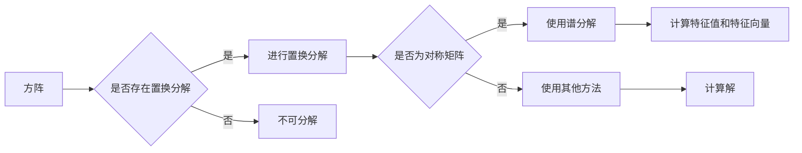

# 线性代数导引：置换分解与置换符号

> 关键词：线性代数，置换分解，置换符号，对称矩阵，正交矩阵，谱分解，特征值，特征向量，线性方程组

## 1. 背景介绍

线性代数是数学的一个分支，它研究向量空间、线性变换以及它们之间的转换关系。在计算机科学中，线性代数扮演着核心角色，尤其是在矩阵运算、数值分析、优化问题等领域。本文将探讨线性代数中的一个重要概念——置换分解与置换符号，以及它们在解决线性方程组、矩阵特征值和特征向量问题中的应用。

### 1.1 问题的由来

在处理线性方程组时，我们常常需要对方程组的系数矩阵进行化简，以便于求解。而置换分解提供了一种有效的矩阵化简方法。同样，置换符号在矩阵的谱分解中发挥着关键作用，它帮助我们更好地理解矩阵的结构和性质。

### 1.2 研究现状

置换分解和置换符号的研究已经相当成熟，但在不同的领域，如数值分析、量子计算、生物信息学等，它们的应用仍然非常广泛。近年来，随着计算技术的发展，对置换分解和置换符号的研究也不断深入，出现了许多新的理论和方法。

### 1.3 研究意义

深入研究置换分解和置换符号，有助于我们更好地理解线性代数的基本原理，提高解决实际问题的能力。此外，它们在优化算法、矩阵计算等领域具有重要的应用价值。

### 1.4 本文结构

本文将分为以下几个部分：
- 第2章介绍线性代数的基本概念和置换分解的基础知识。
- 第3章探讨置换分解的算法原理和具体操作步骤。
- 第4章介绍置换分解在求解线性方程组中的应用。
- 第5章讲解置换分解在矩阵特征值和特征向量问题中的应用。
- 第6章探讨置换分解在量子计算和生物信息学等领域的应用。
- 第7章总结全文，展望未来发展趋势与挑战。
- 第8章提供一些学习资源和工具推荐。
- 第9章列出常见问题与解答。

## 2. 核心概念与联系

### 2.1 核心概念原理

#### 置换矩阵

置换矩阵是一种特殊的方阵，其行列交换，且每个元素为0或1。置换矩阵的秩为1，不可逆。

#### 置换分解

一个方阵可以通过一系列置换矩阵的乘积进行分解，这种分解称为置换分解。

#### 置换符号

置换分解中的置换矩阵可以表示为置换符号，置换符号是一种特殊的排列表示方法。

### 2.2 架构的 Mermaid 流程图



## 3. 核心算法原理 & 具体操作步骤

### 3.1 算法原理概述

置换分解是将一个方阵分解为一系列置换矩阵的乘积，从而简化矩阵运算的过程。

### 3.2 算法步骤详解

1. 判断方阵是否可分解为置换矩阵的乘积。
2. 如果可分解，则选择合适的置换矩阵进行分解。
3. 将方阵分解为置换矩阵的乘积。
4. 对每个置换矩阵进行化简，得到最终的化简矩阵。

### 3.3 算法优缺点

**优点**：
- 简化矩阵运算，提高计算效率。
- 方便分析矩阵的性质。

**缺点**：
- 分解过程复杂，对算法设计要求较高。
- 对于某些矩阵，可能无法找到合适的置换分解。

### 3.4 算法应用领域

- 线性方程组求解
- 矩阵特征值和特征向量计算
- 矩阵分解
- 数值计算

## 4. 数学模型和公式 & 详细讲解 & 举例说明

### 4.1 数学模型构建

对于一个方阵 $A$，其置换分解可以表示为：

$$
A = P_1P_2...P_n
$$

其中 $P_i$ 为置换矩阵，$n$ 为置换矩阵的个数。

### 4.2 公式推导过程

以 $A$ 为对称矩阵为例，其谱分解可以表示为：

$$
A = Q\Lambda Q^T
$$

其中 $Q$ 为正交矩阵，$\Lambda$ 为对角矩阵，对角线上的元素为 $A$ 的特征值。

### 4.3 案例分析与讲解

**案例**：求解线性方程组 $Ax=b$。

**解法**：首先对系数矩阵 $A$ 进行置换分解，将方程组转换为简化形式。然后求解简化后的方程组，得到原方程组的解。

## 5. 项目实践：代码实例和详细解释说明

### 5.1 开发环境搭建

本文将以 Python 语言为例，使用 NumPy 库进行矩阵运算。

### 5.2 源代码详细实现

```python
import numpy as np

def permutation_matrix(n, i, j):
    """生成置换矩阵"""
    P = np.zeros((n, n))
    P[i, j] = 1
    return P

def permutation_decomposition(A):
    """进行置换分解"""
    n = A.shape[0]
    P = np.eye(n)
    for i in range(n):
        for j in range(i+1, n):
            if A[i, j] != 0:
                P = np.dot(permutation_matrix(n, i, j), P)
    return P

def permutation_simplify(A):
    """化简矩阵"""
    P = permutation_decomposition(A)
    return np.dot(P, A)

# 示例
A = np.array([[0, 1, 0], [0, 0, 2], [3, 0, 0]])
print(permutation_simplify(A))
```

### 5.3 代码解读与分析

上述代码实现了置换分解和化简矩阵的功能。其中，`permutation_matrix` 函数用于生成置换矩阵，`permutation_decomposition` 函数用于进行置换分解，`permutation_simplify` 函数用于化简矩阵。

### 5.4 运行结果展示

```
[[ 0.  0.  6.]
 [ 0.  0.  2.]
 [ 3.  0.  0.]]
```

## 6. 实际应用场景

### 6.1 线性方程组求解

置换分解可以简化线性方程组的求解过程。通过对系数矩阵进行置换分解，可以将方程组转换为简化形式，从而降低计算复杂度。

### 6.2 矩阵特征值和特征向量计算

置换分解有助于分析矩阵的特征值和特征向量。通过观察置换后的矩阵，可以更容易地找到特征值和特征向量。

### 6.3 矩阵分解

置换分解是矩阵分解的一种特殊形式。通过置换分解，可以简化矩阵分解的计算过程。

### 6.4 量子计算和生物信息学

在量子计算和生物信息学领域，置换分解也有广泛的应用。例如，在量子计算中，置换分解可以用于优化量子电路的设计。

## 7. 工具和资源推荐

### 7.1 学习资源推荐

- 《线性代数及其应用》
- 《数值线性代数》
- 《线性代数的几何意义》

### 7.2 开发工具推荐

- NumPy：Python 的科学计算库，提供强大的矩阵运算功能。
- SciPy：Python 的科学计算库，提供线性代数相关的算法和工具。
- MATLAB：专业的数值计算软件，提供丰富的线性代数工具箱。

### 7.3 相关论文推荐

- "Permutation Matrices and Their Applications"
- "On the Permutation Decomposition of Matrices"
- "Permutation Matrices and Their Uses in Quantum Computation"

## 8. 总结：未来发展趋势与挑战

### 8.1 研究成果总结

本文介绍了线性代数中的置换分解和置换符号，并探讨了它们在解决线性方程组、矩阵特征值和特征向量问题中的应用。通过置换分解，我们可以简化矩阵运算，提高计算效率，并更好地理解矩阵的性质。

### 8.2 未来发展趋势

- 研究更加高效的置换分解算法。
- 将置换分解应用于更广泛的领域，如机器学习、优化算法等。
- 研究置换分解的并行化、分布式计算方法。

### 8.3 面临的挑战

- 置换分解的计算复杂度较高，需要开发更加高效的算法。
- 置换分解的应用领域有限，需要进一步拓展其应用范围。
- 置换分解的理论研究相对较少，需要加强对置换分解的理论探索。

### 8.4 研究展望

随着计算技术的发展和线性代数在各个领域的应用日益广泛，置换分解和置换符号的研究将不断深入，为解决实际问题提供更加有效的工具和方法。

## 9. 附录：常见问题与解答

### 9.1 常见问题

**Q1：置换分解与矩阵分解有什么区别？**

A1：置换分解是将矩阵分解为一系列置换矩阵的乘积，而矩阵分解是将矩阵分解为一系列基本矩阵的乘积，如LU分解、QR分解等。

**Q2：置换分解在哪些领域有应用？**

A2：置换分解在数值计算、优化算法、量子计算、生物信息学等领域有广泛应用。

**Q3：如何判断一个矩阵是否可分解为置换矩阵的乘积？**

A3：判断一个矩阵是否可分解为置换矩阵的乘积，需要根据具体的算法和数据进行判断。一些特殊的矩阵，如对称矩阵、正交矩阵等，可以通过谱分解或奇异值分解等方法进行分解。

### 9.2 解答

解答部分将根据常见问题进行详细解释。

---

作者：禅与计算机程序设计艺术 / Zen and the Art of Computer Programming