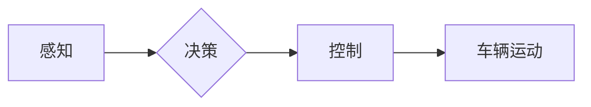

## 自动驾驶领域顶级学术会议论文汇总与解读

> 关键词：自动驾驶、深度学习、强化学习、计算机视觉、路径规划、传感器融合、安全保障

### 1. 背景介绍

自动驾驶技术作为未来交通运输的重要发展方向，近年来取得了显著进展。从早期基于规则的控制系统到如今的深度学习和强化学习驱动的智能驾驶系统，自动驾驶技术经历了从感知到决策、控制的逐步完善。 

自动驾驶技术涉及多个领域，包括计算机视觉、传感器融合、路径规划、控制理论、机器学习等。其中，深度学习和强化学习在自动驾驶领域扮演着越来越重要的角色。深度学习能够从海量数据中学习驾驶场景的特征和规律，而强化学习则可以训练车辆在复杂环境中做出最优决策。

顶级学术会议论文是自动驾驶领域研究进展的重要体现，它们不仅展示了最新的研究成果，也指引了未来的研究方向。本文将对自动驾驶领域顶级学术会议论文进行汇总和解读，帮助读者了解自动驾驶技术的发展现状和未来趋势。

### 2. 核心概念与联系

**2.1 核心概念**

* **感知:** 自动驾驶系统通过摄像头、雷达、激光雷达等传感器获取周围环境的信息，包括车辆、行人、道路标志等。
* **决策:** 根据感知到的信息，自动驾驶系统做出驾驶决策，例如转向、加速、减速等。
* **控制:** 自动驾驶系统通过控制油门、刹车、方向盘等执行驾驶决策。

**2.2 架构图**



**2.3 联系**

感知、决策和控制是自动驾驶系统的三个核心模块，它们相互关联，共同完成自动驾驶任务。感知模块提供决策模块所需的输入信息，决策模块根据输入信息做出驾驶决策，控制模块则根据决策指令执行驾驶操作。

### 3. 核心算法原理 & 具体操作步骤

**3.1 算法原理概述**

自动驾驶算法主要包括以下几个方面：

* **目标检测:** 利用深度学习算法识别周围环境中的目标，例如车辆、行人、道路标志等。
* **路径规划:** 根据感知到的环境信息，规划车辆行驶的路径，避免碰撞和违反交通规则。
* **运动控制:** 控制车辆的运动状态，例如速度、方向、加速度等，使车辆沿着规划好的路径行驶。

**3.2 算法步骤详解**

**目标检测算法:**

1. **数据预处理:** 对图像数据进行预处理，例如裁剪、缩放、增强等。
2. **特征提取:** 利用卷积神经网络提取图像特征。
3. **目标分类:** 利用分类器对提取的特征进行分类，识别目标类型。
4. **目标定位:** 利用回归算法对目标进行定位，确定目标的边界框。

**路径规划算法:**

1. **环境建模:** 建立车辆周围环境的模型，包括道路、障碍物、交通标志等。
2. **路径搜索:** 利用搜索算法在环境模型中搜索一条安全、高效的路径。
3. **路径优化:** 对搜索到的路径进行优化，例如缩短路径长度、避免急转弯等。

**运动控制算法:**

1. **状态估计:** 利用传感器数据估计车辆的当前状态，例如位置、速度、方向等。
2. **轨迹跟踪:** 根据规划好的路径，控制车辆的运动状态，使其沿着规划好的轨迹行驶。
3. **轨迹优化:** 对车辆的运动轨迹进行优化，例如提高行驶平稳度、降低油耗等。

**3.3 算法优缺点**

**目标检测算法:**

* **优点:** 识别精度高，能够识别多种目标类型。
* **缺点:** 计算量大，实时性较差。

**路径规划算法:**

* **优点:** 可以规划安全、高效的路径。
* **缺点:** 对环境建模要求较高，在复杂环境中可能难以规划出最佳路径。

**运动控制算法:**

* **优点:** 可以使车辆平稳地行驶，并跟踪规划好的路径。
* **缺点:** 对车辆模型和传感器精度要求较高。

**3.4 算法应用领域**

* **自动驾驶汽车:** 目标检测、路径规划和运动控制算法是自动驾驶汽车的核心技术。
* **无人机:** 目标检测和路径规划算法可以用于无人机的自主飞行。
* **机器人:** 目标检测和路径规划算法可以用于机器人自主导航。

### 4. 数学模型和公式 & 详细讲解 & 举例说明

**4.1 数学模型构建**

自动驾驶算法的数学模型通常基于以下几个方面：

* **状态空间模型:** 描述车辆的运动状态，例如位置、速度、方向等。
* **控制模型:** 描述车辆对控制输入的响应，例如油门、刹车、方向盘等。
* **环境模型:** 描述车辆周围环境的信息，例如道路、障碍物、交通标志等。

**4.2 公式推导过程**

例如，车辆的运动状态可以用以下状态空间模型表示：

$$
\dot{x} = f(x, u)
$$

其中，$x$ 是车辆的状态向量，$u$ 是控制输入向量，$f$ 是状态转移函数。

**4.3 案例分析与讲解**

**目标检测算法:**

目标检测算法通常使用损失函数来衡量预测结果与真实结果之间的差异。常见的损失函数包括交叉熵损失函数和边界框回归损失函数。

**交叉熵损失函数:**

$$
L_{ce} = -\sum_{i=1}^{N} y_i \log(\hat{y}_i)
$$

其中，$y_i$ 是真实标签，$\hat{y}_i$ 是预测标签。

**边界框回归损失函数:**

$$
L_{bbox} = \sum_{i=1}^{N} \left\| b_i - \hat{b}_i \right\|^2
$$

其中，$b_i$ 是真实边界框，$\hat{b}_i$ 是预测边界框。

### 5. 项目实践：代码实例和详细解释说明

**5.1 开发环境搭建**

自动驾驶项目开发通常需要以下软件环境：

* **操作系统:** Linux 或 Windows
* **编程语言:** Python
* **深度学习框架:** TensorFlow 或 PyTorch
* **计算机视觉库:** OpenCV
* **仿真平台:** CARLA 或 Gazebo

**5.2 源代码详细实现**

以下是一个简单的目标检测代码示例，使用 TensorFlow 和 OpenCV 库：

```python
import tensorflow as tf
import cv2

# 加载预训练模型
model = tf.keras.models.load_model('object_detection_model.h5')

# 读取图像
image = cv2.imread('image.jpg')

# 预处理图像
image = cv2.resize(image, (300, 300))
image = image / 255.0

# 进行目标检测
predictions = model.predict(image[None,...])

# 绘制检测结果
for prediction in predictions[0]:
    class_id = prediction[1]
    confidence = prediction[2]
    if confidence > 0.5:
        x1, y1, x2, y2 = prediction[3:7]
        cv2.rectangle(image, (int(x1), int(y1)), (int(x2), int(y2)), (0, 255, 0), 2)
        cv2.putText(image, class_id, (int(x1), int(y1) - 10), cv2.FONT_HERSHEY_SIMPLEX, 0.5, (0, 255, 0), 2)

# 显示结果
cv2.imshow('Detection Result', image)
cv2.waitKey(0)
```

**5.3 代码解读与分析**

这段代码首先加载预训练的目标检测模型，然后读取图像并进行预处理。接着，使用模型对图像进行预测，并根据预测结果绘制检测框和类别标签。

**5.4 运行结果展示**

运行这段代码后，将显示带有检测框和类别标签的图像。

### 6. 实际应用场景

自动驾驶技术在多个领域都有着广泛的应用场景：

* **自动驾驶汽车:** 自动驾驶汽车是自动驾驶技术的典型应用场景，可以提高道路安全性和交通效率。
* **无人配送:** 自动驾驶无人车可以用于配送货物，提高配送效率和降低成本。
* **智能交通:** 自动驾驶技术可以用于智能交通信号灯、自动泊车等应用，优化交通流量和缓解拥堵。

**6.4 未来应用展望**

未来，自动驾驶技术将应用于更多领域，例如：

* **自动驾驶公共交通:** 自动驾驶公交车、出租车等可以提高公共交通的效率和安全性。
* **自动驾驶农业:** 自动驾驶无人机和拖拉机可以用于农业生产，提高效率和降低成本。
* **自动驾驶医疗:** 自动驾驶无人车可以用于医疗物资运输，提高医疗服务效率。

### 7. 工具和资源推荐

**7.1 学习资源推荐**

* **书籍:**
    * "Principles of Robot Motion: Theory, Algorithms, and Implementations" by Howie Choset et al.
    * "Probabilistic Robotics" by Sebastian Thrun et al.
* **在线课程:**
    * Coursera: "Self-Driving Cars" by Udacity
    * edX: "Introduction to Autonomous Driving" by MIT

**7.2 开发工具推荐**

* **ROS (Robot Operating System):** 一个用于机器人开发的开源软件框架。
* **Gazebo:** 一个用于机器人仿真和测试的开源软件平台。
* **CARLA:** 一个用于自动驾驶仿真和测试的开源软件平台。

**7.3 相关论文推荐**

* "End to End Learning for Self-Driving Cars" by Bojarski et al.
* "Deep Reinforcement Learning for End-to-End Autonomous Driving" by Chen et al.
* "Learning to Drive in a Simulator" by Schulman et al.

### 8. 总结：未来发展趋势与挑战

**8.1 研究成果总结**

近年来，自动驾驶技术取得了显著进展，深度学习和强化学习算法在自动驾驶领域发挥着越来越重要的作用。自动驾驶汽车已经从实验室走向现实道路，并在部分地区实现商业化应用。

**8.2 未来发展趋势**

未来，自动驾驶技术将朝着以下几个方向发展：

* **更强的感知能力:** 开发更先进的传感器和感知算法，提高自动驾驶系统的感知精度和可靠性。
* **更智能的决策能力:** 利用更强大的机器学习算法，提高自动驾驶系统的决策能力和安全性。
* **更完善的法律法规:** 制定完善的法律法规，规范自动驾驶技术的应用和发展。

**8.3 面临的挑战**

自动驾驶技术还面临着一些挑战：

* **复杂环境下的鲁棒性:** 自动驾驶系统在复杂环境下，例如恶劣天气、拥堵交通等情况下，仍然存在一定的鲁棒性问题。
* **安全保障:** 自动驾驶系统的安全性是至关重要的，需要进一步加强安全测试和验证。
* **伦理问题:** 自动驾驶系统可能会面临一些伦理问题，例如事故责任归属等，需要进行深入探讨和研究。

**8.4 研究展望**

未来，自动驾驶技术将继续朝着更安全、更智能、更可靠的方向发展，并将在交通运输、物流、医疗等多个领域发挥重要作用。


### 9. 附录：常见问题与解答

**9.1 自动驾驶汽车真的安全吗？**

自动驾驶汽车的安全性仍然是一个研究热点，目前的技术水平已经能够在相对理想的条件下实现较高的安全性，但仍然存在一些风险。

**9.2 自动驾驶汽车什么时候能够普及？**

自动驾驶汽车的普及时间取决于技术发展、政策法规、公众接受度等多方面因素，预计在未来几年到十年内，部分地区和场景将实现自动驾驶汽车的普及。

**9.3 自动驾驶汽车会取代人类驾驶员吗？**

自动驾驶技术的发展可能会改变人类驾驶员的工作模式，但不会完全取代人类驾驶员。未来，人类驾驶员可能更多地承担安全监督、紧急处理