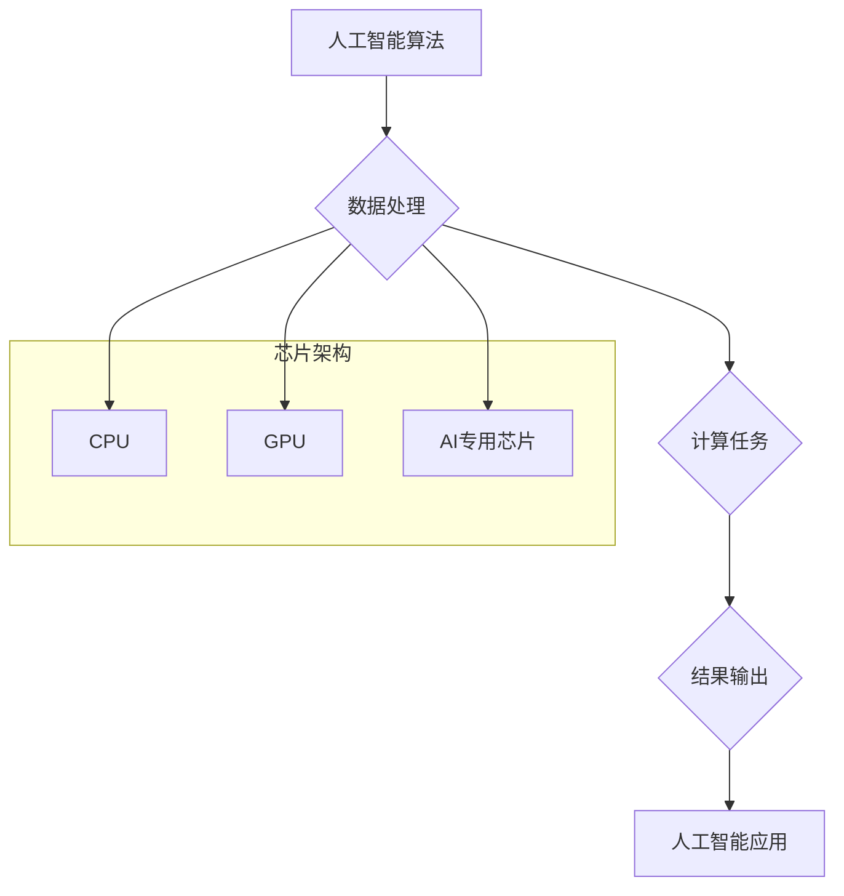

## 芯片在人工智能底层创新体系中的作用

> 关键词：人工智能、芯片、计算架构、深度学习、神经网络、摩尔定律、异构计算、专用芯片

## 1. 背景介绍

人工智能（AI）正以惊人的速度发展，其应用领域不断扩展，从自动驾驶到医疗诊断，再到金融分析，AI正在深刻地改变着我们的生活。然而，AI的发展离不开强大的计算能力的支持。芯片作为人工智能底层的基础设施，在推动AI发展中扮演着至关重要的角色。

随着深度学习算法的兴起，对计算资源的需求量呈指数级增长。传统CPU架构在处理海量数据和复杂的计算任务时存在瓶颈，无法满足AI训练和推理的实时性和效率要求。因此，专门为AI设计的芯片应运而生，并迅速成为AI发展的新引擎。

## 2. 核心概念与联系

### 2.1  人工智能与芯片

人工智能的核心是模拟人类智能的行为，包括学习、推理和决策。而芯片作为电子设备的核心部件，负责执行这些智能算法所需的计算任务。

AI算法通常需要处理海量数据并进行复杂的数学运算，例如矩阵乘法和卷积操作。这些运算对计算能力和数据传输速度提出了极高的要求。

### 2.2  芯片架构与AI

传统的CPU架构采用通用设计，可以执行各种类型的计算任务，但对于AI特定的计算模式效率较低。而AI芯片则针对深度学习算法的特点进行优化，例如并行计算、数据流处理和内存访问，以提高计算效率和性能。

**Mermaid 流程图**



### 2.3  AI芯片类型

目前，AI芯片主要分为以下几种类型：

* **GPU（图形处理单元）：**最初用于图形渲染，但其强大的并行计算能力也适用于深度学习算法。
* **ASIC（专用集成电路）：**专门为特定AI任务设计的芯片，具有更高的计算效率和功耗比。
* **FPGA（现场可编程门阵列）：**可根据需要灵活编程的芯片，可以根据不同的AI算法进行定制化设计。

## 3. 核心算法原理 & 具体操作步骤

### 3.1  算法原理概述

深度学习算法的核心是多层神经网络，通过学习数据中的特征和模式来实现智能化决策。

神经网络由多个神经元组成，每个神经元接收输入信号，进行处理并输出信号。神经元之间通过连接权重进行信息传递。通过训练，神经网络可以调整连接权重，使输出结果与真实值尽可能接近。

### 3.2  算法步骤详解

1. **数据预处理:** 将原始数据转换为神经网络可以理解的格式，例如归一化、编码等。
2. **网络结构设计:** 根据任务需求设计神经网络的层数、神经元数量和连接方式。
3. **参数初始化:** 为神经网络中的连接权重赋予初始值。
4. **前向传播:** 将输入数据通过神经网络传递，计算输出结果。
5. **反向传播:** 计算输出结果与真实值的误差，并根据误差调整连接权重。
6. **迭代训练:** 重复前向传播和反向传播步骤，直到模型性能达到预期水平。

### 3.3  算法优缺点

**优点:**

* **高精度:** 深度学习算法能够学习到数据中的复杂模式，从而实现高精度预测和分类。
* **自动化学习:** 深度学习算法能够自动学习特征，无需人工特征工程。
* **泛化能力强:** 深度学习模型能够泛化到新的数据，并适应不同的场景。

**缺点:**

* **数据依赖:** 深度学习算法需要大量的数据进行训练，否则性能会下降。
* **计算资源消耗大:** 深度学习模型训练需要大量的计算资源，例如GPU和TPU。
* **可解释性差:** 深度学习模型的决策过程难以解释，难以理解模型是如何做出预测的。

### 3.4  算法应用领域

深度学习算法广泛应用于以下领域:

* **计算机视觉:** 图像识别、物体检测、图像分割、人脸识别等。
* **自然语言处理:** 文本分类、情感分析、机器翻译、语音识别等。
* **语音合成:** 生成逼真的语音。
* **医疗诊断:** 辅助医生诊断疾病，例如癌症检测、病灶识别等。
* **金融分析:** 风险评估、欺诈检测、投资预测等。

## 4. 数学模型和公式 & 详细讲解 & 举例说明

### 4.1  数学模型构建

深度学习算法的核心是神经网络，其数学模型可以表示为多层感知机（MLP）。

**MLP模型**

* **输入层:** 接收原始数据。
* **隐藏层:** 对数据进行特征提取和表示。
* **输出层:** 输出最终结果。

每个神经元接收来自前一层神经元的输入信号，并通过激活函数进行处理，输出到下一层神经元。

### 4.2  公式推导过程

**激活函数:**

常用的激活函数包括 sigmoid 函数、ReLU 函数、tanh 函数等。

* **sigmoid 函数:** $f(x) = \frac{1}{1 + e^{-x}}$

* **ReLU 函数:** $f(x) = max(0, x)$

**损失函数:**

损失函数用于衡量模型预测结果与真实值的差异。常用的损失函数包括均方误差（MSE）、交叉熵损失等。

* **均方误差 (MSE):** $L = \frac{1}{n} \sum_{i=1}^{n} (y_i - \hat{y}_i)^2$

其中，$y_i$ 是真实值，$\hat{y}_i$ 是模型预测值，$n$ 是样本数量。

**梯度下降:**

梯度下降算法用于优化模型参数，使其能够最小化损失函数。

* **梯度更新公式:** $\theta = \theta - \alpha \nabla L(\theta)$

其中，$\theta$ 是模型参数，$\alpha$ 是学习率，$\nabla L(\theta)$ 是损失函数对参数的梯度。

### 4.3  案例分析与讲解

**图像分类:**

假设我们有一个图像分类任务，目标是将图像分类为猫、狗或鸟。我们可以使用深度学习算法训练一个神经网络模型，该模型能够学习图像特征并进行分类。

训练过程中，我们会将大量标记好的图像数据输入到神经网络中，并使用交叉熵损失函数和梯度下降算法优化模型参数。

经过多次训练迭代后，模型能够准确地识别图像中的猫、狗或鸟。

## 5. 项目实践：代码实例和详细解释说明

### 5.1  开发环境搭建

* **操作系统:** Ubuntu 20.04 LTS
* **编程语言:** Python 3.8
* **深度学习框架:** TensorFlow 2.0
* **GPU:** NVIDIA GeForce RTX 3080

### 5.2  源代码详细实现

```python
import tensorflow as tf

# 定义模型结构
model = tf.keras.models.Sequential([
    tf.keras.layers.Conv2D(32, (3, 3), activation='relu', input_shape=(28, 28, 1)),
    tf.keras.layers.MaxPooling2D((2, 2)),
    tf.keras.layers.Conv2D(64, (3, 3), activation='relu'),
    tf.keras.layers.MaxPooling2D((2, 2)),
    tf.keras.layers.Flatten(),
    tf.keras.layers.Dense(10, activation='softmax')
])

# 编译模型
model.compile(optimizer='adam',
              loss='sparse_categorical_crossentropy',
              metrics=['accuracy'])

# 加载数据集
(x_train, y_train), (x_test, y_test) = tf.keras.datasets.mnist.load_data()

# 数据预处理
x_train = x_train.astype('float32') / 255.0
x_test = x_test.astype('float32') / 255.0
x_train = x_train.reshape((x_train.shape[0], 28, 28, 1))
x_test = x_test.reshape((x_test.shape[0], 28, 28, 1))

# 训练模型
model.fit(x_train, y_train, epochs=5)

# 评估模型
loss, accuracy = model.evaluate(x_test, y_test)
print('Test loss:', loss)
print('Test accuracy:', accuracy)
```

### 5.3  代码解读与分析

这段代码实现了使用 TensorFlow 框架训练一个简单的 MNIST 手写数字识别模型。

* **模型结构:** 代码定义了一个包含卷积层、池化层和全连接层的深度神经网络模型。
* **模型编译:** 使用 Adam 优化器、交叉熵损失函数和准确率指标编译模型。
* **数据加载:** 使用 Keras 的 MNIST 数据集加载训练和测试数据。
* **数据预处理:** 将数据转换为浮点数格式并归一化到 0 到 1 之间。
* **模型训练:** 使用 `model.fit()` 函数训练模型，训练 5 个 epochs。
* **模型评估:** 使用 `model.evaluate()` 函数评估模型在测试集上的性能。

### 5.4  运行结果展示

训练完成后，模型能够准确地识别 MNIST 手写数字。

## 6. 实际应用场景

### 6.1  自动驾驶

AI芯片在自动驾驶领域发挥着至关重要的作用，例如处理摄像头、雷达和激光雷达数据，识别道路场景、车辆和行人，并做出驾驶决策。

### 6.2  医疗诊断

AI芯片可以帮助医生更快、更准确地诊断疾病，例如癌症、心血管疾病和神经退行性疾病。

### 6.3  金融分析

AI芯片可以用于金融风险评估、欺诈检测、投资预测等领域，帮助金融机构提高效率和降低风险。

### 6.4  未来应用展望

随着AI技术的不断发展，AI芯片将在更多领域得到应用，例如机器人、智能家居、工业自动化等。

## 7. 工具和资源推荐

### 7.1  学习资源推荐

* **深度学习书籍:**

    * 《深度学习》
    * 《动手学深度学习》
    * 《神经网络与深度学习》

* **在线课程:**

    * Coursera 深度学习课程
    * Udacity 深度学习工程师 Nanodegree

### 7.2  开发工具推荐

* **深度学习框架:** TensorFlow, PyTorch, Keras
* **编程语言:** Python
* **云平台:** Google Cloud AI Platform, Amazon SageMaker, Microsoft Azure AI

### 7.3  相关论文推荐

* **《ImageNet Classification with Deep Convolutional Neural Networks》**
* **《Attention Is All You Need》**
* **《BERT: Pre-training of Deep Bidirectional Transformers for Language Understanding》**

## 8. 总结：未来发展趋势与挑战

### 8.1  研究成果总结

近年来，AI芯片技术取得了长足的进步，其计算能力、功耗和性能不断提升。

### 8.2  未来发展趋势

* **异构计算:** 将不同类型的芯片结合使用，例如CPU、GPU和AI专用芯片，以提高计算效率。
* **神经架构搜索:** 自动搜索最佳的神经网络架构，以提高模型性能。
* **边缘计算:** 将AI芯片部署到边缘设备，实现本地化计算和决策。

### 8.3  面临的挑战

* **摩尔定律放缓:** 芯片制造工艺的进步速度放缓，导致芯片性能提升的难度增加。
* **功耗问题:** AI芯片的功耗较高，需要开发更节能的芯片设计方案。
* **