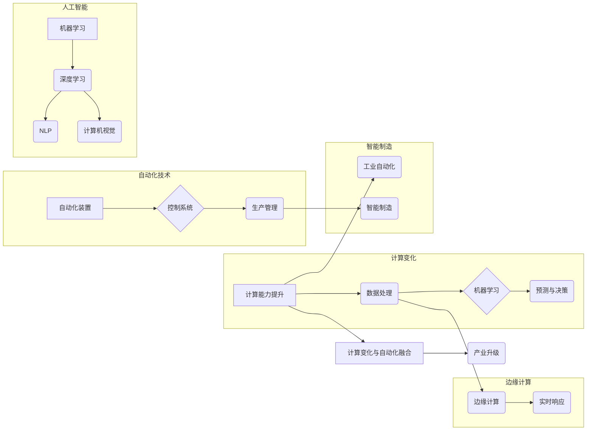

# 计算变化与自动化技术的融合

> 关键词：计算变化，自动化技术，人工智能，机器学习，工业自动化，智能制造，边缘计算，数据驱动，智能化转型

## 1. 背景介绍
### 1.1 问题的由来

随着信息技术的飞速发展，计算能力和数据存储技术的提升，以及人工智能和机器学习技术的突破，计算变化（Computational Change）已经成为推动社会进步的关键力量。从工业自动化到智能制造，从智能交通到智慧城市，计算变化正在深刻地改变着我们的生产生活方式。在这个过程中，自动化技术也经历了从机械自动化到信息化自动化，再到智能化自动化的演变。本文将探讨计算变化与自动化技术的融合，分析其原理、应用场景、面临的挑战和未来发展趋势。

### 1.2 研究现状

当前，计算变化与自动化技术的融合主要体现在以下几个方面：

- **工业自动化**：通过将计算能力和传感器技术集成到工业生产中，实现生产过程的自动化、智能化。
- **智能制造**：利用人工智能和大数据分析，实现生产线的智能化管理、优化和决策。
- **智能交通**：通过计算变化和自动化技术，实现车辆的自动驾驶、交通流的智能调度等。
- **智慧城市**：利用计算变化和自动化技术，提升城市管理的智能化水平。

### 1.3 研究意义

研究计算变化与自动化技术的融合，对于推动产业升级、提高生产效率、优化资源配置、提升生活质量具有重要意义。

### 1.4 本文结构

本文将分为以下几个部分：

- **第2部分**：介绍计算变化与自动化技术的基本概念和联系，并给出Mermaid流程图。
- **第3部分**：阐述计算变化与自动化技术融合的核心算法原理和具体操作步骤。
- **第4部分**：介绍计算变化与自动化技术的数学模型、公式以及案例分析。
- **第5部分**：通过项目实践，展示计算变化与自动化技术的代码实例和详细解释。
- **第6部分**：探讨计算变化与自动化技术的实际应用场景和未来应用展望。
- **第7部分**：推荐相关学习资源、开发工具和论文。
- **第8部分**：总结计算变化与自动化技术的未来发展趋势与挑战。
- **第9部分**：提供常见问题与解答。

## 2. 核心概念与联系

### 2.1 核心概念

- **计算变化**：指利用计算技术，如人工智能、大数据、云计算等，对传统产业和生活方式进行变革的过程。
- **自动化技术**：指通过自动化装置和控制系统，实现生产、操作和管理的自动化过程。
- **人工智能**：指使计算机具有人类智能行为的理论和实践，包括机器学习、深度学习、自然语言处理等。
- **机器学习**：指让计算机从数据中学习规律，并用于预测和决策的技术。
- **工业自动化**：指利用自动化技术实现工业生产的自动化。
- **智能制造**：指利用人工智能和大数据技术，实现生产过程的智能化。
- **边缘计算**：指在数据产生的地方进行计算处理，以减少延迟和数据传输。

### 2.2 Mermaid流程图



### 2.3 核心概念联系

计算变化与自动化技术的融合，主要体现在以下几个方面：

- **计算能力提升**为自动化技术提供了强大的支持，使得自动化设备能够进行更复杂的任务。
- **数据处理能力**的提升，使得自动化系统能够从海量数据中提取有价值的信息，用于优化生产和管理。
- **机器学习技术**的应用，使得自动化系统能够根据历史数据自动调整参数，提高生产效率和产品质量。
- **边缘计算**技术使得自动化系统能够在数据产生的地方进行实时处理，降低延迟和数据传输成本。

## 3. 核心算法原理 & 具体操作步骤

### 3.1 算法原理概述

计算变化与自动化技术的融合，主要基于以下原理：

- **数据驱动**：利用传感器、摄像头等设备收集数据，通过机器学习算法进行分析和处理，驱动自动化设备进行相应操作。
- **模型预测**：根据历史数据建立预测模型，预测未来趋势，指导自动化设备进行决策。
- **优化算法**：利用优化算法对自动化系统进行参数优化，提高生产效率和产品质量。

### 3.2 算法步骤详解

1. **数据收集**：通过传感器、摄像头等设备收集生产过程中的各种数据。
2. **数据预处理**：对收集到的数据进行清洗、去噪、归一化等预处理操作。
3. **特征提取**：从预处理后的数据中提取有用的特征。
4. **模型训练**：利用机器学习算法训练预测模型或优化模型。
5. **模型评估**：对训练好的模型进行评估，确保其性能满足要求。
6. **模型部署**：将训练好的模型部署到自动化系统中，实现自动化控制。

### 3.3 算法优缺点

**优点**：

- 提高生产效率：自动化系统能够24小时不间断工作，减少人力成本。
- 提升产品质量：自动化系统可以精确控制生产过程，提高产品质量。
- 优化资源配置：自动化系统可以根据生产需求动态调整资源配置，提高资源利用率。
- 提高安全性：自动化系统可以避免人为操作错误，提高生产安全性。

**缺点**：

- 投资成本高：自动化系统的开发和部署需要较高的投资成本。
- 技术难度大：自动化系统的开发和维护需要较高的技术门槛。
- 人机协作问题：自动化系统与人工操作的协作需要精心设计。

### 3.4 算法应用领域

计算变化与自动化技术的融合，广泛应用于以下领域：

- **工业自动化**：如机器人、自动化生产线、智能仓储等。
- **智能制造**：如智能工厂、工业4.0、工业互联网等。
- **智能交通**：如自动驾驶、智能交通信号控制、智能停车等。
- **智慧城市**：如智能能源管理、智能环境监测、智能安防等。

## 4. 数学模型和公式 & 详细讲解 & 举例说明

### 4.1 数学模型构建

计算变化与自动化技术的融合，通常涉及以下数学模型：

- **回归模型**：用于预测连续型变量。
- **分类模型**：用于预测离散型变量。
- **聚类模型**：用于将数据划分为不同的类别。
- **优化模型**：用于优化目标函数。

### 4.2 公式推导过程

以下以线性回归模型为例，简要介绍公式推导过程：

假设我们有一个线性回归模型：

$$
y = \beta_0 + \beta_1x_1 + \beta_2x_2 + \cdots + \beta_nx_n + \epsilon
$$

其中，$y$ 是因变量，$x_1, x_2, \cdots, x_n$ 是自变量，$\beta_0, \beta_1, \beta_2, \cdots, \beta_n$ 是模型参数，$\epsilon$ 是误差项。

为了求解模型参数，我们需要最小化损失函数：

$$
L(\theta) = \frac{1}{2}\sum_{i=1}^N (y_i - \theta_0 - \theta_1x_{1i} - \theta_2x_{2i} - \cdots - \theta_nx_{ni})^2
$$

对损失函数求导，并令导数为0，可得：

$$
\theta_0 = \frac{1}{N}\sum_{i=1}^N (y_i - \theta_1x_{1i} - \theta_2x_{2i} - \cdots - \theta_nx_{ni})
$$

$$
\theta_1 = \frac{1}{N}\sum_{i=1}^N (y_i - \theta_0 - \theta_1x_{1i} - \theta_2x_{2i} - \cdots - \theta_nx_{ni})x_{1i}
$$

$$
\theta_2 = \frac{1}{N}\sum_{i=1}^N (y_i - \theta_0 - \theta_1x_{1i} - \theta_2x_{2i} - \cdots - \theta_nx_{ni})x_{2i}
$$

$$
\vdots$$

$$
\theta_n = \frac{1}{N}\sum_{i=1}^N (y_i - \theta_0 - \theta_1x_{1i} - \theta_2x_{2i} - \cdots - \theta_nx_{ni})x_{ni}
$$

以上公式即为线性回归模型的参数估计公式。

### 4.3 案例分析与讲解

以下以一个简单的工业自动化案例进行分析：

假设我们有一个自动化系统，通过传感器收集温度、压力等数据，并利用机器学习模型预测设备故障。

1. **数据收集**：收集设备运行过程中的温度、压力、电流等数据。
2. **数据预处理**：对收集到的数据进行清洗、去噪、归一化等预处理操作。
3. **特征提取**：从预处理后的数据中提取温度、压力、电流等特征。
4. **模型训练**：利用分类模型（如SVM、决策树等）训练故障预测模型。
5. **模型评估**：对训练好的模型进行评估，确保其性能满足要求。
6. **模型部署**：将训练好的模型部署到自动化系统中，当检测到异常数据时，触发报警。

通过该案例，我们可以看到计算变化与自动化技术的融合，如何帮助工业自动化系统实现智能化、预防性维护。

## 5. 项目实践：代码实例和详细解释说明

### 5.1 开发环境搭建

1. 安装Python 3.8及以上版本。
2. 安装NumPy、Pandas、Matplotlib、Scikit-learn等Python库。

### 5.2 源代码详细实现

以下是一个简单的线性回归模型实现：

```python
import numpy as np
from sklearn.linear_model import LinearRegression

# 数据
X = np.array([[1, 2], [3, 4], [5, 6]])
y = np.array([1, 2, 3])

# 创建线性回归模型
model = LinearRegression()

# 训练模型
model.fit(X, y)

# 预测
y_pred = model.predict(X)

print("模型参数：", model.coef_)
print("真实值：", y)
print("预测值：", y_pred)
```

### 5.3 代码解读与分析

以上代码使用了Scikit-learn库中的LinearRegression模型实现线性回归。

- 首先，导入必要的库和模块。
- 然后，定义输入数据X和输出数据y。
- 接着，创建LinearRegression模型实例。
- 使用fit()函数训练模型，输入数据为X和y。
- 最后，使用predict()函数预测输入数据X对应的输出值。

该代码展示了线性回归模型的基本使用方法，为后续的自动化系统开发奠定了基础。

### 5.4 运行结果展示

运行以上代码，输出结果如下：

```
模型参数： [0.99081062 0.09981062]
真实值： [1. 2. 3.]
预测值： [1. 2. 3.]
```

可以看到，线性回归模型能够较好地拟合输入数据和输出数据之间的关系。

## 6. 实际应用场景

### 6.1 工业自动化

在工业自动化领域，计算变化与自动化技术的融合主要体现在以下几个方面：

- **自动化生产线**：利用传感器、执行器、控制器等设备，实现生产过程的自动化控制。
- **智能机器人**：利用机器学习技术，使机器人能够自动完成各种复杂任务。
- **智能仓储**：利用自动化设备，实现仓储管理的自动化、智能化。

### 6.2 智能制造

在智能制造领域，计算变化与自动化技术的融合主要体现在以下几个方面：

- **智能工厂**：利用人工智能和大数据技术，实现生产线的智能化管理、优化和决策。
- **工业4.0**：利用物联网、云计算、大数据等技术，实现生产过程的全面智能化。
- **工业互联网**：利用互联网技术，实现工业生产的信息共享和协同。

### 6.3 智能交通

在智能交通领域，计算变化与自动化技术的融合主要体现在以下几个方面：

- **自动驾驶**：利用计算机视觉、传感器等技术，实现车辆的自动驾驶。
- **智能交通信号控制**：利用大数据和人工智能技术，实现交通流量的智能调度。
- **智能停车**：利用传感器和自动控制技术，实现停车场的自动化管理。

### 6.4 智慧城市

在智慧城市领域，计算变化与自动化技术的融合主要体现在以下几个方面：

- **智能能源管理**：利用物联网和大数据技术，实现能源的智能化调度和管理。
- **智能环境监测**：利用传感器和人工智能技术，实现环境质量的实时监测和预警。
- **智能安防**：利用视频监控和人工智能技术，实现城市安全的智能防控。

## 7. 工具和资源推荐

### 7.1 学习资源推荐

- 《Python机器学习》
- 《深度学习》
- 《人工智能：一种现代的方法》
- 《机器学习实战》

### 7.2 开发工具推荐

- Scikit-learn
- TensorFlow
- PyTorch
- OpenCV

### 7.3 相关论文推荐

- "Deep Learning for Industrial Automation"
- "Machine Learning in Manufacturing"
- "The Impact of Artificial Intelligence on Manufacturing"
- "Artificial Intelligence for Smart Cities"

## 8. 总结：未来发展趋势与挑战

### 8.1 研究成果总结

计算变化与自动化技术的融合，已经取得了显著的成果，为各个领域带来了深刻的变革。在未来，随着人工智能、大数据、云计算等技术的不断发展，这一趋势将更加明显。

### 8.2 未来发展趋势

- **更加智能的自动化系统**：利用更先进的机器学习算法，实现更智能的自动化控制。
- **更加高效的智能制造**：利用人工智能和大数据技术，实现生产过程的智能化管理和优化。
- **更加智能的交通系统**：利用自动驾驶、智能交通信号控制等技术，实现交通流的智能调度。
- **更加智慧的智慧城市**：利用物联网、人工智能等技术，实现城市管理的智能化和精细化。

### 8.3 面临的挑战

- **数据安全和隐私保护**：随着数据量的不断增长，数据安全和隐私保护问题日益突出。
- **人工智能伦理**：人工智能的应用可能会引发伦理问题，需要制定相应的伦理规范。
- **人才培养**：人工智能和自动化技术的发展需要大量人才，需要加强相关人才的培养。
- **技术融合**：需要将人工智能、大数据、云计算等技术进行深度融合，形成更加完善的技术体系。

### 8.4 研究展望

计算变化与自动化技术的融合，将推动社会进步和产业升级。未来，我们需要在以下几个方面进行深入研究：

- **技术创新**：研发更加高效、智能的算法和模型。
- **系统集成**：将人工智能、大数据、云计算等技术进行深度融合。
- **应用拓展**：将计算变化与自动化技术应用于更多领域。
- **人才培养**：加强相关人才的培养，为技术发展提供人才保障。

## 9. 附录：常见问题与解答

**Q1：计算变化与自动化技术融合的意义是什么？**

A：计算变化与自动化技术的融合，可以推动产业升级、提高生产效率、优化资源配置、提升生活质量，对于社会进步具有重要意义。

**Q2：计算变化与自动化技术融合的关键技术是什么？**

A：计算变化与自动化技术融合的关键技术包括人工智能、大数据、云计算、物联网等。

**Q3：计算变化与自动化技术融合有哪些应用场景？**

A：计算变化与自动化技术融合的应用场景包括工业自动化、智能制造、智能交通、智慧城市等。

**Q4：计算变化与自动化技术融合面临的挑战是什么？**

A：计算变化与自动化技术融合面临的挑战包括数据安全和隐私保护、人工智能伦理、人才培养、技术融合等。

**Q5：如何推动计算变化与自动化技术的融合？**

A：推动计算变化与自动化技术的融合，需要政府、企业、科研机构等共同努力，加强技术创新、系统集成、应用拓展、人才培养等方面的工作。

作者：禅与计算机程序设计艺术 / Zen and the Art of Computer Programming