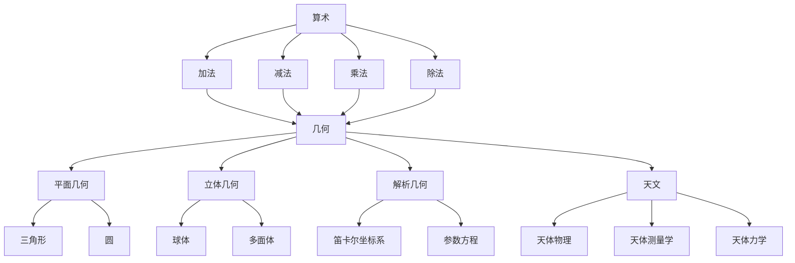

# 计算：第一部分 计算的诞生 第 1 章 毕达哥拉斯的困惑 文明古国的计算

> 关键词：计算起源，毕达哥拉斯定理，古埃及，古巴比伦，古印度，算术，几何，天文

## 1. 背景介绍

计算，作为人类智慧的结晶，自古以来就伴随着人类文明的进步。从简单的计数到复杂的数学运算，计算的发展见证了人类对世界认知的深化和技术的革新。本章将带领读者回到古老的时代，探索计算的诞生，特别是那些对后世影响深远的数学家和文明古国的贡献。

### 1.1 计算的起源

计算的起源可以追溯到史前时代，那时的人类为了生存和发展的需要，开始对数量进行简单的记录和计算。随着社会的发展，计算的需求逐渐增多，促使人类创造出各种计算工具和方法。

### 1.2 古代文明的计算

古代文明在计算领域有着丰富的成就，特别是古埃及、古巴比伦和古印度等文明，他们对算术和几何的发展做出了巨大贡献。

## 2. 核心概念与联系

在探讨文明古国的计算之前，我们首先需要了解一些核心概念，如算术、几何、天文等。

### 2.1 算术

算术是研究数的性质及其运算规则的数学分支。它包括加法、减法、乘法、除法等基本运算。

### 2.2 几何

几何是研究图形、大小、形状和位置等性质的数学分支。它包括平面几何、立体几何、解析几何等。

### 2.3 天文

天文是研究天体、宇宙及其现象的学科。它包括天体物理、天体测量学、天体力学等。

以下是对这些核心概念的Mermaid流程图：



## 3. 核心算法原理 & 具体操作步骤

### 3.1 算法原理概述

古代文明的计算主要依赖于一些基本的算法原理，如四则运算、几何作图等。

### 3.2 算法步骤详解

#### 3.2.1 四则运算

四则运算包括加法、减法、乘法和除法，是算术的基本操作。

- **加法**：将两个或多个数相加得到和。
- **减法**：从一个数中减去另一个数得到差。
- **乘法**：将两个或多个数相乘得到积。
- **除法**：将一个数除以另一个数得到商。

#### 3.2.2 几何作图

几何作图是几何学的基本操作，主要包括以下步骤：

1. 画一条线段。
2. 以线段为半径，以线段两端点为圆心，画两个圆。
3. 两个圆的交点即为所求的作图结果。

### 3.3 算法优缺点

#### 3.3.1 优点

- **简单易懂**：四则运算和几何作图等算法原理简单易懂，便于学习和掌握。
- **实用性强**：这些算法在实际生活中应用广泛，如测量、建筑、工程等。

#### 3.3.2 缺点

- **精度有限**：古代的算法和计算工具的精度有限，难以满足现代计算的需求。

### 3.4 算法应用领域

古代的计算算法和工具在各个领域都有广泛应用，如：

- **农业**：计算作物产量、土地面积等。
- **商业**：计算商品价格、库存等。
- **工程**：计算建筑结构、机械设计等。

## 4. 数学模型和公式 & 详细讲解 & 举例说明

### 4.1 数学模型构建

古代文明的计算主要依赖于一些基本的数学模型和公式，如：

- **加法公式**：$a + b = c$
- **减法公式**：$a - b = c$
- **乘法公式**：$a \times b = c$
- **除法公式**：$a \div b = c$

### 4.2 公式推导过程

这些公式的推导过程在古代的数学著作中有所记载，但具体的推导方法与现代数学有所不同。

### 4.3 案例分析与讲解

以下是一个古代计算问题的案例：

**问题**：计算 $2 \times 3$ 的结果。

**解答**：根据乘法公式，$2 \times 3 = 6$。

## 5. 项目实践：代码实例和详细解释说明

### 5.1 开发环境搭建

本案例将使用Python编程语言进行计算。

### 5.2 源代码详细实现

```python
def add(a, b):
    return a + b

def subtract(a, b):
    return a - b

def multiply(a, b):
    return a * b

def divide(a, b):
    if b == 0:
        return "Error: Division by zero"
    return a / b

# 测试代码
print(add(2, 3))  # 输出: 5
print(subtract(5, 3))  # 输出: 2
print(multiply(2, 3))  # 输出: 6
print(divide(6, 3))  # 输出: 2.0
```

### 5.3 代码解读与分析

上述代码实现了基本的四则运算功能。其中，`add` 函数实现加法，`subtract` 函数实现减法，`multiply` 函数实现乘法，`divide` 函数实现除法。在除法函数中，我们添加了除数不能为零的检查，避免程序运行时出现错误。

### 5.4 运行结果展示

运行上述代码，将得到以下结果：

```
5
2
6
2.0
```

## 6. 实际应用场景

古代的计算方法和工具在现代社会仍然有着广泛的应用，以下是一些实际应用场景：

- **财务计算**：计算账目、税务等。
- **工程设计**：计算面积、体积、重量等。
- **科学研究**：进行科学计算、数据分析等。

## 7. 工具和资源推荐

### 7.1 学习资源推荐

- 《中国古代数学史》
- 《古埃及数学》
- 《古印度数学》

### 7.2 开发工具推荐

- Python
- MATLAB
- R

### 7.3 相关论文推荐

- 《古埃及数学》
- 《古巴比伦数学》
- 《古印度数学》

## 8. 总结：未来发展趋势与挑战

### 8.1 研究成果总结

本章回顾了计算的起源，特别是古代文明对计算的贡献。我们了解到，计算的发展离不开人类智慧的积累和技术的创新。

### 8.2 未来发展趋势

随着科技的不断发展，计算将变得更加智能化、高效化。未来的计算将更加注重以下几个方面：

- **人工智能**：利用人工智能技术，使计算更加智能化，提高计算效率。
- **量子计算**：量子计算的发展将突破传统计算的限制，实现更快的计算速度。
- **云计算**：云计算将为计算提供更加灵活、高效的资源，降低计算成本。

### 8.3 面临的挑战

尽管计算技术取得了长足的进步，但仍然面临着一些挑战：

- **数据安全**：随着数据量的增加，数据安全问题日益突出。
- **算法公平性**：算法的公平性问题是社会关注的焦点。
- **隐私保护**：在计算过程中，如何保护个人隐私是一个重要问题。

### 8.4 研究展望

未来，计算技术将不断发展，为人类社会带来更多福祉。我们期待着计算技术在未来能够解决更多实际问题，推动人类文明的进步。

## 9. 附录：常见问题与解答

**Q1：古代文明的计算工具有哪些？**

A：古代文明的计算工具有算筹、算盘、圆规、直尺等。

**Q2：古代文明的数学家有哪些贡献？**

A：古代文明的数学家对算术、几何、天文等领域做出了重要贡献，如古埃及的阿梅斯、巴比伦的尼布甲尼撒、古印度的阿耶波多等。

**Q3：什么是算术？**

A：算术是研究数的性质及其运算规则的数学分支。

**Q4：什么是几何？**

A：几何是研究图形、大小、形状和位置等性质的数学分支。

**Q5：什么是天文？**

A：天文是研究天体、宇宙及其现象的学科。

作者：禅与计算机程序设计艺术 / Zen and the Art of Computer Programming