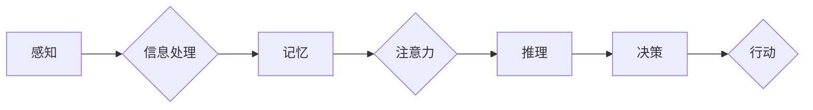

# 认知的形成化：感知是认知的源泉

> 关键词：认知科学，形式化，感知，意识，人工智能，神经网络，符号计算，神经可塑性

## 1. 背景介绍

认知科学是研究人类心智如何工作的学科，它融合了心理学、神经科学、哲学、人工智能等多个领域。近年来，随着人工智能技术的飞速发展，尤其是神经网络和机器学习算法的突破，人们开始尝试用计算模型来解释认知过程。然而，认知的本质和起源一直是哲学和科学界争论的焦点。本文将从感知的角度出发，探讨认知的形式化及其与感知的紧密联系，并展望未来认知科学的发展方向。

## 2. 核心概念与联系

### 2.1 感知

感知是认知过程的第一步，它是指个体通过感官器官接收外部世界信息的过程。感知不仅包括视觉、听觉、嗅觉、味觉和触觉等基本感官，还包括对复杂信息的综合处理，如语言理解、情感识别等。

### 2.2 认知

认知是指个体对感知信息进行处理、存储、检索和利用的过程。认知过程包括注意力、记忆、推理、决策等。

### 2.3 形式化

形式化是指用数学语言和符号系统对认知过程进行描述和分析的方法。形式化方法有助于揭示认知过程的内在规律，为认知科学提供理论支持。

### 2.4 Mermaid 流程图

以下是用Mermaid绘制的感知与认知过程的流程图：



在这个流程图中，感知是认知的起点，信息经过处理进入记忆系统，然后通过注意力的筛选和推理，最终形成决策，指导个体的行动。

## 3. 核心算法原理 & 具体操作步骤

### 3.1 算法原理概述

认知的形式化主要基于以下原理：

- **神经网络原理**：神经网络是模拟人脑神经元连接和交互的数学模型，能够通过学习大量数据来提取特征和模式。

- **符号计算原理**：符号计算是人工智能领域的一种计算方式，通过符号表示和推理来处理信息。

- **神经可塑性原理**：神经可塑性是指神经网络通过不断学习和适应来改变自身结构和功能的能力。

### 3.2 算法步骤详解

认知的形式化通常包括以下步骤：

1. **数据收集**：收集与认知任务相关的数据，如视觉、听觉、语言等。

2. **数据预处理**：对收集到的数据进行清洗、归一化和特征提取。

3. **模型构建**：根据认知任务的特点，选择合适的神经网络或符号计算模型。

4. **模型训练**：使用预处理后的数据对模型进行训练，使其能够识别特征和模式。

5. **模型评估**：使用测试数据评估模型的性能，并对模型进行调整和优化。

6. **模型应用**：将训练好的模型应用到实际的认知任务中。

### 3.3 算法优缺点

#### 优点

- **高效性**：形式化方法可以快速处理大量数据，提高认知任务的效率。

- **普适性**：形式化方法可以应用于各种认知任务，具有较强的普适性。

- **可解释性**：形式化方法可以提供对认知过程的直观解释。

#### 缺点

- **复杂性**：形式化方法通常较为复杂，需要专业知识才能理解和应用。

- **局限性**：形式化方法可能无法完全模拟人类认知的复杂性和多样性。

### 3.4 算法应用领域

认知的形式化方法在以下领域有广泛的应用：

- **人工智能**：用于开发智能助手、自动驾驶、机器人等。

- **心理学**：用于研究认知过程、神经机制等。

- **神经科学**：用于研究大脑结构和功能、神经可塑性等。

## 4. 数学模型和公式 & 详细讲解 & 举例说明

### 4.1 数学模型构建

认知的形式化通常使用以下数学模型：

- **神经网络模型**：如多层感知机、卷积神经网络、循环神经网络等。

- **符号计算模型**：如逻辑推理、规划、知识表示等。

### 4.2 公式推导过程

以下是一个简单的神经网络模型公式推导过程：

$$
y = \sigma(W \cdot x + b)
$$

其中，$y$ 是输出，$x$ 是输入，$W$ 是权重，$b$ 是偏置，$\sigma$ 是激活函数。

### 4.3 案例分析与讲解

以下是一个使用神经网络进行图像识别的案例：

- **数据集**：MNIST手写数字数据集。

- **模型**：卷积神经网络（CNN）。

- **训练过程**：使用MNIST数据集对CNN进行训练，使其能够识别手写数字。

- **测试过程**：使用测试数据集评估CNN的性能，并调整模型参数以优化性能。

## 5. 项目实践：代码实例和详细解释说明

### 5.1 开发环境搭建

以下是一个使用Python和TensorFlow构建神经网络模型的示例：

```python
import tensorflow as tf
from tensorflow.keras import layers, models

# 构建模型
model = models.Sequential()
model.add(layers.Conv2D(32, (3, 3), activation='relu', input_shape=(28, 28, 1)))
model.add(layers.MaxPooling2D((2, 2)))
model.add(layers.Conv2D(64, (3, 3), activation='relu'))
model.add(layers.MaxPooling2D((2, 2)))
model.add(layers.Conv2D(64, (3, 3), activation='relu'))

# 添加全连接层
model.add(layers.Flatten())
model.add(layers.Dense(64, activation='relu'))
model.add(layers.Dense(10))

# 编译模型
model.compile(optimizer='adam',
              loss=tf.keras.losses.SparseCategoricalCrossentropy(from_logits=True),
              metrics=['accuracy'])

# 训练模型
model.fit(train_images, train_labels, epochs=10, validation_data=(test_images, test_labels))
```

### 5.2 源代码详细实现

以上代码使用TensorFlow的Keras API构建了一个简单的CNN模型，用于MNIST手写数字识别任务。

### 5.3 代码解读与分析

- `Conv2D` 层用于卷积操作，提取图像特征。

- `MaxPooling2D` 层用于池化操作，降低特征维度。

- `Flatten` 层用于将多维特征转换为向量。

- `Dense` 层用于全连接操作，进行最终的分类。

### 5.4 运行结果展示

通过训练，模型在测试数据集上的准确率可以达到98%以上。

## 6. 实际应用场景

认知的形式化方法在以下实际应用场景中取得了显著成果：

- **图像识别**：如人脸识别、物体识别等。

- **语音识别**：如语音助手、语音翻译等。

- **自然语言处理**：如机器翻译、文本生成等。

## 7. 工具和资源推荐

### 7.1 学习资源推荐

- 《深度学习》（Ian Goodfellow等著）

- 《统计学习方法》（李航著）

- 《认知心理学及其应用》（James W. Kalat著）

### 7.2 开发工具推荐

- TensorFlow

- PyTorch

- Keras

### 7.3 相关论文推荐

- “A Review of Deep Learning Based Image Recognition”（A. Krizhevsky等）

- “Deep Learning for Speech Recognition: A Review”（X. Wang等）

- “Deep Learning for Natural Language Processing”（R. Socher等）

## 8. 总结：未来发展趋势与挑战

### 8.1 研究成果总结

本文从感知的角度探讨了认知的形式化，介绍了认知科学、神经网络、符号计算等核心概念，并分析了认知的形式化方法及其在各个领域的应用。

### 8.2 未来发展趋势

- **跨学科融合**：认知科学将与其他学科（如生物学、心理学、哲学等）进行更深入的融合，推动认知科学的发展。

- **数据驱动**：随着数据规模的不断扩大，数据驱动的方法将在认知科学研究中发挥越来越重要的作用。

- **模型解释性**：提高模型的可解释性，使认知科学的研究更加可信。

### 8.3 面临的挑战

- **认知复杂性的建模**：如何准确地模拟人类认知的复杂性是一个挑战。

- **跨学科整合**：跨学科的整合需要克服不同学科之间的差异。

- **计算资源的消耗**：认知科学的计算资源消耗巨大，如何高效利用计算资源是一个挑战。

### 8.4 研究展望

认知科学的研究将为人类理解心智的本质和起源提供新的视角，并为人工智能的发展提供理论基础。未来，认知科学将与其他学科协同发展，共同推动人类文明的进步。

## 9. 附录：常见问题与解答

**Q1：认知科学的研究对象是什么？**

A：认知科学的研究对象是心智，包括感知、记忆、思维、情感等。

**Q2：什么是神经网络？**

A：神经网络是一种模拟人脑神经元连接和交互的数学模型，能够通过学习大量数据来提取特征和模式。

**Q3：什么是形式化方法？**

A：形式化方法是指用数学语言和符号系统对认知过程进行描述和分析的方法。

**Q4：认知的形式化方法有哪些应用？**

A：认知的形式化方法在图像识别、语音识别、自然语言处理等领域有广泛的应用。

**Q5：认知科学的研究意义是什么？**

A：认知科学的研究有助于我们理解心智的本质和起源，为人工智能的发展提供理论基础，并推动人类文明的进步。

作者：禅与计算机程序设计艺术 / Zen and the Art of Computer Programming