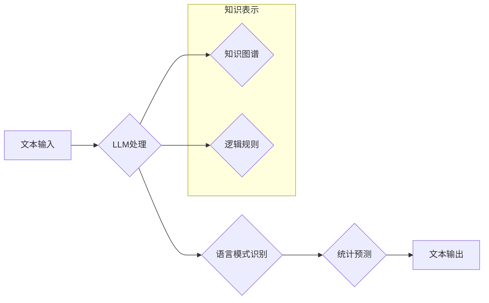

## 语言与推理：大模型的认知障碍

> 关键词：大语言模型、推理能力、认知障碍、知识表示、逻辑推理、常识推理

### 1. 背景介绍

近年来，大语言模型（Large Language Models，LLMs）在自然语言处理领域取得了令人瞩目的成就。从文本生成、翻译到问答和代码编写，LLMs展现出强大的能力，甚至在某些方面超越了人类的表现。然而，尽管LLMs在处理语言方面取得了巨大进步，但它们在推理能力方面仍然存在着显著的局限性。

传统的AI系统通常依赖于明确的规则和逻辑程序，而LLMs则通过学习海量文本数据来掌握语言模式和关系。这种学习方式使得LLMs能够生成流畅、连贯的文本，但同时也导致了它们在推理方面的不足。

LLMs主要依赖于统计预测，而非真正的理解和推理。它们无法像人类一样从文本中提取深层含义，进行逻辑推演和常识推理。当遇到需要逻辑思考、推断和解决问题的情景时，LLMs往往会表现出明显的缺陷。

### 2. 核心概念与联系

**2.1 核心概念**

* **大语言模型 (LLMs):** 训练于海量文本数据上的深度学习模型，能够理解和生成人类语言。
* **推理能力:**  指从已知信息中推导出新的知识或结论的能力。
* **认知障碍:** 指在认知功能方面存在缺陷或障碍。

**2.2  LLMs推理能力的局限性**

LLMs的推理能力受到以下因素的限制：

* **缺乏世界知识:** LLMs主要学习语言模式，缺乏对现实世界知识的理解和建模。
* **统计预测的局限性:** LLMs依赖于统计预测，无法进行真正的逻辑推理和常识推理。
* **可解释性差:** LLMs的决策过程难以解释，难以理解它们是如何得出结论的。

**2.3  LLMs推理能力的挑战**

* 如何赋予LLMs更强的世界知识和常识推理能力？
* 如何提高LLMs推理过程的可解释性和透明度？
* 如何将LLMs与其他AI技术结合，构建更强大的推理系统？

**2.4  Mermaid 流程图**



### 3. 核心算法原理 & 具体操作步骤

**3.1  算法原理概述**

目前，LLMs的推理能力主要依赖于以下几种算法：

* **Transformer模型:** Transformer模型通过自注意力机制学习文本中的长距离依赖关系，提高了LLMs的文本理解能力。
* **图神经网络 (GNN):** GNN可以将知识表示为图结构，并利用图卷积操作进行推理。
* **逻辑推理框架:** 逻辑推理框架可以将LLMs与逻辑规则和知识库结合，进行更精确的推理。

**3.2  算法步骤详解**

* **数据预处理:** 将文本数据进行清洗、分词、标记等预处理操作。
* **模型训练:** 使用训练数据训练LLM模型，例如Transformer模型。
* **知识表示:** 将世界知识和逻辑规则表示为知识图谱或逻辑公式。
* **推理过程:** 将输入文本输入到LLM模型中，并结合知识表示进行推理。
* **结果输出:** 输出推理结果，例如答案、解释或预测。

**3.3  算法优缺点**

* **Transformer模型:** 优点：强大的文本理解能力，可以学习长距离依赖关系。缺点：训练成本高，推理速度相对较慢。
* **图神经网络 (GNN):** 优点：可以有效地表示知识关系，进行图结构推理。缺点：对知识图谱的构建和维护要求较高。
* **逻辑推理框架:** 优点：可以进行精确的逻辑推理，提高推理的可靠性。缺点：需要人工构建逻辑规则，难以处理复杂的情景。

**3.4  算法应用领域**

* **问答系统:** 回答用户提出的问题，例如搜索引擎、聊天机器人。
* **文本摘要:** 从长文本中提取关键信息，生成简洁的摘要。
* **机器翻译:** 将文本从一种语言翻译成另一种语言。
* **代码生成:** 根据自然语言描述生成代码。

### 4. 数学模型和公式 & 详细讲解 & 举例说明

**4.1  数学模型构建**

LLMs通常使用神经网络模型进行训练，其中Transformer模型是目前最流行的架构之一。Transformer模型的核心是自注意力机制，它可以学习文本中的长距离依赖关系。

**4.2  公式推导过程**

自注意力机制的计算公式如下：

$$
Attention(Q, K, V) = \frac{exp(Q \cdot K^T / \sqrt{d_k})}{exp(Q \cdot K^T / \sqrt{d_k})} \cdot V
$$

其中：

* $Q$：查询矩阵
* $K$：键矩阵
* $V$：值矩阵
* $d_k$：键向量的维度

**4.3  案例分析与讲解**

例如，在翻译句子“The cat sat on the mat”时，自注意力机制可以帮助模型理解“cat”和“sat”之间的关系，以及“mat”与“on”之间的关系，从而生成更准确的翻译。

### 5. 项目实践：代码实例和详细解释说明

**5.1  开发环境搭建**

* Python 3.7+
* PyTorch 或 TensorFlow
* CUDA 和 cuDNN (可选)

**5.2  源代码详细实现**

```python
import torch
import torch.nn as nn

class Attention(nn.Module):
    def __init__(self, d_model, num_heads):
        super(Attention, self).__init__()
        self.d_model = d_model
        self.num_heads = num_heads
        self.head_dim = d_model // num_heads

        self.query = nn.Linear(d_model, d_model)
        self.key = nn.Linear(d_model, d_model)
        self.value = nn.Linear(d_model, d_model)
        self.fc_out = nn.Linear(d_model, d_model)

    def forward(self, query, key, value, mask=None):
        batch_size = query.size(0)

        # Linear projections
        Q = self.query(query).view(batch_size, -1, self.num_heads, self.head_dim).transpose(1, 2)
        K = self.key(key).view(batch_size, -1, self.num_heads, self.head_dim).transpose(1, 2)
        V = self.value(value).view(batch_size, -1, self.num_heads, self.head_dim).transpose(1, 2)

        # Scaled dot-product attention
        scores = torch.matmul(Q, K.transpose(-2, -1)) / torch.sqrt(torch.tensor(self.head_dim, dtype=torch.float))
        if mask is not None:
            scores = scores.masked_fill(mask == 0, -1e9)
        attention_weights = torch.softmax(scores, dim=-1)

        # Weighted sum of values
        context = torch.matmul(attention_weights, V)

        # Concatenate heads and project
        context = context.transpose(1, 2).contiguous().view(batch_size, -1, self.d_model)
        output = self.fc_out(context)

        return output, attention_weights
```

**5.3  代码解读与分析**

这段代码实现了自注意力机制的计算过程。首先，将输入的查询、键和值矩阵进行线性投影，然后计算它们的点积，并进行归一化。接着，使用softmax函数计算注意力权重，并将注意力权重与值矩阵相乘，得到上下文向量。最后，将上下文向量进行线性变换，得到最终的输出。

**5.4  运行结果展示**

运行这段代码可以得到注意力权重矩阵，可以直观地观察模型是如何关注不同词之间的关系的。

### 6. 实际应用场景

**6.1  问答系统**

LLMs可以用于构建问答系统，例如搜索引擎、聊天机器人等。通过训练LLMs，使其能够理解用户的问题，并从知识库中找到相应的答案。

**6.2  文本摘要**

LLMs可以用于生成文本摘要，例如新闻文章、会议记录等。通过训练LLMs，使其能够提取文本中的关键信息，并生成简洁的摘要。

**6.3  机器翻译**

LLMs可以用于机器翻译，例如将文本从一种语言翻译成另一种语言。通过训练LLMs，使其能够学习语言之间的对应关系，并生成准确的翻译结果。

**6.4  未来应用展望**

随着LLMs的不断发展，其推理能力将会得到进一步提升，在更多领域得到应用，例如：

* **自动代码生成:** 根据自然语言描述自动生成代码。
* **科学发现:** 帮助科学家发现新的规律和知识。
* **个性化教育:** 为每个学生提供个性化的学习方案。

### 7. 工具和资源推荐

**7.1  学习资源推荐**

* **论文:**
    * Attention Is All You Need (Vaswani et al., 2017)
    * BERT: Pre-training of Deep Bidirectional Transformers for Language Understanding (Devlin et al., 2018)
    * GPT-3: Language Models are Few-Shot Learners (Brown et al., 2020)
* **书籍:**
    * Deep Learning (Goodfellow et al., 2016)
    * Natural Language Processing with Python (Bird et al., 2009)

**7.2  开发工具推荐**

* **PyTorch:** https://pytorch.org/
* **TensorFlow:** https://www.tensorflow.org/
* **Hugging Face Transformers:** https://huggingface.co/transformers/

**7.3  相关论文推荐**

* **XLNet: Generalized Autoregressive Pretraining for Language Understanding** (Yang et al., 2019)
* **T5: Text-to-Text Transfer Transformer** (Raffel et al., 2019)
* **RoBERTa: A Robustly Optimized BERT Pretraining Approach** (Liu et al., 2019)

### 8. 总结：未来发展趋势与挑战

**8.1  研究成果总结**

近年来，LLMs在自然语言处理领域取得了显著的进展，其推理能力也得到了提升。然而，LLMs仍然存在着一些局限性，例如缺乏世界知识、可解释性差等。

**8.2  未来发展趋势**

* **增强世界知识:** 将外部知识库和逻辑规则融入LLMs的训练过程，提升其世界知识和推理能力。
* **提高可解释性:** 研究更可解释的LLM架构和推理方法，使得LLMs的决策过程更加透明。
* **跨模态推理:** 将LLMs与其他模态数据（例如图像、音频）结合，进行跨模态推理。

**8.3  面临的挑战**

* **数据规模和质量:** 训练强大的LLMs需要海量高质量的数据，这仍然是一个挑战。
* **计算资源:** 训练和推理大型LLMs需要大量的计算资源，这限制了其应用范围。
* **伦理问题:** LLMs的应用可能带来一些伦理问题，例如偏见、虚假信息传播等，需要引起重视。

**8.4  研究展望**

未来，LLMs的研究将继续朝着更强大、更智能、更安全的方向发展。相信随着技术的不断进步，LLMs将会在更多领域发挥重要作用，改变我们的生活方式。

### 9. 附录：常见问题与解答

**9.1  LLMs为什么不能像人类