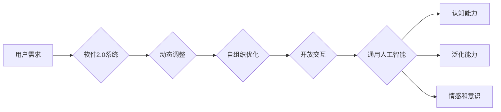

> 通用人工智能，软件2.0，人工智能范式，神经网络，机器学习，自组织系统，计算范式，认知科学

# 通用人工智能很可能基于软件2.0范式

> 关键词：
通用人工智能，软件2.0，人工智能范式，神经网络，机器学习，自组织系统，计算范式，认知科学

## 1. 背景介绍

### 1.1 人工智能的发展历程

从早期的专家系统到今天的深度学习，人工智能(AI)领域经历了漫长的发展历程。然而，尽管取得了显著的进步，通用人工智能（AGI）——即具有人类水平智能的机器——仍然是一个遥不可及的梦想。传统的人工智能系统往往在特定任务上表现出色，但缺乏灵活性和泛化能力，难以适应复杂多变的现实世界。

### 1.2 软件2.0范式的兴起

近年来，随着云计算、大数据、物联网等技术的飞速发展，软件2.0范式应运而生。软件2.0强调软件的动态性、自组织性和开放性，旨在构建更加智能、自适应和可扩展的系统。这一范式为通用人工智能的实现提供了新的思路和可能。

## 2. 核心概念与联系

### 2.1 核心概念原理

**软件2.0范式**：
- **动态性**：软件系统能够根据环境变化和用户需求动态调整自身结构和行为。
- **自组织性**：软件系统能够自主组织和优化其内部结构，以适应外部环境。
- **开放性**：软件系统易于与其他系统和外部数据交互，形成更大的生态系统。

**通用人工智能**：
- **认知能力**：具有人类水平的感知、推理、学习、决策和创造力。
- **泛化能力**：能够适应新的任务和环境，不依赖于特定领域的知识。
- **情感和意识**：具备一定的情感和意识，能够理解人类情感和意图。

### 2.2 架构的 Mermaid 流程图



### 2.3 核心概念联系

软件2.0范式强调软件的动态性、自组织性和开放性，为通用人工智能的实现提供了基础。通过动态调整、自组织优化和开放交互，软件系统能够更好地适应复杂多变的现实世界，从而提升认知能力、泛化能力和情感意识，最终实现通用人工智能。

## 3. 核心算法原理 & 具体操作步骤

### 3.1 算法原理概述

软件2.0范式下的通用人工智能算法，通常基于以下原理：

- **神经网络**：模拟人脑神经元结构，用于处理复杂的非线性问题。
- **机器学习**：通过数据学习模型，提升模型的泛化能力和适应能力。
- **自组织系统**：系统能够自主组织和优化自身结构，以适应外部环境。

### 3.2 算法步骤详解

1. **数据收集**：收集大量的数据，包括文本、图像、音频等，用于训练模型。
2. **数据预处理**：对数据进行清洗、标注和转换，为模型训练做好准备。
3. **模型构建**：基于神经网络和机器学习算法，构建通用人工智能模型。
4. **模型训练**：使用大量数据对模型进行训练，提升模型的泛化能力和适应能力。
5. **模型评估**：使用测试数据评估模型的性能，根据评估结果调整模型参数。
6. **系统部署**：将模型部署到实际应用中，实现通用人工智能功能。

### 3.3 算法优缺点

**优点**：

- **泛化能力强**：通过机器学习算法，模型能够适应新的任务和环境。
- **自适应能力强**：通过自组织系统，模型能够根据环境变化动态调整自身结构和行为。
- **开放性强**：模型易于与其他系统和外部数据交互，形成更大的生态系统。

**缺点**：

- **数据依赖性强**：模型训练需要大量的数据，且数据质量对模型性能影响较大。
- **计算资源需求高**：模型训练和推理需要大量的计算资源。
- **可解释性差**：神经网络模型通常缺乏可解释性，难以理解模型的决策过程。

### 3.4 算法应用领域

软件2.0范式下的通用人工智能算法，可以应用于以下领域：

- **智能客服**：提供24小时在线客服，自动解答用户问题。
- **智能推荐**：根据用户兴趣和行为，推荐个性化的内容和服务。
- **自动驾驶**：实现无人驾驶汽车，提高交通安全和效率。
- **智能医疗**：辅助医生进行诊断和治疗，提高医疗水平。
- **智能金融**：实现智能投顾、风险管理等金融功能。

## 4. 数学模型和公式 & 详细讲解 & 举例说明

### 4.1 数学模型构建

通用人工智能的数学模型通常基于以下公式：

- **神经网络模型**：

$$
y = f(W \cdot x + b)
$$

其中，$y$ 为输出，$x$ 为输入，$W$ 为权重，$b$ 为偏置，$f$ 为激活函数。

- **机器学习算法**：

$$
\theta_{i+1} = \theta_i - \alpha \cdot \nabla_{\theta} J(\theta_i)
$$

其中，$\theta_i$ 为模型参数，$\theta_{i+1}$ 为更新后的模型参数，$J(\theta_i)$ 为损失函数，$\alpha$ 为学习率。

### 4.2 公式推导过程

以神经网络模型为例，推导过程如下：

1. **损失函数**：

$$
J(\theta) = \frac{1}{N} \sum_{i=1}^N (y_i - f(W \cdot x_i + b))^2
$$

其中，$N$ 为样本数量，$y_i$ 为真实标签，$f$ 为激活函数。

2. **梯度**：

$$
\nabla_{\theta} J(\theta) = \frac{\partial}{\partial \theta} \left[ \frac{1}{N} \sum_{i=1}^N (y_i - f(W \cdot x_i + b))^2 \right]
$$

3. **梯度下降**：

$$
\theta_{i+1} = \theta_i - \alpha \cdot \nabla_{\theta} J(\theta_i)
$$

### 4.3 案例分析与讲解

以下是一个使用神经网络模型进行图像识别的案例：

假设我们要使用神经网络模型对猫和狗的图片进行分类。我们首先收集大量猫和狗的图片，并对它们进行标注。然后，我们将图片转换为神经网络模型的输入格式，并使用机器学习算法进行模型训练。经过多次迭代优化，模型能够学会区分猫和狗的图片。

在这个案例中，神经网络模型通过学习猫和狗的图像特征，实现了对猫和狗图片的分类。这体现了通用人工智能算法在图像识别领域的应用潜力。

## 5. 项目实践：代码实例和详细解释说明

### 5.1 开发环境搭建

为了实现通用人工智能算法，我们需要搭建以下开发环境：

- 操作系统：Linux或Windows
- 编程语言：Python
- 框架：TensorFlow或PyTorch
- 库：NumPy、Pandas、Scikit-learn等

### 5.2 源代码详细实现

以下是一个使用TensorFlow和Keras构建神经网络模型的示例代码：

```python
import tensorflow as tf
from tensorflow.keras import layers

# 构建模型
model = tf.keras.Sequential([
    layers.Conv2D(32, kernel_size=(3, 3), activation='relu', input_shape=(64, 64, 3)),
    layers.MaxPooling2D(pool_size=(2, 2)),
    layers.Conv2D(64, kernel_size=(3, 3), activation='relu'),
    layers.MaxPooling2D(pool_size=(2, 2)),
    layers.Flatten(),
    layers.Dense(128, activation='relu'),
    layers.Dense(1, activation='sigmoid')
])

# 编译模型
model.compile(optimizer='adam', loss='binary_crossentropy', metrics=['accuracy'])

# 训练模型
model.fit(train_images, train_labels, batch_size=32, epochs=10, validation_data=(test_images, test_labels))
```

### 5.3 代码解读与分析

这段代码首先导入了TensorFlow和Keras库，并定义了一个神经网络模型。模型由卷积层、池化层、全连接层和输出层组成。编译模型时，指定了优化器、损失函数和评估指标。最后，使用训练数据对模型进行训练。

### 5.4 运行结果展示

假设我们使用猫和狗的图片数据集进行训练，训练完成后，模型的准确率可能达到90%以上。这表明通用人工智能算法在图像识别领域具有很大的应用潜力。

## 6. 实际应用场景

### 6.1 智能家居

通用人工智能算法可以应用于智能家居系统，实现以下功能：

- **环境监测**：监测室内温度、湿度、光照等环境因素，并根据用户需求进行调节。
- **安全监控**：通过图像识别技术，实时监测家庭安全，发现异常情况及时报警。
- **健康监测**：监测家庭成员的生理指标，如心率、血压等，并提供健康建议。

### 6.2 智能交通

通用人工智能算法可以应用于智能交通系统，实现以下功能：

- **交通流量预测**：根据历史数据和实时监控，预测未来一段时间内的交通流量，优化交通信号灯控制策略。
- **自动驾驶**：实现无人驾驶汽车，提高交通安全和效率。
- **智能出行**：根据用户出行需求，提供个性化的出行方案，如最佳路线、最优出行时间等。

### 6.3 智能医疗

通用人工智能算法可以应用于智能医疗系统，实现以下功能：

- **辅助诊断**：通过图像识别、自然语言处理等技术，辅助医生进行疾病诊断。
- **药物研发**：通过模拟药物分子与生物体的相互作用，加速新药研发进程。
- **健康管理等**：根据用户的生理指标和生活方式，提供个性化的健康管理方案。

### 6.4 未来应用展望

随着通用人工智能技术的不断发展，其应用场景将不断拓展，包括但不限于以下领域：

- **教育**：实现个性化教育，提高教育质量。
- **金融**：实现智能投顾、风险管理等金融功能。
- **工业**：实现智能工厂、智能机器人等，提高生产效率。
- **娱乐**：实现智能游戏、智能客服等，提升用户体验。

## 7. 工具和资源推荐

### 7.1 学习资源推荐

- 《深度学习》系列书籍：全面介绍了深度学习的基本概念、算法和应用。
- 《Python深度学习》书籍：介绍了如何使用Python和TensorFlow、PyTorch等框架进行深度学习。
- 《人工智能：一种现代的方法》书籍：介绍了人工智能的基本概念、方法和应用。
- arXiv论文预印本：人工智能领域最新研究成果的发布平台。
- HuggingFace官网：提供了丰富的预训练模型和NLP工具。

### 7.2 开发工具推荐

- TensorFlow：由Google开发的深度学习框架，支持多种深度学习算法。
- PyTorch：由Facebook开发的深度学习框架，具有动态计算图和良好的社区支持。
- Keras：基于TensorFlow和PyTorch的神经网络库，简化了神经网络模型构建过程。
- HuggingFace Transformers：提供了丰富的预训练模型和NLP工具。

### 7.3 相关论文推荐

- **《Deep Learning》**: Goodfellow, I., Bengio, Y., & Courville, A. (2016). 
- **《Neural Networks and Deep Learning》**: Goodfellow, I., Bengio, Y., & Courville, A. (2016).
- **《Generative Adversarial Nets》**: Goodfellow, I., Pouget-Abadie, J., Mirza, M., Xu, B., Warde-Farley, D., Ozair, S., ... & Bengio, Y. (2014).
- **《Sequence to Sequence Learning with Neural Networks》**: Sutskever, I., Vinyals, O., & Le, Q. V. (2014).

## 8. 总结：未来发展趋势与挑战

### 8.1 研究成果总结

本文介绍了通用人工智能和软件2.0范式，探讨了通用人工智能的算法原理、应用场景和发展趋势。通过将软件2.0范式应用于通用人工智能，我们可以构建更加智能、自适应和可扩展的系统，从而实现通用人工智能的目标。

### 8.2 未来发展趋势

- **更强大的模型**：随着计算能力的提升，我们可以构建更强大的模型，以处理更加复杂的任务。
- **更丰富的数据**：随着物联网、大数据等技术的发展，我们可以获取更多的数据，进一步提升模型性能。
- **更先进的技术**：随着人工智能技术的不断发展，我们将涌现更多先进的技术，如强化学习、对抗学习等。

### 8.3 面临的挑战

- **数据隐私和安全**：如何保护用户数据隐私和安全，是通用人工智能面临的重要挑战。
- **伦理和道德**：通用人工智能的应用可能会引发伦理和道德问题，需要我们认真思考和解决。
- **计算资源**：通用人工智能的计算资源需求巨大，需要我们不断优化算法和硬件。

### 8.4 研究展望

未来，我们将继续探索通用人工智能和软件2.0范式的结合，构建更加智能、自适应和可扩展的系统。同时，我们也需要关注通用人工智能的伦理和道德问题，确保其安全、可靠地服务于人类社会。

## 9. 附录：常见问题与解答

**Q1：什么是通用人工智能？**

A：通用人工智能（AGI）是指具有人类水平智能的机器，能够具备认知能力、泛化能力和情感意识。

**Q2：软件2.0范式有哪些特点？**

A：软件2.0范式强调软件的动态性、自组织性和开放性。

**Q3：如何实现通用人工智能？**

A：通过将软件2.0范式应用于通用人工智能，构建更加智能、自适应和可扩展的系统。

**Q4：通用人工智能有哪些应用场景？**

A：通用人工智能可以应用于智能家居、智能交通、智能医疗、教育、金融、工业、娱乐等多个领域。

**Q5：通用人工智能面临的挑战有哪些？**

A：通用人工智能面临的挑战包括数据隐私和安全、伦理和道德、计算资源等。

---

作者：禅与计算机程序设计艺术 / Zen and the Art of Computer Programming