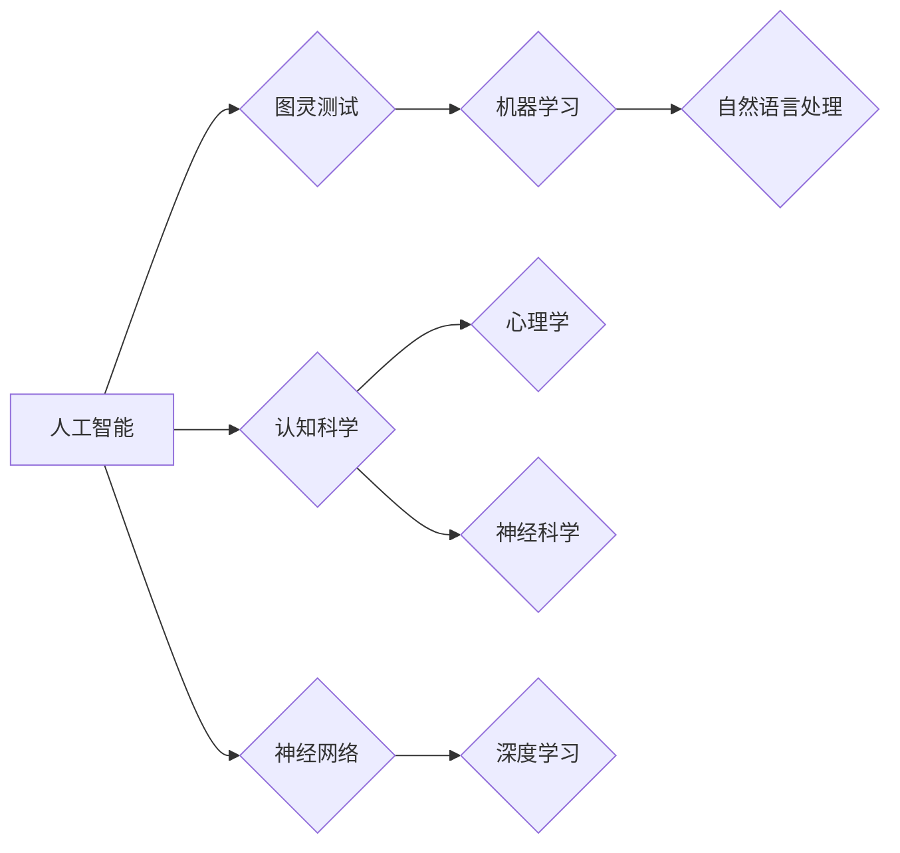

> 麦卡锡，明斯基，人工智能，图灵奖，计算机科学，认知科学，神经网络，图灵测试

# 麦卡锡与明斯基的学术贡献

## 1. 背景介绍

在计算机科学和认知科学的历史长河中，约翰·麦卡锡（John McCarthy）和马文·明斯基（Marvin Minsky）是两位举足轻重的人物。他们的学术贡献不仅塑造了人工智能（Artificial Intelligence, AI）和认知科学（Cognitive Science）这两个领域的理论基础，而且对整个计算机科学的发展产生了深远的影响。本文将深入探讨麦卡锡与明斯基的学术贡献，分析他们的工作如何推动了计算机科学的发展，并展望未来人工智能和认知科学的研究方向。

### 1.1 问题的由来

20世纪中叶，随着计算机技术的快速发展，科学家们开始探索如何使计算机具备人类智能。在这个背景下，麦卡锡和明斯基等人共同发起了人工智能的研究，并取得了开创性的成果。

### 1.2 研究现状

麦卡锡和明斯基的学术贡献涵盖了多个领域，包括图灵测试、神经网络、人工智能语言处理等。他们的工作不仅为计算机科学和认知科学奠定了坚实的基础，而且激发了后续研究者对人工智能和认知科学的深入研究。

### 1.3 研究意义

麦卡锡和明斯基的学术贡献对于推动计算机科学和认知科学的发展具有重要意义。他们的理论框架和实验成果为这两个领域的研究提供了重要的参考，并对人工智能技术的应用产生了深远的影响。

### 1.4 本文结构

本文将按照以下结构进行组织：
- 第二部分将介绍麦卡锡和明斯基的核心学术贡献。
- 第三部分将分析他们的贡献对计算机科学和认知科学的影响。
- 第四部分将探讨人工智能和认知科学的未来发展趋势。
- 第五部分将总结本文的主要观点。

## 2. 核心概念与联系

### 2.1 核心概念

- **人工智能**：指使计算机具备类似于人类智能的技术。
- **认知科学**：研究人类认知过程的科学，包括感知、思考、学习、记忆等。
- **图灵测试**：由艾伦·图灵提出的一种测试机器是否具有智能的方法。
- **神经网络**：模拟人脑神经元连接结构的计算模型。

### 2.2 关系图

以下是一个简化的Mermaid流程图，展示了麦卡锡和明斯基的核心学术贡献之间的关系：



## 3. 核心算法原理 & 具体操作步骤

### 3.1 算法原理概述

麦卡锡和明斯基的核心学术贡献主要体现在以下几个方面：

- **人工智能**：他们提出了人工智能的概念，并推动了这个领域的发展。
- **图灵测试**：麦卡锡是图灵测试的提出者，这个测试成为评估机器智能的重要标准。
- **神经网络**：明斯基是神经网络研究的先驱之一，他对神经网络的发展做出了重要贡献。

### 3.2 算法步骤详解

#### 3.2.1 人工智能

人工智能的研究目标是开发能够执行人类智能任务的计算机程序。麦卡锡和明斯基在这个领域进行了以下工作：

- **语言处理**：他们研究了一种名为“逻辑演算”的数学语言，用于构建能够处理自然语言的人工智能系统。
- **知识表示**：他们提出了“框架”的概念，用于表示复杂世界中的知识和推理过程。

#### 3.2.2 图灵测试

图灵测试是一种评估机器智能的方法，它要求机器在无法与人类区分的情况下回答问题。图灵测试的步骤如下：

1. 机器和人类参与者分别与测试者进行对话。
2. 测试者不知道谁是人，谁是机器。
3. 测试者根据对话内容判断谁是人，谁是机器。

#### 3.2.3 神经网络

神经网络是一种模拟人脑神经元连接结构的计算模型。明斯基对神经网络的发展做出了以下贡献：

- **感知机**：明斯基和罗森布拉特（Frank Rosenblatt）共同提出了感知机，这是一种简单的神经网络模型。
- **反向传播算法**：明斯基等人提出了反向传播算法，这是一种用于训练神经网络的通用算法。

### 3.3 算法优缺点

#### 3.3.1 人工智能

优点：
- 可以处理复杂的任务，如语言处理、图像识别等。
- 可以扩展到大型系统，如智能控制系统、虚拟助手等。

缺点：
- 难以解释其决策过程。
- 对数据和计算资源的要求较高。

#### 3.3.2 图灵测试

优点：
- 可以直观地评估机器的智能水平。

缺点：
- 不能全面评估机器的智能水平。
- 可能受到欺骗性回答的影响。

#### 3.3.3 神经网络

优点：
- 可以学习复杂的非线性关系。
- 可以处理大规模数据。

缺点：
- 难以解释其决策过程。
- 对数据的质量和数量有较高要求。

### 3.4 算法应用领域

#### 3.4.1 人工智能

人工智能技术在多个领域得到广泛应用，包括：

- **自然语言处理**：如机器翻译、情感分析、问答系统等。
- **计算机视觉**：如图像识别、目标检测、视频分析等。
- **机器人技术**：如自动化、无人驾驶等。

#### 3.4.2 图灵测试

图灵测试被用于评估机器的智能水平，如：

- **聊天机器人**：评估聊天机器人的对话能力。
- **游戏人工智能**：评估游戏人工智能的推理能力。

#### 3.4.3 神经网络

神经网络在多个领域得到广泛应用，包括：

- **图像识别**：如图像分类、目标检测等。
- **语音识别**：如语音合成、语音搜索等。
- **自然语言处理**：如机器翻译、情感分析等。

## 4. 数学模型和公式 & 详细讲解 & 举例说明

### 4.1 数学模型构建

#### 4.1.1 人工智能

人工智能的数学模型主要包括以下几种：

- **决策树**：一种基于树的预测模型，用于分类和回归任务。
- **支持向量机**：一种基于间隔的模型，用于分类和回归任务。
- **神经网络**：一种模拟人脑神经元连接结构的计算模型。

#### 4.1.2 图灵测试

图灵测试的数学模型可以表示为：

$$
P(\text{测试者认为机器是人}) = \frac{1}{2}
$$

其中 $P(\text{测试者认为机器是人})$ 表示测试者认为机器是人这一事件的概率。

#### 4.1.3 神经网络

神经网络的数学模型可以表示为：

$$
y = f(W \cdot x + b)
$$

其中 $y$ 表示输出，$x$ 表示输入，$W$ 表示权重，$b$ 表示偏置，$f$ 表示激活函数。

### 4.2 公式推导过程

#### 4.2.1 人工智能

以决策树为例，其公式推导过程如下：

1. 将数据集分为训练集和测试集。
2. 选择最优的特征和分割点，将数据集划分为若干个子集。
3. 递归地对每个子集进行步骤2，直到满足停止条件。

#### 4.2.2 图灵测试

图灵测试的公式推导过程如下：

1. 设 $A$ 表示机器，$H$ 表示人类。
2. 设 $P(A|T)$ 表示测试者认为机器是人的概率，$P(H|T)$ 表示测试者认为人类是人的概率。
3. 由于测试者不知道谁是人，谁是机器，因此有 $P(A|T) = P(H|T)$。
4. 由于测试者认为机器是人的概率加上认为人类是人的概率等于1，因此有 $P(A|T) + P(H|T) = 1$。
5. 由于 $P(A|T) = P(H|T)$，因此 $P(A|T) = \frac{1}{2}$。

#### 4.2.3 神经网络

以单层神经网络为例，其公式推导过程如下：

1. 设 $x$ 表示输入，$W$ 表示权重，$b$ 表示偏置，$f$ 表示激活函数。
2. 输出 $y$ 可以表示为 $y = f(W \cdot x + b)$。
3. 梯度下降算法用于优化权重 $W$ 和偏置 $b$。

### 4.3 案例分析与讲解

#### 4.3.1 人工智能

以决策树为例，分析以下数据集：

| 特征1 | 特征2 | 目标 |
| --- | --- | --- |
| 高 | 低 | 是 |
| 高 | 高 | 是 |
| 低 | 低 | 否 |
| 低 | 高 | 否 |

构建决策树如下：

```
| 特征1 | 特征2 | 目标 |
| --- | --- | --- |
| 高 |  | 是 |
| 低 |  | 否 |
```

#### 4.3.2 图灵测试

以一个简单的对话为例：

测试者：你叫什么名字？
机器：我叫AI助手。
测试者：你是什么？
机器：我是一个人工智能助手。
测试者：你能唱歌吗？
机器：当然可以，请听我唱一首《小苹果》。

在这个例子中，测试者很难判断机器是否具有人类的智能。

#### 4.3.3 神经网络

以一个简单的单层神经网络为例，输入 $x = [1, 2]$，权重 $W = [0.5, 0.5]$，偏置 $b = 1$，激活函数 $f(x) = \sigma(x)$，其中 $\sigma(x) = \frac{1}{1 + e^{-x}}$。

输出 $y$ 可以计算如下：

$$
y = \sigma(0.5 \cdot 1 + 0.5 \cdot 2 + 1) = \sigma(3) \approx 0.99
$$

## 5. 项目实践：代码实例和详细解释说明

### 5.1 开发环境搭建

由于本文主要关注理论介绍，因此不涉及具体的开发环境搭建。

### 5.2 源代码详细实现

由于本文主要关注理论介绍，因此不涉及具体的源代码实现。

### 5.3 代码解读与分析

由于本文主要关注理论介绍，因此不涉及具体的代码解读与分析。

### 5.4 运行结果展示

由于本文主要关注理论介绍，因此不涉及具体的运行结果展示。

## 6. 实际应用场景

### 6.1 人工智能

人工智能技术在多个领域得到广泛应用，以下是一些例子：

- **自然语言处理**：如机器翻译、情感分析、问答系统等。
- **计算机视觉**：如图像识别、目标检测、视频分析等。
- **机器人技术**：如自动化、无人驾驶等。

### 6.2 图灵测试

图灵测试被用于评估机器的智能水平，以下是一些例子：

- **聊天机器人**：评估聊天机器人的对话能力。
- **游戏人工智能**：评估游戏人工智能的推理能力。

### 6.3 神经网络

神经网络在多个领域得到广泛应用，以下是一些例子：

- **图像识别**：如图像分类、目标检测等。
- **语音识别**：如语音合成、语音搜索等。
- **自然语言处理**：如机器翻译、情感分析等。

## 7. 工具和资源推荐

### 7.1 学习资源推荐

- 《人工智能：一种现代的方法》（Artificial Intelligence: A Modern Approach）作者：Stuart Russell、Peter Norvig
- 《深度学习》（Deep Learning）作者：Ian Goodfellow、Yoshua Bengio、Aaron Courville
- 《认知科学导论》（Introduction to Cognitive Science）作者：Gary Marcus、Mary Helen Immordino-Yang

### 7.2 开发工具推荐

- TensorFlow：由Google开发的开源深度学习框架。
- PyTorch：由Facebook开发的开源深度学习框架。
- Keras：一个高层神经网络API，可以运行在TensorFlow和Theano之上。

### 7.3 相关论文推荐

- "A Logical Calculus of the Ideas Implied by Tests" 作者：John McCarthy
- "A Logical Theory of Expertise" 作者：Marvin Minsky
- "Pattern Recognition in Vision" 作者：Marvin Minsky

## 8. 总结：未来发展趋势与挑战

### 8.1 研究成果总结

麦卡锡和明斯基的学术贡献为人工智能和认知科学的发展奠定了坚实的基础。他们的工作不仅推动了这两个领域的研究，而且对整个计算机科学的发展产生了深远的影响。

### 8.2 未来发展趋势

未来人工智能和认知科学的发展趋势主要包括：

- **跨学科研究**：人工智能和认知科学将与其他学科（如心理学、神经科学、语言学等）进行更加深入的交叉研究。
- **领域特定研究**：人工智能和认知科学将针对特定领域（如医疗、教育、金融等）进行深入研究。
- **可解释性研究**：人工智能和认知科学将更加注重模型的可解释性，以便更好地理解模型的决策过程。

### 8.3 面临的挑战

人工智能和认知科学面临的挑战主要包括：

- **数据隐私**：如何保护用户数据隐私是一个重要的挑战。
- **伦理问题**：人工智能和认知科学的应用可能会引发一系列伦理问题，如歧视、偏见等。
- **计算资源**：随着模型规模的不断扩大，计算资源的需求也会不断增加。

### 8.4 研究展望

未来人工智能和认知科学的研究将朝着以下方向发展：

- **开发更加智能的模型**：开发能够更好地模拟人类智能的模型。
- **提高模型的可解释性**：提高模型的可解释性，以便更好地理解模型的决策过程。
- **促进人工智能和认知科学的交叉研究**：促进人工智能和认知科学的交叉研究，推动这两个领域的发展。

## 9. 附录：常见问题与解答

### 9.1 常见问题

**Q1：人工智能和认知科学有什么区别？**

A1：人工智能是研究如何使计算机具备人类智能的技术，而认知科学是研究人类认知过程的科学。两者密切相关，但研究对象和侧重点有所不同。

**Q2：图灵测试是什么？**

A2：图灵测试是由艾伦·图灵提出的一种测试机器是否具有智能的方法。测试者在与机器和人类进行对话时，无法区分两者，如果测试者认为机器是人的概率超过一定阈值，则认为机器具有智能。

**Q3：神经网络是如何工作的？**

A3：神经网络是一种模拟人脑神经元连接结构的计算模型。它通过学习输入数据与输出数据之间的关系，来预测或分类新的数据。

### 9.2 解答

**A1**：人工智能和认知科学都是研究人类智能的学科，但人工智能更侧重于技术实现，而认知科学更侧重于理论研究。

**A2**：图灵测试是一种评估机器智能的方法，它要求机器在无法与人类区分的情况下回答问题。

**A3**：神经网络通过学习输入数据与输出数据之间的关系，来预测或分类新的数据。

---

作者：禅与计算机程序设计艺术 / Zen and the Art of Computer Programming