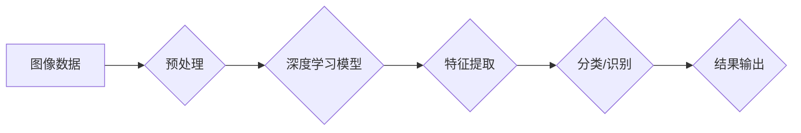

## 李飞飞与ImageNet的故事

> 关键词：深度学习、计算机视觉、ImageNet、分类、识别、迁移学习、人工智能

### 1. 背景介绍

20世纪90年代末，随着互联网的蓬勃发展，海量图像数据开始涌现。这为计算机视觉领域带来了前所未有的机遇，也带来了新的挑战。如何让计算机能够像人类一样理解和识别图像，一直是计算机视觉领域的核心问题。

传统的计算机视觉方法主要依赖于人工特征工程，需要专家手动设计特征提取算法，并对图像进行大量的预处理。这种方法效率低下，难以应对图像的复杂性和多样性。

2009年，斯坦福大学教授李飞飞发起了一个名为ImageNet的项目，旨在构建一个包含百万张图像的大规模图像数据集，并举办每年一次的ImageNet图像识别挑战赛。ImageNet的出现标志着深度学习在计算机视觉领域的兴起。

### 2. 核心概念与联系

ImageNet数据集包含了超过20万个类别，涵盖了几乎所有你能想象到的物体和场景。它为深度学习模型提供了海量的数据训练样本，促进了深度学习算法的快速发展。

**Mermaid 流程图**



**核心概念:**

* **深度学习:** 一种机器学习方法，利用多层神经网络模拟人类大脑的学习过程。
* **图像识别:** 让计算机能够识别图像中包含的物体、场景或其他信息。
* **分类:** 将图像归类到预定义的类别中。
* **迁移学习:** 利用预训练模型的知识，对新的任务进行训练。

### 3. 核心算法原理 & 具体操作步骤

#### 3.1  算法原理概述

深度学习模型，特别是卷积神经网络（CNN），在图像识别领域取得了突破性的进展。CNN利用卷积操作和池化操作来提取图像特征，并通过全连接层进行分类或识别。

#### 3.2  算法步骤详解

1. **数据预处理:** 将图像数据进行尺寸调整、归一化等预处理操作，以提高模型训练的效率和精度。
2. **卷积层:** 使用卷积核对图像进行卷积操作，提取图像局部特征。
3. **池化层:** 对卷积层的输出进行池化操作，例如最大池化，降低特征图的尺寸，提高模型的鲁棒性。
4. **全连接层:** 将池化层的输出连接到全连接层，进行分类或识别。
5. **损失函数:** 使用损失函数衡量模型预测结果与真实标签之间的差异。
6. **优化算法:** 使用优化算法，例如梯度下降，更新模型参数，降低损失函数的值。

#### 3.3  算法优缺点

**优点:**

* 能够自动学习图像特征，无需人工特征工程。
* 性能优异，在图像识别任务中取得了突破性进展。
* 可迁移学习，可以将预训练模型应用于新的任务。

**缺点:**

* 训练数据量大，需要大量的计算资源。
* 模型复杂，难以解释模型的决策过程。

#### 3.4  算法应用领域

* **图像分类:** 将图像归类到预定义的类别中，例如识别猫、狗、汽车等。
* **目标检测:** 在图像中定位和识别目标，例如检测人脸、车辆、交通标志等。
* **图像分割:** 将图像分割成不同的区域，例如分割图像中的前景和背景。
* **图像生成:** 生成新的图像，例如生成人脸、风景、物体等。

### 4. 数学模型和公式 & 详细讲解 & 举例说明

#### 4.1  数学模型构建

深度学习模型的核心是神经网络，它由多个层组成，每一层包含多个神经元。每个神经元接收来自上一层的输入，并通过激活函数进行处理，输出到下一层。

**激活函数:**

激活函数的作用是引入非线性，使神经网络能够学习复杂的函数关系。常见的激活函数包括ReLU、Sigmoid、Tanh等。

**ReLU函数:**

$$f(x) = max(0, x)$$

**Sigmoid函数:**

$$f(x) = \frac{1}{1 + e^{-x}}$$

#### 4.2  公式推导过程

深度学习模型的训练过程是通过反向传播算法来进行的。反向传播算法的核心是计算模型预测结果与真实标签之间的误差，并根据误差反向更新模型参数。

**损失函数:**

损失函数衡量模型预测结果与真实标签之间的差异。常见的损失函数包括交叉熵损失、均方误差损失等。

**交叉熵损失:**

$$L = - \sum_{i=1}^{N} y_i \log(\hat{y}_i)$$

其中，$y_i$是真实标签，$\hat{y}_i$是模型预测的概率。

**梯度下降:**

梯度下降算法是一种优化算法，用于更新模型参数，降低损失函数的值。

**更新公式:**

$$\theta = \theta - \alpha \nabla L$$

其中，$\theta$是模型参数，$\alpha$是学习率，$\nabla L$是损失函数的梯度。

#### 4.3  案例分析与讲解

以ImageNet图像识别挑战赛为例，参赛者需要训练深度学习模型，使其能够识别ImageNet数据集中的20万个类别。

训练过程通常包括以下步骤:

1. 使用ImageNet数据集进行模型训练。
2. 使用验证集评估模型的性能。
3. 根据验证集的性能，调整模型参数和训练策略。
4. 在测试集上评估模型的最终性能。

### 5. 项目实践：代码实例和详细解释说明

#### 5.1  开发环境搭建

使用Python语言和深度学习框架TensorFlow或PyTorch进行开发。

#### 5.2  源代码详细实现

```python
# 使用TensorFlow框架实现图像分类模型

import tensorflow as tf

# 定义模型结构
model = tf.keras.models.Sequential([
    tf.keras.layers.Conv2D(32, (3, 3), activation='relu', input_shape=(224, 224, 3)),
    tf.keras.layers.MaxPooling2D((2, 2)),
    tf.keras.layers.Conv2D(64, (3, 3), activation='relu'),
    tf.keras.layers.MaxPooling2D((2, 2)),
    tf.keras.layers.Flatten(),
    tf.keras.layers.Dense(1000, activation='softmax')
])

# 编译模型
model.compile(optimizer='adam',
              loss='sparse_categorical_crossentropy',
              metrics=['accuracy'])

# 训练模型
model.fit(train_images, train_labels, epochs=10)

# 评估模型
loss, accuracy = model.evaluate(test_images, test_labels)
print('Test loss:', loss)
print('Test accuracy:', accuracy)
```

#### 5.3  代码解读与分析

* 代码首先定义了模型结构，包括卷积层、池化层和全连接层。
* 然后编译模型，指定优化器、损失函数和评价指标。
* 接着训练模型，使用训练数据进行训练。
* 最后评估模型，使用测试数据评估模型的性能。

#### 5.4  运行结果展示

训练完成后，可以查看模型的训练损失和准确率曲线，以及测试集上的准确率。

### 6. 实际应用场景

* **自动驾驶:** 用于识别道路标志、车辆、行人等。
* **医疗诊断:** 用于识别病灶、肿瘤等。
* **人脸识别:** 用于身份验证、安全监控等。
* **图像搜索:** 用于根据图像内容进行搜索。

### 6.4  未来应用展望

* **更精准的图像识别:** 能够识别更细粒度的物体和场景。
* **更鲁棒的图像识别:** 能够应对图像噪声、模糊、遮挡等情况。
* **更解释性的图像识别:** 能够解释模型的决策过程。
* **更广泛的应用场景:** 能够应用于更多领域，例如艺术创作、教育教学等。

### 7. 工具和资源推荐

#### 7.1  学习资源推荐

* **书籍:**
    * 《深度学习》
    * 《计算机视觉:算法与应用》
* **在线课程:**
    * Coursera上的深度学习课程
    * Udacity上的计算机视觉课程

#### 7.2  开发工具推荐

* **TensorFlow:** 开源深度学习框架
* **PyTorch:** 开源深度学习框架
* **Keras:** 高级深度学习API

#### 7.3  相关论文推荐

* **ImageNet Classification with Deep Convolutional Neural Networks**
* **AlexNet**
* **VGGNet**

### 8. 总结：未来发展趋势与挑战

#### 8.1  研究成果总结

ImageNet项目和深度学习算法的兴起，标志着计算机视觉领域取得了重大突破。深度学习模型在图像识别任务中取得了显著的性能提升，并被广泛应用于各个领域。

#### 8.2  未来发展趋势

* **更强大的模型:** 研究更深、更复杂的深度学习模型，提高模型的识别精度和鲁棒性。
* **更有效的训练方法:** 研究更有效的训练方法，降低模型训练的成本和时间。
* **更解释性的模型:** 研究更解释性的深度学习模型，能够解释模型的决策过程。
* **更广泛的应用场景:** 将深度学习技术应用于更多领域，例如医疗诊断、自动驾驶、艺术创作等。

#### 8.3  面临的挑战

* **数据获取和标注:** 深度学习模型需要大量的训练数据，数据获取和标注成本较高。
* **模型解释性:** 深度学习模型的决策过程难以解释，这限制了模型在一些安全敏感领域中的应用。
* **模型公平性:** 深度学习模型可能存在偏见，导致模型在不同人群中的表现不一致。

#### 8.4  研究展望

未来，计算机视觉领域将继续朝着更智能、更安全、更公平的方向发展。深度学习技术将继续发挥重要作用，并与其他技术融合，例如自然语言处理、机器人技术等，推动人工智能的快速发展。

### 9. 附录：常见问题与解答

* **什么是ImageNet？**

ImageNet是一个包含百万张图像的大规模图像数据集，用于训练和评估计算机视觉模型。

* **什么是深度学习？**

深度学习是一种机器学习方法，利用多层神经网络模拟人类大脑的学习过程。

* **如何训练深度学习模型？**

训练深度学习模型需要大量的训练数据和计算资源。常用的训练方法包括反向传播算法和梯度下降算法。

* **深度学习模型的应用场景有哪些？**

深度学习模型在图像识别、目标检测、图像分割、图像生成等领域都有广泛的应用。

作者：禅与计算机程序设计艺术 / Zen and the Art of Computer Programming


