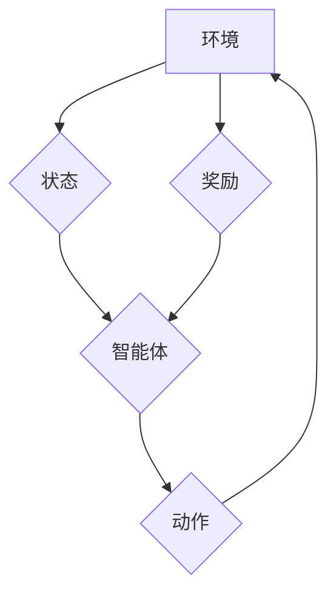

## 深度 Q-learning：在教育领域中的应用

> 关键词：深度学习、Q-learning、强化学习、教育科技、个性化学习、智能辅导系统

## 1. 背景介绍

教育领域一直致力于提升学习效率和效果，为每个学生提供个性化的学习体验。随着人工智能技术的快速发展，深度学习和强化学习等方法开始在教育领域崭露头角，为个性化学习和智能辅导提供了新的可能性。

深度 Q-learning 作为一种强大的强化学习算法，能够学习复杂的决策策略，并根据反馈信息不断优化学习过程。它在游戏领域取得了显著的成功，例如 AlphaGo 和 AlphaZero，证明了其强大的学习能力和应用潜力。

## 2. 核心概念与联系

**2.1 强化学习**

强化学习是一种机器学习范式，其中智能体通过与环境交互，学习最优的策略以最大化累积奖励。

* **智能体 (Agent):** 学习和决策的实体。
* **环境 (Environment):** 智能体所处的外部世界。
* **状态 (State):** 环境的当前情况。
* **动作 (Action):** 智能体在特定状态下可以执行的操作。
* **奖励 (Reward):** 环境对智能体动作的反馈，可以是正向或负向。
* **策略 (Policy):** 智能体在不同状态下选择动作的规则。

**2.2 Q-learning**

Q-learning 是一种基于价值函数的强化学习算法，它学习一个 Q-表，其中 Q(s, a) 表示在状态 s 下执行动作 a 的预期累积奖励。

**2.3 深度 Q-learning**

深度 Q-learning 将深度神经网络用于学习 Q-表，能够处理高维和复杂的状态空间。

**2.4  流程图**



## 3. 核心算法原理 & 具体操作步骤

**3.1 算法原理概述**

深度 Q-learning 的核心思想是通过深度神经网络学习一个 Q-函数，该函数将状态和动作映射到预期累积奖励。

算法通过以下步骤进行训练：

1. 智能体从环境中获取当前状态。
2. 智能体根据当前状态和策略选择一个动作。
3. 智能体执行动作，并从环境中获得下一个状态和奖励。
4. 智能体更新 Q-函数，使其逼近最优策略。

**3.2 算法步骤详解**

1. **初始化 Q-网络:** 使用深度神经网络初始化 Q-函数，并设置学习率和折扣因子。
2. **环境交互:** 智能体与环境交互，获取状态、执行动作、获得奖励和下一个状态。
3. **Q-值更新:** 使用 Bellman 方程更新 Q-网络的参数，使其逼近最优策略。
4. **策略更新:** 根据更新后的 Q-网络，更新策略，选择更有利于获得高奖励的动作。
5. **重复步骤 2-4:** 重复以上步骤，直到 Q-网络收敛或达到预设的训练目标。

**3.3 算法优缺点**

**优点:**

* 可以处理高维和复杂的状态空间。
* 学习能力强，能够学习复杂的决策策略。
* 能够在线学习，不断优化策略。

**缺点:**

* 训练时间长，需要大量的训练数据。
* 容易陷入局部最优解。
* 需要仔细设计奖励函数，否则可能导致学习不稳定。

**3.4 算法应用领域**

深度 Q-learning 在以下领域具有广泛的应用前景：

* **游戏 AI:** 训练游戏 AI 玩家，使其能够学习并战胜人类玩家。
* **机器人控制:** 训练机器人执行复杂的任务，例如导航、抓取和组装。
* **推荐系统:** 建立个性化的推荐系统，推荐用户感兴趣的内容。
* **医疗诊断:** 辅助医生进行疾病诊断，提高诊断准确率。

## 4. 数学模型和公式 & 详细讲解 & 举例说明

**4.1 数学模型构建**

深度 Q-learning 的数学模型基于马尔可夫决策过程 (MDP)。

* **状态空间 S:** 所有可能的系统状态的集合。
* **动作空间 A:** 在每个状态下可执行的动作集合。
* **状态转移概率 P(s', r|s, a):** 在状态 s 下执行动作 a，转移到状态 s' 的概率，以及获得奖励 r 的概率。
* **奖励函数 R(s, a):** 在状态 s 下执行动作 a 获得的奖励。
* **折扣因子 γ:** 权衡未来奖励和当前奖励的比例。

**4.2 公式推导过程**

目标是学习一个 Q-函数 Q(s, a)，它表示在状态 s 下执行动作 a 的预期累积奖励。

Bellman 方程描述了 Q-函数的更新规则：

$$Q(s, a) = R(s, a) + \gamma \max_{a'} Q(s', a')$$

其中，s' 是执行动作 a 后到达的状态，a' 是在状态 s' 下可以执行的动作。

**4.3 案例分析与讲解**

假设一个智能体在玩一个简单的游戏，游戏状态包括玩家的位置和游戏目标的位置。

* 状态空间 S: 包含所有可能的玩家位置和目标位置组合。
* 动作空间 A: 包含向上、向下、向左、向右四个动作。
* 奖励函数 R(s, a): 当玩家到达目标位置时，奖励为 1，否则奖励为 0。

使用深度 Q-learning 算法，智能体可以学习一个 Q-表，其中 Q(s, a) 表示在状态 s 下执行动作 a 的预期累积奖励。

通过不断与环境交互，智能体可以更新 Q-表，最终学习到最优策略，即如何选择动作以最大化累积奖励。

## 5. 项目实践：代码实例和详细解释说明

**5.1 开发环境搭建**

* Python 3.x
* TensorFlow 或 PyTorch
* OpenAI Gym

**5.2 源代码详细实现**

```python
import tensorflow as tf

# 定义 Q-网络
class QNetwork(tf.keras.Model):
    def __init__(self, state_size, action_size):
        super(QNetwork, self).__init__()
        self.dense1 = tf.keras.layers.Dense(64, activation='relu')
        self.dense2 = tf.keras.layers.Dense(32, activation='relu')
        self.output = tf.keras.layers.Dense(action_size)

    def call(self, state):
        x = self.dense1(state)
        x = self.dense2(x)
        return self.output(x)

# 定义训练函数
def train(q_network, state, action, reward, next_state, done):
    with tf.GradientTape() as tape:
        q_values = q_network(state)
        target_q_value = reward + gamma * tf.reduce_max(q_network(next_state), axis=1)
        loss = tf.keras.losses.MeanSquaredError()(target_q_value, q_values[tf.range(tf.shape(state)[0]), action])
    gradients = tape.gradient(loss, q_network.trainable_variables)
    optimizer.apply_gradients(zip(gradients, q_network.trainable_variables))

#... 其他代码...
```

**5.3 代码解读与分析**

* QNetwork 类定义了深度神经网络的结构，包括两个全连接层和一个输出层。
* train 函数定义了训练过程，包括计算损失函数、反向传播和更新网络参数。
* 其他代码负责环境交互、数据预处理和模型评估等。

**5.4 运行结果展示**

训练完成后，可以评估模型的性能，例如在测试环境中计算平均奖励。

## 6. 实际应用场景

**6.1 个性化学习**

深度 Q-learning 可以用于构建个性化学习系统，根据学生的学习进度和能力，推荐合适的学习内容和学习策略。

**6.2 智能辅导系统**

深度 Q-learning 可以用于训练智能辅导系统，帮助学生解决学习问题，提供个性化的指导和反馈。

**6.3 教育游戏**

深度 Q-learning 可以用于开发教育游戏，使学习过程更加有趣和互动。

**6.4 未来应用展望**

随着人工智能技术的不断发展，深度 Q-learning 在教育领域的应用前景更加广阔。

* **更智能的学习助手:** 深度 Q-learning 可以帮助学生更好地理解学习内容，提高学习效率。
* **更个性化的学习体验:** 深度 Q-learning 可以根据学生的学习风格和需求，提供个性化的学习方案。
* **更有效的教育评估:** 深度 Q-learning 可以用于评估学生的学习进度和能力，帮助教师制定更有效的教学策略。

## 7. 工具和资源推荐

**7.1 学习资源推荐**

* **书籍:**
    * Deep Reinforcement Learning Hands-On by Maxim Lapan
    * Reinforcement Learning: An Introduction by Richard S. Sutton and Andrew G. Barto
* **在线课程:**
    * Deep Reinforcement Learning Specialization by DeepLearning.AI
    * Reinforcement Learning by David Silver (University of DeepMind)

**7.2 开发工具推荐**

* **TensorFlow:** https://www.tensorflow.org/
* **PyTorch:** https://pytorch.org/
* **OpenAI Gym:** https://gym.openai.com/

**7.3 相关论文推荐**

* **Playing Atari with Deep Reinforcement Learning** by Mnih et al. (2013)
* **Human-level control through deep reinforcement learning** by Mnih et al. (2015)
* **Mastering the game of Go with deep neural networks and tree search** by Silver et al. (2016)

## 8. 总结：未来发展趋势与挑战

**8.1 研究成果总结**

深度 Q-learning 在教育领域取得了显著的成果，例如个性化学习系统、智能辅导系统和教育游戏。

**8.2 未来发展趋势**

* **更强大的模型:** 研究更强大的深度学习模型，例如 Transformer 和 Graph Neural Networks，以处理更复杂和多样的教育数据。
* **更有效的奖励设计:** 研究更有效的奖励函数设计方法，以更好地引导智能体的学习过程。
* **更安全的应用:** 研究深度 Q-learning 在教育领域的安全性问题，确保其应用不会对学生造成负面影响。

**8.3 面临的挑战**

* **数据获取和标注:** 教育数据通常难以获取和标注，这限制了深度 Q-learning 模型的训练和性能。
* **模型解释性和可解释性:** 深度学习模型的决策过程通常难以解释，这可能导致教育应用中的信任问题。
* **伦理和社会影响:** 深度 Q-learning 在教育领域的应用可能带来伦理和社会影响，例如公平性、隐私性和就业问题。

**8.4 研究展望**

未来，深度 Q-learning 在教育领域的应用将继续发展，并带来更多创新和突破。

## 9. 附录：常见问题与解答

**9.1 如何选择合适的奖励函数？**

奖励函数的设计至关重要，它决定了智能体的学习方向。

需要根据具体的应用场景和目标，设计一个能够有效地引导智能体学习最优策略的奖励函数。

**9.2 如何解决数据获取和标注问题？**

可以采用以下方法解决数据获取和标注问题：

* 利用公开的教育数据集。
* 与教育机构合作，获取真实世界的教育数据。
* 使用数据合成技术生成模拟数据。
* 探索无监督学习和半监督学习方法，减少对标注数据的依赖。

**9.3 如何提高模型的解释性和可解释性？**

可以采用以下方法提高模型的解释性和可解释性：

* 使用可解释的机器学习模型，例如决策树和线性回归。
* 使用模型解释技术，例如 LIME 和 SHAP，解释模型的决策过程。
* 开发可视