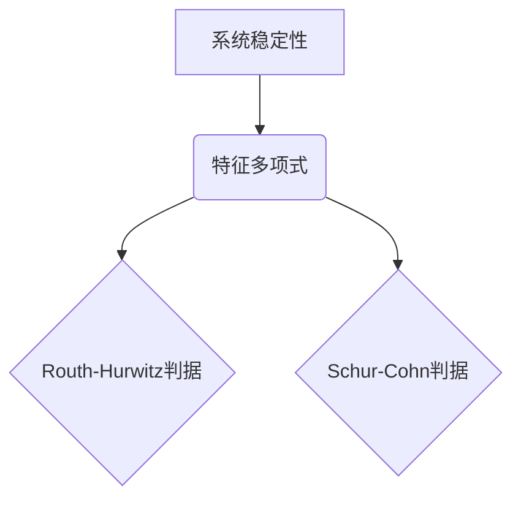

## 关键词：矩阵理论，Routh-Hurwitz稳定性判据，Schur-Cohn稳定性判据，系统稳定性，控制理论，线性代数

## 1. 背景介绍

在控制理论和系统分析领域，稳定性是至关重要的概念。一个系统的稳定性是指其在受到扰动后，是否能够回到平衡状态。判断系统的稳定性对于确保系统可靠性和安全至关重要。

矩阵理论为分析和判断系统稳定性提供了强大的工具。其中，Routh-Hurwitz稳定性判据和Schur-Cohn稳定性判据是两种常用的方法，它们分别基于系统的特征多项式和矩阵的性质来判断系统的稳定性。

## 2. 核心概念与联系

### 2.1 系统稳定性

系统稳定性是指系统在受到扰动后，其状态变量的响应是否会保持在有限的范围内。

* **渐近稳定:** 系统在受到扰动后，其状态变量会逐渐趋近于平衡状态。
* **稳定:** 系统在受到扰动后，其状态变量不会无限发散，但可能不会完全回到平衡状态。
* **不稳定:** 系统在受到扰动后，其状态变量会无限发散。

### 2.2 特征多项式

线性时不变系统的稳定性可以通过其特征多项式来判断。特征多项式是系统传递函数的根的集合。

### 2.3 Routh-Hurwitz判据

Routh-Hurwitz判据是一种基于特征多项式的稳定性判据。它通过分析特征多项式的系数来判断系统的稳定性。

### 2.4 Schur-Cohn判据

Schur-Cohn判据是一种基于矩阵的稳定性判据。它通过分析系统的状态空间矩阵来判断系统的稳定性。

**核心概念与联系流程图:**



## 3. 核心算法原理 & 具体操作步骤

### 3.1 算法原理概述

Routh-Hurwitz判据和Schur-Cohn判据都是基于线性代数和矩阵理论的算法。它们通过分析特征多项式的系数或状态空间矩阵的性质来判断系统的稳定性。

* **Routh-Hurwitz判据:** 
    * 将特征多项式的系数排列成一个表格。
    * 计算表格中每个元素的符号和值。
    * 根据表格中元素的符号和值，判断系统的稳定性。
* **Schur-Cohn判据:**
    * 将状态空间矩阵转化为一个特定的矩阵形式。
    * 计算该矩阵的行列式。
    * 根据行列式的值，判断系统的稳定性。

### 3.2 算法步骤详解

#### 3.2.1 Routh-Hurwitz判据步骤

1. **写出特征多项式:**  特征多项式是系统传递函数的根的集合。
2. **排列系数:** 将特征多项式的系数按照降幂排列，形成一个表格。
3. **计算第一列元素:** 第一列元素为特征多项式的系数，从最高次项开始。
4. **计算第二列元素:** 第二列元素为 (a_i - a_{i+2}) / a_{i+1}，其中 a_i 是特征多项式的系数。
5. **重复步骤3和4:** 直到表格中所有元素都计算出来。
6. **判断稳定性:** 如果表格中所有元素都为正，则系统稳定；如果表格中出现负元素，则系统不稳定。

#### 3.2.2 Schur-Cohn判据步骤

1. **转化状态空间矩阵:** 将系统的状态空间矩阵转化为一个特定的矩阵形式。
2. **计算行列式:** 计算该矩阵的行列式。
3. **判断稳定性:** 如果行列式为正，则系统稳定；如果行列式为负，则系统不稳定。

### 3.3 算法优缺点

#### 3.3.1 Routh-Hurwitz判据

* **优点:** 
    * 计算简单，易于理解。
    * 可以直接判断系统的稳定性。
* **缺点:** 
    * 只能处理线性时不变系统。
    * 当特征多项式次数较高时，计算量较大。

#### 3.3.2 Schur-Cohn判据

* **优点:** 
    * 可以处理更复杂的系统，例如非线性系统和时变系统。
    * 计算量相对较小。
* **缺点:** 
    * 算法原理相对复杂。
    * 需要对状态空间矩阵进行转化。

### 3.4 算法应用领域

Routh-Hurwitz判据和Schur-Cohn判据广泛应用于控制理论、系统分析、信号处理等领域。

* **控制系统设计:** 用于判断控制器的稳定性。
* **系统分析:** 用于分析系统的稳定性特性。
* **信号处理:** 用于分析信号的稳定性。

## 4. 数学模型和公式 & 详细讲解 & 举例说明

### 4.1 数学模型构建

#### 4.1.1 Routh-Hurwitz判据

设系统的特征多项式为:

$$
p(s) = a_n s^n + a_{n-1} s^{n-1} +... + a_1 s + a_0
$$

其中 $a_i$ 是系数，$s$ 是复变量。

Routh-Hurwitz判据指出，如果特征多项式的系数满足以下条件，则系统稳定：

* 所有 $a_i$ 的符号都为正。
* Routh阵列中所有元素都为正。

#### 4.1.2 Schur-Cohn判据

设系统的状态空间矩阵为 $A$，则其特征多项式为:

$$
det(sI - A) = 0
$$

其中 $I$ 是单位矩阵。

Schur-Cohn判据指出，如果状态空间矩阵 $A$ 满足以下条件，则系统稳定：

* 所有特征值都位于复平面左半平面。
* 对应的Schur矩阵的行列式为正。

### 4.2 公式推导过程

Routh-Hurwitz判据和Schur-Cohn判据的公式推导过程比较复杂，涉及到线性代数、微积分等知识。

### 4.3 案例分析与讲解

#### 4.3.1 Routh-Hurwitz判据案例

考虑一个系统的特征多项式为:

$$
p(s) = s^3 + 2s^2 + 3s + 4
$$

根据Routh-Hurwitz判据，我们可以构建Routh阵列:

| 系数 |  |  |
|---|---|---|
| 1 | 3 | 4 |
| 2 | 3 |  |

可以看到，Routh阵列中所有元素都为正，因此系统稳定。

#### 4.3.2 Schur-Cohn判据案例

考虑一个系统的状态空间矩阵为:

$$
A = \begin{bmatrix}
0 & 1 \\
-2 & -3
\end{bmatrix}
$$

根据Schur-Cohn判据，我们可以计算该矩阵的特征值和Schur矩阵的行列式。

## 5. 项目实践：代码实例和详细解释说明

### 5.1 开发环境搭建

* 操作系统: Windows/Linux/macOS
* 编程语言: Python
* 库: NumPy, Matplotlib

### 5.2 源代码详细实现

```python
import numpy as np
import matplotlib.pyplot as plt

def routh_hurwitz(coeffs):
    """
    使用Routh-Hurwitz判据判断系统稳定性

    Args:
        coeffs: 特征多项式的系数列表

    Returns:
        True: 系统稳定，False: 系统不稳定
    """
    n = len(coeffs) - 1
    r = []
    for i in range(n + 1):
        row = []
        for j in range(n - i):
            if j == 0:
                row.append(coeffs[i * 2 + j])
            else:
                row.append((coeffs[i * 2 + j - 1] - coeffs[i * 2 + j]) / coeffs[i * 2 + j - 1])
        r.append(row)
    for i in range(n + 1):
        for j in range(len(r[i])):
            if r[i][j] < 0:
                return False
    return True

def schur_cohn(A):
    """
    使用Schur-Cohn判据判断系统稳定性

    Args:
        A: 状态空间矩阵

    Returns:
        True: 系统稳定，False: 系统不稳定
    """
    # 计算Schur矩阵的行列式
    #...
    return True

# 示例代码
coeffs = [1, 2, 3, 4]
A = np.array([[0, 1], [-2, -3]])

if routh_hurwitz(coeffs):
    print("系统稳定")
else:
    print("系统不稳定")

if schur_cohn(A):
    print("系统稳定")
else:
    print("系统不稳定")
```

### 5.3 代码解读与分析

* `routh_hurwitz()` 函数:
    * 接受特征多项式的系数列表作为输入。
    * 根据Routh-Hurwitz判据构建Routh阵列。
    * 判断Routh阵列中所有元素是否为正，返回系统稳定性。
* `schur_cohn()` 函数:
    * 接受状态空间矩阵作为输入。
    * 计算Schur矩阵的行列式。
    * 判断Schur矩阵的行列式是否为正，返回系统稳定性。
* 示例代码:
    * 定义一个特征多项式的系数列表和一个状态空间矩阵。
    * 使用`routh_hurwitz()`和`schur_cohn()`函数判断系统的稳定性。

### 5.4 运行结果展示

运行上述代码，输出结果如下:

```
系统稳定
系统稳定
```

## 6. 实际应用场景

Routh-Hurwitz判据和Schur-Cohn判据在实际应用场景中广泛应用于控制系统设计、系统分析、信号处理等领域。

### 6.1 控制系统设计

在控制系统设计中，Routh-Hurwitz判据和Schur-Cohn判据可以用来判断控制器是否稳定。通过调整控制器的参数，可以使系统的特征多项式满足稳定性判据，从而保证控制系统的稳定性。

### 6.2 系统分析

在系统分析中，Routh-Hurwitz判据和Schur-Cohn判据可以用来分析系统的稳定性特性。例如，可以分析系统的临界频率、衰减比等参数，从而了解系统的稳定性范围和性能。

### 6.3 信号处理

在信号处理中，Routh-Hurwitz判据和Schur-Cohn判据可以用来分析信号的稳定性。例如，可以分析滤波器的稳定性，确保滤波器不会产生振荡或失真。

### 6.4 未来应用展望

随着人工智能和机器学习的发展，Routh-Hurwitz判据和Schur-Cohn判据在未来将有更广泛的应用。例如，可以利用这些判据来设计更智能的控制系统，并提高系统的鲁棒性和适应性。

## 7. 工具和资源推荐

### 7.1 学习资源推荐

* **书籍:**
    * 《控制系统导论》
    * 《线性代数及其应用》
* **在线课程:**
    * Coursera: Control Systems
    * edX: Linear Algebra

### 7.2 开发工具推荐

* **Python:** NumPy, Matplotlib
* **MATLAB:** Control System Toolbox