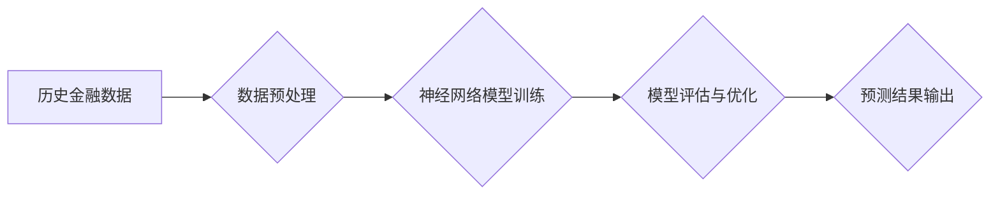

## 神经网络在金融预测中的应用

> 关键词：神经网络、金融预测、时间序列分析、深度学习、强化学习、风险管理、股票预测、信用评分

## 1. 背景介绍

金融市场瞬息万变，预测未来价格走势、评估风险、识别投资机会一直是金融机构和个人投资者面临的重大挑战。传统统计模型在处理复杂、非线性的金融数据时往往表现不足。近年来，深度学习技术，特别是神经网络，凭借其强大的学习能力和非线性建模能力，在金融预测领域展现出巨大的潜力。

神经网络是一种模仿人脑神经网络结构的人工智能算法，能够从海量数据中学习复杂的模式和关系。在金融预测领域，神经网络被广泛应用于股票价格预测、信用评分、欺诈检测、风险管理等多个方面。

## 2. 核心概念与联系

### 2.1 神经网络

神经网络由多个相互连接的节点（神经元）组成，这些节点按照特定的结构和规则进行信息处理。每个神经元接收来自其他神经元的输入信号，并根据权重进行加权求和，然后通过激活函数进行非线性变换，输出到下一个神经元。

神经网络的学习过程是通过调整连接权重来最小化预测误差的过程。通过大量的训练数据，神经网络可以学习到金融数据的复杂模式和关系，从而提高预测精度。

### 2.2 金融预测

金融预测是指利用历史数据和模型来预测未来金融市场变量的变化趋势。常见的金融预测任务包括：

* **股票价格预测:** 预测股票价格的未来走势，帮助投资者做出投资决策。
* **信用评分:** 评估借款人的信用风险，帮助金融机构进行贷款审批和风险管理。
* **欺诈检测:** 识别金融交易中的欺诈行为，保护金融机构和客户的利益。
* **风险管理:** 评估金融机构的风险敞口，帮助制定风险控制策略。

### 2.3  神经网络在金融预测中的应用

神经网络能够有效地处理金融数据的复杂性和非线性关系，因此在金融预测领域具有广泛的应用前景。

**Mermaid 流程图**



## 3. 核心算法原理 & 具体操作步骤

### 3.1 算法原理概述

在金融预测中，常用的神经网络算法包括：

* **多层感知机 (MLP):**  最基本的深度学习网络结构，由多个全连接层组成。
* **卷积神经网络 (CNN):**  擅长处理图像数据，也可以用于提取金融数据的特征，例如股票价格走势图。
* **循环神经网络 (RNN):**  能够处理序列数据，例如股票价格时间序列，并捕捉时间依赖关系。
* **长短期记忆网络 (LSTM):**  一种改进的 RNN，能够更好地处理长序列数据。

### 3.2 算法步骤详解

1. **数据收集和预处理:** 收集历史金融数据，并进行清洗、转换、标准化等预处理操作，以确保数据质量和模型训练的有效性。
2. **模型选择和架构设计:** 根据具体的预测任务和数据特点，选择合适的网络结构和参数设置。
3. **模型训练:** 使用训练数据训练神经网络模型，通过调整连接权重来最小化预测误差。
4. **模型评估和优化:** 使用测试数据评估模型的预测精度，并根据评估结果调整模型参数和结构，以提高模型性能。
5. **预测结果输出:** 将训练好的模型应用于新的数据进行预测，并输出预测结果。

### 3.3 算法优缺点

**优点:**

* **强大的学习能力:** 神经网络能够学习到金融数据的复杂模式和关系，提高预测精度。
* **非线性建模能力:** 神经网络能够处理非线性数据，更好地模拟金融市场的复杂性。
* **自动化特征提取:** 神经网络可以自动学习特征，无需人工特征工程。

**缺点:**

* **数据依赖性:** 神经网络的性能依赖于训练数据的质量和数量。
* **黑盒效应:** 神经网络的决策过程难以解释，难以理解模型的预测结果。
* **计算资源需求:** 训练大型神经网络模型需要大量的计算资源。

### 3.4 算法应用领域

* **股票价格预测:** 预测股票价格的未来走势，帮助投资者做出投资决策。
* **信用评分:** 评估借款人的信用风险，帮助金融机构进行贷款审批和风险管理。
* **欺诈检测:** 识别金融交易中的欺诈行为，保护金融机构和客户的利益。
* **风险管理:** 评估金融机构的风险敞口，帮助制定风险控制策略。
* **量化投资:** 利用神经网络构建自动交易策略，实现量化投资。

## 4. 数学模型和公式 & 详细讲解 & 举例说明

### 4.1 数学模型构建

神经网络的数学模型主要包括以下几个方面：

* **激活函数:** 用于引入非线性，使神经网络能够学习复杂的模式。常见的激活函数包括 sigmoid 函数、ReLU 函数、tanh 函数等。
* **损失函数:** 用于衡量模型预测结果与真实值的差异。常见的损失函数包括均方误差 (MSE)、交叉熵损失 (Cross-Entropy Loss) 等。
* **优化算法:** 用于更新神经网络的连接权重，以最小化损失函数。常见的优化算法包括梯度下降 (Gradient Descent)、Adam 算法、RMSprop 算法等。

### 4.2 公式推导过程

**激活函数:**

$$
f(x) = \frac{1}{1 + e^{-x}}
$$

**损失函数:**

$$
Loss = \frac{1}{n} \sum_{i=1}^{n} (y_i - \hat{y}_i)^2
$$

其中，$y_i$ 是真实值，$\hat{y}_i$ 是预测值，$n$ 是样本数量。

**梯度下降:**

$$
\theta = \theta - \alpha \frac{\partial Loss}{\partial \theta}
$$

其中，$\theta$ 是连接权重，$\alpha$ 是学习率。

### 4.3 案例分析与讲解

假设我们想要预测股票价格，可以使用神经网络模型进行训练。

1. 收集历史股票价格数据，并进行预处理。
2. 选择合适的网络结构，例如多层感知机 (MLP)。
3. 使用训练数据训练模型，并选择合适的损失函数和优化算法。
4. 使用测试数据评估模型的预测精度。
5. 将训练好的模型应用于新的数据进行预测。

## 5. 项目实践：代码实例和详细解释说明

### 5.1 开发环境搭建

* Python 3.x
* TensorFlow 或 PyTorch 深度学习框架
* NumPy 科学计算库
* Pandas 数据处理库
* Matplotlib 数据可视化库

### 5.2 源代码详细实现

```python
import tensorflow as tf

# 定义神经网络模型
model = tf.keras.models.Sequential([
    tf.keras.layers.Dense(64, activation='relu', input_shape=(timesteps, features)),
    tf.keras.layers.Dense(32, activation='relu'),
    tf.keras.layers.Dense(1)
])

# 编译模型
model.compile(loss='mean_squared_error', optimizer='adam')

# 训练模型
model.fit(X_train, y_train, epochs=100, batch_size=32)

# 评估模型
loss, accuracy = model.evaluate(X_test, y_test)
print('Loss:', loss)
print('Accuracy:', accuracy)

# 预测
predictions = model.predict(X_new)
```

### 5.3 代码解读与分析

* **模型定义:** 使用 TensorFlow 的 `keras` API 定义一个多层感知机 (MLP) 模型，包含三个全连接层。
* **激活函数:** 使用 ReLU 激活函数，引入非线性。
* **损失函数:** 使用均方误差 (MSE) 作为损失函数，衡量预测结果与真实值的差异。
* **优化算法:** 使用 Adam 优化算法更新模型参数。
* **模型训练:** 使用训练数据训练模型，设置训练轮数 (epochs) 和批处理大小 (batch_size)。
* **模型评估:** 使用测试数据评估模型的性能，输出损失值和准确率。
* **预测:** 使用训练好的模型预测新的数据。

### 5.4 运行结果展示

运行代码后，会输出模型的训练损失、测试损失、准确率等指标，以及对新数据的预测结果。

## 6. 实际应用场景

### 6.1 股票价格预测

神经网络可以分析历史股票价格数据、市场新闻、经济指标等多种因素，预测股票价格的未来走势。

### 6.2 信用评分

神经网络可以分析借款人的财务记录、信用历史、个人信息等数据，评估借款人的信用风险，帮助金融机构进行贷款审批和风险管理。

### 6.3 欺诈检测

神经网络可以分析金融交易数据，识别异常交易行为，帮助金融机构预防和控制欺诈。

### 6.4 未来应用展望

随着深度学习技术的不断发展，神经网络在金融预测领域的应用将更加广泛和深入。例如：

* **个性化投资建议:** 根据用户的风险偏好、投资目标等信息，提供个性化的投资建议。
* **自动交易策略:** 利用神经网络构建自动交易策略，实现量化投资。
* **金融风险管理:** 更准确地评估金融机构的风险敞口，制定更有效的风险控制策略。

## 7. 工具和资源推荐

### 7.1 学习资源推荐

* **书籍:**
    * Deep Learning by Ian Goodfellow, Yoshua Bengio, and Aaron Courville
    * Hands-On Machine Learning with Scikit-Learn, Keras & TensorFlow by Aurélien Géron
* **在线课程:**
    * TensorFlow 官方教程: https://www.tensorflow.org/tutorials
    * Coursera 深度学习课程: https://www.coursera.org/specializations/deep-learning

### 7.2 开发工具推荐

* **TensorFlow:** https://www.tensorflow.org/
* **PyTorch:** https://pytorch.org/
* **Keras:** https://keras.io/

### 7.3 相关论文推荐

* **Stock Price Prediction Using Deep Learning:** https://arxiv.org/abs/1706.08811
* **Credit Risk Assessment Using Deep Learning:** https://arxiv.org/abs/1803.03034
* **Fraud Detection Using Deep Learning:** https://arxiv.org/abs/1903.04947

## 8. 总结：未来发展趋势与挑战

### 8.1 研究成果总结

神经网络在金融预测领域取得了显著的成果，能够有效地处理复杂金融数据，提高预测精度。

### 8.2 未来发展趋势

* **模型复杂度提升:** 研究更深、更复杂的网络结构，例如 Transformer 网络，以提高预测精度。
* **数据融合:** 将多种数据类型融合在一起，例如文本数据、图像数据、音频数据，以获得更全面的信息。
* **解释性增强:** 研究更可解释的神经网络模型，以便更好地理解模型的决策过程。
* **可解释性增强:** 研究更可解释的神经网络模型，以便更好地理解模型的决策过程。
* **边缘计算:** 将神经网络模型部署到边缘设备，实现实时预测。

### 8.3 面临的挑战

* **数据质量:** 神经网络的性能依赖于训练数据的质量，获取高质量的金融数据仍然是一个挑战。
* **模型解释性:** 神经网络的决策过程难以解释，这限制了其在金融领域的应用。
* **计算资源:** 训练大型神经网络模型需要大量的计算资源，这对于一些小型金融机构来说是一个负担。
* **监管合规:** 神经网络在金融领域的应用需要符合相关监管要求，这需要进一步的规范和研究。

### 8.4 研究展望

未来，神经网络在金融预测领域的应用将更加广泛和深入，为金融机构和个人投资者提供