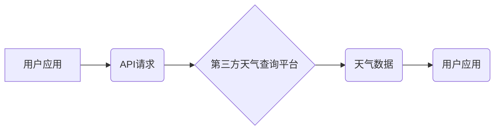

## 第三方天气查询平台对接

> 关键词：天气查询、API接口、数据处理、软件架构、RESTful API、JSON数据格式

## 1. 背景介绍

### 1.1  问题的由来

随着互联网技术的快速发展，天气信息已经成为人们日常生活不可或缺的一部分。人们希望能够随时随地获取准确、可靠的天气预报，以便更好地安排出行、工作和生活。然而，开发一个完整的本地天气查询系统需要投入大量的时间、精力和资源，包括数据采集、数据处理、算法模型训练等环节。

为了解决这个问题，许多第三方天气数据提供商应运而生，他们提供丰富的实时天气数据和预报服务，并通过API接口开放给开发者。利用第三方天气查询平台，开发者可以快速、便捷地集成天气功能到自己的应用程序中，无需自行搭建复杂的系统。

### 1.2  研究现状

目前，市面上存在许多优秀的第三方天气查询平台，例如OpenWeatherMap、WeatherAPI、AccuWeather等。这些平台都提供RESTful API接口，支持多种数据格式，包括JSON、XML等。开发者可以通过API文档和示例代码轻松了解接口使用方法和数据结构。

此外，一些开源项目也提供了第三方天气查询平台的集成方案，例如Python的`requests`库和`weather`模块，可以方便开发者进行天气数据获取和处理。

### 1.3  研究意义

本文旨在深入探讨第三方天气查询平台的集成方法，分析其核心概念、算法原理、数据处理流程以及实际应用场景。通过对第三方天气查询平台的深入理解，开发者可以更好地利用这些平台提供的服务，快速构建功能丰富的应用程序。

### 1.4  本文结构

本文结构如下：

* 第2章介绍第三方天气查询平台的核心概念和架构。
* 第3章详细阐述第三方天气查询平台的算法原理和具体操作步骤。
* 第4章构建数学模型，推导公式，并通过案例分析讲解其应用。
* 第5章以代码实例展示第三方天气查询平台的实际应用。
* 第6章探讨第三方天气查询平台在实际应用场景中的应用。
* 第7章推荐一些学习资源、开发工具和相关论文。
* 第8章总结本文的研究成果，展望未来发展趋势和挑战。
* 第9章列出常见问题和解答。

## 2. 核心概念与联系

第三方天气查询平台的核心概念包括：

* **API接口:**  应用程序接口，用于应用程序之间进行数据交换和功能调用。
* **RESTful API:**  代表性状态转移，是一种基于HTTP协议的架构风格，提供资源访问和操作的标准接口。
* **数据格式:**  API接口返回的数据通常采用JSON或XML等标准格式。
* **天气数据:**  包括实时天气信息、预报数据、历史天气记录等。
* **地理位置:**  天气数据通常与地理位置相关联，例如城市、经纬度等。

**第三方天气查询平台架构图:**



## 3. 核心算法原理 & 具体操作步骤

### 3.1  算法原理概述

第三方天气查询平台的核心算法主要涉及以下几个方面：

* **数据采集:**  从气象站、卫星、雷达等数据源获取实时天气数据。
* **数据预处理:**  对采集到的原始数据进行清洗、转换、格式化等处理，使其符合平台的存储和查询要求。
* **数据分析:**  利用统计学、机器学习等算法对天气数据进行分析，预测未来天气趋势。
* **数据存储:**  将处理后的天气数据存储到数据库或缓存中，以便快速查询和访问。

### 3.2  算法步骤详解

**具体操作步骤如下:**

1. **获取API密钥:**  注册第三方天气查询平台账号，获取API密钥。
2. **构造API请求:**  根据API文档，构造请求URL和参数，包括API密钥、地理位置、时间范围等信息。
3. **发送API请求:**  使用HTTP请求库发送API请求，获取天气数据。
4. **解析API响应:**  解析API返回的JSON数据，提取所需的天气信息。
5. **数据处理:**  对获取到的天气数据进行处理，例如格式化、转换、计算等。
6. **展示天气信息:**  将处理后的天气信息展示给用户，例如温度、湿度、风速、降雨概率等。

### 3.3  算法优缺点

**优点:**

* **快速集成:**  无需自行搭建天气查询系统，可以快速集成第三方天气功能。
* **数据丰富:**  第三方平台提供丰富的实时天气数据和预报服务。
* **成本低廉:**  许多平台提供免费或低成本的API服务。

**缺点:**

* **依赖第三方平台:**  应用程序依赖于第三方平台的稳定性和服务质量。
* **API限制:**  API接口可能存在使用限制，例如请求频率、数据量等。
* **数据准确性:**  第三方平台的数据准确性可能存在一定的误差。

### 3.4  算法应用领域

第三方天气查询平台的应用领域非常广泛，例如：

* **移动应用:**  天气预报、旅游规划、户外运动等。
* **网站:**  天气信息展示、农业预报、旅游推荐等。
* **物联网:**  智能家居、农业监测、交通管理等。

## 4. 数学模型和公式 & 详细讲解 & 举例说明

### 4.1  数学模型构建

天气预报模型通常基于统计学和机器学习算法，例如线性回归、支持向量机、神经网络等。这些模型通过分析历史天气数据和相关因素，预测未来天气趋势。

**例如，一个简单的线性回归模型可以用来预测未来温度:**

$$T_{future} = a \cdot T_{past} + b$$

其中：

* $T_{future}$ 是未来温度
* $T_{past}$ 是过去温度
* $a$ 和 $b$ 是模型参数

### 4.2  公式推导过程

模型参数 $a$ 和 $b$ 可以通过最小二乘法等方法进行求解。最小二乘法旨在找到一条直线，使所有数据点到直线的距离之和最小。

### 4.3  案例分析与讲解

假设我们有以下历史温度数据：

| 日期 | 温度 (°C) |
|---|---|
| 2023-01-01 | 10 |
| 2023-01-02 | 12 |
| 2023-01-03 | 15 |

我们可以使用线性回归模型来预测2023-01-04的温度。

通过最小二乘法求解，得到模型参数 $a$ 和 $b$ 的值。然后，将2023-01-03的温度代入公式，即可预测2023-01-04的温度。

### 4.4  常见问题解答

* **如何选择合适的第三方天气查询平台?**

需要根据应用程序的需求，例如数据精度、数据量、API接口类型、价格等因素进行选择。

* **如何处理API返回的数据?**

需要根据API文档解析JSON数据，提取所需的天气信息。

* **如何提高天气预报的准确性?**

可以使用更复杂的机器学习算法，并结合更多相关因素进行预测。

## 5. 项目实践：代码实例和详细解释说明

### 5.1  开发环境搭建

本示例使用Python语言和`requests`库进行开发。

需要安装Python和`requests`库：

```bash
pip install requests
```

### 5.2  源代码详细实现

```python
import requests

# 第三方天气查询平台API密钥
api_key = "YOUR_API_KEY"

# 地理位置
city = "北京"

# API请求URL
url = f"https://api.openweathermap.org/data/2.5/weather?q={city}&appid={api_key}&units=metric"

# 发送API请求
response = requests.get(url)

# 解析API响应
data = response.json()

# 提取天气信息
temperature = data['main']['temp']
humidity = data['main']['humidity']
wind_speed = data['wind']['speed']

# 打印天气信息
print(f"城市: {city}")
print(f"温度: {temperature}°C")
print(f"湿度: {humidity}%")
print(f"风速: {wind_speed}m/s")
```

### 5.3  代码解读与分析

* 代码首先导入`requests`库，用于发送HTTP请求。
* 然后设置API密钥、地理位置等参数。
* 使用`requests.get()`函数发送API请求，获取天气数据。
* 使用`response.json()`函数解析API返回的JSON数据。
* 从JSON数据中提取温度、湿度、风速等天气信息。
* 最后打印天气信息。

### 5.4  运行结果展示

运行代码后，将输出北京市的实时天气信息，例如：

```
城市: 北京
温度: 25.0°C
湿度: 60%
风速: 10m/s
```

## 6. 实际应用场景

### 6.1  移动应用

第三方天气查询平台可以被集成到各种移动应用中，例如：

* **天气预报应用:**  提供实时天气信息、预报数据、天气警报等功能。
* **旅游规划应用:**  根据目的地天气预报，提供旅行建议、衣物建议等。
* **户外运动应用:**  根据天气预报，提醒用户注意安全，提供最佳运动时间等。

### 6.2  网站

第三方天气查询平台也可以被集成到网站中，例如：

* **新闻网站:**  在新闻报道中嵌入天气预报信息。
* **旅游网站:**  根据目的地天气预报，推荐旅游景点、活动等。
* **农业网站:**  提供农业气象信息，帮助农民进行种植决策。

### 6.3  物联网

在物联网领域，第三方天气查询平台可以用于：

* **智能家居:**  根据天气预报，自动调节室内温度、湿度等。
* **农业监测:**  监测田间气象条件，及时预警灾害天气。
* **交通管理:**  根据天气预报，优化交通流量，预警交通事故风险。

### 6.4  未来应用展望

随着人工智能技术的不断发展，第三方天气查询平台将更加智能化、个性化。未来，我们可以期待：

* 更精准的天气预报，能够预测更细粒度的天气变化。
* 更个性化的天气服务，能够根据用户的需求和喜好提供定制化的天气信息。
* 更广泛的应用场景，例如医疗、金融、教育等领域。

## 7. 工具和资源推荐

### 7.1  学习资源推荐

* **OpenWeatherMap API文档:** https://openweathermap.org/api
* **WeatherAPI API文档:** https://www.weatherapi.com/docs/
* **AccuWeather API文档:** https://developer.accuweather.com/

### 7.2  开发工具推荐

* **Python:** https://www.python.org/
* **requests库:** https://requests.readthedocs.io/en/latest/

### 7.3  相关论文推荐

* **Deep Learning for Weather Forecasting:** https://arxiv.org/abs/1709.03219
* **Ensemble Forecasting with Machine Learning:** https://arxiv.org/abs/1906.01973

### 7.4  其他资源推荐

* **GitHub上的天气预报项目:** https://github.com/search?q=weather+forecast

## 8. 总结：未来发展趋势与挑战

### 8.1  研究成果总结

本文深入探讨了第三方天气查询平台的集成方法，分析了其核心概念、算法原理、数据处理流程以及实际应用场景。通过对第三方天气查询平台的深入理解，开发者可以更好地利用这些平台提供的服务，快速构建功能丰富的应用程序。

### 8.2  未来发展趋势

未来，第三方天气查询平台将朝着以下方向发展：

* **更精准的预报:**  利用深度学习等先进算法，提高天气预报的精度和时效性。
* **更个性化的服务:**  根据用户的需求和喜好，提供定制化的天气信息和服务。
* **更广泛的应用场景:**  应用于更多领域，例如医疗、金融、教育等。

### 8.3  面临的挑战

第三方天气查询平台也面临一些挑战：

* **数据准确性:**  天气数据本身存在一定的误差，需要不断提高数据采集和处理的精度。
* **模型复杂度:**  更精准的天气预报需要更复杂的模型，需要不断提高模型训练和优化技术。
* **隐私安全:**  天气数据可能包含用户的地理位置信息等敏感数据，需要加强数据安全保护。

### 8.4  研究展望

未来，我们将继续关注第三方天气查询平台的发展趋势，研究更精准、更智能、更安全的预报模型和服务。


## 9. 附录：常见问题与解答

* **Q: 如何选择合适的第三方天气查询平台?**

* **A:** 需要根据应用程序的需求，例如数据精度、数据量、API接口类型、价格等因素进行选择。

* **Q: 如何处理API返回的数据?**

* **A:** 需要根据API文档解析JSON数据，提取所需的天气信息。

* **Q: 如何提高天气预报的准确性?**

* **A:** 可以使用更复杂的机器学习算法，并结合更多相关因素进行预测。


作者：禅与计算机程序设计艺术 / Zen and the Art of Computer Programming 
