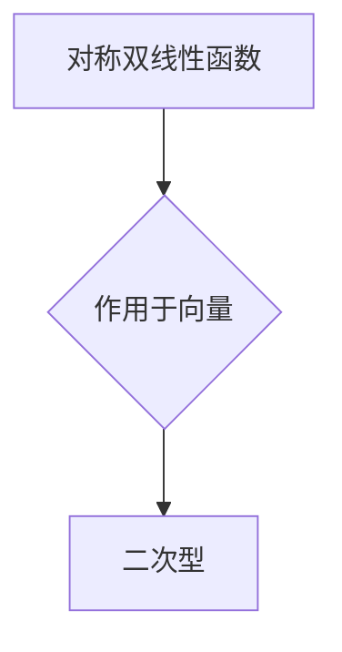

## 线性代数导引：对称双线性函数与二次型

> 关键词：线性代数、对称双线性函数、二次型、矩阵、特征值、特征向量、应用场景

## 1. 背景介绍

在现代数学和计算机科学中，线性代数扮演着至关重要的角色。它为我们提供了处理向量、矩阵和线性变换的强大工具，并广泛应用于机器学习、数据科学、图像处理、信号处理等领域。其中，对称双线性函数和二次型作为线性代数的重要概念，在理解和解决许多实际问题时具有重要意义。

对称双线性函数是定义在两个向量上的函数，满足一定的对称性和线性性质。二次型则是通过对称双线性函数作用于向量而得到的标量函数。它们在物理学、工程学、经济学等领域都有广泛的应用，例如，在物理学中，二次型可以用来描述能量、势能等物理量；在工程学中，二次型可以用来描述结构的稳定性、材料的性能等。

## 2. 核心概念与联系

### 2.1 对称双线性函数

对称双线性函数是一种特殊的函数，它接受两个向量作为输入，并返回一个标量作为输出。其定义如下：

**定义：** 设 $V$ 是一个向量空间，则 $B: V \times V \rightarrow F$ 称为一个对称双线性函数，如果满足以下条件：

1. **双线性性：** 对任意 $u, v, w \in V$ 和 $a, b \in F$，有：
    * $B(au + bv, w) = aB(u, w) + bB(v, w)$
    * $B(u, av + bw) = aB(u, v) + bB(u, w)$

2. **对称性：** 对任意 $u, v \in V$，有：
    * $B(u, v) = B(v, u)$

### 2.2 二次型

二次型是通过对称双线性函数作用于向量而得到的标量函数。其定义如下：

**定义：** 设 $V$ 是一个向量空间，$B: V \times V \rightarrow F$ 是一个对称双线性函数，则对于任意 $v \in V$，$Q(v) = B(v, v)$ 称为一个二次型。

### 2.3 核心概念联系

对称双线性函数和二次型之间存在着密切的联系。二次型可以看作是对称双线性函数作用于向量的结果。

**Mermaid 流程图：**



## 3. 核心算法原理 & 具体操作步骤

### 3.1 算法原理概述

在实际应用中，我们经常需要对对称双线性函数和二次型进行计算和分析。为此，我们开发了一些高效的算法，例如：

* **特征值和特征向量算法：** 用于求解对称双线性函数的特征值和特征向量，这些值可以帮助我们理解和分析二次型的性质。
* **正交变换算法：** 用于将二次型转化为标准形式，从而更容易进行分析和计算。
* **数值计算算法：** 用于对对称双线性函数和二次型进行数值计算，例如求解二次型的最小值或最大值。

### 3.2 算法步骤详解

以下是一些常见算法的具体步骤：

* **特征值和特征向量算法：**

1.  将对称双线性函数表示为矩阵形式。
2.  求解矩阵的特征值和特征向量。
3.  将特征值和特征向量与对称双线性函数联系起来。

* **正交变换算法：**

1.  将二次型表示为矩阵形式。
2.  进行正交变换，将矩阵转化为标准形式。
3.  根据标准形式分析二次型的性质。

* **数值计算算法：**

1.  根据具体的计算需求选择合适的数值计算方法。
2.  利用计算机进行数值计算，得到结果。

### 3.3 算法优缺点

不同的算法具有不同的优缺点，需要根据实际应用场景选择合适的算法。

* **特征值和特征向量算法：**

    * **优点：** 可以提供对二次型深刻的理解，例如确定二次型的正定性、负定性等。
    * **缺点：** 计算复杂度较高，对于大型矩阵可能需要耗费大量时间。

* **正交变换算法：**

    * **优点：** 可以将二次型转化为标准形式，方便分析和计算。
    * **缺点：** 需要进行复杂的矩阵变换，计算过程可能比较繁琐。

* **数值计算算法：**

    * **优点：** 计算速度快，适用于大型数据处理。
    * **缺点：** 只能得到近似结果，精度有限。

### 3.4 算法应用领域

对称双线性函数和二次型在许多领域都有广泛的应用，例如：

* **机器学习：** 在支持向量机、主成分分析等算法中，二次型被用来度量数据之间的相似性或距离。
* **数据科学：** 在数据分析和可视化中，二次型可以用来描述数据的分布特征。
* **图像处理：** 在图像压缩、图像恢复等领域，二次型被用来描述图像的纹理和结构。
* **信号处理：** 在信号分析和滤波中，二次型可以用来描述信号的能量和频率特性。

## 4. 数学模型和公式 & 详细讲解 & 举例说明

### 4.1 数学模型构建

**对称双线性函数：**

设 $V$ 是一个 $n$ 维向量空间，则对称双线性函数 $B: V \times V \rightarrow F$ 可以表示为：

$$B(x, y) = x^T A y$$

其中，$x, y \in V$ 是两个向量，$A$ 是一个 $n \times n$ 的对称矩阵。

**二次型：**

二次型 $Q: V \rightarrow F$ 可以表示为：

$$Q(x) = x^T A x$$

其中，$x \in V$ 是一个向量，$A$ 是一个 $n \times n$ 的对称矩阵。

### 4.2 公式推导过程

**对称双线性函数的双线性性：**

$$B(au + bv, w) = (au + bv)^T A w = a(u^T A w) + b(v^T A w) = aB(u, w) + bB(v, w)$$

$$B(u, av + bw) = u^T A (av + bw) = a(u^T A v) + b(u^T A w) = aB(u, v) + bB(u, w)$$

**对称双线性函数的对称性：**

$$B(u, v) = u^T A v = (v^T A u)^T = v^T A u = B(v, u)$$

### 4.3 案例分析与讲解

**例子：**

设 $V = R^2$，$B(x, y) = 2x_1y_1 + 3x_1y_2 + 3x_2y_1 + 4x_2y_2$，其中 $x = (x_1, x_2)$，$y = (y_1, y_2)$。

我们可以将 $B$ 表示为矩阵形式：

$$B(x, y) = \begin{pmatrix} x_1 \\ x_2 \end{pmatrix}^T \begin{pmatrix} 2 & 3 \\ 3 & 4 \end{pmatrix} \begin{pmatrix} y_1 \\ y_2 \end{pmatrix}$$

对应的二次型为：

$$Q(x) = x^T A x = \begin{pmatrix} x_1 \\ x_2 \end{pmatrix}^T \begin{pmatrix} 2 & 3 \\ 3 & 4 \end{pmatrix} \begin{pmatrix} x_1 \\ x_2 \end{pmatrix}$$

## 5. 项目实践：代码实例和详细解释说明

### 5.1 开发环境搭建

本项目使用 Python 语言进行开发，所需的库包括 NumPy 和 Matplotlib。

```
pip install numpy matplotlib
```

### 5.2 源代码详细实现

```python
import numpy as np
import matplotlib.pyplot as plt

# 定义对称双线性函数
def bilinear_function(x, y, A):
  return np.dot(x.T, np.dot(A, y))

# 定义二次型
def quadratic_form(x, A):
  return np.dot(x.T, np.dot(A, x))

# 创建对称矩阵
A = np.array([[2, 3], [3, 4]])

# 定义两个向量
x = np.array([1, 2])
y = np.array([3, 4])

# 计算对称双线性函数和二次型
result_bilinear = bilinear_function(x, y, A)
result_quadratic = quadratic_form(x, A)

# 打印结果
print("对称双线性函数结果:", result_bilinear)
print("二次型结果:", result_quadratic)

# 可视化二次型
x_range = np.linspace(-5, 5, 100)
y_range = np.linspace(-5, 5, 100)
X, Y = np.meshgrid(x_range, y_range)
Z = quadratic_form(np.array([X, Y]).T, A)
plt.contourf(X, Y, Z, cmap='viridis')
plt.colorbar()
plt.title("二次型可视化")
plt.show()
```

### 5.3 代码解读与分析

*   代码首先定义了对称双线性函数和二次型的计算函数。
*   然后创建了一个对称矩阵 $A$，并定义了两个向量 $x$ 和 $y$。
*   接着调用函数计算对称双线性函数和二次型的结果，并打印输出。
*   最后使用 Matplotlib 库对二次型进行可视化，绘制出二次型的等高线图。

### 5.4 运行结果展示

运行代码后，会输出对称双线性函数和二次型的结果，并显示出二次型的等高线图。

## 6. 实际应用场景

### 6.1 机器学习

在机器学习中，对称双线性函数和二次型被广泛应用于以下场景：

*   **支持向量机 (SVM)：** SVM 使用二次型来度量数据点之间的距离，从而找到最佳的分隔超平面。
*   **主成分分析 (PCA)：** PCA 使用二次型来计算数据点的投影方向，从而降维数据。

### 6.2 数据科学

在数据科学中，对称双线性函数和二次型可以用于以下场景：

*   **数据分析：** 使用二次型来描述数据的分布特征，例如，协方差矩阵可以看作是数据之间的对称双线性函数。
*   **数据可视化：** 使用二次型来生成数据可视化图形，例如，散点图上的数据点可以表示为二次型。

### 6.3 图像处理

在图像处理中，对称双线性函数和二次型可以用于以下场景：

*   **图像压缩：** 使用二次型来表示图像的纹理和结构，从而进行图像压缩。
*   **图像恢复：** 使用二次型来恢复图像的细节信息，例如，去噪和去模糊。

### 6.4 信号处理

在信号处理中，对称双线性函数和二次型可以用于以下场景：

*   **信号分析：** 使用二次型来描述信号的能量和频率特性。
*   **信号滤波：** 使用二次型来设计信号滤波器，例如，低通滤波器和高通滤波器。

### 6.5