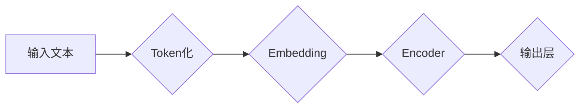

## 自监督学习与BERT的训练

> 关键词：自监督学习、BERT、自然语言处理、Transformer、预训练、微调、语言模型

## 1. 背景介绍

自然语言处理 (NLP) 领域近年来取得了飞速发展，深度学习模型在文本理解、生成和翻译等任务上取得了显著成果。然而，训练高质量的深度学习模型需要大量的标注数据，而标注数据往往昂贵且难以获取。为了解决这个问题，自监督学习 (Self-Supervised Learning) 应运而生。

自监督学习是一种无需人工标注数据就能训练深度学习模型的技术。它通过设计特殊的预训练任务，利用文本本身的结构和语义信息，学习到通用的语言表示。这些预训练模型可以进一步微调到特定下游任务，从而在有限标注数据下也能取得良好的性能。

BERT (Bidirectional Encoder Representations from Transformers) 是基于自监督学习的预训练语言模型，由 Google AI 团队于 2018 年提出。BERT 在多个 NLP 任务上取得了state-of-the-art 的成绩，并对 NLP 领域产生了深远影响。

## 2. 核心概念与联系

### 2.1 自监督学习

自监督学习的核心思想是通过设计与目标任务相关的预训练任务，利用未标记数据训练模型。这些任务通常利用文本本身的结构和语义信息，例如：

* ** masked language modeling (MLM) **：随机遮盖文本中的某些词，训练模型预测被遮盖词。
* ** next sentence prediction (NSP) **：给定两个句子，训练模型预测它们是否相邻。

通过这些预训练任务，模型学习到丰富的语言表示，可以用于下游任务。

### 2.2 Transformer

Transformer 是 BERT 模型的基础架构。它是一种基于注意力机制的序列模型，能够有效捕捉文本中的长距离依赖关系。

Transformer 的核心结构包括：

* **Encoder**: 用于编码输入序列，将文本转换为隐藏表示。
* **Decoder**: 用于解码隐藏表示，生成输出序列。
* **注意力机制**: 用于计算每个词与其他词之间的相关性，捕捉文本中的语义关系。

### 2.3 BERT

BERT 是基于 Transformer 架构的预训练语言模型。它采用 MLM 和 NSP 两个预训练任务，训练了一个双向编码器。

BERT 的特点：

* **双向编码**: BERT 能够同时考虑上下文前后信息，捕捉更丰富的语义信息。
* **预训练**: BERT 在大量文本数据上进行预训练，学习到通用的语言表示。
* **微调**: BERT 可以根据下游任务进行微调，提高模型性能。

**BERT 模型架构流程图**

## 3. 核心算法原理 & 具体操作步骤

### 3.1 算法原理概述

BERT 的核心算法原理是基于 Transformer 架构，并采用 MLM 和 NSP 两个预训练任务。

* **MLM**: 随机遮盖输入文本中的某些词，训练模型预测被遮盖词。
* **NSP**: 给定两个句子，训练模型预测它们是否相邻。

通过这两个任务，BERT 学习到丰富的语言表示，能够捕捉文本中的语义信息和上下文关系。

### 3.2 算法步骤详解

BERT 的训练过程可以分为以下几个步骤：

1. **数据预处理**: 将文本数据进行 token 化，并将每个 token 映射到词向量。
2. **模型初始化**: 初始化 BERT 模型的参数。
3. **预训练**: 使用 MLM 和 NSP 任务对 BERT 模型进行预训练。
4. **微调**: 将预训练好的 BERT 模型微调到特定下游任务。

### 3.3 算法优缺点

**优点**:

* **性能优越**: BERT 在多个 NLP 任务上取得了 state-of-the-art 的成绩。
* **通用性强**: 预训练模型可以应用于多种下游任务。
* **数据效率**: 在有限标注数据下也能取得良好的性能。

**缺点**:

* **计算资源需求高**: BERT 模型参数量大，训练需要大量的计算资源。
* **训练时间长**: BERT 的训练时间相对较长。

### 3.4 算法应用领域

BERT 的应用领域非常广泛，包括：

* **文本分类**: 识别文本的类别，例如情感分析、主题分类等。
* **问答系统**: 回答用户提出的问题。
* **机器翻译**: 将文本从一种语言翻译成另一种语言。
* **文本摘要**: 生成文本的简短摘要。
* **对话系统**: 与用户进行自然语言对话。

## 4. 数学模型和公式 & 详细讲解 & 举例说明

### 4.1 数学模型构建

BERT 模型的数学模型构建基于 Transformer 架构，主要包括以下几个部分：

* **词嵌入**: 将每个词映射到一个低维向量空间。
* **注意力机制**: 计算每个词与其他词之间的相关性。
* **多头注意力**: 使用多个注意力头，捕捉不同类型的语义信息。
* **前馈神经网络**: 对每个词的隐藏表示进行非线性变换。

### 4.2 公式推导过程

BERT 模型的训练目标是最小化 MLM 和 NSP 任务的损失函数。

* **MLM 损失函数**:

$$
L_{MLM} = -\sum_{i \in \text{masked words}} \log p(w_i | context)
$$

其中，$w_i$ 是被遮盖的词，$context$ 是该词的上下文信息，$p(w_i | context)$ 是模型预测该词的概率。

* **NSP 损失函数**:

$$
L_{NSP} = -\log p(next_sentence | context)
$$

其中，$next_sentence$ 是下一个句子，$context$ 是两个句子的上下文信息，$p(next_sentence | context)$ 是模型预测两个句子是否相邻的概率。

### 4.3 案例分析与讲解

假设我们有一个句子 "The cat sat on the mat"，其中 "cat" 被遮盖。BERT 模型需要预测 "cat" 的词向量。

通过 MLM 任务，BERT 会学习到 "cat" 在句子中的语义信息，例如它是一个动物，并且在 "sat" 和 "mat" 之间。

最终，BERT 会输出一个词向量，代表 "cat" 的含义。

## 5. 项目实践：代码实例和详细解释说明

### 5.1 开发环境搭建

BERT 模型的开发环境需要 Python、PyTorch 或 TensorFlow 等深度学习框架。

### 5.2 源代码详细实现

BERT 的源代码可以从 Hugging Face 等平台下载。

### 5.3 代码解读与分析

BERT 的代码主要包括以下几个部分：

* **模型定义**: 定义 BERT 模型的架构。
* **数据加载**: 加载预训练数据或下游任务数据。
* **训练**: 使用 MLM 和 NSP 任务训练 BERT 模型。
* **微调**: 将预训练好的 BERT 模型微调到特定下游任务。

### 5.4 运行结果展示

BERT 模型的训练结果可以评估其在 MLM 和 NSP 任务上的性能。

## 6. 实际应用场景

BERT 在多个实际应用场景中取得了成功，例如：

* **搜索引擎**: BERT 可以用于理解用户搜索意图，提高搜索结果的准确性。
* **聊天机器人**: BERT 可以用于训练更智能的聊天机器人，能够进行更自然流畅的对话。
* **文本生成**: BERT 可以用于生成高质量的文本，例如新闻报道、故事等。

### 6.4 未来应用展望

BERT 的未来应用前景广阔，例如：

* **多模态理解**: 将 BERT 与其他模态数据（例如图像、音频）结合，实现多模态理解。
* **跨语言理解**: 将 BERT 应用于跨语言理解任务，例如机器翻译、跨语言信息检索。
* **个性化推荐**: 使用 BERT 理解用户的兴趣偏好，提供个性化推荐。

## 7. 工具和资源推荐

### 7.1 学习资源推荐

* **BERT 官方论文**: https://arxiv.org/abs/1810.04805
* **Hugging Face BERT 模型**: https://huggingface.co/bert-base-uncased
* **TensorFlow BERT 实现**: https://github.com/tensorflow/models/tree/master/official/nlp/bert

### 7.2 开发工具推荐

* **PyTorch**: https://pytorch.org/
* **TensorFlow**: https://www.tensorflow.org/

### 7.3 相关论文推荐

* **XLNet**: https://arxiv.org/abs/1906.08237
* **RoBERTa**: https://arxiv.org/abs/1907.11692
* **GPT-3**: https://openai.com/blog/gpt-3/

## 8. 总结：未来发展趋势与挑战

### 8.1 研究成果总结

自监督学习和 BERT 模型的出现，为 NLP 领域带来了革命性的变化。

自监督学习能够有效利用未标记数据，提高模型的训练效率和性能。BERT 模型的双向编码和预训练能力，使其在多个 NLP 任务上取得了 state-of-the-art 的成绩。

### 8.2 未来发展趋势

未来，自监督学习和 BERT 模型的发展趋势包括：

* **模型规模更大**: 预训练模型的参数量将继续增加，从而提高模型的性能。
* **多模态理解**: 将 BERT 与其他模态数据结合，实现多模态理解。
* **更有效的训练方法**: 研究更有效的自监督学习训练方法，提高模型的训练效率和性能。

### 8.3 面临的挑战

自监督学习和 BERT 模型也面临一些挑战：

* **计算资源需求高**: 大型预训练模型的训练需要大量的计算资源。
* **数据偏差**: 预训练数据可能存在偏差，导致模型在某些任务上表现不佳。
* **可解释性**: BERT 模型的内部机制比较复杂，难以解释其决策过程。

### 8.4 研究展望

未来，研究人员将继续探索自监督学习和 BERT 模型的潜力，解决其面临的挑战，并将其应用于更多领域。

## 9. 附录：常见问题与解答

### 9.1 BERT 和 ELMo 的区别

BERT 和 ELMo 都是基于 Transformer 架构的语言模型，但它们在训练目标和模型结构上有所不同。

* **BERT**: 使用 MLM 和 NSP 任务进行预训练，并采用双向编码器。
* **ELMo**: 使用单向编码器，并通过上下文信息生成词向量。

### 9.2 如何微调 BERT 模型

微调 BERT 模型需要以下步骤：

1. 下载预训练好的 BERT 模型。
2. 将下游任务数据进行预处理。
3. 将 BERT 模型的输出层替换为下游任务所需的输出层。
4. 使用下游任务数据对 BERT 模型进行微调。

### 9.3 BERT 模型的应用场景

BERT 的应用场景非常广泛，包括：

* 文本分类
* 问答系统
* 机器翻译
* 文本摘要
* 对话系统

作者：禅与计算机程序设计艺术 / Zen and the Art of Computer Programming

