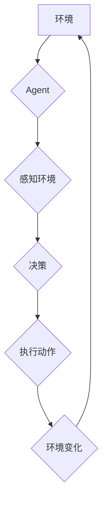

## 关键词：

Agent, 规划, 决策, 搜索算法, 状态空间, 目标, 策略,  人工智能,  知识表示

## 1. 背景介绍

在人工智能领域，规划问题一直是研究的热点之一。规划是指一个智能体（Agent）为了实现某个目标，在已知的环境和规则下，制定一系列行动步骤的过程。 

想象一下，一个机器人需要从起点走到终点，它需要根据周围环境、自身能力以及目标位置，规划出最优的路径。这就是规划的本质。

规划问题广泛存在于各个领域，例如：

* **机器人学:** 机器人导航、任务规划、运动控制等。
* **游戏人工智能:** 游戏角色的行动决策、策略制定等。
* **自动驾驶:** 车辆路径规划、避障决策等。
* **医疗保健:** 治疗方案规划、药物组合推荐等。
* **物流管理:** 物流路线优化、仓储调度等。

## 2. 核心概念与联系

### 2.1  Agent

Agent 是一个能够感知环境、做出决策并执行行动的智能体。它可以是物理实体，也可以是软件程序。

### 2.2  状态空间

状态空间是指一个系统所有可能的状态的集合。在规划问题中，状态空间通常表示环境的当前状态，包括所有相关变量和属性。

### 2.3  动作

动作是指Agent可以执行的改变环境状态的操作。

### 2.4  目标

目标是指Agent想要达成的最终状态或结果。

### 2.5  策略

策略是指Agent在不同状态下选择动作的规则。

**Mermaid 流程图**



## 3. 核心算法原理 & 具体操作步骤

### 3.1  算法原理概述

规划算法的核心是搜索状态空间，找到从初始状态到目标状态的一条可行路径。常见的规划算法包括：

* **基于规则的规划:** 使用一系列预先定义的规则来指导决策。
* **基于搜索的规划:** 使用搜索算法在状态空间中搜索可行路径。

### 3.2  算法步骤详解

**基于搜索的规划算法步骤:**

1. **定义状态空间:** 确定所有可能的系统状态。
2. **定义动作:** 确定Agent可以执行的动作。
3. **设置初始状态和目标状态:** 指定规划的起点和终点。
4. **选择搜索算法:** 根据问题特点选择合适的搜索算法，例如广度优先搜索、深度优先搜索、A*搜索等。
5. **执行搜索:** 在状态空间中搜索从初始状态到目标状态的可行路径。
6. **输出规划方案:** 返回从初始状态到目标状态的一条可行路径。

### 3.3  算法优缺点

**基于规则的规划:**

* **优点:** 规则易于理解和维护，执行效率高。
* **缺点:** 规则难以覆盖所有情况，缺乏灵活性。

**基于搜索的规划:**

* **优点:** 可以解决更复杂的问题，具有更高的灵活性。
* **缺点:** 搜索空间可能非常大，执行效率较低。

### 3.4  算法应用领域

* **基于规则的规划:** 适用于规则简单、环境相对稳定的领域，例如游戏AI、机器人控制等。
* **基于搜索的规划:** 适用于规则复杂、环境动态变化的领域，例如自动驾驶、医疗诊断等。

## 4. 数学模型和公式 & 详细讲解 & 举例说明

### 4.1  数学模型构建

规划问题可以抽象为一个状态空间搜索问题。

* 状态空间：S = {s1, s2,..., sn}
* 初始状态：s0
* 目标状态：sg
* 动作集：A(s)

其中，A(s) 表示在状态 s 下可执行的动作集合。

### 4.2  公式推导过程

**状态转移函数:**

$$s' = s(a)$$

其中，s' 是执行动作 a 在状态 s 下到达的新状态。

**成本函数:**

$$c(s, a, s')$$

其中，c(s, a, s') 表示从状态 s 执行动作 a 到状态 s' 的成本。

**目标函数:**

$$min_{π} Σ_{t=0}^{T} c(s_t, a_t, s_{t+1})$$

其中，π 是从初始状态到目标状态的一条路径，T 是路径长度。

### 4.3  案例分析与讲解

**举例说明:**

一个机器人需要从起点 A 到达终点 B，中间经过状态 C 和 D。

* 状态空间：S = {A, B, C, D}
* 初始状态：s0 = A
* 目标状态：sg = B
* 动作集：A(A) = {移动到 C}, A(C) = {移动到 D}, A(D) = {移动到 B}

**状态转移函数:**

* A(A) = {移动到 C} => s' = C
* A(C) = {移动到 D} => s' = D
* A(D) = {移动到 B} => s' = B

**成本函数:**

* c(A, 移动到 C, C) = 1
* c(C, 移动到 D, D) = 2
* c(D, 移动到 B, B) = 3

**目标函数:**

找到从 A 到 B 的路径，使得总成本最小。

## 5. 项目实践：代码实例和详细解释说明

### 5.1  开发环境搭建

* Python 3.x
* ROS (Robot Operating System)

### 5.2  源代码详细实现

```python
import rospy
from move_base_msgs.msg import MoveBaseAction, MoveBaseGoal

class Planner:
    def __init__(self):
        rospy.init_node('planner')
        self.move_base = rospy.ServiceProxy('/move_base', MoveBaseAction)

    def plan_to_goal(self, goal_pose):
        goal = MoveBaseGoal()
        goal.target_pose.header.frame_id ='map'
        goal.target_pose.header.stamp = rospy.Time.now()
        goal.target_pose.pose.position.x = goal_pose.x
        goal.target_pose.pose.position.y = goal_pose.y
        goal.target_pose.pose.orientation.w = 1.0

        result = self.move_base(goal)
        return result.status

# 使用示例
planner = Planner()
goal_pose = {'x': 2.0, 'y': 3.0}
status = planner.plan_to_goal(goal_pose)
if status == 1:
    print('规划成功!')
else:
    print('规划失败!')
```

### 5.3  代码解读与分析

* 该代码定义了一个 Planner 类，用于规划机器人运动路径。
* `__init__` 方法初始化 ROS 节点并获取 move_base 服务代理。
* `plan_to_goal` 方法接受目标位置作为输入，生成 MoveBaseGoal 消息并发送到 move_base 服务，获取规划结果。
* 使用示例代码演示了如何使用 Planner 类规划机器人到指定位置的路径。

### 5.4  运行结果展示

* 如果规划成功，机器人将按照规划好的路径移动到目标位置。
* 如果规划失败，则会打印 "规划失败!" 的信息。

## 6. 实际应用场景

### 6.1  机器人导航

规划算法可以用于机器人自主导航，例如在未知环境中寻找目标、避开障碍物等。

### 6.2  游戏AI

在游戏中，规划算法可以用于控制游戏角色的行动，例如制定攻击策略、躲避敌人的攻击等。

### 6.3  自动驾驶

自动驾驶系统需要规划车辆的路径，避开障碍物，并与其他车辆安全行驶。

### 6.4  未来应用展望

随着人工智能技术的不断发展，规划算法将在更多领域得到应用，例如：

* **医疗保健:** 规划手术方案、制定个性化治疗方案等。
* **金融:** 规划投资策略、识别金融风险等。
* **教育:** 规划个性化学习路径、辅助学生学习等。

## 7. 工具和资源推荐

### 7.1  学习资源推荐

* **书籍:**
    * Artificial Intelligence: A Modern Approach by Stuart Russell and Peter Norvig
    * Planning: Theory and Practice by Declan McCauley
* **在线课程:**
    * Coursera: Artificial Intelligence
    * edX: Introduction to Artificial Intelligence

### 7.2  开发工具推荐

* **ROS (Robot Operating System):** 用于机器人开发的开源平台。
* **Python:** 广泛应用于人工智能开发的编程语言。
* **OpenAI Gym:** 用于强化学习的开源环境。

### 7.3  相关论文推荐

* **Classical Planning:**
    * "Planning with PDDL" by Henry Kautz and Bart Selman
* **Probabilistic Planning:**
    * "Probabilistic Planning" by Daniel Weld
* **Reinforcement Learning:**
    * "Deep Reinforcement Learning" by Volodymyr Mnih et al.

## 8. 总结：未来发展趋势与挑战

### 8.1  研究成果总结

规划算法在人工智能领域取得了显著进展，从传统的基于规则的规划到更灵活的基于搜索的规划，再到结合机器学习的强化学习规划，算法的效率和能力不断提升。

### 8.2  未来发展趋势

* **更强大的学习能力:** 将机器学习技术融入规划算法，使规划系统能够从数据中学习，并适应不断变化的环境。
* **更复杂的场景处理:** 针对更复杂、更动态的场景，开发更强大的规划算法，例如多机器人协同规划、多目标规划等。
* **更有效的计算方法:** 研究更有效的计算方法，提高规划算法的效率，使其能够处理更大规模的问题。

### 8.3  面临的挑战

* **知识表示:** 如何有效地表示和处理复杂世界的知识，是规划算法面临的重大挑战。
* **不确定性处理:** 真实世界充满了不确定性，如何设计规划算法来处理不确定性，是另一个关键问题。
* **可解释性:** 规划算法的决策过程往往难以理解，如何提高规划算法的可解释性，是未来研究的重要方向。

### 8.4  研究展望

规划算法的研究前景广阔，未来将继续朝着更智能、更灵活、更强大的方向发展。随着人工智能技术的不断进步，规划算法将在更多领域发挥重要作用，推动人类社会的发展。

## 9. 附录：常见问题与解答

### 9.1  什么是状态空间？

状态空间是指一个系统所有可能的状态的集合。

### 9.2  什么是动作？

动作是指Agent可以执行的改变环境状态的操作。

### 9.3  什么是目标函数？

目标函数用于评估规划方案的优劣，通常是希望最小化成本或最大化收益。


作者：禅与计算机程序设计艺术 / Zen and the Art of Computer Programming 
