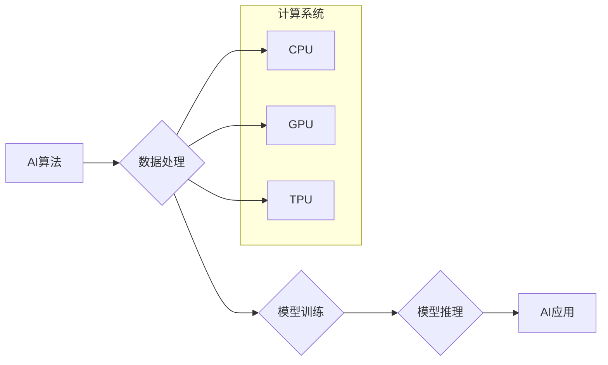

## 计算系统在AI中的重要性

> 关键词：人工智能、计算系统、硬件加速、深度学习、神经网络、算法效率、数据处理、可扩展性、未来趋势

## 1. 背景介绍

人工智能（AI）正以惊人的速度发展，从自动驾驶到医疗诊断，AI技术正在改变着我们生活的方方面面。然而，AI的发展离不开强大的计算系统作为基础。计算系统为AI算法提供执行平台，决定着AI模型的训练速度、精度和规模。随着AI应用的不断扩展，对计算系统的需求也日益增长，这使得计算系统在AI发展中的重要性更加凸显。

## 2. 核心概念与联系

**2.1 AI与计算系统的相互依赖**

人工智能的核心是算法，而这些算法需要大量的计算资源才能运行。AI算法的训练过程通常涉及对海量数据进行复杂的数学运算，例如矩阵乘法、卷积运算等。这些运算量巨大，需要强大的计算能力才能在合理的时间内完成。

**2.2 计算系统架构与AI应用**

不同的AI应用场景对计算系统的要求也不同。例如，图像识别和自然语言处理等任务需要强大的并行计算能力，而预测分析和决策支持等任务则更注重计算精度和稳定性。因此，计算系统架构需要根据不同的AI应用场景进行优化设计。

**2.3 硬件加速与AI性能提升**

传统的CPU架构在处理AI算法时存在效率低下、耗能大等问题。为了提升AI性能，出现了专门为AI算法设计的硬件加速器，例如GPU、TPU等。这些硬件加速器拥有更强大的并行计算能力和更低的功耗，能够显著加速AI模型的训练和推理过程。

**Mermaid 流程图**



## 3. 核心算法原理 & 具体操作步骤

**3.1 算法原理概述**

深度学习是目前AI领域最热门的算法之一，其核心是多层神经网络。神经网络模仿了人脑的神经元结构，通过层层传递信息，学习数据中的复杂模式。深度学习算法的训练过程是通过调整神经网络参数，使得模型输出与真实值之间的误差最小化。

**3.2 算法步骤详解**

1. **数据预处理:** 将原始数据转换为模型可以理解的格式，例如归一化、编码等。
2. **网络结构设计:** 根据任务需求设计神经网络的层数、节点数、激活函数等参数。
3. **参数初始化:** 为神经网络参数赋予初始值。
4. **前向传播:** 将输入数据通过神经网络层层传递，得到模型输出。
5. **损失函数计算:** 计算模型输出与真实值之间的误差。
6. **反向传播:** 根据损失函数的梯度，调整神经网络参数。
7. **优化算法:** 使用优化算法，例如梯度下降法，更新神经网络参数。
8. **模型评估:** 使用测试数据评估模型的性能。

**3.3 算法优缺点**

**优点:**

* 能够学习复杂数据模式，取得高精度。
* 可应用于多种任务，例如图像识别、自然语言处理等。

**缺点:**

* 训练过程耗时、耗能。
* 对数据量要求高，需要大量数据才能训练出好的模型。
* 模型解释性差，难以理解模型的决策过程。

**3.4 算法应用领域**

* **图像识别:** 人脸识别、物体检测、图像分类等。
* **自然语言处理:** 机器翻译、文本摘要、情感分析等。
* **语音识别:** 语音转文本、语音助手等。
* **推荐系统:** 商品推荐、内容推荐等。
* **医疗诊断:** 病情预测、疾病诊断等。

## 4. 数学模型和公式 & 详细讲解 & 举例说明

**4.1 数学模型构建**

深度学习模型的核心是神经网络，其结构可以表示为多个层级的神经元连接。每个神经元接收来自上一层的输入信号，经过激活函数处理后，输出到下一层。

**4.2 公式推导过程**

神经网络的训练过程是通过最小化损失函数来实现的。损失函数衡量模型输出与真实值的差异。常用的损失函数包括均方误差（MSE）、交叉熵损失等。

**均方误差 (MSE):**

$$MSE = \frac{1}{n} \sum_{i=1}^{n} (y_i - \hat{y}_i)^2$$

其中：

* $y_i$ 是真实值
* $\hat{y}_i$ 是模型预测值
* $n$ 是样本数量

**4.3 案例分析与讲解**

假设我们训练一个简单的线性回归模型，用于预测房价。模型输入特征包括房屋面积和房间数量，输出房价。

我们可以使用MSE损失函数来衡量模型预测的房价与真实房价之间的差异。通过反向传播算法，调整模型参数，使得MSE最小化。

## 5. 项目实践：代码实例和详细解释说明

**5.1 开发环境搭建**

* Python 3.x
* TensorFlow 或 PyTorch 等深度学习框架
* GPU 

**5.2 源代码详细实现**

```python
import tensorflow as tf

# 定义模型结构
model = tf.keras.models.Sequential([
    tf.keras.layers.Dense(64, activation='relu', input_shape=(2,)),
    tf.keras.layers.Dense(1)
])

# 编译模型
model.compile(optimizer='adam', loss='mse')

# 训练模型
model.fit(X_train, y_train, epochs=10)

# 评估模型
loss = model.evaluate(X_test, y_test)
```

**5.3 代码解读与分析**

* 使用 TensorFlow 框架定义一个简单的线性回归模型。
* 模型包含两层全连接神经元，第一层有64个神经元，使用ReLU激活函数，输入特征维度为2。
* 使用Adam优化器和均方误差损失函数训练模型。
* 训练模型10个 epochs。
* 使用测试数据评估模型的性能。

**5.4 运行结果展示**

训练完成后，可以查看模型的损失值，以及在测试数据上的预测精度。

## 6. 实际应用场景

**6.1 图像识别**

* **自动驾驶:** 识别道路标志、车辆、行人等。
* **医疗诊断:** 识别病灶、肿瘤等。
* **安防监控:** 人脸识别、行为识别等。

**6.2 自然语言处理**

* **机器翻译:** 将文本从一种语言翻译成另一种语言。
* **文本摘要:** 自动生成文本的简要摘要。
* **聊天机器人:** 与用户进行自然语言对话。

**6.3 其他应用场景**

* **语音识别:** 将语音转换为文本。
* **推荐系统:** 根据用户喜好推荐商品、内容等。
* **金融分析:** 预测股票价格、识别欺诈交易等。

**6.4 未来应用展望**

随着计算系统性能的不断提升，AI技术将应用于更多领域，例如：

* **个性化教育:** 根据学生的学习情况提供个性化的学习方案。
* **精准医疗:** 根据患者的基因信息和病史提供个性化的治疗方案。
* **智能家居:** 通过AI技术实现家居自动化、智能控制等功能。

## 7. 工具和资源推荐

**7.1 学习资源推荐**

* **书籍:**
    * 深度学习 (Deep Learning) - Ian Goodfellow, Yoshua Bengio, Aaron Courville
    * 人工智能：一种现代方法 (Artificial Intelligence: A Modern Approach) - Stuart Russell, Peter Norvig
* **在线课程:**
    * Coursera: 深度学习 Specialization
    * Udacity: AI Programming with Python Nanodegree
    * fast.ai: Practical Deep Learning for Coders

**7.2 开发工具推荐**

* **深度学习框架:** TensorFlow, PyTorch, Keras
* **编程语言:** Python
* **云计算平台:** Google Cloud Platform, Amazon Web Services, Microsoft Azure

**7.3 相关论文推荐**

* **ImageNet Classification with Deep Convolutional Neural Networks** - Alex Krizhevsky, Ilya Sutskever, Geoffrey E. Hinton
* **Attention Is All You Need** - Ashish Vaswani, Noam Shazeer, Niki Parmar, Jakob Uszkoreit, Llion Jones, Aidan N. Gomez, Łukasz Kaiser, Illia Polosukhin

## 8. 总结：未来发展趋势与挑战

**8.1 研究成果总结**

近年来，AI技术取得了长足的进步，特别是深度学习算法在图像识别、自然语言处理等领域取得了突破性进展。这些成果离不开计算系统的发展，例如GPU、TPU等硬件加速器的出现，使得AI模型的训练和推理速度得到显著提升。

**8.2 未来发展趋势**

* **模型规模和复杂度提升:** 未来AI模型将更加庞大，拥有更多的参数和更复杂的结构，从而能够学习更复杂的数据模式。
* **边缘计算的兴起:** AI计算将逐渐向边缘设备转移，例如智能手机、物联网设备等，实现更快速的响应和更低的延迟。
* **AI算法的可解释性提升:** 研究人员将致力于开发更可解释的AI算法，使得模型的决策过程更加透明，更容易被理解。

**8.3 面临的挑战**

* **计算资源需求:** 训练大型AI模型需要大量的计算资源，这给能源消耗和环境保护带来了挑战。
* **数据安全和隐私:** AI算法依赖于大量数据，如何保护数据安全和隐私是一个重要的课题。
* **算法偏见:** AI算法可能存在偏见，导致不公平的结果，需要研究如何解决算法偏见问题。

**8.4 研究展望**

未来，计算系统和AI技术将继续相互促进发展，推动人工智能技术向更智能、更安全、更可持续的方向发展。


## 9. 附录：常见问题与解答

**9.1 如何选择合适的计算系统架构？**

选择合适的计算系统架构需要根据具体的AI应用场景进行评估。例如，对于需要高并行计算能力的图像识别任务，可以选择GPU架构；对于需要高精度计算的预测分析任务，可以选择CPU架构。

**9.2 如何优化AI模型的训练效率？**

可以采用以下方法优化AI模型的训练效率：

* 使用硬件加速器，例如GPU、TPU。
* 使用分布式训练，将模型训练任务分发到多个机器上进行。
* 使用模型压缩技术，减少模型参数量。

**9.3 如何解决AI算法的偏见问题？**

可以采用以下方法解决AI算法的偏见问题：

* 使用更加多样化的训练数据。
* 在模型训练过程中加入公平性约束。
* 对模型输出进行解释和分析，识别潜在的偏见。


作者：禅与计算机程序设计艺术 / Zen and the Art of Computer Programming 
