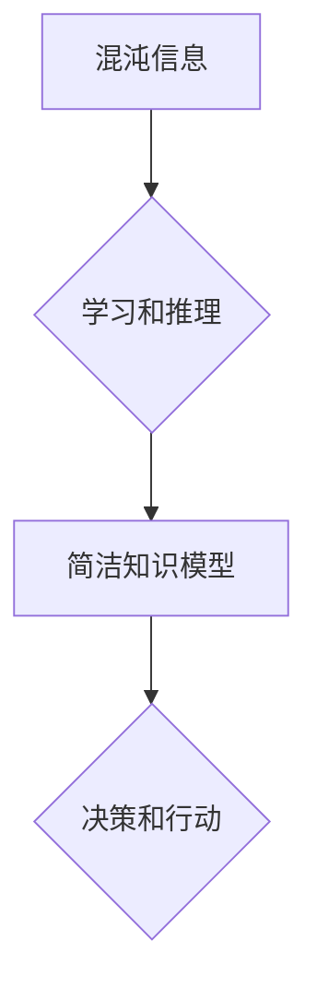

## 认知发展中的混沌与简洁

> 关键词：人工智能、认知科学、复杂系统、简洁原则、算法、模型

### 1. 背景介绍

人类的认知能力是极其复杂的，它能够从纷繁的信息中提取本质，构建简洁的知识模型，并做出明智的决策。然而，这个过程是如何实现的，仍然是一个未解之谜。近年来，人工智能的快速发展为我们理解认知提供了新的视角。

人工智能的研究旨在构建能够模拟人类智能的机器。从早期规则型系统到如今的深度学习模型，人工智能的发展经历了多个阶段。而深度学习的出现，特别是卷积神经网络和循环神经网络的成功应用，使得人工智能在图像识别、自然语言处理等领域取得了突破性进展。

然而，深度学习模型的复杂性也引发了新的思考。这些模型拥有数百万甚至数十亿的参数，其内部运作机制难以被人类完全理解。这不禁让人们思考：人类的认知能力是如何在复杂的信息世界中保持简洁和高效的？

### 2. 核心概念与联系

**2.1 认知的混沌与简洁**

认知过程可以被看作是一个从混沌到简洁的演化过程。

* **混沌:** 我们的感官不断接收来自外部世界的各种信息，这些信息是纷繁复杂的，缺乏结构和意义。
* **简洁:** 人类大脑通过学习和推理，将这些混沌的信息进行组织和归纳，构建出简洁、易于理解的知识模型。

**2.2 复杂系统与人工智能**

人工智能模型，特别是深度学习模型，本质上是复杂的系统。它们由大量的节点和连接组成，这些节点之间相互作用，形成复杂的网络结构。

* **复杂系统:** 复杂系统是指由许多相互作用的个体组成的系统，这些个体之间存在非线性关系，导致系统整体行为难以预测。
* **人工智能:** 人工智能模型试图通过学习和训练，从数据中发现复杂系统的规律，并生成新的预测或决策。

**2.3 简洁原则与算法设计**

简洁原则在认知科学和人工智能领域都具有重要意义。

* **认知科学:** 简洁原则认为，人类大脑倾向于构建简洁、易于理解的知识模型。
* **人工智能:** 简洁原则在算法设计中意味着追求算法的简洁性和易于理解性，这有助于提高算法的效率和可维护性。

**Mermaid 流程图**



### 3. 核心算法原理 & 具体操作步骤

**3.1 算法原理概述**

深度学习算法的核心原理是利用多层神经网络来学习数据中的复杂模式。

* **神经网络:** 神经网络是一种模仿人脑神经元结构的计算模型。它由多个层组成，每一层包含许多神经元。神经元之间通过连接进行信息传递，每个连接都有一个权重。
* **学习:** 深度学习算法通过训练数据来调整神经网络的权重，使得网络能够准确地预测输出。

**3.2 算法步骤详解**

1. **数据预处理:** 将原始数据转换为深度学习模型可以理解的格式。
2. **网络结构设计:** 根据任务需求设计神经网络的结构，包括层数、神经元数量、激活函数等。
3. **权重初始化:** 为神经网络的连接赋予初始权重。
4. **前向传播:** 将输入数据通过神经网络传递，计算输出结果。
5. **损失函数计算:** 计算模型输出与真实值的差异，即损失值。
6. **反向传播:** 根据损失值，调整神经网络的权重，使得损失值最小化。
7. **迭代训练:** 重复前向传播和反向传播的过程，直到模型达到预期的性能。

**3.3 算法优缺点**

**优点:**

* **强大的学习能力:** 深度学习模型能够学习数据中的复杂模式，并进行精准的预测。
* **自动化特征提取:** 深度学习模型能够自动提取数据的特征，无需人工特征工程。
* **泛化能力强:** 深度学习模型能够将从训练数据中学到的知识应用到新的数据上。

**缺点:**

* **数据依赖性强:** 深度学习模型需要大量的训练数据才能达到良好的性能。
* **训练时间长:** 深度学习模型的训练时间通常很长，需要强大的计算资源。
* **可解释性差:** 深度学习模型的内部运作机制难以被人类完全理解。

**3.4 算法应用领域**

深度学习算法在各个领域都有广泛的应用，例如：

* **图像识别:** 人脸识别、物体检测、图像分类
* **自然语言处理:** 机器翻译、文本摘要、情感分析
* **语音识别:** 语音转文本、语音助手
* **推荐系统:** 商品推荐、内容推荐
* **医疗诊断:** 病情预测、疾病诊断

### 4. 数学模型和公式 & 详细讲解 & 举例说明

**4.1 数学模型构建**

深度学习模型可以看作是一个复杂的数学模型，其核心是神经网络的激活函数和权重更新规则。

* **激活函数:** 激活函数用于引入非线性，使得神经网络能够学习复杂的数据模式。常见的激活函数包括 sigmoid 函数、ReLU 函数、tanh 函数等。
* **权重更新规则:** 权重更新规则用于根据损失值调整神经网络的权重，使得模型的性能不断提升。常见的权重更新规则包括梯度下降法、动量法、Adam 优化器等。

**4.2 公式推导过程**

损失函数的计算公式通常是基于真实值和预测值的差异，例如均方误差 (MSE) 或交叉熵 (Cross-Entropy)。

$$
MSE = \frac{1}{n} \sum_{i=1}^{n} (y_i - \hat{y}_i)^2
$$

$$
Cross-Entropy = -\frac{1}{n} \sum_{i=1}^{n} y_i \log(\hat{y}_i) + (1-y_i) \log(1-\hat{y}_i)
$$

其中，$y_i$ 是真实值，$\hat{y}_i$ 是预测值，$n$ 是样本数量。

**4.3 案例分析与讲解**

以图像分类为例，假设我们有一个包含猫和狗的图像数据集。

* **训练数据:** 将数据集的一部分用于训练深度学习模型，使得模型能够学习区分猫和狗的特征。
* **测试数据:** 将数据集的另一部分用于测试模型的性能，评估模型对新图像的分类准确率。

在训练过程中，模型会不断调整权重，使得预测结果与真实值之间的差异最小化。最终，模型能够学习到区分猫和狗的特征，并能够对新的图像进行准确分类。

### 5. 项目实践：代码实例和详细解释说明

**5.1 开发环境搭建**

* **操作系统:** Linux 或 macOS
* **编程语言:** Python
* **深度学习框架:** TensorFlow 或 PyTorch
* **硬件:** GPU 加速器

**5.2 源代码详细实现**

```python
import tensorflow as tf

# 定义模型结构
model = tf.keras.models.Sequential([
    tf.keras.layers.Conv2D(32, (3, 3), activation='relu', input_shape=(28, 28, 1)),
    tf.keras.layers.MaxPooling2D((2, 2)),
    tf.keras.layers.Conv2D(64, (3, 3), activation='relu'),
    tf.keras.layers.MaxPooling2D((2, 2)),
    tf.keras.layers.Flatten(),
    tf.keras.layers.Dense(10, activation='softmax')
])

# 编译模型
model.compile(optimizer='adam',
              loss='sparse_categorical_crossentropy',
              metrics=['accuracy'])

# 训练模型
model.fit(x_train, y_train, epochs=10)

# 评估模型
loss, accuracy = model.evaluate(x_test, y_test)
print('Test loss:', loss)
print('Test accuracy:', accuracy)
```

**5.3 代码解读与分析**

这段代码定义了一个简单的卷积神经网络模型，用于图像分类任务。

* **Conv2D:** 卷积层，用于提取图像特征。
* **MaxPooling2D:** 最大池化层，用于降低特征图尺寸，提高模型鲁棒性。
* **Flatten:** 将多维特征图转换为一维向量。
* **Dense:** 全连接层，用于分类。
* **adam:** 优化器，用于更新模型权重。
* **sparse_categorical_crossentropy:** 损失函数，用于计算模型预测结果与真实值的差异。
* **accuracy:** 评估指标，用于衡量模型的分类准确率。

**5.4 运行结果展示**

训练完成后，模型能够对新的图像进行分类。

### 6. 实际应用场景

深度学习算法在各个领域都有广泛的应用，例如：

* **医疗诊断:** 深度学习模型能够辅助医生诊断疾病，例如癌症、糖尿病等。
* **金融风险控制:** 深度学习模型能够识别金融欺诈、预测市场风险等。
* **自动驾驶:** 深度学习模型能够帮助车辆识别道路环境、做出决策等。

**6.4 未来应用展望**

随着人工智能技术的不断发展，深度学习算法将在更多领域得到应用，例如：

* **个性化教育:** 深度学习模型能够根据学生的学习情况提供个性化的学习方案。
* **智能客服:** 深度学习模型能够提供更加智能、人性化的客服服务。
* **科学研究:** 深度学习模型能够加速科学研究，例如药物研发、材料科学等。

### 7. 工具和资源推荐

**7.1 学习资源推荐**

* **书籍:**
    * 深度学习 (Deep Learning) - Ian Goodfellow, Yoshua Bengio, Aaron Courville
    * 深度学习实践 (Deep Learning with Python) - Francois Chollet
* **在线课程:**
    * Coursera: 深度学习 Specialization
    * Udacity: 深度学习 Nanodegree
    * fast.ai: 深度学习课程

**7.2 开发工具推荐**

* **深度学习框架:** TensorFlow, PyTorch, Keras
* **编程语言:** Python
* **数据处理工具:** Pandas, NumPy

**7.3 相关论文推荐**

* **AlexNet:** ImageNet Classification with Deep Convolutional Neural Networks
* **VGGNet:** Very Deep Convolutional Networks for Large-Scale Image Recognition
* **ResNet:** Deep Residual Learning for Image Recognition

### 8. 总结：未来发展趋势与挑战

**8.1 研究成果总结**

深度学习算法取得了令人瞩目的成就，在图像识别、自然语言处理等领域取得了突破性进展。

**8.2 未来发展趋势**

* **模型效率提升:** 研究更轻量级、更高效的深度学习模型。
* **可解释性增强:** 研究更易于理解的深度学习模型，提高模型的可解释性。
* **跨模态学习:** 研究能够处理多种模态数据的深度学习模型，例如图像、文本、音频等。

**8.3 面临的挑战**

* **数据获取和标注:** 深度学习模型需要大量的训练数据，数据获取和标注成本高昂。
* **模型训练时间长:** 深度学习模型的训练时间通常很长，需要强大的计算资源。
* **模型泛化能力:** 深度学习模型在新的数据上可能表现不佳，泛化能力需要进一步提升。

**8.4 研究展望**

未来，深度学习算法将继续发展，并在更多领域发挥重要作用。研究人员将致力于解决上述挑战，开发更强大、更智能的深度学习模型，推动人工智能技术的进步。

### 9. 附录：常见问题与解答

**9.1 什么是深度学习？**

深度学习是一种机器学习的子领域，它利用多层神经网络来学习数据中的复杂模式。

**9.2 深度学习算法有哪些？**

常见的深度学习算法包括卷积神经网络 (CNN)、循环神经网络 (RNN)、生成对抗网络 (GAN) 等。

**9.3 深度学习模型的训练需要哪些资源？**

深度学习模型的训练需要大量的训练数据、强大的