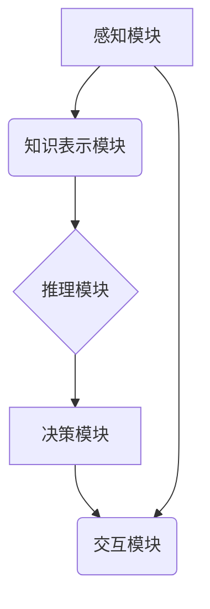

## 认知的形式化：时钟不停，与外界交互不息，思维和认知不止

> 关键词：认知计算、形式化语言、人工智能、交互式学习、动态系统、神经网络

### 1. 背景介绍

人类认知的复杂性一直是科学研究的焦点。从感知、记忆、推理到决策，认知过程涉及到大量的抽象、联想和演绎。然而，传统计算机科学以其精确的逻辑和可计算性为主，难以完全模拟人类的灵活性和创造性。近年来，随着人工智能领域的飞速发展，人们开始探索将认知科学的原理融入到计算机系统中，从而构建更智能、更接近人类思维的机器。

认知计算（Cognitive Computing）应运而生，它旨在通过模拟人类认知机制，开发能够理解、学习和推理的智能系统。认知计算的核心在于将复杂认知过程分解成可形式化的步骤，并用算法和数据结构进行建模。

### 2. 核心概念与联系

**2.1 认知的本质**

认知可以理解为对信息进行处理、理解和应用的过程。它包括感知、记忆、推理、决策等多个方面。

**2.2 形式化语言**

形式化语言是一种精确、 unambiguous 的符号系统，用于表达和推理知识。它提供了一种结构化的方式来描述概念、关系和规则，并允许进行逻辑推理和推导。

**2.3 认知计算的架构**

认知计算系统通常由以下几个模块组成：

* **感知模块:** 用于接收来自外部世界的输入信息，例如文本、图像、音频等。
* **知识表示模块:** 用于将感知到的信息转化为可理解的知识表示形式，例如概念图、语义网络等。
* **推理模块:** 用于根据已有的知识和规则进行逻辑推理，得出新的结论或预测。
* **决策模块:** 用于根据推理结果和目标进行决策。
* **交互模块:** 用于与用户进行交互，提供反馈和解释。

**2.4 核心概念联系**

认知计算通过将认知过程形式化，并用算法和数据结构进行建模，从而实现对认知的模拟和理解。



### 3. 核心算法原理 & 具体操作步骤

**3.1 算法原理概述**

认知计算中常用的算法包括：

* **神经网络:** 

   模拟大脑神经元结构和功能，通过学习数据来提取特征和进行分类。

* **规则引擎:** 

   基于预先定义的规则进行推理和决策。
* **语义网络:** 

   用节点和边表示概念和关系，进行知识表示和推理。

**3.2 算法步骤详解**

以神经网络为例，其训练过程可以概括为以下步骤：

1. **数据预处理:** 将原始数据转换为神经网络可以理解的格式。
2. **网络结构设计:** 根据任务需求设计神经网络的层数、节点数和激活函数等参数。
3. **权值初始化:** 为神经网络的连接赋予初始权值。
4. **前向传播:** 将输入数据通过神经网络层级传递，计算输出结果。
5. **反向传播:** 计算输出结果与目标值的误差，并根据误差调整神经网络的权值。
6. **迭代训练:** 重复前向传播和反向传播步骤，直到误差达到预设阈值。

**3.3 算法优缺点**

* **神经网络:** 优点：能够学习复杂模式，具有强大的泛化能力。缺点：训练过程复杂，需要大量数据，解释性较差。
* **规则引擎:** 优点：规则易于理解和维护，解释性强。缺点：难以处理复杂、模糊的知识。
* **语义网络:** 优点：能够表示知识的层次结构和语义关系，支持推理和知识发现。缺点：构建语义网络需要专业知识，规模较大的语义网络难以管理。

**3.4 算法应用领域**

认知计算算法广泛应用于各个领域，例如：

* **自然语言处理:** 机器翻译、文本摘要、情感分析等。
* **计算机视觉:** 图像识别、目标检测、图像分割等。
* **医疗诊断:** 疾病预测、影像分析、药物研发等。
* **金融分析:** 风险评估、欺诈检测、投资决策等。

### 4. 数学模型和公式 & 详细讲解 & 举例说明

**4.1 数学模型构建**

认知计算中常用的数学模型包括：

* **概率模型:** 用于描述随机事件和变量之间的关系，例如贝叶斯网络、马尔可夫链等。
* **逻辑模型:** 用于描述知识和推理规则，例如命题逻辑、谓词逻辑等。
* **图论模型:** 用于表示知识的结构和关系，例如知识图谱、社交网络等。

**4.2 公式推导过程**

以贝叶斯网络为例，其核心公式为：

$$P(A|B) = \frac{P(B|A)P(A)}{P(B)}$$

其中：

* $P(A|B)$ 表示在已知事件 B 发生的情况下，事件 A 发生的概率。
* $P(B|A)$ 表示在已知事件 A 发生的情况下，事件 B 发生的概率。
* $P(A)$ 表示事件 A 发生的概率。
* $P(B)$ 表示事件 B 发生的概率。

**4.3 案例分析与讲解**

假设我们有一个贝叶斯网络，用于预测是否患有感冒。网络中包含以下节点：

* $S$: 感冒症状
* $I$: 感冒病毒感染
* $W$: 体温

我们可以根据以下概率信息构建贝叶斯网络：

* $P(S|I) = 0.9$ (感染病毒后出现感冒症状的概率)
* $P(I|W) = 0.8$ (体温升高后感染病毒的概率)
* $P(W) = 0.1$ (体温升高的概率)

如果患者出现感冒症状，那么根据贝叶斯公式，我们可以计算出患者感染病毒的概率：

$$P(I|S) = \frac{P(S|I)P(I)}{P(S)}$$

其中 $P(S)$ 可以通过求和法计算：

$$P(S) = P(S|I)P(I) + P(S|¬I)P(¬I)$$

### 5. 项目实践：代码实例和详细解释说明

**5.1 开发环境搭建**

* Python 3.x
* TensorFlow 或 PyTorch 等深度学习框架
* Jupyter Notebook 或 VS Code 等代码编辑器

**5.2 源代码详细实现**

以下是一个简单的基于 TensorFlow 的神经网络代码示例，用于分类手写数字：

```python
import tensorflow as tf

# 定义模型结构
model = tf.keras.models.Sequential([
  tf.keras.layers.Flatten(input_shape=(28, 28)),
  tf.keras.layers.Dense(128, activation='relu'),
  tf.keras.layers.Dropout(0.2),
  tf.keras.layers.Dense(10, activation='softmax')
])

# 编译模型
model.compile(optimizer='adam',
              loss='sparse_categorical_crossentropy',
              metrics=['accuracy'])

# 训练模型
model.fit(x_train, y_train, epochs=5)

# 评估模型
loss, accuracy = model.evaluate(x_test, y_test)
print('Accuracy:', accuracy)
```

**5.3 代码解读与分析**

* `tf.keras.models.Sequential`: 定义一个顺序模型，层级结构清晰。
* `tf.keras.layers.Flatten`: 将输入图像数据扁平化，以便后续层处理。
* `tf.keras.layers.Dense`: 定义全连接层，连接所有输入节点和输出节点。
* `activation='relu'`: 使用 ReLU 激活函数，提高模型的非线性表达能力。
* `Dropout(0.2)`: 使用 dropout 正则化，防止过拟合。
* `loss='sparse_categorical_crossentropy'`: 使用交叉熵损失函数，用于多分类任务。
* `metrics=['accuracy']`: 使用准确率作为评估指标。

**5.4 运行结果展示**

训练完成后，模型会输出训练和测试集上的准确率。

### 6. 实际应用场景

**6.1 自然语言处理**

* **机器翻译:** 利用神经网络模型，将一种语言翻译成另一种语言。
* **文本摘要:** 自动生成文本的简短摘要，例如新闻文章的标题或会议记录的要点。
* **情感分析:** 分析文本中的情感倾向，例如判断用户对产品的评价是正面还是负面。

**6.2 计算机视觉**

* **图像识别:** 将图像分类到不同的类别，例如识别动物、物体或场景。
* **目标检测:** 在图像中定位和识别特定目标，例如检测人脸、车辆或交通标志。
* **图像分割:** 将图像分割成不同的区域，例如将图像中的前景和背景分离。

**6.3 其他领域**

* **医疗诊断:** 利用机器学习模型，辅助医生诊断疾病，例如分析医学影像或预测患者的风险。
* **金融分析:** 利用机器学习模型，进行风险评估、欺诈检测和投资决策。
* **个性化推荐:** 利用用户行为数据，推荐个性化的商品、服务或内容。

**6.4 未来应用展望**

随着认知计算技术的不断发展，未来将有更多更广泛的应用场景出现，例如：

* **智能机器人:** 能够理解和响应人类语言，并执行复杂的任务。
* **虚拟助手:** 能够提供更智能、更个性化的服务，例如安排日程、提供信息查询和进行对话。
* **自动驾驶汽车:** 能够感知周围环境，并做出安全可靠的驾驶决策。

### 7. 工具和资源推荐

**7.1 学习资源推荐**

* **书籍:**
    * 《深度学习》 (Deep Learning) by Ian Goodfellow, Yoshua Bengio, and Aaron Courville
    * 《认知计算》 (Cognitive Computing) by John D. Kelleher, Brian Mac Namee, and Aoife D. Coyle
* **在线课程:**
    * Coursera: 深度学习 Specialization
    * edX: Artificial Intelligence
* **网站:**
    * TensorFlow: https://www.tensorflow.org/
    * PyTorch: https://pytorch.org/

**7.2 开发工具推荐**

* **Python:** https://www.python.org/
* **Jupyter Notebook:** https://jupyter.org/
* **VS Code:** https://code.visualstudio.com/

**7.3 相关论文推荐**

* **《ImageNet Classification with Deep Convolutional Neural Networks》** by Alex Krizhevsky, Ilya Sutskever, and Geoffrey E. Hinton
* **《Attention Is All You Need》** by Ashish Vaswani, Noam Shazeer, Niki Parmar, Jakob Uszkoreit, Llion Jones, Aidan N. Gomez, Łukasz Kaiser, and Illia Polosukhin

### 8. 总结：未来发展趋势与挑战

**8.1 研究成果总结**

近年来，认知计算取得了显著进展，在自然语言处理、计算机视觉、医疗诊断等领域取得了突破性成果。

**8.2 未来发展趋势**

* **更强大的模型:** 研究更深、更复杂的模型，例如 Transformer 和 GPT 等，以提高模型的性能和泛化能力。
* **更有效的训练方法:** 研究更有效的训练方法，例如迁移学习和联邦学习，以降低训练成本和提高数据利用率。
* **更强的解释性:** 研究更强的模型解释性，使模型的决策过程更加透明和可理解。
* **更广泛的应用:** 将认知计算技术应用到更多领域，例如教育、娱乐、金融等。

**8.3 面临的挑战**

* **数据获取和标注:** 训练强大的认知计算模型需要大量高质量的数据，而数据