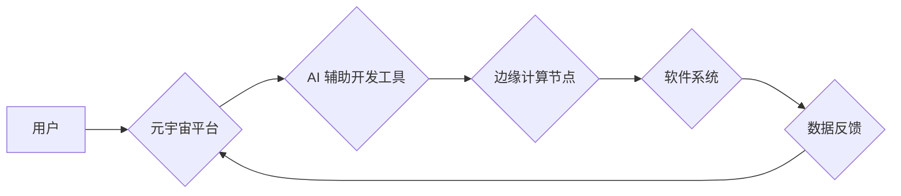

## 软件 2.0 的未来愿景：创造更美好的世界

> 关键词：人工智能、软件架构、可解释性、协作开发、元宇宙、低代码、边缘计算、量子计算

### 1. 背景介绍

软件已经深刻地改变了我们的生活，从智能手机到自动驾驶汽车，再到医疗诊断和金融交易，软件无处不在。然而，当前的软件开发模式面临着诸多挑战：

* **复杂性爆炸:** 软件系统越来越复杂，开发、维护和更新成本不断上升。
* **可解释性不足:** 许多人工智能算法难以解释其决策过程，这导致信任和可控性问题。
* **协作效率低下:** 软件开发是一个高度协作的过程，但现有的工具和流程难以有效地支持团队协作。
* **人才短缺:** 软件开发人才需求量巨大，但供给不足，导致人才竞争激烈。

这些挑战阻碍了软件技术的发展，也限制了软件在解决人类问题方面的潜力。因此，我们需要探索新的软件开发模式，构建更强大、更安全、更可解释、更易于使用的软件系统。

### 2. 核心概念与联系

软件 2.0 是一种基于人工智能、元宇宙、边缘计算等新兴技术的软件开发模式，旨在解决当前软件开发模式面临的挑战，并创造更美好的世界。

**核心概念:**

* **人工智能 (AI):** AI 将被广泛应用于软件开发各个环节，例如代码生成、测试、部署和维护。
* **元宇宙 (Metaverse):** 元宇宙将提供一个虚拟环境，用于软件开发、测试和演示，从而提高协作效率和开发体验。
* **边缘计算 (Edge Computing):** 边缘计算将使软件能够在设备本地进行处理，从而降低延迟、提高效率和保障数据安全。
* **低代码 (Low-Code):** 低代码平台将使非程序员也能参与软件开发，从而降低开发门槛和缩短开发周期。
* **可解释性 (Explainability):** 可解释性 AI 将使软件的决策过程更加透明，从而提高信任度和可控性。

**架构图:**



### 3. 核心算法原理 & 具体操作步骤

**3.1 算法原理概述**

软件 2.0 的核心算法原理基于深度学习、自然语言处理和强化学习等人工智能技术。

* **深度学习:** 用于代码生成、代码理解和软件缺陷检测等任务。
* **自然语言处理:** 用于理解用户需求、生成软件文档和支持自然语言交互。
* **强化学习:** 用于优化软件系统性能、自动测试和软件部署。

**3.2 算法步骤详解**

1. **数据收集:** 收集大量软件代码、文档和用户需求数据。
2. **数据预处理:** 对数据进行清洗、格式化和转换。
3. **模型训练:** 使用深度学习、自然语言处理和强化学习算法训练模型。
4. **模型评估:** 使用测试数据评估模型性能。
5. **模型部署:** 将训练好的模型部署到软件开发平台或边缘计算节点。

**3.3 算法优缺点**

**优点:**

* 自动化软件开发流程，提高效率和降低成本。
* 提升软件质量，减少缺陷和错误。
* 支持更复杂的软件系统开发。

**缺点:**

* 需要大量的数据进行训练，数据质量直接影响模型性能。
* 模型解释性不足，难以理解模型的决策过程。
* 算法本身存在一定的局限性，难以解决所有软件开发问题。

**3.4 算法应用领域**

* 代码生成
* 代码理解和分析
* 软件缺陷检测
* 软件测试自动化
* 软件部署自动化
* 用户需求分析
* 软件文档生成
* 自然语言交互

### 4. 数学模型和公式 & 详细讲解 & 举例说明

**4.1 数学模型构建**

软件 2.0 的核心算法通常基于深度学习模型，例如循环神经网络 (RNN) 和 transformers。这些模型可以看作是复杂的函数，将输入数据映射到输出数据。

**4.2 公式推导过程**

深度学习模型的训练过程基于梯度下降算法，其目标是找到模型参数，使得模型输出与真实输出之间的误差最小化。

**损失函数:**

$$L(w) = \frac{1}{N} \sum_{i=1}^{N} (y_i - \hat{y}_i)^2$$

其中:

* $w$ 是模型参数
* $N$ 是样本数量
* $y_i$ 是真实输出
* $\hat{y}_i$ 是模型预测输出

**梯度下降算法:**

$$w = w - \alpha \frac{\partial L(w)}{\partial w}$$

其中:

* $\alpha$ 是学习率

**4.3 案例分析与讲解**

例如，在代码生成任务中，我们可以使用 transformers 模型将自然语言描述映射到代码。训练过程中，模型会根据输入描述和对应的代码进行训练，学习代码的语法和语义规则。

### 5. 项目实践：代码实例和详细解释说明

**5.1 开发环境搭建**

* Python 3.x
* TensorFlow 或 PyTorch 深度学习框架
* Jupyter Notebook 或 VS Code 开发环境

**5.2 源代码详细实现**

```python
# 使用 transformers 模型进行代码生成
from transformers import AutoModelForSeq2SeqLM, AutoTokenizer

# 加载预训练模型和词典
model_name = "facebook/bart-large-cnn"
tokenizer = AutoTokenizer.from_pretrained(model_name)
model = AutoModelForSeq2SeqLM.from_pretrained(model_name)

# 输入自然语言描述
input_text = "编写一个 Python 函数，计算两个整数的和。"

# Tokenize 输入文本
input_ids = tokenizer.encode(input_text, return_tensors="pt")

# 生成代码
output_ids = model.generate(input_ids)

# Decode 输出代码
generated_code = tokenizer.decode(output_ids[0], skip_special_tokens=True)

# 打印生成的代码
print(generated_code)
```

**5.3 代码解读与分析**

* 该代码使用 transformers 库加载预训练的 BART 模型，该模型擅长序列到序列的文本生成任务。
* 首先，将输入的自然语言描述进行 tokenization，转换为模型可以理解的格式。
* 然后，使用模型的 `generate` 方法生成代码。
* 最后，将生成的代码解码回文本格式，并打印输出。

**5.4 运行结果展示**

```python
def sum_two_integers(a, b):
  return a + b
```

### 6. 实际应用场景

**6.1 软件开发自动化**

* 自动生成代码模板和文档
* 自动测试和部署软件

**6.2 个性化软件体验**

* 根据用户需求自动生成定制化的软件

**6.3 增强软件可解释性**

* 使用可解释性 AI 解释软件的决策过程

**6.4 未来应用展望**

* 软件 2.0 将进一步融合人工智能、元宇宙、边缘计算等新兴技术，构建更加智能、交互性和可扩展性的软件系统。
* 软件开发将更加民主化，更多的人能够参与到软件开发过程中。
* 软件将更加深入地融入到我们的生活，解决更多人类面临的挑战。

### 7. 工具和资源推荐

**7.1 学习资源推荐**

* 深度学习课程 (Coursera, Udacity)
* 自然语言处理课程 (Stanford NLP, Fast.ai)
* 软件工程课程 (MIT OpenCourseWare, edX)

**7.2 开发工具推荐**

* TensorFlow
* PyTorch
* Jupyter Notebook
* VS Code

**7.3 相关论文推荐**

* Attention Is All You Need (Vaswani et al., 2017)
* BERT: Pre-training of Deep Bidirectional Transformers for Language Understanding (Devlin et al., 2018)
* GPT-3: Language Models are Few-Shot Learners (Brown et al., 2020)

### 8. 总结：未来发展趋势与挑战

**8.1 研究成果总结**

软件 2.0 已经取得了显著的进展，人工智能技术在软件开发各个环节发挥着越来越重要的作用。

**8.2 未来发展趋势**

* 更强大的 AI 模型和算法
* 更广泛的 AI 应用场景
* 更人性化的软件体验
* 更安全的软件系统

**8.3 面临的挑战**

* 数据安全和隐私保护
* 模型解释性和可控性
* 算法公平性和可信度
* 人工智能伦理问题

**8.4 研究展望**

未来，我们需要继续探索人工智能在软件开发领域的应用，并解决软件 2.0 发展过程中面临的挑战，最终实现软件技术更好地服务于人类社会。

### 9. 附录：常见问题与解答

**9.1 如何学习软件 2.0 的相关知识？**

* 阅读相关书籍和论文
* 参加在线课程和培训
* 参与开源项目和社区讨论

**9.2 如何参与软件 2.0 的开发？**

* 学习相关编程语言和技术
* 寻找合适的开源项目或公司
* 积极参与社区讨论和贡献代码

**9.3 软件 2.0 会取代人类软件工程师吗？**

* 软件 2.0 会自动化许多软件开发任务，但不会完全取代人类软件工程师。
* 人类软件工程师仍然需要负责软件设计、架构、测试和维护等高层次的工作。


作者：禅与计算机程序设计艺术 / Zen and the Art of Computer Programming 
