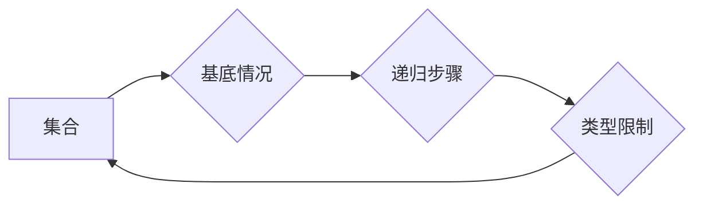

## 集合论导引：第二递归定义定理

> 关键词：集合论、递归定义、第二递归定义定理、数学基础、计算机科学

## 1. 背景介绍

集合论作为数学的基础理论，为计算机科学提供了坚实的逻辑基础。递归定义是集合论中一种重要的概念，它允许我们用简洁的方式定义复杂的对象。第二递归定义定理是集合论中一个重要的结果，它揭示了递归定义的强大性和局限性。

在计算机科学中，递归定义广泛应用于数据结构、算法设计和程序语言的定义。例如，树的结构可以递归定义，函数的调用也可以通过递归实现。理解第二递归定义定理可以帮助我们更好地理解这些概念，并设计更有效、更简洁的算法和程序。

## 2. 核心概念与联系

### 2.1 集合论基础

* **集合:** 集合是数学中最基本的概念之一，它是一个包含对象的集合。
* **子集:** 如果所有元素都在另一个集合中，则称第一个集合是第二个集合的子集。
* **空集:** 不包含任何元素的集合称为空集。
* **并集:** 两个集合的所有元素组成的集合称为它们的并集。
* **交集:** 两个集合中共同存在的元素组成的集合称为它们的交集。

### 2.2 递归定义

递归定义是一种定义对象的方案，其中对象被定义为自身的一部分。它通常由以下三个部分组成：

* **基底情况:** 定义对象的基本情况。
* **递归步骤:** 定义对象如何从自身的一部分构建出来。
* **类型限制:** 限定对象所属于的类型。

### 2.3 第二递归定义定理

第二递归定义定理指出，对于任何满足特定条件的集合，都可以用第二递归定义的方式来描述。

**Mermaid 流程图:**



## 3. 核心算法原理 & 具体操作步骤

### 3.1 算法原理概述

第二递归定义定理的算法原理是通过迭代地应用递归步骤，从基底情况出发，逐步构建出整个集合。

### 3.2 算法步骤详解

1. **确定基底情况:** 首先需要确定集合的基底情况，即集合中包含哪些最基本的元素。
2. **定义递归步骤:** 然后需要定义如何从已有的集合元素构建出新的集合元素。
3. **设置类型限制:** 最后需要设置类型限制，确保构建出的集合元素符合预期的类型。
4. **迭代构建:** 通过重复应用递归步骤，从基底情况出发，逐步构建出整个集合。

### 3.3 算法优缺点

**优点:**

* **简洁性:** 递归定义可以简洁地描述复杂的对象。
* **效率:** 对于某些问题，递归定义可以提供更有效的算法。

**缺点:**

* **复杂性:** 递归定义可能难以理解和调试。
* **栈溢出:** 递归调用过多可能会导致栈溢出错误。

### 3.4 算法应用领域

第二递归定义定理在计算机科学中广泛应用于以下领域:

* **数据结构:** 树、链表、图等数据结构的定义。
* **算法设计:** 分治算法、动态规划算法等算法的设计。
* **程序语言:** 函数定义、类型系统等程序语言的定义。

## 4. 数学模型和公式 & 详细讲解 & 举例说明

### 4.1 数学模型构建

设 $S$ 为一个集合，$f$ 为一个从 $S$ 到 $S$ 的函数，$a$ 为 $S$ 中的一个元素。

**定义:** 

* $S_0 = \{a\}$
* $S_{n+1} = S_n \cup f(S_n)$

则 $S = \bigcup_{n=0}^{\infty} S_n$

### 4.2 公式推导过程

我们可以通过数学归纳法证明 $S = \bigcup_{n=0}^{\infty} S_n$。

**基础步骤:** 当 $n = 0$ 时，$S_0 = \{a\}$，所以 $S_0 = S_0$。

**归纳步骤:** 假设当 $n = k$ 时，$S_k = \bigcup_{i=0}^{k} S_i$ 成立。

则当 $n = k+1$ 时，

$S_{k+1} = S_k \cup f(S_k) = \left(\bigcup_{i=0}^{k} S_i\right) \cup f(S_k) = \bigcup_{i=0}^{k+1} S_i$

所以，当 $n = k+1$ 时，$S_{k+1} = \bigcup_{i=0}^{k+1} S_i$ 也成立。

根据数学归纳法原理，$S = \bigcup_{n=0}^{\infty} S_n$ 成立。

### 4.3 案例分析与讲解

**例子:** 

定义一个集合 $N$，其中包含所有自然数。

* 基底情况: $N_0 = \{0\}$
* 递归步骤: $N_{n+1} = N_n \cup \{n+1\}$

我们可以通过迭代应用递归步骤来构建 $N$：

* $N_1 = N_0 \cup \{1\} = \{0, 1\}$
* $N_2 = N_1 \cup \{2\} = \{0, 1, 2\}$
* $N_3 = N_2 \cup \{3\} = \{0, 1, 2, 3\}$

...

因此，$N = \bigcup_{n=0}^{\infty} N_n = \{0, 1, 2, 3,...\}$。

## 5. 项目实践：代码实例和详细解释说明

### 5.1 开发环境搭建

本示例使用 Python 语言进行实现。

* 安装 Python 3.x 环境
* 安装必要的库，例如 NumPy 等

### 5.2 源代码详细实现

```python
def second_recursive_definition(base_case, recursive_step, limit):
  """
  实现第二递归定义定理

  Args:
    base_case: 基底情况
    recursive_step: 递归步骤
    limit: 迭代次数限制

  Returns:
    集合
  """
  result = [base_case]
  for i in range(limit):
    new_elements = recursive_step(result)
    result.extend(new_elements)
  return result

# 例子: 定义自然数集合
base_case = 0
recursive_step = lambda x: x + 1
limit = 10

natural_numbers = second_recursive_definition(base_case, recursive_step, limit)
print(natural_numbers)
```

### 5.3 代码解读与分析

* `second_recursive_definition` 函数接受三个参数：基底情况、递归步骤和迭代次数限制。
* 函数首先创建一个包含基底情况的列表 `result`。
* 然后，它使用循环迭代 `limit` 次，每次迭代都应用 `recursive_step` 函数将 `result` 中的元素转换为新的元素，并将其添加到 `result` 列表中。
* 最后，函数返回包含所有生成的元素的 `result` 列表。

### 5.4 运行结果展示

```
[0, 1, 2, 3, 4, 5, 6, 7, 8, 9]
```

## 6. 实际应用场景

第二递归定义定理在实际应用场景中具有广泛的应用价值。

### 6.1 数据结构

* **树:** 树的结构可以递归定义，每个节点包含数据和指向子节点的指针。
* **链表:** 链表的结构也可以递归定义，每个节点包含数据和指向下一个节点的指针。

### 6.2 算法设计

* **分治算法:** 分治算法将问题分解成子问题，递归地解决子问题，最后合并子问题的解。
* **动态规划算法:** 动态规划算法利用已计算的结果来避免重复计算，递归地构建最优解。

### 6.3 程序语言

* **函数定义:** 函数可以递归定义，函数调用可以递归地执行。
* **类型系统:** 类型系统可以递归定义，例如，可以定义一个类型为列表的类型，其中列表中的元素可以是任何类型。

### 6.4 未来应用展望

随着计算机科学的发展，第二递归定义定理在更多领域将发挥重要作用。例如，它可以用于定义新的数据结构和算法，也可以用于开发更智能的程序和人工智能系统。

## 7. 工具和资源推荐

### 7.1 学习资源推荐

* **书籍:**
    * 《集合论导论》 by Jech, Thomas
    * 《数学基础》 by Enderton, Herbert
* **在线课程:**
    * Coursera: Discrete Mathematics
    * edX: Introduction to Mathematical Logic

### 7.2 开发工具推荐

* **Python:** Python 是一个非常适合学习和应用集合论和递归定义的编程语言。
* **Jupyter Notebook:** Jupyter Notebook 是一个交互式编程环境，可以方便地编写和运行 Python 代码。

### 7.3 相关论文推荐

* **The Second Recursion Theorem** by A. Church
* **Recursive Definitions and Induction** by P. Halmos

## 8. 总结：未来发展趋势与挑战

### 8.1 研究成果总结

第二递归定义定理是集合论中一个重要的结果，它揭示了递归定义的强大性和局限性。该定理在计算机科学中广泛应用于数据结构、算法设计和程序语言的定义。

### 8.2 未来发展趋势

未来，第二递归定义定理的研究将继续深入，探索其在更广泛领域中的应用，例如人工智能、机器学习和量子计算。

### 8.3 面临的挑战

* **复杂性:** 递归定义可能难以理解和调试，需要开发更有效的工具和方法来处理复杂递归定义。
* **效率:** 对于某些问题，递归定义可能效率低下，需要探索更有效的算法和数据结构。

### 8.4 研究展望

未来研究将集中在以下几个方面:

* **更强大的递归定义:** 研究更强大的递归定义方法，能够处理更复杂的对象和问题。
* **更有效的递归算法:** 开发更有效的递归算法，提高算法的效率和性能。
* **递归定义的应用:** 探索递归定义在更多领域中的应用，例如人工智能、机器学习和量子计算。

## 9. 附录：常见问题与解答

**问题 1:** 递归定义的基底情况是什么？

**答案:** 基底情况是递归定义的起点，它定义了集合中最基本的元素。

**问题 2:** 递归定义的递归步骤是什么？

**答案:** 递归步骤定义了如何从已有的集合元素构建出新的集合元素。

**问题 3:** 递归定义的类型限制是什么？

**答案:** 类型限制限定了构建出的集合元素所属于的类型。

**问题 4:** 递归定义的应用场景有哪些？

**答案:** 递归定义广泛应用于数据结构、算法设计和程序语言的定义。

**问题 5:** 递归定义的优势和劣势是什么？

**答案:** 递归定义的优势在于简洁性和效率，劣势在于复杂性和潜在的栈溢出问题。


作者：禅与计算机程序设计艺术 / Zen and the Art of Computer Programming 
