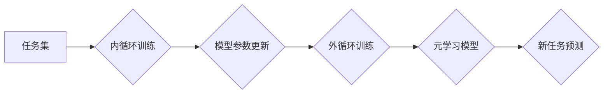

## 元学习(Meta-Learning) - 原理与代码实例讲解

> 关键词：元学习、迁移学习、快速学习、Few-Shot Learning、Meta-Training、Meta-Testing

## 1. 背景介绍

在机器学习领域，我们通常训练模型来解决特定的任务，例如图像分类、文本生成或语音识别。然而，当面对新的任务时，模型需要从头开始训练，这往往需要大量的样本数据和计算资源。元学习（Meta-Learning）应运而生，它旨在学习如何学习，从而使模型能够更快、更有效地适应新的任务。

元学习的核心思想是通过学习一系列任务的学习策略，来提高模型在面对新任务时的泛化能力。换句话说，元学习的目标不是直接学习一个特定任务的模型，而是学习一个能够快速适应新任务的“学习器”。

## 2. 核心概念与联系

元学习的核心概念包括：

* **内循环（Inner Loop）：** 在元学习过程中，内循环指的是针对单个任务进行模型训练的过程。
* **外循环（Outer Loop）：** 外循环指的是针对多个任务进行元学习训练的过程，在这个过程中，模型的参数会根据对多个任务的学习性能进行更新。
* **支持集（Support Set）：**  用于训练模型的少量样本数据，通常包含多个任务的样本。
* **查询集（Query Set）：** 用于评估模型性能的样本数据，通常包含新任务的样本。

**元学习流程图:**



## 3. 核心算法原理 & 具体操作步骤

### 3.1  算法原理概述

元学习算法的核心思想是通过学习一个“学习器”，来提高模型在面对新任务时的泛化能力。这个“学习器”可以看作是一个能够根据少量样本数据快速学习新任务的模型。

常见的元学习算法包括：

* **MAML (Model-Agnostic Meta-Learning):**  MAML 是一种通用的元学习算法，它可以应用于各种机器学习模型。MAML 的目标是学习一个模型参数，使得在给定少量样本数据后，模型能够快速适应新的任务。
* **Prototypical Networks:**  Prototypical Networks 是一种基于原型学习的元学习算法，它将每个类别的样本数据聚类成一个原型，然后根据新样本数据与原型之间的距离进行分类。
* **Matching Networks:**  Matching Networks 是一种基于匹配学习的元学习算法，它通过学习一个匹配函数，来比较新样本数据与支持集中的样本数据之间的相似性。

### 3.2  算法步骤详解

以 MAML 算法为例，其具体操作步骤如下：

1. **初始化模型参数:**  随机初始化模型参数。
2. **元训练:**
    * 从任务集 T 中随机抽取一个任务 T_i。
    * 在 T_i 的支持集上进行内循环训练，更新模型参数。
    * 计算模型在 T_i 的查询集上的性能。
    * 根据模型在所有任务上的平均性能更新模型参数。
3. **元测试:**
    * 从任务集 T 中随机抽取一个新任务 T_j。
    * 在 T_j 的支持集上进行少量内循环训练，更新模型参数。
    * 计算模型在 T_j 的查询集上的性能。

### 3.3  算法优缺点

**优点:**

* **快速适应新任务:** 元学习模型能够在给定少量样本数据后快速适应新的任务。
* **提高泛化能力:** 元学习模型能够学习到更通用的学习策略，从而提高其在面对新任务时的泛化能力。

**缺点:**

* **计算成本高:** 元学习算法通常需要进行大量的训练，计算成本较高。
* **数据需求:** 元学习算法需要大量的任务数据进行训练。

### 3.4  算法应用领域

元学习算法在以下领域具有广泛的应用前景:

* **自然语言处理:**  例如文本分类、机器翻译、问答系统等。
* **计算机视觉:**  例如图像识别、目标检测、图像分割等。
* **机器人学:**  例如机器人控制、机器人导航等。
* **个性化推荐:**  例如商品推荐、内容推荐等。

## 4. 数学模型和公式 & 详细讲解 & 举例说明

### 4.1  数学模型构建

元学习的目标是学习一个能够快速适应新任务的“学习器”。我们可以将这个学习器表示为一个函数 f(θ, x), 其中 θ 是模型参数，x 是输入数据。

在元学习过程中，我们通常使用一个损失函数 L(θ, x, y) 来衡量模型的性能，其中 y 是真实标签。

### 4.2  公式推导过程

MAML 算法的目标是学习一个模型参数 θ*, 使得在给定少量样本数据后，模型能够快速适应新的任务。

MAML 的损失函数可以表示为:

$$
L(\theta) = \frac{1}{N} \sum_{i=1}^{N} L_i(\theta, x_i, y_i)
$$

其中 N 是任务的数量，L_i(θ, x_i, y_i) 是第 i 个任务的损失函数。

MAML 使用梯度下降法来更新模型参数 θ。

梯度下降法的更新规则可以表示为:

$$
\theta = \theta - \alpha \nabla_{\theta} L(\theta)
$$

其中 α 是学习率。

### 4.3  案例分析与讲解

假设我们有一个图像分类任务，需要训练一个模型来识别猫和狗的图片。

我们可以使用 MAML 算法来训练一个元学习模型。

在元训练阶段，我们从一个包含多个猫和狗图片的任务集 T 中随机抽取一个任务 T_i。

然后，我们使用 T_i 的支持集进行内循环训练，更新模型参数。

最后，我们计算模型在 T_i 的查询集上的性能，并根据模型在所有任务上的平均性能更新模型参数。

在元测试阶段，我们从任务集 T 中随机抽取一个新任务 T_j。

然后，我们使用 T_j 的支持集进行少量内循环训练，更新模型参数。

最后，我们计算模型在 T_j 的查询集上的性能。

## 5. 项目实践：代码实例和详细解释说明

### 5.1  开发环境搭建

* Python 3.6+
* PyTorch 1.0+
* NumPy
* Matplotlib

### 5.2  源代码详细实现

```python
import torch
import torch.nn as nn
import torch.optim as optim

# 定义一个简单的元学习模型
class MetaModel(nn.Module):
    def __init__(self, input_size, output_size):
        super(MetaModel, self).__init__()
        self.fc1 = nn.Linear(input_size, 64)
        self.fc2 = nn.Linear(64, output_size)

    def forward(self, x):
        x = torch.relu(self.fc1(x))
        x = self.fc2(x)
        return x

# 定义元学习训练函数
def meta_train(model, optimizer, train_loader, epochs):
    for epoch in range(epochs):
        for task_id, (support_x, support_y, query_x, query_y) in enumerate(train_loader):
            # 内循环训练
            optimizer.zero_grad()
            support_output = model(support_x)
            support_loss = nn.CrossEntropyLoss()(support_output, support_y)
            support_loss.backward()
            optimizer.step()

            # 外循环更新
            query_output = model(query_x)
            query_loss = nn.CrossEntropyLoss()(query_output, query_y)
            query_loss.backward()
            optimizer.step()

            print(f"Epoch: {epoch}, Task: {task_id}, Support Loss: {support_loss.item():.4f}, Query Loss: {query_loss.item():.4f}")

# 定义元学习测试函数
def meta_test(model, test_loader):
    model.eval()
    total_correct = 0
    total_samples = 0
    for task_id, (support_x, support_y, query_x, query_y) in enumerate(test_loader):
        with torch.no_grad():
            query_output = model(query_x)
            _, predicted = torch.max(query_output.data, 1)
            total_correct += (predicted == query_y).sum().item()
            total_samples += query_y.size(0)
    accuracy = total_correct / total_samples
    print(f"Test Accuracy: {accuracy:.4f}")

# 实例化模型、优化器和数据加载器
model = MetaModel(input_size=784, output_size=10)
optimizer = optim.Adam(model.parameters(), lr=0.001)
train_loader =... # 数据加载器
test_loader =... # 数据加载器

# 元学习训练
meta_train(model, optimizer, train_loader, epochs=10)

# 元学习测试
meta_test(model, test_loader)
```

### 5.3  代码解读与分析

* **模型定义:**  代码中定义了一个简单的元学习模型 `MetaModel`，它是一个两层全连接神经网络。
* **元学习训练函数:**  `meta_train` 函数实现了 MAML 算法的训练过程。
* **内循环训练:**  在每个任务上进行内循环训练，更新模型参数。
* **外循环更新:**  根据所有任务的平均性能更新模型参数。
* **元学习测试函数:**  `meta_test` 函数实现了元学习模型的测试过程。
* **数据加载器:**  需要根据实际数据集构建数据加载器。

### 5.4  运行结果展示

运行代码后，会输出训练和测试过程中的损失值和准确率。

## 6. 实际应用场景

元学习算法在以下领域具有广泛的应用前景:

* **个性化推荐:**  根据用户的历史行为数据，学习用户的偏好，并推荐个性化的商品或内容。
* **医疗诊断:**  根据患者的症状和病史数据，学习疾病的诊断规则，并辅助医生进行诊断。
* **金融风险评估:**  根据用户的财务数据，学习用户的风险偏好，并评估用户的金融风险。

### 6.4  未来应用展望

随着元学习算法的不断发展，其应用场景将会更加广泛。

未来，元学习算法可能会被应用于:

* **自动驾驶:**  学习驾驶规则，并能够快速适应不同的道路环境。
* **机器人控制:**  学习机器人控制策略，并能够适应不同的任务和环境。
* **自然语言理解:**  学习更复杂的语言理解规则，并能够更好地理解人类语言。

## 7. 工具和资源推荐

### 7.1  学习资源推荐

* **书籍:**
    * 《Deep Learning》 by Ian Goodfellow, Yoshua Bengio, and Aaron Courville
    * 《Meta-Learning with Differentiable Convex Optimization》 by Timothy Hospedales and Antreas Antoniou
* **论文:**
    * 《Model-Agnostic Meta-Learning for Fast Adaptation of Deep Networks》 by Finn et al.
    * 《Prototypical Networks for Few-Shot Learning》 by Snell et al.
* **在线课程:**
    * Coursera: Deep Learning Specialization
    * Udacity: Machine Learning Engineer Nanodegree

### 7.2  开发工具推荐

* **PyTorch:**  一个开源的深度学习框架。
* **TensorFlow:**  另一个开源的深度学习框架。
* **Keras:**  一个基于 TensorFlow 的高层深度学习 API。

### 7.3  相关论文推荐

* 《Meta-Learning with Differentiable Convex Optimization》