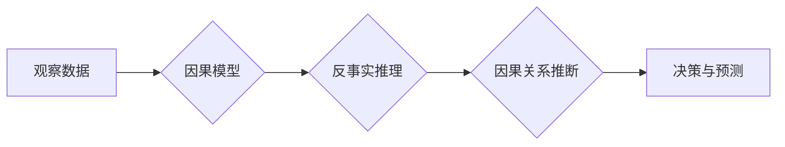

## 关键词：因果推理、因果图、贝叶斯网络、深度学习、反事实推理、可解释性AI

## 1. 背景介绍

在数据爆炸的时代，我们拥有前所未有的数据量，但仅仅拥有数据并不能带来真正的洞察力。我们需要能够理解数据背后的因果关系，才能真正地掌握数据的力量。因果推理是指从观察到的数据中推断出因果关系的过程，它能够帮助我们回答“为什么”问题，并预测未来的事件发生。

传统的统计方法主要关注关联性，而因果推理则更进一步，试图揭示变量之间的因果关系。例如，我们观察到吸烟和肺癌的发病率较高，但这并不意味着吸烟导致肺癌。可能存在其他因素，例如遗传因素或环境因素，也可能导致肺癌。只有通过因果推理，我们才能确定吸烟是否确实是肺癌的直接原因。

因果推理在许多领域都有广泛的应用，例如：

* **医疗保健:** 识别疾病的潜在原因，预测患者的治疗效果，开发新的治疗方案。
* **市场营销:** 了解广告的效果，预测客户的行为，优化营销策略。
* **社会科学:** 研究社会现象的成因，预测社会趋势，制定政策建议。
* **人工智能:** 构建更智能、更可靠的 AI 系统，提高 AI 的可解释性。

## 2. 核心概念与联系

因果推理的核心概念包括：

* **因果关系:** 指一个事件或因素导致另一个事件或因素发生。
* **干预:**  人为改变一个变量的值，观察其对其他变量的影响。
* **反事实:**  假设某个事件没有发生，观察其对其他事件的影响。

这些概念之间相互关联，共同构成了因果推理的框架。

**Mermaid 流程图**



## 3. 核心算法原理 & 具体操作步骤

### 3.1  算法原理概述

因果推理算法旨在从数据中学习因果关系。常见的因果推理算法包括：

* **贝叶斯网络:**  一种概率图模型，用于表示变量之间的因果关系。
* **因果图:**  一种图形模型，用于表示变量之间的因果关系。
* **深度学习:**  一种机器学习方法，可以学习复杂的因果关系。

### 3.2  算法步骤详解

以贝叶斯网络为例，其学习因果关系的步骤如下：

1. **构建因果图:**  根据领域知识和数据特征，构建一个表示变量之间因果关系的图。
2. **学习概率分布:**  使用数据训练贝叶斯网络，学习每个变量的条件概率分布。
3. **因果推断:**  利用贝叶斯网络的概率计算规则，推断出变量之间的因果关系。

### 3.3  算法优缺点

**贝叶斯网络:**

* **优点:**  能够表示复杂的因果关系，具有可解释性。
* **缺点:**  需要大量的领域知识来构建因果图，学习过程可能比较复杂。

**因果图:**

* **优点:**  能够表示更抽象的因果关系，具有更强的泛化能力。
* **缺点:**  需要更复杂的算法来学习因果关系，可解释性相对较弱。

**深度学习:**

* **优点:**  能够学习复杂的非线性关系，具有强大的学习能力。
* **缺点:**  可解释性较差，难以理解模型的决策过程。

### 3.4  算法应用领域

因果推理算法在许多领域都有广泛的应用，例如：

* **医疗保健:**  识别疾病的潜在原因，预测患者的治疗效果，开发新的治疗方案。
* **市场营销:**  了解广告的效果，预测客户的行为，优化营销策略。
* **社会科学:**  研究社会现象的成因，预测社会趋势，制定政策建议。
* **人工智能:**  构建更智能、更可靠的 AI 系统，提高 AI 的可解释性。

## 4. 数学模型和公式 & 详细讲解 & 举例说明

### 4.1  数学模型构建

因果推理的数学模型通常基于概率论和图论。

* **概率论:**  用于描述变量之间的概率关系。
* **图论:**  用于表示变量之间的因果关系。

例如，贝叶斯网络可以使用概率图模型来表示变量之间的因果关系，并使用贝叶斯定理来计算变量之间的条件概率。

### 4.2  公式推导过程

**贝叶斯定理:**

$$P(A|B) = \frac{P(B|A)P(A)}{P(B)}$$

其中：

* $P(A|B)$ 是事件 A 在事件 B 发生的条件概率。
* $P(B|A)$ 是事件 B 在事件 A 发生的条件概率。
* $P(A)$ 是事件 A 的概率。
* $P(B)$ 是事件 B 的概率。

**举例说明:**

假设我们有一个贝叶斯网络，其中变量 A 是“吸烟”，变量 B 是“肺癌”。根据数据，我们知道：

* $P(B|A) = 0.2$ (吸烟会导致肺癌的概率为 20%)
* $P(A) = 0.3$ (吸烟的概率为 30%)
* $P(B) = 0.05$ (肺癌的概率为 5%)

根据贝叶斯定理，我们可以计算出吸烟者患肺癌的概率：

$$P(A|B) = \frac{0.2 \times 0.3}{0.05} = 1.2$$

### 4.3  案例分析与讲解

通过贝叶斯网络，我们可以分析因果关系，并进行反事实推理。例如，我们可以假设“如果这个人没有吸烟，他患肺癌的概率是多少？”

通过反事实推理，我们可以得到：

$$P(B|¬A) = \frac{P(¬A|B)P(¬A)}{P(B)}$$

其中：

* $P(¬A|B)$ 是“不吸烟”在“患肺癌”的情况下发生的概率。
* $P(¬A)$ 是“不吸烟”的概率。

通过计算，我们可以得到“如果这个人没有吸烟，他患肺癌的概率”是多少。

## 5. 项目实践：代码实例和详细解释说明

### 5.1  开发环境搭建

* Python 3.x
* PyTorch 或 TensorFlow
* 其他必要的库，例如 NumPy、Pandas

### 5.2  源代码详细实现

```python
import torch
import torch.nn as nn

# 定义一个简单的贝叶斯网络模型
class BayesianNetwork(nn.Module):
    def __init__(self, input_size, hidden_size, output_size):
        super(BayesianNetwork, self).__init__()
        self.fc1 = nn.Linear(input_size, hidden_size)
        self.fc2 = nn.Linear(hidden_size, output_size)

    def forward(self, x):
        x = torch.relu(self.fc1(x))
        x = self.fc2(x)
        return x

# 训练数据
input_data = torch.randn(100, 5)
output_data = torch.randn(100, 2)

# 创建模型实例
model = BayesianNetwork(input_size=5, hidden_size=10, output_size=2)

# 定义损失函数和优化器
criterion = nn.CrossEntropyLoss()
optimizer = torch.optim.Adam(model.parameters(), lr=0.01)

# 训练模型
for epoch in range(100):
    # 前向传播
    outputs = model(input_data)
    loss = criterion(outputs, output_data)

    # 反向传播
    optimizer.zero_grad()
    loss.backward()

    # 更新参数
    optimizer.step()

# 保存模型
torch.save(model.state_dict(), 'bayesian_network.pth')
```

### 5.3  代码解读与分析

* 代码首先定义了一个简单的贝叶斯网络模型，该模型使用两个全连接层来学习输入数据和输出数据的映射关系。
* 然后，代码创建了训练数据和模型实例，并定义了损失函数和优化器。
* 最后，代码训练了模型，并保存了训练好的模型参数。

### 5.4  运行结果展示

训练完成后，我们可以使用保存的模型参数来预测新的数据。

## 6. 实际应用场景

因果推理在许多实际应用场景中都有着重要的作用。例如：

* **医疗保健:**  识别疾病的潜在原因，预测患者的治疗效果，开发新的治疗方案。
* **市场营销:**  了解广告的效果，预测客户的行为，优化营销策略。
* **社会科学:**  研究社会现象的成因，预测社会趋势，制定政策建议。
* **人工智能:**  构建更智能、更可靠的 AI 系统，提高 AI 的可解释性。

### 6.4  未来应用展望

随着人工智能技术的不断发展，因果推理将在未来发挥越来越重要的作用。例如：

* **个性化医疗:**  根据患者的个体特征，预测疾病风险和治疗效果，制定个性化的治疗方案。
* **精准营销:**  根据客户的兴趣和行为，精准推送广告和产品推荐，提高营销效果。
* **自动驾驶:**  理解道路环境和交通规则，提高自动驾驶系统的安全性。

## 7. 工具和资源推荐

### 7.1  学习资源推荐

* **书籍:**
    * Causality: Models, Reasoning, and Inference by Judea Pearl
    * The Book of Why: The New Science of Cause and Effect by Judea Pearl and Dana Mackenzie
* **课程:**
    * Causal Inference: The Mixtape by Scott Cunningham
    * Causal Inference with Python by University of California, Berkeley

### 7.2  开发工具推荐

* **Python:**  一个流行的编程语言，广泛用于机器学习和数据科学。
* **PyTorch:**  一个开源的深度学习框架，支持因果推理算法的开发。
* **TensorFlow:**  另一个开源的深度学习框架，也支持因果推理算法的开发。

### 7.3  相关论文推荐

* **Doeblin, P., &  Pearl, J. (2003). Causal inference with Bayesian networks. In Proceedings of the 17th conference on Uncertainty in artificial intelligence (pp. 31-38).**
* **Shpitser, I., & Pearl, J. (2006).  Causal discovery with latent variables. In Proceedings of the 22nd conference on Uncertainty in artificial intelligence (pp. 31-38).**

## 8. 总结：未来发展趋势与挑战

### 8.1  研究成果总结

近年来，因果推理领域取得了显著的进展，包括：

* **贝叶斯网络:**  贝叶斯网络是一种经典的因果推理方法，在许多领域都有广泛的应用。
* **因果图:**  因果图是一种更抽象的因果推理方法，具有更强的泛化能力。
* **深度学习:**  深度学习方法能够学习复杂的因果关系，但其可解释性较差。

### 8.2  未来发展趋势

未来，因果推理领域将朝着以下几个方向发展：

* **更强大的算法:**  开发更强大的因果推理算法，能够学习更复杂的因果关系。
* **更好的可解释性:**  提高因果推理算法的可解释性，使模型的决策过程更加透明。
* **更广泛的应用:**  将因果推理应用到更多领域，例如自动驾驶、个性化医疗等。

### 8.3  面临的挑战

因果推理领域也面临着一些挑战：

* **数据稀缺:**  因果关系的学习需要大量的因果数据，而因果数据往往比较稀缺。
* **因果关系的复杂性:**  现实世界中的因果关系往往非常复杂，难以用简单的模型来表示。
* **可解释性的问题:**  许多深度学习方法的可解释性较差，难以理解模型的决策过程。

### 8.4  研究展望

尽管面临着挑战，但因果推理领域仍然充满着希望。随着人工智能技术的不断发展，