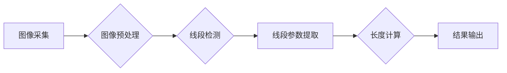

## 基于Opencv的卡尺找线系统详细设计与具体代码实现

> 关键词：OpenCV, 卡尺找线, 图像处理, 线段检测, 测量, Python

## 1. 背景介绍

在工业生产、建筑测量、科研实验等领域，精确测量线段长度是不可或缺的一环。传统的测量方法往往依赖人工操作，容易受到人为误差的影响，效率低下。随着计算机视觉技术的快速发展，基于图像处理的测量方法逐渐成为主流。

卡尺找线系统是一种利用图像处理技术实现线段长度测量的自动化系统。其原理是通过摄像头拍摄目标图像，利用OpenCV等图像处理库对图像进行分析，识别出目标线段，并根据已知的标定信息计算出线段长度。

本篇文章将详细介绍基于OpenCV的卡尺找线系统的详细设计与具体代码实现，包括核心概念、算法原理、数学模型、代码实例以及实际应用场景等方面。

## 2. 核心概念与联系

卡尺找线系统主要包含以下核心概念：

* **图像采集:** 利用摄像头获取目标图像。
* **图像预处理:** 对图像进行灰度化、去噪、二值化等处理，增强图像质量。
* **线段检测:** 利用OpenCV中的边缘检测、霍夫变换等算法识别目标线段。
* **线段参数提取:** 获取线段的起点、终点坐标以及方向等参数。
* **长度计算:** 根据线段参数和已知的标定信息计算出线段长度。

**核心架构流程图:**



## 3. 核心算法原理 & 具体操作步骤

### 3.1  算法原理概述

卡尺找线系统中，线段检测是核心步骤。常用的算法包括：

* **边缘检测:** 利用Sobel、Canny等算子检测图像边缘，提取线段轮廓。
* **霍夫变换:** 将图像边缘点投影到参数空间，通过投票机制检测出直线。
* **Hough线变换:** 是一种改进的霍夫变换，可以检测出多条直线。

### 3.2  算法步骤详解

以Canny边缘检测和霍夫变换为例，详细说明算法步骤：

1. **图像预处理:** 对原始图像进行灰度化、去噪等处理，提高边缘检测的准确性。
2. **Canny边缘检测:**
    * 采用高斯滤波平滑图像，减少噪声干扰。
    * 计算图像梯度幅值和方向。
    * 应用非极大值抑制算法，抑制非边缘像素。
    * 应用双阈值法，确定边缘点。
3. **霍夫变换:**
    * 将边缘点投影到参数空间，每个点对应一个直线参数。
    * 通过投票机制，统计每个参数出现的次数。
    * 设定阈值，将投票次数超过阈值的直线参数作为检测结果。

### 3.3  算法优缺点

**Canny边缘检测和霍夫变换的优缺点:**

* **优点:** 
    * 检测精度高，能够有效识别出直线特征。
    * 算法实现相对简单，易于理解和编程。
* **缺点:** 
    * 对图像噪声敏感，需要进行充分的图像预处理。
    * 难以检测出弯曲的线段或多条交错的线段。

### 3.4  算法应用领域

Canny边缘检测和霍夫变换广泛应用于：

* **机器视觉:** 物体识别、定位、跟踪等。
* **图像分析:** 图像分割、特征提取等。
* **自动驾驶:** 道路检测、车道线识别等。

## 4. 数学模型和公式 & 详细讲解 & 举例说明

### 4.1  数学模型构建

卡尺找线系统中，线段长度计算的数学模型可以表示为：

$$
L = \frac{d}{s}
$$

其中：

* $L$ 为线段长度。
* $d$ 为线段在图像中的像素长度。
* $s$ 为图像中单位像素对应的实际长度。

### 4.2  公式推导过程

公式推导过程如下：

1. 假设摄像头拍摄的图像与实际场景成比例，即图像中像素长度与实际长度成比例。
2. 设图像中单位像素对应的实际长度为 $s$。
3. 线段在图像中的像素长度为 $d$，则线段实际长度为 $L = d \times s$。

### 4.3  案例分析与讲解

假设摄像头拍摄的图像中，线段在图像中的像素长度为 100 像素，图像中单位像素对应的实际长度为 1 毫米。则根据公式，线段的实际长度为：

$$
L = 100 \times 1 = 100 \text{ 毫米}
$$

## 5. 项目实践：代码实例和详细解释说明

### 5.1  开发环境搭建

本项目使用 Python 语言和 OpenCV 库进行开发。

* **Python:** Python 3.x 版本。
* **OpenCV:** OpenCV 4.x 版本。

### 5.2  源代码详细实现

```python
import cv2
import numpy as np

# 读取图像
image = cv2.imread('image.jpg')

# 图像灰度化
gray = cv2.cvtColor(image, cv2.COLOR_BGR2GRAY)

# Canny边缘检测
edges = cv2.Canny(gray, 50, 150)

# 霍夫变换
lines = cv2.HoughLinesP(edges, 1, np.pi/180, 100)

# 绘制检测到的直线
for line in lines:
    x1, y1, x2, y2 = line[0]
    cv2.line(image, (x1, y1), (x2, y2), (0, 0, 255), 2)

# 显示结果
cv2.imshow('Result', image)
cv2.waitKey(0)
cv2.destroyAllWindows()
```

### 5.3  代码解读与分析

* **读取图像:** 使用 `cv2.imread()` 函数读取图像文件。
* **图像灰度化:** 使用 `cv2.cvtColor()` 函数将彩色图像转换为灰度图像。
* **Canny边缘检测:** 使用 `cv2.Canny()` 函数进行边缘检测，参数分别为图像、低阈值、高阈值。
* **霍夫变换:** 使用 `cv2.HoughLinesP()` 函数进行霍夫变换，参数分别为边缘图像、线段间距、角度间距、投票阈值。
* **绘制检测到的直线:** 使用 `cv2.line()` 函数绘制检测到的直线。
* **显示结果:** 使用 `cv2.imshow()` 函数显示结果图像。

### 5.4  运行结果展示

运行代码后，将显示一张带有检测到的直线的图像。

## 6. 实际应用场景

卡尺找线系统在工业生产、建筑测量、科研实验等领域具有广泛的应用场景：

* **工业生产:** 用于测量工件尺寸、检测产品缺陷等。
* **建筑测量:** 用于测量建筑物高度、长度、宽度等。
* **科研实验:** 用于测量实验样品的尺寸、形状等。

### 6.4  未来应用展望

随着计算机视觉技术的不断发展，卡尺找线系统将朝着以下方向发展：

* **更高精度:** 利用深度学习等先进算法提高线段检测精度。
* **更智能化:** 实现自动识别和测量多个线段，并自动生成测量报告。
* **更广泛应用:** 应用于更多领域，例如医疗影像分析、自动驾驶等。

## 7. 工具和资源推荐

### 7.1  学习资源推荐

* **OpenCV 官方文档:** https://docs.opencv.org/
* **Python 图像处理教程:** https://www.pyimagesearch.com/

### 7.2  开发工具推荐

* **VS Code:** https://code.visualstudio.com/
* **PyCharm:** https://www.jetbrains.com/pycharm/

### 7.3  相关论文推荐

* **Canny Edge Detector:** https://ieeexplore.ieee.org/document/697871
* **Hough Transform for Line Detection:** https://ieeexplore.ieee.org/document/1161109

## 8. 总结：未来发展趋势与挑战

### 8.1  研究成果总结

本篇文章详细介绍了基于OpenCV的卡尺找线系统的详细设计与具体代码实现，包括核心概念、算法原理、数学模型、代码实例以及实际应用场景等方面。

### 8.2  未来发展趋势

卡尺找线系统将朝着更高精度、更智能化、更广泛应用的方向发展。

### 8.3  面临的挑战

* **复杂场景处理:** 对于复杂场景，例如光照变化、遮挡物等，需要开发更 robust 的算法。
* **实时性要求:** 在一些实时应用场景中，需要提高算法的实时性。
* **数据标注:** 深度学习算法需要大量的标注数据，数据标注工作量较大。

### 8.4  研究展望

未来将继续研究更先进的算法和技术，提高卡尺找线系统的性能和应用范围。

## 9. 附录：常见问题与解答

* **Q1: 如何选择合适的边缘检测算法？**

* **A1:** 选择边缘检测算法需要根据图像特点和应用场景进行选择。Canny边缘检测算法精度高，但对噪声敏感；Sobel算子简单快速，但精度较低。

* **Q2: 如何提高霍夫变换的检测精度？**

* **A2:** 可以通过调整霍夫变换的参数，例如线段间距、角度间距、投票阈值等，来提高检测精度。

* **Q3: 如何实现自动识别和测量多个线段？**

* **A3:** 可以利用图像分割、特征提取等技术，将图像分割成多个区域，然后对每个区域进行线段检测和测量。


作者：禅与计算机程序设计艺术 / Zen and the Art of Computer Programming 
