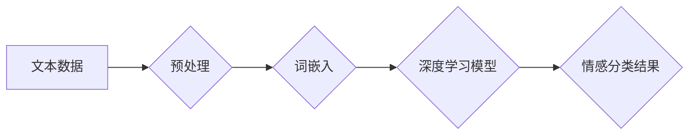

## 基于深度学习的文本情感分析

> 关键词：深度学习、文本情感分析、自然语言处理、卷积神经网络、循环神经网络、BERT、情感分类、情绪识别

## 1. 背景介绍

文本情感分析（Text Sentiment Analysis），又称情感计算（Sentiment Computing），是自然语言处理（NLP）领域的重要研究方向之一。它旨在从文本数据中识别和理解作者表达的情感倾向，例如正面、负面或中立。随着互联网和社交媒体的蓬勃发展，海量文本数据被不断产生，文本情感分析技术在各个领域都得到了广泛应用，例如：

* **市场营销:** 分析客户对产品或服务的评价，了解市场趋势和消费者需求。
* **品牌监控:** 监测品牌形象和口碑，及时应对负面舆情。
* **社交媒体分析:** 了解用户对特定事件或话题的看法，进行舆情分析和趋势预测。
* **客户服务:** 自动识别客户情绪，提供更精准和人性化的服务。
* **金融领域:** 分析市场情绪，预测股票价格走势。

传统的文本情感分析方法主要依赖于规则匹配和词袋模型等方法，但这些方法难以处理文本数据中的复杂语义和上下文信息。随着深度学习技术的快速发展，基于深度学习的文本情感分析方法取得了显著的进步，能够更准确地识别和理解文本的情感倾向。

## 2. 核心概念与联系

**2.1  自然语言处理 (NLP)**

自然语言处理 (NLP) 是计算机科学的一个分支，旨在使计算机能够理解、处理和生成人类语言。NLP 涉及许多子领域，例如：

* **文本分类:** 将文本数据分类到预定义的类别中，例如情感分类、主题分类等。
* **文本摘要:** 从长文本中提取关键信息，生成简短的摘要。
* **机器翻译:** 将文本从一种语言翻译成另一种语言。
* **问答系统:** 能够理解用户的问题并提供准确的答案。

**2.2  深度学习 (Deep Learning)**

深度学习是机器学习的一个子领域，它利用多层神经网络来学习数据中的复杂模式。深度学习模型能够自动提取特征，无需人工特征工程，因此在许多任务中都取得了优异的性能。

**2.3  文本情感分析 (Sentiment Analysis)**

文本情感分析是利用深度学习技术从文本数据中识别和理解作者表达的情感倾向。

**2.4  情感分类 (Sentiment Classification)**

情感分类是文本情感分析的一个重要任务，它将文本数据分类到预定义的情感类别中，例如：

* **正面 (Positive):** 表达赞赏、喜爱、积极的情绪。
* **负面 (Negative):** 表达不满、厌恶、消极的情绪。
* **中立 (Neutral):** 不表达明显的情感倾向。

**2.5  情绪识别 (Emotion Recognition)**

情绪识别是文本情感分析的一个更细粒度的任务，它不仅识别文本的情感类别，还识别出具体的细粒度情绪，例如：

* **快乐 (Joy)**
* **悲伤 (Sadness)**
* **愤怒 (Anger)**
* **恐惧 (Fear)**
* **惊喜 (Surprise)**

**2.6  架构图**



## 3. 核心算法原理 & 具体操作步骤

### 3.1  算法原理概述

基于深度学习的文本情感分析算法主要利用深度神经网络来学习文本数据中的情感特征。常见的深度学习模型包括：

* **卷积神经网络 (CNN):** CNN 擅长提取文本中的局部特征，例如单词或短语的组合。
* **循环神经网络 (RNN):** RNN 擅长处理序列数据，例如文本，能够捕捉文本中的上下文信息。
* **Transformer:** Transformer 是近年来兴起的深度学习模型，它利用注意力机制来捕捉文本中的长距离依赖关系，在许多自然语言处理任务中都取得了优异的性能。

### 3.2  算法步骤详解

1. **数据预处理:** 将原始文本数据进行清洗、格式化和转换，例如去除停用词、标点符号、HTML 标签等。
2. **词嵌入:** 将文本中的单词或词语映射到低维向量空间，例如 Word2Vec、GloVe 等词嵌入模型。
3. **深度学习模型训练:** 使用深度学习模型对预处理后的文本数据进行训练，学习文本情感特征。
4. **情感分类:** 将训练好的深度学习模型应用于新的文本数据，预测文本的情感类别。

### 3.3  算法优缺点

**优点:**

* **准确率高:** 深度学习模型能够学习文本数据中的复杂语义和上下文信息，因此在情感分类任务中具有较高的准确率。
* **自动化程度高:** 深度学习模型能够自动提取特征，无需人工特征工程。
* **可扩展性强:** 深度学习模型可以处理海量文本数据。

**缺点:**

* **训练数据需求量大:** 深度学习模型需要大量的训练数据才能达到较高的性能。
* **训练时间长:** 深度学习模型的训练时间通常较长。
* **解释性差:** 深度学习模型的决策过程比较复杂，难以解释模型的预测结果。

### 3.4  算法应用领域

* **市场营销:** 分析客户对产品或服务的评价，了解市场趋势和消费者需求。
* **品牌监控:** 监测品牌形象和口碑，及时应对负面舆情。
* **社交媒体分析:** 了解用户对特定事件或话题的看法，进行舆情分析和趋势预测。
* **客户服务:** 自动识别客户情绪，提供更精准和人性化的服务。
* **金融领域:** 分析市场情绪，预测股票价格走势。

## 4. 数学模型和公式 & 详细讲解 & 举例说明

### 4.1  数学模型构建

深度学习模型的构建通常基于神经网络的结构，例如卷积神经网络 (CNN) 或循环神经网络 (RNN)。这些模型由多个层组成，每一层包含多个神经元。神经元之间通过权重连接，权重决定了神经元之间的信息传递强度。

### 4.2  公式推导过程

深度学习模型的训练过程基于反向传播算法，该算法通过调整神经元的权重来最小化模型的预测误差。反向传播算法的核心公式包括：

* **损失函数:** 用于衡量模型预测结果与真实结果之间的差异。常见的损失函数包括交叉熵损失函数和均方误差损失函数。
* **梯度下降:** 用于更新神经元的权重，使其朝着最小化损失函数的方向变化。梯度下降算法的公式如下：

$$
\theta = \theta - \alpha \nabla L(\theta)
$$

其中：

* $\theta$ 是神经元的权重。
* $\alpha$ 是学习率，控制着权重更新的步长。
* $\nabla L(\theta)$ 是损失函数关于权重的梯度。

### 4.3  案例分析与讲解

例如，在情感分类任务中，可以使用交叉熵损失函数来衡量模型预测结果与真实情感类别之间的差异。假设模型预测文本属于正面的概率为 $p$, 真实情感类别为正面的概率为 $y$, 则交叉熵损失函数可以表示为：

$$
L = -y \log(p) - (1-y) \log(1-p)
$$

通过反向传播算法，可以计算出损失函数关于权重的梯度，并根据梯度更新权重，从而提高模型的预测准确率。

## 5. 项目实践：代码实例和详细解释说明

### 5.1  开发环境搭建

* Python 3.x
* TensorFlow 或 PyTorch 深度学习框架
* NLTK 自然语言处理库
* Scikit-learn 机器学习库

### 5.2  源代码详细实现

```python
import tensorflow as tf
from tensorflow.keras.models import Sequential
from tensorflow.keras.layers import Embedding, Conv1D, MaxPooling1D, Flatten, Dense

# 数据预处理和词嵌入
#...

# 模型构建
model = Sequential()
model.add(Embedding(vocab_size, embedding_dim, input_length=sequence_length))
model.add(Conv1D(filters=64, kernel_size=3, activation='relu'))
model.add(MaxPooling1D(pool_size=2))
model.add(Flatten())
model.add(Dense(units=1, activation='sigmoid'))

# 模型编译
model.compile(optimizer='adam', loss='binary_crossentropy', metrics=['accuracy'])

# 模型训练
model.fit(X_train, y_train, epochs=10, batch_size=32)

# 模型评估
loss, accuracy = model.evaluate(X_test, y_test)
print('Test Loss:', loss)
print('Test Accuracy:', accuracy)
```

### 5.3  代码解读与分析

* **数据预处理和词嵌入:** 这一部分代码负责将原始文本数据进行清洗、格式化和转换，并使用词嵌入模型将文本中的单词映射到低维向量空间。
* **模型构建:** 代码构建了一个简单的卷积神经网络模型，包含嵌入层、卷积层、最大池化层、扁平化层和全连接层。
* **模型编译:** 代码使用 Adam 优化器、二元交叉熵损失函数和准确率作为评估指标对模型进行编译。
* **模型训练:** 代码使用训练数据对模型进行训练，训练过程会迭代地更新模型的权重，使其能够更好地预测文本的情感类别。
* **模型评估:** 代码使用测试数据对模型进行评估，并打印出测试损失和准确率。

### 5.4  运行结果展示

运行代码后，可以得到模型的测试损失和准确率。

## 6. 实际应用场景

### 6.1  市场营销

* **产品评价分析:** 分析客户对产品评价的正面、负面和中立情绪，了解产品优缺点，改进产品设计和营销策略。
* **广告效果评估:** 评估广告文案和广告投放效果，优化广告内容和投放策略。
* **品牌监控:** 监测品牌形象和口碑，及时应对负面舆情，维护品牌声誉。

### 6.2  社交媒体分析

* **舆情监测:** 监测社交媒体平台上的用户对特定事件或话题的看法，了解舆情趋势和热点，及时应对危机。
* **用户情绪分析:** 分析用户在社交媒体平台上的情绪倾向，了解用户需求和痛点，改进产品和服务。
* **内容推荐:** 根据用户的兴趣和情绪倾向，推荐相关内容，提高用户粘性和参与度。

### 6.3  客户服务

* **自动客服:** 利用深度学习模型构建自动客服系统，能够识别客户的情绪，并提供相应的回复，提高客户服务效率。
* **客户反馈分析:** 分析客户反馈意见，了解客户需求和问题，改进产品和服务。
* **风险预警:** 识别潜在的客户风险，例如客户不满、投诉等，及时采取措施进行干预。

### 6.4  未来应用展望

随着深度学习技术的不断发展，文本情感分析技术将有更广泛的应用场景，例如：

* **医疗领域:** 分析患者的病历和聊天记录，识别患者的情绪状态，提供更精准的医疗服务。
* **教育领域:** 分析学生的学习情况和情绪状态，提供个性化的学习建议和支持。
* **金融领域:** 分析市场情绪和投资者 sentiment，预测股票价格走势，降低投资风险。

## 7. 工具和资源推荐

### 7.1  学习资源推荐

* **书籍:**
    * Deep Learning with Python by Francois Chollet
    * Natural Language Processing with Python by Steven Bird, Ewan Klein, and Edward Loper
* **在线课程:**
    * Coursera: Deep Learning Specialization by Andrew Ng
    * Udacity: Deep Learning Nanodegree
* **博客和网站:**
    * Towards Data Science
    * Machine Learning Mastery

### 7.2  开发工具推荐

* **深度学习框架:** TensorFlow, PyTorch, Keras
* **自然语言处理库:** NLTK, spaCy, Gensim
* **数据可视化工具:**