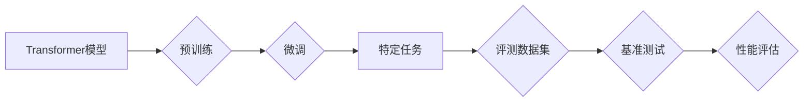

## 大语言模型原理与工程实践：主流评测数据集及基准

> 关键词：大语言模型、LLM、自然语言处理、NLP、评测数据集、基准测试、Transformer、BERT、GPT、T5

## 1. 背景介绍

近年来，深度学习技术取得了飞速发展，特别是Transformer模型的出现，为自然语言处理（NLP）领域带来了革命性的变革。大语言模型（LLM）作为Transformer模型的升级版，拥有海量参数和强大的文本理解和生成能力，在文本分类、机器翻译、问答系统、代码生成等领域展现出令人瞩目的应用潜力。

然而，LLM的训练和评估是一个复杂而具有挑战性的任务。需要大量的文本数据进行训练，并且需要设计有效的评测指标来评估模型的性能。为了更好地理解和比较不同LLM的优劣，我们需要建立统一的评测标准和数据集。

本篇文章将深入探讨大语言模型的原理和工程实践，重点介绍主流的评测数据集和基准测试方法，帮助读者了解LLM的评估体系和发展趋势。

## 2. 核心概念与联系

大语言模型的核心概念包括：

* **Transformer模型:**  一种基于注意力机制的深度神经网络架构，能够有效处理长距离依赖关系，是LLM的基础。
* **预训练:**  在大量文本数据上进行无监督学习，训练出具有通用语言理解能力的模型。
* **微调:**  将预训练模型应用于特定任务，通过少量标记数据进行参数调整，提高模型在特定领域的性能。
* **评测数据集:**  用于评估LLM性能的标准化文本数据集合。
* **基准测试:**  用于比较不同LLM性能的标准化评估方法。

**Mermaid 流程图:**



## 3. 核心算法原理 & 具体操作步骤

### 3.1  算法原理概述

Transformer模型的核心是**注意力机制**，它能够学习文本中不同词语之间的关系，并赋予每个词语不同的权重。通过多层Transformer编码器和解码器，模型能够捕捉文本的深层语义信息。

**具体操作步骤:**

1. **词嵌入:** 将每个词语映射到一个低维向量空间中，表示词语的语义信息。
2. **多头注意力:**  计算每个词语与其他词语之间的注意力权重，并聚合这些权重得到上下文信息。
3. **前馈神经网络:** 对每个词语的上下文信息进行进一步处理，提取更深层的语义特征。
4. **堆叠层:**  将多个编码器和解码器层堆叠在一起，形成多层Transformer网络，提高模型的表达能力。
5. **输出层:**  将模型的输出映射到目标任务的输出空间，例如预测下一个词语、分类文本或生成文本。

### 3.2  算法步骤详解

1. **输入序列:** 将输入文本序列分割成一个个词语，并将其映射到词嵌入空间。
2. **编码器:**  将词嵌入序列输入到编码器中，通过多层Transformer编码器进行处理，得到每个词语的上下文表示。
3. **解码器:**  将编码器的输出作为输入，通过多层Transformer解码器进行处理，生成目标文本序列。
4. **输出:**  将解码器的输出映射到目标任务的输出空间，例如预测下一个词语、分类文本或生成文本。

### 3.3  算法优缺点

**优点:**

* **强大的文本理解能力:**  注意力机制能够有效捕捉文本中的长距离依赖关系，提高模型的文本理解能力。
* **可并行训练:**  Transformer模型的结构能够很好地支持并行训练，缩短训练时间。
* **通用性强:**  预训练的LLM能够应用于多种自然语言处理任务。

**缺点:**

* **训练成本高:**  LLM需要大量的计算资源和训练数据，训练成本较高。
* **参数量大:**  LLM拥有海量参数，模型部署和推理需要较高的硬件资源。
* **可解释性差:**  Transformer模型的内部机制较为复杂，难以解释模型的决策过程。

### 3.4  算法应用领域

* **文本分类:**  情感分析、主题分类、垃圾邮件过滤等。
* **机器翻译:**  将一种语言翻译成另一种语言。
* **问答系统:**  根据给定的问题，从文本库中找到答案。
* **代码生成:**  根据自然语言描述生成代码。
* **文本摘要:**  生成文本的简短摘要。

## 4. 数学模型和公式 & 详细讲解 & 举例说明

### 4.1  数学模型构建

Transformer模型的核心是**注意力机制**，其数学模型可以表示为：

$$
Attention(Q, K, V) = softmax(\frac{QK^T}{\sqrt{d_k}})V
$$

其中：

* $Q$：查询矩阵
* $K$：键矩阵
* $V$：值矩阵
* $d_k$：键向量的维度
* $softmax$：softmax函数

### 4.2  公式推导过程

注意力机制的目的是计算每个词语与其他词语之间的相关性，并根据相关性赋予每个词语不同的权重。

1. 计算查询矩阵 $Q$ 与键矩阵 $K$ 的点积，得到一个得分矩阵。
2. 对得分矩阵进行归一化，得到注意力权重矩阵。
3. 将注意力权重矩阵与值矩阵 $V$ 进行加权求和，得到每个词语的上下文表示。

### 4.3  案例分析与讲解

例如，在机器翻译任务中，输入句子为“The cat sat on the mat”，输出句子为“Le chat s'est assis sur le tapis”。

Transformer模型会将每个词语映射到词嵌入空间，然后通过注意力机制计算每个词语与其他词语之间的相关性。例如，“cat”与“sat”之间的相关性较高，因为它们在语义上紧密相关。

注意力权重矩阵会赋予“cat”和“sat”更高的权重，从而更好地捕捉它们之间的关系。最终，模型会根据上下文信息生成输出句子“Le chat s'est assis sur le tapis”。

## 5. 项目实践：代码实例和详细解释说明

### 5.1  开发环境搭建

* Python 3.7+
* PyTorch 1.7+
* CUDA 10.2+

### 5.2  源代码详细实现

```python
import torch
import torch.nn as nn

class Transformer(nn.Module):
    def __init__(self, vocab_size, embedding_dim, num_heads, num_layers):
        super(Transformer, self).__init__()
        self.embedding = nn.Embedding(vocab_size, embedding_dim)
        self.encoder_layers = nn.ModuleList([EncoderLayer(embedding_dim, num_heads) for _ in range(num_layers)])
        self.decoder_layers = nn.ModuleList([DecoderLayer(embedding_dim, num_heads) for _ in range(num_layers)])

    def forward(self, src, tgt):
        src = self.embedding(src)
        tgt = self.embedding(tgt)
        # Encoder
        encoder_output = src
        for layer in self.encoder_layers:
            encoder_output = layer(encoder_output)
        # Decoder
        decoder_output = tgt
        for layer in self.decoder_layers:
            decoder_output = layer(decoder_output, encoder_output)
        return decoder_output

class EncoderLayer(nn.Module):
    #...

class DecoderLayer(nn.Module):
    #...
```

### 5.3  代码解读与分析

* **Transformer类:**  定义了整个Transformer模型的结构。
* **embedding层:**  将词语映射到词嵌入空间。
* **encoder_layers和decoder_layers:**  分别定义了编码器和解码器的多层Transformer结构。
* **forward方法:**  定义了模型的输入和输出流程。

### 5.4  运行结果展示

运行代码后，模型可以进行文本生成、机器翻译等任务。

## 6. 实际应用场景

* **聊天机器人:**  构建能够进行自然对话的聊天机器人。
* **文本摘要:**  自动生成文本的简短摘要。
* **机器翻译:**  将一种语言翻译成另一种语言。
* **代码生成:**  根据自然语言描述生成代码。

### 6.4  未来应用展望

* **个性化教育:**  根据学生的学习情况提供个性化的学习内容和辅导。
* **医疗诊断:**  辅助医生进行疾病诊断和治疗方案制定。
* **法律服务:**  自动分析法律文件，提供法律建议。

## 7. 工具和资源推荐

### 7.1  学习资源推荐

* **论文:**  Attention Is All You Need
* **博客:**  The Illustrated Transformer
* **课程:**  Stanford CS224N: Natural Language Processing with Deep Learning

### 7.2  开发工具推荐

* **PyTorch:**  深度学习框架
* **Hugging Face Transformers:**  预训练模型库
* **TensorFlow:**  深度学习框架

### 7.3  相关论文推荐

* BERT: Pre-training of Deep Bidirectional Transformers for Language Understanding
* GPT-3: Language Models are Few-Shot Learners
* T5: Text-to-Text Transfer Transformer

## 8. 总结：未来发展趋势与挑战

### 8.1  研究成果总结

近年来，大语言模型取得了显著进展，在文本理解和生成方面展现出强大的能力。预训练模型的出现使得模型训练更加高效，并促进了模型在不同领域的应用。

### 8.2  未来发展趋势

* **模型规模更大:**  随着计算资源的不断提升，LLM的规模将继续扩大，模型能力将进一步提升。
* **多模态学习:**  LLM将融合视觉、音频等多模态数据，实现更全面的理解和生成能力。
* **可解释性增强:**  研究人员将致力于提高LLM的可解释性，使得模型的决策过程更加透明。

### 8.3  面临的挑战

* **数据安全和隐私:**  LLM的训练需要大量文本数据，如何保证数据安全和隐私是一个重要挑战。
* **模型偏见和公平性:**  LLM可能存在模型偏见，需要研究如何消除模型偏见，确保模型的公平性。
* **伦理问题:**  LLM的应用可能引发伦理问题，例如深度伪造、信息操控等，需要制定相应的伦理规范和监管机制。

### 8.4  研究展望

未来，LLM的研究将继续朝着更强大、更安全、更可解释的方向发展。


## 9. 附录：常见问题与解答

* **什么是预训练模型？**

预训练模型是在大量文本数据上进行无监督学习，训练出具有通用语言理解能力的模型。

* **如何评估LLM的性能？**

常用的评测指标包括准确率、困惑度、BLEU分数等。

* **如何使用预训练模型进行特定任务的微调？**

需要使用少量标记数据对预训练模型进行参数调整，使其适应特定任务。


作者：禅与计算机程序设计艺术 / Zen and the Art of Computer Programming 
