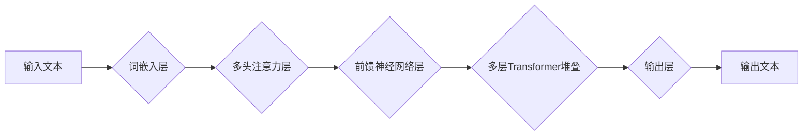

## 大语言模型原理与工程实践：大语言模型基础技术

> 关键词：大语言模型、Transformer、自然语言处理、深度学习、文本生成、机器学习、BERT、GPT

### 1. 背景介绍

近年来，深度学习技术取得了飞速发展，尤其是在自然语言处理（NLP）领域取得了突破性进展。大语言模型（Large Language Model，LLM）作为深度学习在NLP领域的代表性成果，凭借其强大的文本理解和生成能力，在机器翻译、文本摘要、对话系统、代码生成等众多领域展现出巨大的应用潜力。

LLM的出现，标志着人工智能迈向更智能、更人性化的方向。它能够理解和生成人类语言，并完成复杂的语言任务，为我们提供更加便捷、高效的智能服务。

### 2. 核心概念与联系

大语言模型的核心概念是**Transformer**架构。Transformer是一种基于注意力机制的深度神经网络结构，它能够有效地捕捉文本序列中的长距离依赖关系，从而实现更准确的文本理解和生成。

**Mermaid 流程图：**



**核心概念联系：**

* **词嵌入层:** 将文本中的每个单词映射到一个低维向量空间，使得单词之间的语义关系能够被捕捉。
* **多头注意力层:** 能够同时关注文本序列中的多个位置，并学习单词之间的关系，从而捕捉长距离依赖关系。
* **前馈神经网络层:** 对每个单词的嵌入向量进行非线性变换，进一步提取文本特征。
* **多层Transformer堆叠:** 通过堆叠多个Transformer层，可以学习更深层次的文本表示。
* **输出层:** 将最终的文本表示映射到输出文本。

### 3. 核心算法原理 & 具体操作步骤

#### 3.1  算法原理概述

Transformer模型的核心算法是**注意力机制**。注意力机制能够学习文本序列中不同单词之间的重要程度，并根据这些重要程度对单词进行加权求和，从而得到更准确的文本表示。

#### 3.2  算法步骤详解

1. **词嵌入:** 将输入文本中的每个单词映射到一个低维向量空间。
2. **多头注意力:** 对每个单词的嵌入向量进行多头注意力计算，学习单词之间的关系。
3. **前馈神经网络:** 对每个单词的注意力输出进行前馈神经网络计算，进一步提取文本特征。
4. **残差连接和层归一化:** 使用残差连接和层归一化技术，提高模型的训练效率和性能。
5. **堆叠Transformer层:** 将多个Transformer层堆叠在一起，学习更深层次的文本表示。
6. **输出层:** 将最终的文本表示映射到输出文本。

#### 3.3  算法优缺点

**优点:**

* 能够有效地捕捉文本序列中的长距离依赖关系。
* 训练速度快，性能优异。
* 可用于多种自然语言处理任务。

**缺点:**

* 参数量大，需要大量的计算资源进行训练。
* 对训练数据质量要求较高。

#### 3.4  算法应用领域

* 机器翻译
* 文本摘要
* 问答系统
* 对话系统
* 代码生成
* 文本分类
* 情感分析

### 4. 数学模型和公式 & 详细讲解 & 举例说明

#### 4.1  数学模型构建

Transformer模型的数学模型主要包括以下几个部分：

* **词嵌入层:** 使用词向量表示每个单词，例如Word2Vec或GloVe。
* **多头注意力层:** 使用注意力机制计算每个单词与其他单词之间的关系。
* **前馈神经网络层:** 使用多层感知机对每个单词的注意力输出进行非线性变换。

#### 4.2  公式推导过程

**注意力机制公式:**

$$
Attention(Q, K, V) = softmax(\frac{QK^T}{\sqrt{d_k}})V
$$

其中：

* $Q$：查询矩阵
* $K$：键矩阵
* $V$：值矩阵
* $d_k$：键向量的维度
* $softmax$：softmax函数

**多头注意力机制公式:**

$$
MultiHead(Q, K, V) = Concat(head_1, head_2,..., head_h)W^O
$$

其中：

* $head_i$：第 $i$ 个注意力头的输出
* $h$：注意力头的数量
* $W^O$：输出权重矩阵

#### 4.3  案例分析与讲解

**举例说明:**

假设我们有一个句子 "The cat sat on the mat"，我们使用多头注意力机制来计算每个单词与其他单词之间的关系。

* 查询矩阵 $Q$：每个单词的嵌入向量
* 键矩阵 $K$：每个单词的嵌入向量
* 值矩阵 $V$：每个单词的嵌入向量

通过计算注意力分数，我们可以得到每个单词与其他单词之间的关系强度。例如，"cat" 与 "sat" 之间的关系强度较高，因为它们在句子中紧密相连。

### 5. 项目实践：代码实例和详细解释说明

#### 5.1  开发环境搭建

* Python 3.6+
* TensorFlow 或 PyTorch
* CUDA 和 cuDNN (可选，用于GPU加速)

#### 5.2  源代码详细实现

```python
import tensorflow as tf

# 定义词嵌入层
embedding_layer = tf.keras.layers.Embedding(vocab_size, embedding_dim)

# 定义多头注意力层
attention_layer = tf.keras.layers.MultiHeadAttention(num_heads=8, key_dim=64)

# 定义前馈神经网络层
ffn_layer = tf.keras.layers.Dense(units=128, activation='relu')

# 定义Transformer层
def transformer_block(inputs, num_heads, key_dim):
    attention_output = attention_layer(inputs, inputs, inputs)
    ffn_output = ffn_layer(attention_output)
    return tf.keras.layers.Add()([inputs, ffn_output])

# 定义Transformer模型
model = tf.keras.Sequential([
    embedding_layer,
    transformer_block(num_heads=8, key_dim=64),
    # 添加更多Transformer层
    tf.keras.layers.Dense(units=vocab_size, activation='softmax')
])

# 编译模型
model.compile(optimizer='adam', loss='sparse_categorical_crossentropy', metrics=['accuracy'])
```

#### 5.3  代码解读与分析

* **词嵌入层:** 将每个单词映射到一个低维向量空间。
* **多头注意力层:** 计算每个单词与其他单词之间的关系。
* **前馈神经网络层:** 对每个单词的注意力输出进行非线性变换。
* **Transformer层:** 将注意力层和前馈神经网络层组合在一起，形成一个完整的Transformer块。
* **Transformer模型:** 将多个Transformer块堆叠在一起，形成一个完整的Transformer模型。

#### 5.4  运行结果展示

训练完成后，我们可以使用模型对新的文本进行预测。例如，我们可以输入一个句子，模型会预测下一个单词。

### 6. 实际应用场景

#### 6.1  机器翻译

LLM可以用于机器翻译，例如将英文翻译成中文。

#### 6.2  文本摘要

LLM可以用于文本摘要，例如将一篇长篇文章总结成几句话。

#### 6.3  问答系统

LLM可以用于问答系统，例如回答用户提出的问题。

#### 6.4  未来应用展望

LLM在未来将有更广泛的应用场景，例如：

* **个性化教育:** 根据学生的学习情况提供个性化的学习内容和辅导。
* **智能客服:** 提供更加智能、人性化的客服服务。
* **代码生成:** 自动生成代码，提高开发效率。
* **创意写作:** 辅助人类进行创意写作，例如写诗、写小说等。

### 7. 工具和资源推荐

#### 7.1  学习资源推荐

* **书籍:**
    * 《深度学习》
    * 《自然语言处理》
    * 《Transformer模型详解》
* **在线课程:**
    * Coursera: 自然语言处理
    * edX: 深度学习
    * fast.ai: 深度学习课程

#### 7.2  开发工具推荐

* **TensorFlow:** 开源深度学习框架
* **PyTorch:** 开源深度学习框架
* **Hugging Face Transformers:** 提供预训练的LLM模型和工具

#### 7.3  相关论文推荐

* **Attention Is All You Need:** https://arxiv.org/abs/1706.03762
* **BERT: Pre-training of Deep Bidirectional Transformers for Language Understanding:** https://arxiv.org/abs/1810.04805
* **GPT-3: Language Models are Few-Shot Learners:** https://arxiv.org/abs/2005.14165

### 8. 总结：未来发展趋势与挑战

#### 8.1  研究成果总结

LLM在自然语言处理领域取得了显著的成果，例如在机器翻译、文本摘要、问答系统等任务上取得了人类水平的性能。

#### 8.2  未来发展趋势

* **模型规模更大:** 随着计算资源的不断发展，LLM的规模将继续扩大，从而提升模型的性能。
* **训练数据更丰富:** 训练数据是LLM性能的关键因素，未来将会有更多高质量的训练数据可用。
* **模型更加高效:** 研究人员将致力于开发更加高效的LLM训练算法，降低训练成本。
* **应用场景更加广泛:** LLM将应用于更多领域，例如教育、医疗、金融等。

#### 8.3  面临的挑战

* **数据安全和隐私:** LLM的训练需要大量数据，如何保证数据安全和隐私是一个重要挑战。
* **模型可解释性:** LLM的决策过程难以理解，如何提高模型的可解释性是一个重要的研究方向。
* **模型偏见:** LLM可能存在偏见，如何消除模型偏见是一个重要的挑战。

#### 8.4  研究展望

未来，LLM研究将继续朝着更智能、更安全、更可解释的方向发展。


### 9. 附录：常见问题与解答

**常见问题:**

* **什么是大语言模型？**

大语言模型是指能够理解和生成人类语言的深度学习模型。

* **大语言模型有哪些应用场景？**

大语言模型可以应用于机器翻译、文本摘要、问答系统、对话系统、代码生成等多种领域。

* **如何训练大语言模型？**

大语言模型的训练需要大量的计算资源和高质量的训练数据。

* **大语言模型有哪些挑战？**

大语言模型面临着数据安全、模型可解释性和模型偏见等挑战。

**作者：禅与计算机程序设计艺术 / Zen and the Art of Computer Programming**