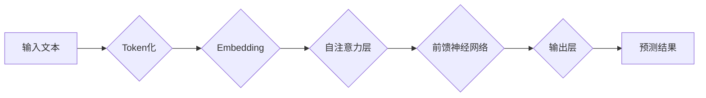

## 大语言模型原理基础与前沿 为什么ICL有效

> 关键词：大语言模型、Transformer、ICL、自回归语言模型、预训练、微调、文本生成、自然语言理解

## 1. 背景介绍

近年来，大语言模型（Large Language Model，LLM）在自然语言处理领域取得了令人瞩目的成就。从文本生成、机器翻译到代码编写和问答系统，LLM展现出强大的能力，深刻地改变了我们与计算机交互的方式。

这些模型的成功离不开Transformer架构的革新以及海量数据和计算资源的支撑。Transformer结构通过自注意力机制有效捕捉文本中的长距离依赖关系，使得模型能够理解更复杂的语义结构。同时，预训练和微调策略的应用，使得LLM能够在不同下游任务上表现出色。

然而，训练大型语言模型仍然面临着巨大的挑战，包括计算成本高、数据获取困难以及模型可解释性差等问题。

## 2. 核心概念与联系

### 2.1  大语言模型

大语言模型是指参数量巨大、训练数据海量的人工智能模型，能够理解和生成人类语言。它们通常基于Transformer架构，并通过预训练和微调的方式进行训练。

### 2.2  Transformer架构

Transformer是一种新型的神经网络架构，其核心是自注意力机制。自注意力机制能够捕捉文本中不同词语之间的关系，即使这些词语相隔很远，也能有效地理解它们之间的语义联系。

### 2.3  预训练与微调

预训练是指在大量无标注数据上训练模型，学习语言的通用表示。微调是指在特定任务的数据上对预训练模型进行进一步训练，使其能够更好地完成该任务。

**Mermaid 流程图**



## 3. 核心算法原理 & 具体操作步骤

### 3.1  算法原理概述

大语言模型的核心算法是Transformer架构，它通过多层自注意力机制和前馈神经网络来捕捉文本的语义信息。

**自注意力机制**

自注意力机制能够计算每个词语与其他词语之间的相关性，并根据相关性赋予每个词语不同的权重。

**前馈神经网络**

前馈神经网络对每个词语的嵌入向量进行非线性变换，进一步提取语义信息。

**多层结构**

Transformer架构由多层自注意力机制和前馈神经网络组成，通过多层堆叠，能够捕捉更深层次的语义关系。

### 3.2  算法步骤详解

1. **Token化:** 将输入文本分割成一个个独立的词语或子词，称为Token。
2. **Embedding:** 将每个Token映射到一个低维的向量空间中，称为词向量。
3. **自注意力层:** 对每个词向量进行自注意力计算，得到每个词语与其他词语之间的相关性权重。
4. **前馈神经网络:** 对每个词向量进行非线性变换，提取更深层次的语义信息。
5. **输出层:** 将经过多层处理后的词向量映射到输出空间，预测下一个词语。

### 3.3  算法优缺点

**优点:**

* 能够捕捉长距离依赖关系
* 并行计算能力强
* 表现优异

**缺点:**

* 计算成本高
* 数据需求量大
* 可解释性差

### 3.4  算法应用领域

* 文本生成
* 机器翻译
* 问答系统
* 代码生成
* 文本摘要
* 情感分析

## 4. 数学模型和公式 & 详细讲解 & 举例说明

### 4.1  数学模型构建

大语言模型通常采用自回归语言模型的数学模型，即预测下一个词语基于之前已生成的词语序列。

### 4.2  公式推导过程

假设输入文本序列为 $x = (x_1, x_2,..., x_t)$，目标是预测下一个词语 $x_{t+1}$。

模型的输出概率分布为：

$$P(x_{t+1} | x_1, x_2,..., x_t)$$

可以使用softmax函数将模型输出映射到概率分布：

$$P(x_{t+1} | x_1, x_2,..., x_t) = \frac{exp(s_{x_{t+1}})}{\sum_{i=1}^{V} exp(s_i)}$$

其中，$s_{x_{t+1}}$ 是模型对词语 $x_{t+1}$ 的预测得分，$V$ 是词典的大小。

### 4.3  案例分析与讲解

例如，预测句子 "The cat sat on the" 下一个词语。

模型会根据之前生成的词语 "The cat sat on the" 计算每个词语的预测得分，然后使用softmax函数将得分映射到概率分布。

如果 "mat" 的预测得分最高，那么模型会预测下一个词语为 "mat"。

## 5. 项目实践：代码实例和详细解释说明

### 5.1  开发环境搭建

* Python 3.7+
* PyTorch 或 TensorFlow
* CUDA 和 cuDNN

### 5.2  源代码详细实现

```python
import torch
import torch.nn as nn

class Transformer(nn.Module):
    def __init__(self, vocab_size, embedding_dim, num_heads, num_layers):
        super(Transformer, self).__init__()
        self.embedding = nn.Embedding(vocab_size, embedding_dim)
        self.transformer_layers = nn.ModuleList([
            nn.TransformerEncoderLayer(embedding_dim, num_heads)
            for _ in range(num_layers)
        ])
        self.linear = nn.Linear(embedding_dim, vocab_size)

    def forward(self, x):
        x = self.embedding(x)
        for layer in self.transformer_layers:
            x = layer(x)
        x = self.linear(x)
        return x
```

### 5.3  代码解读与分析

* `embedding`: 将词向量映射到低维空间。
* `transformer_layers`: 多层Transformer编码器层。
* `linear`: 将输出向量映射到词典大小。

### 5.4  运行结果展示

训练好的模型可以用于预测下一个词语，生成文本等任务。

## 6. 实际应用场景

* **聊天机器人:** 构建能够自然对话的聊天机器人。
* **文本摘要:** 自动生成文本的摘要。
* **机器翻译:** 将文本从一种语言翻译成另一种语言。
* **代码生成:** 根据自然语言描述生成代码。

### 6.4  未来应用展望

* **个性化教育:** 根据学生的学习情况提供个性化的学习内容。
* **医疗诊断:** 辅助医生进行疾病诊断。
* **法律服务:** 自动生成法律文件。

## 7. 工具和资源推荐

### 7.1  学习资源推荐

* **书籍:**
    * 《深度学习》
    * 《自然语言处理》
* **在线课程:**
    * Coursera: 自然语言处理
    * edX: 深度学习

### 7.2  开发工具推荐

* **PyTorch:** 深度学习框架
* **TensorFlow:** 深度学习框架
* **Hugging Face:** 预训练模型库

### 7.3  相关论文推荐

* **Attention Is All You Need:** https://arxiv.org/abs/1706.03762
* **BERT: Pre-training of Deep Bidirectional Transformers for Language Understanding:** https://arxiv.org/abs/1810.04805

## 8. 总结：未来发展趋势与挑战

### 8.1  研究成果总结

大语言模型在自然语言处理领域取得了显著进展，展现出强大的能力和潜力。

### 8.2  未来发展趋势

* **模型规模更大:** 参数量更大、训练数据更多。
* **多模态学习:** 融合文本、图像、音频等多模态数据。
* **可解释性增强:** 提高模型的透明度和可解释性。

### 8.3  面临的挑战

* **计算成本高:** 训练大型模型需要大量的计算资源。
* **数据获取困难:** 高质量的训练数据难以获取。
* **模型安全性和可靠性:** 模型可能存在偏见、错误和攻击漏洞。

### 8.4  研究展望

未来，大语言模型的研究将继续朝着更强大、更安全、更可解释的方向发展。


## 9. 附录：常见问题与解答

* **什么是ICL？**

ICL（In-Context Learning）是指在没有显式训练的情况下，通过提供一些示例输入和输出对模型进行微调。

* **ICL为什么有效？**

ICL有效的原因在于Transformer模型强大的自注意力机制，能够捕捉文本中的上下文信息。通过提供一些示例，模型可以学习到任务的模式和规则，从而在新的输入上进行预测。

* **ICL有哪些应用场景？**

ICL可以应用于各种自然语言处理任务，例如文本分类、问答系统、机器翻译等。

作者：禅与计算机程序设计艺术 / Zen and the Art of Computer Programming 


