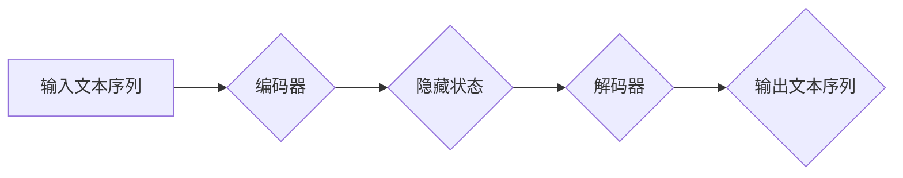

## 大语言模型应用指南：Transformer的原始输入

> 关键词：大语言模型、Transformer、原始输入、自然语言处理、深度学习、编码解码架构、注意力机制

### 1. 背景介绍

近年来，深度学习在自然语言处理 (NLP) 领域取得了突破性进展，大语言模型 (LLM) 作为其重要代表，展现出强大的文本生成、理解和翻译能力。这些模型的成功离不开 Transformer 架构的革新，它彻底改变了 NLP 的发展方向。

Transformer 架构首次提出于 2017 年的论文《Attention Is All You Need》，并迅速成为 NLP 领域的主流架构。与传统的循环神经网络 (RNN) 相比，Transformer 具有以下优势：

* **并行计算能力强:** Transformer 可以并行处理输入序列中的所有元素，大大提高了训练速度。
* **长距离依赖建模能力强:** Transformer 的注意力机制能够捕捉输入序列中任意位置之间的依赖关系，有效解决 RNN 在处理长文本时遇到的梯度消失问题。
* **可扩展性强:** Transformer 的架构设计灵活，可以轻松扩展到处理更长的文本序列和更大的模型规模。

### 2. 核心概念与联系

Transformer 架构的核心是编码解码 (Encoder-Decoder) 结构和注意力机制。

**2.1 编码解码结构**

编码解码结构将文本处理任务分解为两个阶段：编码和解码。

* **编码阶段:** 将输入文本序列编码成一个固定长度的向量表示，捕捉文本序列的语义信息。
* **解码阶段:** 根据编码后的向量表示生成输出文本序列。

**2.2 注意力机制**

注意力机制是 Transformer 架构的关键创新，它允许模型关注输入序列中与当前任务最相关的部分。

注意力机制通过计算每个词与所有其他词之间的相关性，并根据相关性赋予每个词不同的权重，从而突出重要信息。

**2.3 Mermaid 流程图**



### 3. 核心算法原理 & 具体操作步骤

**3.1 算法原理概述**

Transformer 的核心算法是基于多头注意力机制和前馈神经网络的编码器-解码器结构。

* **多头注意力机制:** 通过多个注意力头并行计算，捕捉不同层次的语义信息。
* **前馈神经网络:** 对每个词的隐藏状态进行非线性变换，进一步提取语义特征。

**3.2 算法步骤详解**

1. **输入处理:** 将输入文本序列转换为词嵌入向量。
2. **编码阶段:**
    * 将词嵌入向量输入到编码器中，编码器由多个 Transformer 块组成。
    * 每个 Transformer 块包含多头注意力层和前馈神经网络层。
    * 通过多头注意力层，模型学习捕捉输入序列中不同词之间的依赖关系。
    * 通过前馈神经网络层，模型进一步提取语义特征。
3. **解码阶段:**
    * 将编码器的输出作为解码器的输入。
    * 解码器也由多个 Transformer 块组成，每个块包含多头注意力层和前馈神经网络层。
    * 解码器中的多头注意力层不仅关注编码器的输出，还关注解码器自身生成的文本序列，从而实现自回归文本生成。
4. **输出生成:** 将解码器的输出经过 softmax 函数，得到每个词的概率分布，并根据概率分布选择下一个词。

**3.3 算法优缺点**

**优点:**

* 并行计算能力强，训练速度快。
* 长距离依赖建模能力强，能够处理长文本序列。
* 可扩展性强，可以轻松扩展到更大的模型规模。

**缺点:**

* 计算复杂度高，需要大量的计算资源。
* 训练数据量大，需要大量的文本数据进行训练。

**3.4 算法应用领域**

Transformer 架构在 NLP 领域有着广泛的应用，例如：

* 机器翻译
* 文本摘要
* 问答系统
* 文本生成
* 语义理解

### 4. 数学模型和公式 & 详细讲解 & 举例说明

**4.1 数学模型构建**

Transformer 的数学模型主要基于线性变换、激活函数和注意力机制。

* **线性变换:** 用于将输入向量映射到不同的维度空间。
* **激活函数:** 用于引入非线性，提高模型的表达能力。
* **注意力机制:** 用于计算每个词与所有其他词之间的相关性，并根据相关性赋予每个词不同的权重。

**4.2 公式推导过程**

注意力机制的核心公式是计算每个词与所有其他词之间的加权和。

$$
Attention(Q, K, V) = softmax(\frac{QK^T}{\sqrt{d_k}})V
$$

其中：

* $Q$ 是查询矩阵，表示当前词的表示。
* $K$ 是键矩阵，表示所有词的表示。
* $V$ 是值矩阵，表示所有词的语义信息。
* $d_k$ 是键向量的维度。
* $softmax$ 函数将计算结果归一化到概率分布。

**4.3 案例分析与讲解**

假设我们有一个句子 "The cat sat on the mat"，我们想要计算 "sat" 这个词与所有其他词之间的注意力权重。

1. 将每个词转换为词嵌入向量，得到 $Q$, $K$ 和 $V$ 矩阵。
2. 计算 $QK^T$，得到每个词与所有其他词之间的相关性得分。
3. 对相关性得分进行 softmax 归一化，得到每个词与 "sat" 的注意力权重。
4. 将注意力权重与值矩阵 $V$ 进行加权和，得到 "sat" 这个词的最终表示。

### 5. 项目实践：代码实例和详细解释说明

**5.1 开发环境搭建**

* Python 3.6+
* PyTorch 或 TensorFlow
* CUDA 和 cuDNN (可选，用于 GPU 加速)

**5.2 源代码详细实现**

```python
import torch
import torch.nn as nn

class Transformer(nn.Module):
    def __init__(self, vocab_size, embedding_dim, num_heads, num_layers):
        super(Transformer, self).__init__()
        self.embedding = nn.Embedding(vocab_size, embedding_dim)
        self.encoder = nn.TransformerEncoder(nn.TransformerEncoderLayer(embedding_dim, num_heads), num_layers)
        self.decoder = nn.TransformerDecoder(nn.TransformerDecoderLayer(embedding_dim, num_heads), num_layers)
        self.linear = nn.Linear(embedding_dim, vocab_size)

    def forward(self, src, tgt, src_mask, tgt_mask):
        src = self.embedding(src)
        tgt = self.embedding(tgt)
        encoder_output = self.encoder(src, src_mask)
        decoder_output = self.decoder(tgt, encoder_output, tgt_mask)
        output = self.linear(decoder_output)
        return output
```

**5.3 代码解读与分析**

* `__init__` 方法初始化模型参数，包括词嵌入层、编码器和解码器。
* `forward` 方法定义模型的正向传播过程，输入包括源文本、目标文本、源文本掩码和目标文本掩码。
* 模型首先将输入文本转换为词嵌入向量，然后通过编码器和解码器进行处理，最后通过线性层输出预测结果。

**5.4 运行结果展示**

运行代码并训练模型，可以评估模型在机器翻译、文本摘要等任务上的性能。

### 6. 实际应用场景

Transformer 架构在 NLP 领域有着广泛的应用场景，例如：

* **机器翻译:** Google Translate 使用 Transformer 架构实现高效的机器翻译。
* **文本摘要:** BART 和 T5 等模型利用 Transformer 架构生成高质量的文本摘要。
* **问答系统:** BERT 和 RoBERTa 等模型基于 Transformer 架构，能够理解自然语言问题并给出准确的答案。
* **文本生成:** GPT-3 和 LaMDA 等模型利用 Transformer 架构生成流畅、连贯的文本。

**6.4 未来应用展望**

Transformer 架构的应用前景广阔，未来可能在以下领域得到更广泛的应用：

* **代码生成:** 利用 Transformer 架构学习代码的语法和语义，自动生成代码。
* **药物研发:** 利用 Transformer 架构分析生物数据，加速药物研发过程。
* **个性化教育:** 利用 Transformer 架构提供个性化的学习内容和教学方式。

### 7. 工具和资源推荐

**7.1 学习资源推荐**

* **论文:** 《Attention Is All You Need》
* **博客:** Jay Alammar 的博客
* **课程:** Stanford CS224N

**7.2 开发工具推荐**

* **PyTorch:** 深度学习框架
* **TensorFlow:** 深度学习框架
* **Hugging Face Transformers:** 预训练 Transformer 模型库

**7.3 相关论文推荐**

* BERT: Pre-training of Deep Bidirectional Transformers for Language Understanding
* GPT-3: Language Models are Few-Shot Learners
* T5: Text-to-Text Transfer Transformer


### 8. 总结：未来发展趋势与挑战

**8.1 研究成果总结**

Transformer 架构的提出彻底改变了 NLP 的发展方向，取得了显著的成果，在机器翻译、文本摘要、问答系统等任务上取得了突破性进展。

**8.2 未来发展趋势**

* **模型规模的进一步扩大:** 更大的模型规模能够学习更丰富的语义信息，提升模型性能。
* **高效训练方法的探索:** 探索更有效的训练方法，降低模型训练成本。
* **跨模态理解:** 将 Transformer 架构应用于跨模态理解任务，例如图像和文本的联合理解。

**8.3 面临的挑战**

* **计算资源需求:** Transformer 模型的训练需要大量的计算资源，这对于资源有限的机构和个人来说是一个挑战。
* **数据标注成本:** 训练高质量的 Transformer 模型需要大量的标注数据，数据标注成本较高。
* **模型解释性:** Transformer 模型的内部机制复杂，难以解释模型的决策过程。

**8.4 研究展望**

未来研究将继续探索 Transformer 架构的潜力，解决其面临的挑战，推动 NLP 领域的发展。

### 9. 附录：常见问题与解答

**9.1 什么是 Transformer 架构？**

Transformer 架构是一种用于处理序列数据的深度学习模型，其核心是编码解码结构和注意力机制。

**9.2 Transformer 架构的优势是什么？**

Transformer 架构具有并行计算能力强、长距离依赖建模能力强、可扩展性强等优势。

**9.3 Transformer 架构有哪些应用场景？**

Transformer 架构在机器翻译、文本摘要、问答系统、文本生成等 NLP 任务中有着广泛的应用。


作者：禅与计算机程序设计艺术 / Zen and the Art of Computer Programming