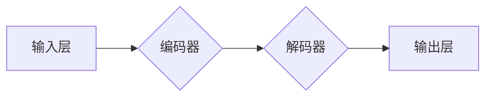

## 大语言模型应用指南：自然语言处理的发展历程

> 关键词：大语言模型、自然语言处理、Transformer、BERT、GPT、LLM应用、NLP发展趋势

### 1. 背景介绍

自然语言处理（Natural Language Processing，NLP）作为人工智能领域的重要分支，致力于使计算机能够理解、处理和生成人类语言。从早期基于规则的系统到如今深度学习驱动的强大模型，NLP技术经历了飞速发展。近年来，大语言模型（Large Language Model，LLM）的出现，标志着NLP领域迈入了一个新的里程碑。

LLM 拥有数十亿甚至数千亿个参数，能够处理海量文本数据，学习复杂的语言模式和语义关系。它们在文本生成、翻译、问答、代码生成等任务上展现出惊人的能力，并逐渐渗透到各个领域，例如搜索引擎、聊天机器人、教育、医疗等。

### 2. 核心概念与联系

**2.1 自然语言处理 (NLP)**

自然语言处理 (NLP) 是人工智能的一个子领域，旨在使计算机能够理解、解释、生成和转换人类语言。NLP的任务包括：

* **文本分类:** 将文本自动分类到预定义的类别中，例如情感分析、主题分类等。
* **文本摘要:** 从长文本中提取关键信息，生成简洁的摘要。
* **机器翻译:** 将文本从一种语言翻译成另一种语言。
* **问答系统:** 能够理解用户的问题并给出准确的答案。
* **对话系统:** 与用户进行自然语言对话，例如聊天机器人。

**2.2 大语言模型 (LLM)**

大语言模型 (LLM) 是近年来发展起来的一种强大的深度学习模型，其特点是：

* **规模庞大:** 拥有数十亿甚至数千亿个参数。
* **预训练:** 在海量文本数据上进行预训练，学习语言的语法、语义和知识。
* **多任务学习:** 可以应用于多种自然语言处理任务，例如文本生成、翻译、问答等。

**2.3 Transformer 架构**

Transformer 架构是 LLMs 的核心技术之一，它通过自注意力机制 (Self-Attention) 能够捕捉文本中长距离依赖关系，从而提升模型的理解能力和生成质量。



### 3. 核心算法原理 & 具体操作步骤

**3.1 算法原理概述**

LLMs 通常基于 Transformer 架构，其核心是自注意力机制和多头注意力机制。

* **自注意力机制:** 允许模型关注输入序列中的不同位置，并计算每个词与其他词之间的相关性。
* **多头注意力机制:** 使用多个自注意力头，分别关注不同的方面，从而捕捉更丰富的语义信息。

**3.2 算法步骤详解**

1. **词嵌入:** 将输入文本中的每个词转换为向量表示。
2. **编码器:** 将词向量序列输入编码器，通过多层 Transformer 块进行处理，生成上下文表示。
3. **解码器:** 将上下文表示输入解码器，通过多层 Transformer 块进行处理，生成输出文本序列。
4. **输出层:** 将解码器输出的向量序列转换为文本。

**3.3 算法优缺点**

**优点:**

* 能够捕捉长距离依赖关系。
* 性能优异，在多种 NLP 任务上取得了突破性进展。
* 可迁移学习，在不同任务上进行微调。

**缺点:**

* 训练成本高，需要大量计算资源和数据。
* 模型规模庞大，部署成本高。
* 存在潜在的偏差和安全风险。

**3.4 算法应用领域**

* **文本生成:** 写作、诗歌创作、代码生成等。
* **机器翻译:** 将文本从一种语言翻译成另一种语言。
* **问答系统:** 理解用户问题并给出准确答案。
* **对话系统:** 与用户进行自然语言对话，例如聊天机器人。
* **文本摘要:** 从长文本中提取关键信息，生成简洁的摘要。

### 4. 数学模型和公式 & 详细讲解 & 举例说明

**4.1 数学模型构建**

LLMs 通常使用 Transformer 架构，其核心是自注意力机制和多头注意力机制。

**4.2 公式推导过程**

* **自注意力机制:**

$$
Attention(Q, K, V) = \frac{exp(Q \cdot K^T / \sqrt{d_k})}{exp(Q \cdot K^T / \sqrt{d_k})} \cdot V
$$

其中：

* $Q$: 查询矩阵
* $K$: 键矩阵
* $V$: 值矩阵
* $d_k$: 键向量的维度

* **多头注意力机制:**

$$
MultiHead(Q, K, V) = Concat(head_1, head_2,..., head_h) \cdot W_o
$$

其中：

* $head_i$: 第 $i$ 个注意力头的输出
* $h$: 注意力头的数量
* $W_o$: 线性变换矩阵

**4.3 案例分析与讲解**

假设我们有一个句子 "The cat sat on the mat"，我们使用自注意力机制来计算每个词与其他词之间的相关性。

* 查询矩阵 $Q$ 将每个词转换为查询向量。
* 键矩阵 $K$ 将每个词转换为键向量。
* 值矩阵 $V$ 将每个词转换为值向量。

通过计算 $Q \cdot K^T$，我们可以得到每个词与其他词之间的相关性分数。然后，我们使用 softmax 函数将分数归一化，得到每个词对其他词的注意力权重。最后，我们将注意力权重与值向量相乘，得到每个词的上下文表示。

### 5. 项目实践：代码实例和详细解释说明

**5.1 开发环境搭建**

* Python 3.6+
* TensorFlow 或 PyTorch
* CUDA 和 cuDNN (可选，用于 GPU 加速)

**5.2 源代码详细实现**

```python
import tensorflow as tf

# 定义 Transformer 模型
class Transformer(tf.keras.Model):
    def __init__(self, vocab_size, embedding_dim, num_heads, num_layers):
        super(Transformer, self).__init__()
        self.embedding = tf.keras.layers.Embedding(vocab_size, embedding_dim)
        self.encoder = tf.keras.layers.StackedRNNCells([tf.keras.layers.LSTM(embedding_dim) for _ in range(num_layers)])
        self.decoder = tf.keras.layers.StackedRNNCells([tf.keras.layers.LSTM(embedding_dim) for _ in range(num_layers)])
        self.fc = tf.keras.layers.Dense(vocab_size)

    def call(self, inputs):
        #... (代码实现 Transformer 模型的 forward pass)

# 实例化 Transformer 模型
model = Transformer(vocab_size=10000, embedding_dim=128, num_heads=8, num_layers=6)

# 训练模型
model.compile(optimizer='adam', loss='sparse_categorical_crossentropy', metrics=['accuracy'])
model.fit(train_data, train_labels, epochs=10)

```

**5.3 代码解读与分析**

* **Embedding 层:** 将每个词转换为向量表示。
* **Encoder 和 Decoder:** 使用 RNN 或 Transformer 块对输入序列进行编码和解码。
* **全连接层:** 将解码器的输出转换为预测概率分布。

**5.4 运行结果展示**

训练完成后，我们可以使用模型对新的文本进行预测。例如，输入 "The cat is on the"，模型可以预测下一个词是 "mat"。

### 6. 实际应用场景

**6.1 搜索引擎**

LLMs 可以用于理解用户搜索意图，并提供更精准的搜索结果。例如，Google 的 BERT 模型已经应用于搜索引擎，提升了搜索结果的质量。

**6.2 聊天机器人**

LLMs 可以用于构建更智能的聊天机器人，能够进行自然流畅的对话。例如，OpenAI 的 GPT-3 模型可以生成逼真的对话文本。

**6.3 教育**

LLMs 可以用于个性化学习，提供定制化的学习内容和辅导。例如，一些教育平台使用 LLMs 为学生提供智能答疑服务。

**6.4 医疗**

LLMs 可以用于分析医疗记录，辅助医生诊断疾病。例如，一些研究表明 LLMs 可以用于识别癌症和其他疾病的风险。

**6.5 未来应用展望**

LLMs 的应用前景广阔，未来可能在更多领域发挥重要作用，例如：

* **代码生成:** 自动生成代码，提高开发效率。
* **创意写作:** 辅助作家创作小说、诗歌等创意作品。
* **翻译:** 提供更准确、更自然的机器翻译服务。
* **个性化推荐:** 提供更精准的商品、服务和内容推荐。

### 7. 工具和资源推荐

**7.1 学习资源推荐**

* **书籍:**
    * 《深度学习》 by Ian Goodfellow, Yoshua Bengio, and Aaron Courville
    * 《自然语言处理入门》 by Jacob Eisenstein
* **在线课程:**
    * Coursera: Natural Language Processing Specialization
    * Stanford CS224N: Natural Language Processing with Deep Learning

**7.2 开发工具推荐**

* **TensorFlow:** 开源深度学习框架
* **PyTorch:** 开源深度学习框架
* **Hugging Face Transformers:** 提供预训练 LLMs 和相关工具

**7.3 相关论文推荐**

* **BERT: Pre-training of Deep Bidirectional Transformers for Language Understanding**
* **GPT-3: Language Models are Few-Shot Learners**
* **T5: Text-to-Text Transfer Transformer**

### 8. 总结：未来发展趋势与挑战

**8.1 研究成果总结**

近年来，LLMs 取得了显著进展，在文本生成、翻译、问答等任务上取得了突破性成果。这些模型的出现，标志着 NLP 领域迈入了一个新的时代。

**8.2 未来发展趋势**

* **模型规模进一步扩大:** 随着计算资源的提升，LLMs 的规模将继续扩大，从而提升模型的性能。
* **多模态学习:** LLMs 将与其他模态数据（例如图像、音频）融合，实现多模态理解和生成。
* **可解释性增强:** 研究如何提高 LLMs 的可解释性，使其决策过程更加透明。
* **安全性和鲁棒性提升:** 研究如何解决 LLMs 的潜在偏差和安全风险，使其更加可靠和安全。

**8.3 面临的挑战**

* **训练成本高:** 训练大型 LLMs 需要大量的计算资源和数据，这对于个人开发者和小型公司来说是一个挑战。
* **模型规模庞大:** LLMs 的模型规模庞大，部署成本高，需要强大的硬件支持。
* **数据偏见:** LLMs 的训练数据可能存在偏见，导致模型输出结果存在偏差。
* **安全风险:** LLMs 可以被用于生成虚假信息、进行恶意攻击等，需要加强安全防护。

**8.4 研究展望**

未来，LLMs 将继续朝着更强大、更智能、更安全的方向发展。研究者们将致力于解决 LLMs 的挑战，使其更好地服务于人类社会。

### 9. 附录：常见问题与解答

**9.1 如何选择合适的 LLM？**

选择合适的 LLM 需要根据具体的应用场景和需求进行考虑。例如，对于文本生成任务，可以选择 GPT-3 等生成式模型；对于问答任务，可以选择 BERT 等理解式模型。

**9.2 如何训练自己的 LLM？**

训练自己的 LLM 需要大量的计算资源、数据和专业知识。建议使用现有的预训练模型进行微调，以降低训练成本和难度。

**9.3 如何解决 LLMs 的数据偏见问题？**

可以通过使用更全面、更均衡的数据集进行训练，以及采用数据增强和模型正则化等技术来缓解 LLMs 的数据偏见问题。


作者：禅与计算机程序设计艺术 / Zen and the Art of Computer Programming 
