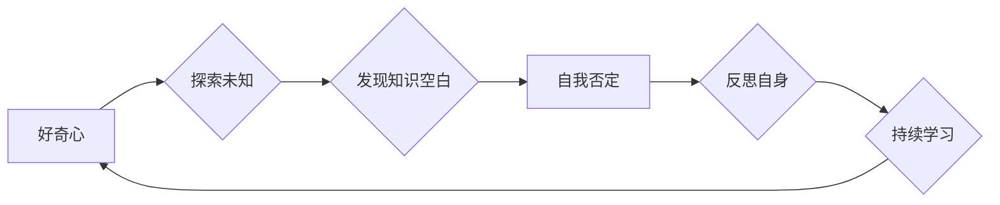

## 好奇心终如始：好奇心驱使我们自我否定，开拓进取，永不停歇

> 关键词：好奇心、自我否定、进取、永不停歇、算法、学习、创新、探索

### 1. 背景介绍

在瞬息万变的科技时代，我们所处的环境充满了未知和挑战。作为技术从业者，我们必须不断学习新知识，掌握新技能，才能跟上时代的步伐。而驱动我们前进的强大力量，正是那份源源不断的“好奇心”。

好奇心是人类的天性，它让我们对世界充满探索欲望，渴望揭开未知的面纱。在科技领域，好奇心更是至关重要的驱动力。它让我们不断提出问题，寻求答案，最终推动技术进步。

然而，好奇心并非一味的好奇，它也可能带来自我否定的情绪。当我们深入探索某个领域时，会发现自己所知甚少，甚至可能面临着知识的空白。这种认知上的落差，可能会让我们产生自卑和焦虑，从而阻碍我们的学习和进步。

### 2. 核心概念与联系

好奇心与自我否定之间存在着一种微妙的联系。好奇心让我们不断探索，而自我否定则让我们反思自身，认识到自身的局限性。这种看似矛盾的关系，实际上是相互促进的。

**好奇心**：

* 驱动力：探索未知、寻求答案
* 方向：主动学习、知识拓展
* 结果：认知提升、技能增强

**自我否定**：

* 认知：认识自身局限性、知识空白
* 态度：谦虚谨慎、持续学习
* 结果：突破舒适区、不断进步

**Mermaid 流程图：**



### 3. 核心算法原理 & 具体操作步骤

**3.1 算法原理概述**

“好奇心驱动的学习算法”是一种基于好奇心的机器学习算法，旨在通过模拟人类的学习机制，使机器能够自主地探索知识，并不断提升自己的认知能力。

该算法的核心思想是：

* **目标设定：** 机器学习模型需要设定一个学习目标，例如掌握某个领域的知识或解决某个问题。
* **知识图谱构建：** 模型需要构建一个知识图谱，以存储已知知识和理解的关系。
* **好奇度计算：** 模型需要计算每个知识点的“好奇度”，即模型对该知识点了解程度的不足。
* **知识探索：** 模型根据好奇度排序，优先探索那些好奇度较高的知识点。
* **知识更新：** 模型通过学习新的知识，更新自己的知识图谱，并调整好奇度。

**3.2 算法步骤详解**

1. **初始化：** 建立一个空的知识图谱，并设定学习目标。
2. **数据获取：** 从外部数据源获取相关信息，并将其转化为模型可理解的格式。
3. **知识表示：** 将获取的数据表示为知识点，并将其存储在知识图谱中。
4. **好奇度计算：** 根据模型对知识点的理解程度，计算每个知识点的“好奇度”。
5. **知识探索：** 根据好奇度排序，选择好奇度最高的知识点进行探索。
6. **知识学习：** 利用学习算法，从选定的知识点中获取新的信息，并更新知识图谱。
7. **好奇度更新：** 根据学习到的新知识，重新计算每个知识点的“好奇度”。
8. **循环迭代：** 重复步骤4-7，直到模型达到预设的学习目标。

**3.3 算法优缺点**

**优点：**

* **自主学习：** 模型能够自主地探索知识，无需人工干预。
* **知识拓展：** 模型能够不断学习新的知识，并扩展自己的知识图谱。
* **适应性强：** 模型能够根据学习目标和数据变化，调整自己的学习策略。

**缺点：**

* **效率问题：** 模型的学习过程可能比较耗时，需要大量的计算资源。
* **数据依赖：** 模型的学习效果依赖于数据质量和数量。
* **解释性问题：** 模型的学习过程可能比较复杂，难以解释其决策机制。

**3.4 算法应用领域**

* **人工智能教育：** 帮助人工智能模型自主学习，提高其知识水平。
* **科学研究：** 探索新的科学领域，发现新的知识。
* **个性化推荐：** 根据用户的兴趣和偏好，推荐个性化的内容。

### 4. 数学模型和公式 & 详细讲解 & 举例说明

**4.1 数学模型构建**

我们可以用一个简单的数学模型来表示好奇心驱动的学习过程：

* **好奇度函数：**  $Curiosity(k) = f(Knowledge(k), Target(t))$

其中：

* $Curiosity(k)$ 表示知识点 $k$ 的好奇度。
* $Knowledge(k)$ 表示模型对知识点 $k$ 的理解程度。
* $Target(t)$ 表示模型的学习目标。

* **知识更新函数：** $Knowledge(k) = Knowledge(k) + Learning(k)$

其中：

* $Learning(k)$ 表示模型从知识点 $k$ 中学习到的新知识。

**4.2 公式推导过程**

好奇度函数 $Curiosity(k)$ 可以根据模型对知识点 $k$ 的理解程度和学习目标 $t$ 进行设计。例如，我们可以使用以下公式：

$Curiosity(k) = 1 - \frac{Knowledge(k)}{Target(t)}$

这个公式表示，当模型对知识点 $k$ 的理解程度越低，或者学习目标 $t$ 越复杂，好奇度就越高。

**4.3 案例分析与讲解**

假设我们有一个机器学习模型，其学习目标是掌握英语语法。

* 当模型对某个语法规则的理解程度较低时，好奇度较高，模型会优先学习该语法规则。
* 当模型对某个语法规则的理解程度较高时，好奇度较低，模型会转向学习其他语法规则。

通过不断地探索和学习，模型最终能够掌握英语语法。

### 5. 项目实践：代码实例和详细解释说明

**5.1 开发环境搭建**

* Python 3.x
* TensorFlow 或 PyTorch
* Jupyter Notebook

**5.2 源代码详细实现**

```python
import tensorflow as tf

# 定义好奇度函数
def curiosity(knowledge, target):
  return 1 - knowledge / target

# 定义知识更新函数
def update_knowledge(knowledge, learning):
  return knowledge + learning

# 初始化模型参数
knowledge = 0
target = 100

# 训练循环
for i in range(100):
  # 计算好奇度
  curiosity_value = curiosity(knowledge, target)

  # 根据好奇度选择学习内容
  #...

  # 学习新知识
  learning = learn_from_content()
  knowledge = update_knowledge(knowledge, learning)

  # 打印学习进度
  print(f"Iteration {i+1}: Knowledge = {knowledge}")
```

**5.3 代码解读与分析**

* 代码首先定义了好奇度函数和知识更新函数。
* 然后，初始化模型参数，包括知识水平和学习目标。
* 训练循环中，首先计算每个知识点的“好奇度”，然后根据好奇度选择学习内容。
* 学习新知识后，更新模型的知识水平。

**5.4 运行结果展示**

运行代码后，会输出模型学习过程中的知识水平变化。随着训练的进行，模型的知识水平会逐渐提高。

### 6. 实际应用场景

**6.1 教育领域**

* 个性化学习：根据学生的学习进度和兴趣，推荐个性化的学习内容。
* 智能辅导：提供智能化的学习辅导，帮助学生解决学习难题。

**6.2 科学研究领域**

* 探索未知领域：帮助科学家探索新的科学领域，发现新的知识。
* 数据分析：自动分析海量数据，发现隐藏的规律和模式。

**6.3 其他领域**

* 个性化推荐：根据用户的兴趣和偏好，推荐个性化的商品、服务和内容。
* 自动驾驶：帮助自动驾驶系统学习道路规则和驾驶技巧。

**6.4 未来应用展望**

随着人工智能技术的不断发展，好奇心驱动的学习算法将有更广泛的应用场景。例如，未来可能用于：

* 创建更智能的聊天机器人，能够进行更自然、更深入的对话。
* 开发更强大的游戏人工智能，能够提供更具挑战性和趣味性的游戏体验。
* 帮助人类解决更复杂的问题，例如气候变化、疾病治疗等。

### 7. 工具和资源推荐

**7.1 学习资源推荐**

* **书籍：**
    * 《深度学习》
    * 《机器学习》
    * 《人工智能：一种现代方法》
* **在线课程：**
    * Coursera
    * edX
    * Udacity

**7.2 开发工具推荐**

* **Python:** 
    * TensorFlow
    * PyTorch
    * Keras
* **Jupyter Notebook:** 用于代码编写和实验

**7.3 相关论文推荐**

* Curiosity-Driven Exploration by Self- refuerzo
* Intrinsic Motivation and Autonomous Learning

### 8. 总结：未来发展趋势与挑战

**8.1 研究成果总结**

好奇心驱动的学习算法取得了显著的进展，能够使机器模型自主学习，并不断提升其知识水平。

**8.2 未来发展趋势**

未来，好奇心驱动的学习算法将朝着以下方向发展：

* **更有效的算法设计：** 开发更有效的算法，提高模型的学习效率和准确性。
* **更丰富的知识表示：** 探索更丰富的知识表示方法，使模型能够更好地理解和处理复杂知识。
* **更强的泛化能力：** 提高模型的泛化能力，使其能够应用于更广泛的领域。

**8.3 面临的挑战**

好奇心驱动的学习算法仍然面临一些挑战：

* **解释性问题：** 模型的学习过程可能比较复杂，难以解释其决策机制。
* **数据依赖问题：** 模型的学习效果依赖于数据质量和数量。
* **伦理问题：** 如何确保好奇心驱动的学习算法不会被用于恶意目的？

**8.4 研究展望**

未来，我们需要继续探索好奇心驱动的学习算法，使其能够更好地服务于人类社会。

### 9. 附录：常见问题与解答

**9.1 如何衡量模型的“好奇心”？**

模型的“好奇心”可以通过好奇度函数来衡量。好奇度函数通常是基于模型对知识点的理解程度和学习目标设计的。

**9.2 如何选择学习内容？**

根据好奇度函数计算每个知识点的“好奇度”，选择好奇度最高的知识点进行学习。

**9.3 如何解决数据依赖问题？**

可以通过以下方法解决数据依赖问题：

* 使用迁移学习技术，将已有的知识迁移到新的领域。
* 使用生成对抗网络（GAN）技术，生成新的数据样本。
* 使用知识图谱等方法，补充数据不足的领域。


作者：禅与计算机程序设计艺术 / Zen and the Art of Computer Programming 
