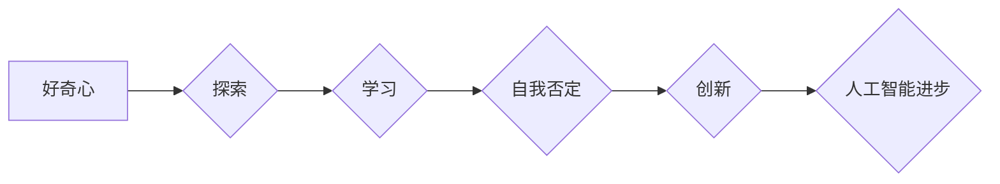

## 好奇心：不断探索与自我否定的动力

> 关键词：好奇心、探索、自我否定、学习、创新、人工智能、算法、深度学习

### 1. 背景介绍

在瞬息万变的科技时代，创新和进步是永恒的主题。而推动这一切的，正是人类那源源不断的“好奇心”。好奇心，是一种对未知事物的强烈渴望，它驱使我们不断探索、学习和突破自我。对于人工智能领域而言，好奇心更是至关重要的驱动力。

从最初的符号逻辑到如今的深度学习，人工智能的发展离不开对未知领域的探索和对现有知识的不断否定。每一次突破，都源于对现有模型的质疑和对更深层次问题的思考。正是这种对未知的渴望，让人工智能不断进化，最终走向更智能、更强大的未来。

### 2. 核心概念与联系

**2.1  好奇心与学习**

好奇心是学习的原动力。当我们对某件事物感到好奇时，就会产生探索和理解的欲望。这种欲望会促使我们主动获取信息、进行思考和分析，最终达到学习目标。

**2.2  自我否定与创新**

自我否定，是指对自身知识和能力的质疑和挑战。它看似消极，但实际上是推动创新和进步的强大动力。当我们对现有知识和方法产生怀疑时，就会开始思考新的可能性，并尝试新的方法。这种不断否定和探索的过程，最终会带来新的发现和突破。

**2.3  好奇心与人工智能**

人工智能的本质是模拟人类的智能行为。而人类的智能行为离不开好奇心和自我否定的驱动。因此，将好奇心和自我否定融入到人工智能的算法设计中，可以帮助人工智能更好地学习、适应和创新。

**Mermaid 流程图**



### 3. 核心算法原理 & 具体操作步骤

**3.1  算法原理概述**

基于好奇心的算法设计旨在模拟人类的学习机制，通过好奇心驱动模型不断探索和学习新的知识。这种算法通常会包含以下几个关键要素：

* **目标函数:**  定义模型学习的目标，例如最大化信息获取、最小化不确定性等。
* **奖励机制:**  根据模型的探索和学习成果给予奖励，鼓励模型继续探索。
* **探索-利用权衡:**  平衡模型在已知知识上的利用和对未知领域的探索。

**3.2  算法步骤详解**

1. **初始化模型参数:**  随机初始化模型参数。
2. **选择探索目标:**  根据模型当前的知识状态和目标函数，选择一个潜在的探索目标。
3. **获取信息:**  通过模型与环境交互，获取关于探索目标的信息。
4. **更新模型参数:**  根据获取的信息，更新模型参数，使其更好地理解探索目标。
5. **评估奖励:**  根据模型的学习成果，评估奖励。
6. **重复步骤2-5:**  重复上述步骤，直到模型达到预设的目标或探索时间结束。

**3.3  算法优缺点**

**优点:**

* 可以有效地驱动模型探索未知领域。
* 可以帮助模型学习更复杂和更丰富的知识。
* 可以提高模型的适应性和创新能力。

**缺点:**

* 算法设计较为复杂，需要大量的计算资源。
* 探索-利用权衡的设置需要谨慎，否则可能会导致模型陷入局部最优。

**3.4  算法应用领域**

基于好奇心的算法在以下领域具有广泛的应用前景:

* **机器人学习:**  帮助机器人自主探索环境，学习新的技能和知识。
* **自然语言处理:**  训练模型更好地理解和生成自然语言，例如机器翻译、文本摘要等。
* **图像识别:**  提高模型对图像的理解能力，例如物体识别、场景理解等。

### 4. 数学模型和公式 & 详细讲解 & 举例说明

**4.1  数学模型构建**

假设模型的当前知识状态为 $S_t$，探索目标为 $O_t$，模型获取关于 $O_t$ 的信息为 $I_t$。则模型的学习过程可以表示为一个状态转移过程:

$$S_{t+1} = f(S_t, O_t, I_t)$$

其中，$f$ 为状态转移函数，描述了模型如何根据当前知识状态、探索目标和获取的信息更新其知识状态。

**4.2  公式推导过程**

目标函数可以定义为最大化信息获取或最小化不确定性。例如，可以使用信息熵作为目标函数，其定义为:

$$H(S) = - \sum_{s \in S} p(s) \log p(s)$$

其中，$p(s)$ 为状态 $s$ 的概率分布。

模型的目标是通过探索和学习，降低其知识状态的熵值，即获得更多的关于世界的信息。

**4.3  案例分析与讲解**

例如，在训练一个图像识别模型时，我们可以使用基于好奇心的算法来引导模型探索不同的图像特征。

模型可以根据其当前的知识状态，选择一个具有较高不确定性的图像特征进行探索。通过观察和学习该特征，模型可以更新其知识状态，并降低对该特征的不确定性。

### 5. 项目实践：代码实例和详细解释说明

**5.1  开发环境搭建**

* Python 3.x
* TensorFlow 或 PyTorch
* 其他必要的库，例如 NumPy、Pandas 等

**5.2  源代码详细实现**

```python
import tensorflow as tf

# 定义模型
model = tf.keras.models.Sequential([
    tf.keras.layers.Conv2D(32, (3, 3), activation='relu', input_shape=(28, 28, 1)),
    tf.keras.layers.MaxPooling2D((2, 2)),
    tf.keras.layers.Flatten(),
    tf.keras.layers.Dense(10, activation='softmax')
])

# 定义损失函数和优化器
loss_fn = tf.keras.losses.SparseCategoricalCrossentropy()
optimizer = tf.keras.optimizers.Adam()

# 定义好奇心奖励函数
def curiosity_reward(model, image, label):
    # 计算模型对图像的预测概率分布
    predictions = model(image)
    # 计算模型对正确标签的预测概率
    correct_probability = predictions[0][label]
    # 计算模型对其他标签的预测概率
    other_probabilities = predictions[0] - correct_probability
    # 计算好奇心奖励
    reward = -tf.reduce_mean(other_probabilities)
    return reward

# 训练模型
for epoch in range(10):
    for image, label in train_dataset:
        with tf.GradientTape() as tape:
            predictions = model(image)
            loss = loss_fn(label, predictions)
            reward = curiosity_reward(model, image, label)
            total_loss = loss - reward
        gradients = tape.gradient(total_loss, model.trainable_variables)
        optimizer.apply_gradients(zip(gradients, model.trainable_variables))
```

**5.3  代码解读与分析**

* 代码首先定义了一个简单的卷积神经网络模型。
* 然后定义了损失函数和优化器。
* 关键部分是定义了好奇心奖励函数，该函数计算模型对正确标签的预测概率和对其他标签的预测概率，并根据这些概率计算好奇心奖励。
* 在训练过程中，模型的损失函数由标准的分类损失函数减去好奇心奖励组成。

**5.4  运行结果展示**

通过训练，模型可以学习到图像特征，并提高其图像识别准确率。同时，好奇心奖励机制可以引导模型探索更丰富的图像特征，从而提高模型的泛化能力。

### 6. 实际应用场景

基于好奇心的算法在以下实际应用场景中具有广泛的应用前景:

* **个性化推荐:**  根据用户的兴趣和行为，推荐更符合用户需求的内容。
* **自动驾驶:**  帮助自动驾驶汽车更好地理解道路环境，并做出更安全的决策。
* **医疗诊断:**  帮助医生更快、更准确地诊断疾病。

**6.4  未来应用展望**

随着人工智能技术的不断发展，基于好奇心的算法将发挥越来越重要的作用。未来，我们可以期待看到更多基于好奇心的算法应用于各个领域，推动人工智能技术向更智能、更安全、更可持续的方向发展。

### 7. 工具和资源推荐

**7.1  学习资源推荐**

* **书籍:**
    * 《深度学习》
    * 《人工智能：现代方法》
* **在线课程:**
    * Coursera 上的深度学习课程
    * edX 上的人工智能课程

**7.2  开发工具推荐**

* **TensorFlow:**  开源深度学习框架
* **PyTorch:**  开源深度学习框架
* **Keras:**  高层深度学习API

**7.3  相关论文推荐**

* **Curiosity-Driven Exploration by Self-Reward**
* **Intrinsic Motivation and Autonomous Learning**
* **Deep Reinforcement Learning with Curiosity**

### 8. 总结：未来发展趋势与挑战

**8.1  研究成果总结**

基于好奇心的算法在人工智能领域取得了显著的进展，为模型的自主学习和探索提供了新的思路。

**8.2  未来发展趋势**

未来，基于好奇心的算法将朝着以下几个方向发展:

* **更有效的奖励机制设计:**  设计更有效的奖励机制，能够更好地引导模型探索和学习。
* **多模态好奇心:**  将好奇心扩展到多模态数据，例如文本、图像、音频等。
* **可解释性增强:**  提高基于好奇心的算法的可解释性，帮助人类更好地理解模型的决策过程。

**8.3  面临的挑战**

基于好奇心的算法仍然面临一些挑战:

* **奖励函数设计难度:**  设计有效的奖励函数仍然是一个难题。
* **计算资源需求:**  基于好奇心的算法通常需要大量的计算资源。
* **安全性和可靠性:**  确保基于好奇心的算法的安全性和可靠性是至关重要的。

**8.4  研究展望**

未来，我们将继续探索基于好奇心的算法，并将其应用于更多实际场景，推动人工智能技术向更智能、更安全、更可持续的方向发展。

### 9. 附录：常见问题与解答

**9.1  好奇心如何量化？**

好奇心是一个复杂的心理现象，难以直接量化。在算法设计中，通常通过代理变量来量化好奇心，例如信息熵、不确定性等。

**9.2  如何避免模型陷入局部最优？**

在基于好奇心的算法中，可以通过探索-利用权衡机制来避免模型陷入局部最优。探索-利用权衡机制可以根据模型的当前知识状态和目标函数，动态调整模型在已知知识上的利用和对未知领域的探索。

**9.3  基于好奇心的算法有哪些应用场景？**

基于好奇心的算法在以下领域具有广泛的应用前景:

* **机器人学习**
* **自然语言处理**
* **图像识别**
* **个性化推荐**
* **自动驾驶**
* **医疗诊断**


作者：禅与计算机程序设计艺术 / Zen and the Art of Computer Programming 
