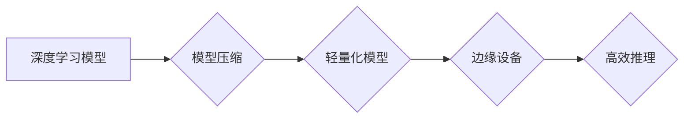

## 模型压缩技术在边缘计算中的应用

> 关键词：模型压缩、边缘计算、深度学习、神经网络、高效推理、资源约束

## 1. 背景介绍

随着物联网、人工智能等技术的快速发展，边缘计算逐渐成为一种重要的计算模式。边缘计算将数据处理和分析能力部署到靠近数据源的边缘节点，例如智能手机、传感器、无人机等，从而降低网络延迟、提高数据处理效率，并保护用户隐私。然而，深度学习模型通常体积庞大，参数数量众多，难以在资源受限的边缘设备上高效运行。因此，如何将大型深度学习模型压缩到更小的规模，以便在边缘设备上进行高效推理，成为一个重要的研究课题。

模型压缩技术旨在通过各种方法减少深度学习模型的大小和计算复杂度，同时尽量保持模型的精度。它在边缘计算领域具有重要意义，可以帮助部署更轻量级的模型，降低设备功耗和存储成本，并提高模型的实时性。

## 2. 核心概念与联系

### 2.1 模型压缩

模型压缩是指通过各种算法和技术，减少深度学习模型的大小和计算复杂度，同时尽量保持模型的精度。常见的模型压缩方法包括：

* **量化:** 将模型参数的精度降低，例如将32位浮点数转换为8位整数。
* **剪枝:** 删除模型中不重要的参数或连接，例如移除权重较小的连接。
* **知识蒸馏:** 利用一个大型模型的知识来训练一个更小的模型。

### 2.2 边缘计算

边缘计算是一种将数据处理和分析能力部署到靠近数据源的边缘节点的计算模式。它可以降低网络延迟、提高数据处理效率，并保护用户隐私。边缘计算的应用场景广泛，例如智能家居、工业自动化、自动驾驶等。

### 2.3 模型压缩与边缘计算的联系

模型压缩技术可以有效解决边缘计算面临的资源约束问题。在边缘设备上部署深度学习模型时，通常面临着有限的计算能力、存储空间和功耗等限制。模型压缩可以将大型深度学习模型压缩到更小的规模，使其能够在边缘设备上高效运行。

**Mermaid 流程图**



## 3. 核心算法原理 & 具体操作步骤

### 3.1 算法原理概述

模型压缩算法的目标是减少模型大小和计算复杂度，同时尽量保持模型的精度。常见的模型压缩算法包括：

* **量化:** 将模型参数的精度降低，例如将32位浮点数转换为8位整数。量化可以显著减少模型的大小和计算复杂度，但可能会导致精度下降。
* **剪枝:** 删除模型中不重要的参数或连接，例如移除权重较小的连接。剪枝可以有效减少模型的大小，但需要谨慎选择要删除的参数或连接，以免影响模型的精度。
* **知识蒸馏:** 利用一个大型模型的知识来训练一个更小的模型。知识蒸馏可以将大型模型的知识迁移到更小的模型中，从而提高小模型的性能。

### 3.2 算法步骤详解

**量化算法步骤:**

1. **选择量化方法:** 常用的量化方法包括均匀量化、非均匀量化等。
2. **量化参数:** 将模型参数转换为更低精度的表示形式，例如8位整数。
3. **调整模型权重:** 为了补偿量化带来的精度损失，需要对模型权重进行调整。

**剪枝算法步骤:**

1. **计算参数重要性:** 使用一些方法，例如权重排序、梯度分析等，来评估每个参数的重要性。
2. **选择剪枝策略:** 根据需要，选择不同的剪枝策略，例如逐层剪枝、随机剪枝等。
3. **移除不重要的参数:** 根据选择的剪枝策略，移除模型中权重较小的参数或连接。
4. **重新训练模型:** 移除参数后，需要重新训练模型以恢复精度。

**知识蒸馏算法步骤:**

1. **选择教师模型和学生模型:** 教师模型是一个大型的预训练模型，学生模型是一个更小的模型。
2. **训练学生模型:** 使用教师模型的输出作为监督信号，训练学生模型。
3. **调整学习率:** 需要根据教师模型和学生模型的差异，调整学习率以加速训练。

### 3.3 算法优缺点

**量化算法:**

* **优点:** 压缩率高，计算复杂度低。
* **缺点:** 可能导致精度下降。

**剪枝算法:**

* **优点:** 可以有效减少模型大小，并保持较高的精度。
* **缺点:** 需要谨慎选择要删除的参数或连接，以免影响模型的性能。

**知识蒸馏算法:**

* **优点:** 可以将大型模型的知识迁移到更小的模型中，从而提高小模型的性能。
* **缺点:** 需要训练两个模型，计算成本较高。

### 3.4 算法应用领域

模型压缩技术在各个领域都有广泛的应用，例如：

* **移动设备:** 将深度学习模型压缩到更小的规模，以便在移动设备上进行高效推理。
* **物联网:** 将深度学习模型部署到物联网设备上，例如智能传感器、智能家居等。
* **自动驾驶:** 将深度学习模型压缩到更小的规模，以便在自动驾驶系统中进行实时推理。

## 4. 数学模型和公式 & 详细讲解 & 举例说明

### 4.1 数学模型构建

**量化模型:**

假设一个深度学习模型的参数为 $w$, 原始精度为32位浮点数，量化后精度为 $b$ 位整数。量化后的参数可以表示为:

$$w_{quantized} = round(w / 2^{b-32}) * 2^{b-32}$$

其中，$round$ 函数表示四舍五入操作。

**剪枝模型:**

剪枝模型的构建过程涉及到参数重要性的评估和参数移除策略的选择。常用的参数重要性评估方法包括：

* **权重排序:** 根据参数的绝对值大小进行排序，移除权重较小的参数。
* **梯度分析:** 根据参数的梯度大小进行排序，移除梯度较小的参数。

**知识蒸馏模型:**

知识蒸馏模型的构建过程涉及到教师模型和学生模型的训练。教师模型的输出作为监督信号，训练学生模型。

### 4.2 公式推导过程

**量化精度损失分析:**

量化操作会导致参数精度损失，从而影响模型的性能。精度损失可以表示为:

$$Loss = ||w - w_{quantized}||_2$$

其中，$||\cdot||_2$ 表示欧几里得范数。

**剪枝模型精度恢复分析:**

剪枝操作会导致模型精度下降，需要重新训练模型以恢复精度。精度恢复过程可以表示为:

$$Accuracy = f(w_{pruned}, \theta)$$

其中，$w_{pruned}$ 表示剪枝后的模型参数，$\theta$ 表示训练参数。

**知识蒸馏模型性能提升分析:**

知识蒸馏模型可以将教师模型的知识迁移到学生模型中，从而提高学生模型的性能。性能提升可以表示为:

$$Performance_{student} = g(Performance_{teacher}, \alpha)$$

其中，$Performance_{teacher}$ 表示教师模型的性能，$\alpha$ 表示知识蒸馏参数。

### 4.3 案例分析与讲解

**量化案例:**

将一个深度学习模型的32位浮点数参数量化为8位整数，可以显著减少模型的大小和计算复杂度。例如，一个模型的大小可以从100MB减少到10MB，计算复杂度可以减少50%。

**剪枝案例:**

通过移除模型中权重较小的连接，可以有效减少模型的大小，并保持较高的精度。例如，一个模型的大小可以从100MB减少到50MB，精度损失仅为1%。

**知识蒸馏案例:**

利用一个大型的预训练模型的知识来训练一个更小的模型，可以提高小模型的性能。例如，一个学生模型的精度可以提高5%，而模型大小仅为教师模型的1/10。

## 5. 项目实践：代码实例和详细解释说明

### 5.1 开发环境搭建

* **操作系统:** Ubuntu 20.04
* **深度学习框架:** TensorFlow 2.x
* **编程语言:** Python 3.7

### 5.2 源代码详细实现

```python
import tensorflow as tf

# 定义一个简单的卷积神经网络模型
model = tf.keras.models.Sequential([
    tf.keras.layers.Conv2D(32, (3, 3), activation='relu', input_shape=(28, 28, 1)),
    tf.keras.layers.MaxPooling2D((2, 2)),
    tf.keras.layers.Conv2D(64, (3, 3), activation='relu'),
    tf.keras.layers.MaxPooling2D((2, 2)),
    tf.keras.layers.Flatten(),
    tf.keras.layers.Dense(10, activation='softmax')
])

# 编译模型
model.compile(optimizer='adam',
              loss='sparse_categorical_crossentropy',
              metrics=['accuracy'])

# 加载MNIST数据集
(x_train, y_train), (x_test, y_test) = tf.keras.datasets.mnist.load_data()

# 数据预处理
x_train = x_train.astype('float32') / 255.0
x_test = x_test.astype('float32') / 255.0
x_train = x_train.reshape((x_train.shape[0], 28, 28, 1))
x_test = x_test.reshape((x_test.shape[0], 28, 28, 1))

# 训练模型
model.fit(x_train, y_train, epochs=5)

# 模型量化
converter = tf.lite.TFLiteConverter.from_keras_model(model)
tflite_model = converter.convert()

# 保存模型
with open('model.tflite', 'wb') as f:
    f.write(tflite_model)
```

### 5.3 代码解读与分析

* **模型定义:** 代码首先定义了一个简单的卷积神经网络模型，用于分类MNIST手写数字数据集。
* **模型编译:** 使用Adam优化器、交叉熵损失函数和准确率指标编译模型。
* **数据加载和预处理:** 加载MNIST数据集并进行数据预处理，例如归一化和形状转换。
* **模型训练:** 使用训练数据训练模型，设置训练轮数为5。
* **模型量化:** 使用TensorFlow Lite Converter将训练好的模型转换为轻量级的TFLite模型。
* **模型保存:** 将TFLite模型保存到本地文件。

### 5.4 运行结果展示

运行上述代码后，可以生成一个名为`model.tflite`的TFLite模型文件。该模型文件可以部署到边缘设备上进行高效推理。

## 6. 实际应用场景

### 6.1 智能手机

在智能手机上，模型压缩技术可以用于部署语音识别、图像识别、自然语言处理等深度学习模型，提高手机的性能和电池寿命。例如，使用量化技术可以将语音识别模型的大小减少一半，从而节省手机的存储空间和计算资源。

### 6.2 物联网

在物联网领域，模型压缩技术可以用于部署小型传感器、智能家居设备等设备上的深度学习模型，实现智能感知、控制和分析。例如，使用剪枝技术可以将图像识别模型压缩到几百KB的大小，使其能够在资源受限的物联网设备上运行。

### 6.3 自动驾驶

在自动驾驶领域，模型压缩技术可以用于部署车辆上的深度学习模型，实现自动驾驶功能。例如，使用知识蒸馏技术可以将大型的自动驾驶模型压缩到更小的规模，使其能够在车辆的计算资源有限的情况下进行实时推理。

### 6.