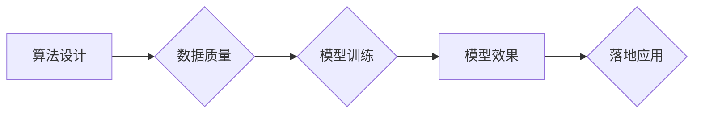

## 模型效果是AI落地的关键

> 关键词：人工智能、模型效果、模型评估、落地应用、算法优化、数据质量、可解释性

### 1. 背景介绍

人工智能（AI）技术近年来发展迅速，取得了令人瞩目的成就。从语音识别、图像识别到自然语言处理，AI已经渗透到我们生活的方方面面。然而，尽管AI技术取得了巨大进步，但将其真正应用于实际场景，并产生实际价值，仍然面临着诸多挑战。其中，**模型效果**是AI落地应用的关键因素之一。

一个AI模型的**效果**是指其在特定任务上的表现，通常用准确率、召回率、F1-score等指标来衡量。一个效果优秀的模型才能真正为用户带来价值，并被广泛应用于实际场景。然而，模型效果的提升是一个复杂的过程，需要考虑多个因素，包括算法设计、数据质量、模型训练方法等。

### 2. 核心概念与联系

**模型效果**是AI落地应用的关键，它直接影响着AI技术的实用性和价值。模型效果的提升需要从多个方面入手，包括算法设计、数据质量、模型训练方法等。

**Mermaid 流程图**



**核心概念原理和架构**

* **算法设计:** 选择合适的算法模型是保证模型效果的基础。不同的算法模型适用于不同的任务类型，例如，卷积神经网络适合图像识别，循环神经网络适合自然语言处理。
* **数据质量:** 数据是AI模型训练的基础，数据质量直接影响着模型的效果。高质量的数据包含准确、完整、多样化的信息，能够帮助模型更好地学习和泛化。
* **模型训练:** 模型训练是将算法模型应用于数据，并不断调整模型参数的过程。训练方法的选择、超参数的设置等都会影响模型的效果。
* **模型效果:** 模型效果是指模型在特定任务上的表现，通常用准确率、召回率、F1-score等指标来衡量。
* **落地应用:** 模型效果优秀的模型才能被应用于实际场景，并产生实际价值。

### 3. 核心算法原理 & 具体操作步骤

#### 3.1  算法原理概述

**深度学习**是目前AI领域最热门的算法之一，它能够学习复杂的数据模式，并取得优异的性能。深度学习模型通常由多个神经网络层组成，每一层都包含多个神经元。神经元之间通过连接和权重进行信息传递，通过训练，模型能够学习到这些连接和权重的最佳值，从而实现对数据的学习和预测。

#### 3.2  算法步骤详解

1. **数据预处理:** 将原始数据进行清洗、转换、特征工程等操作，使其适合深度学习模型的训练。
2. **模型构建:** 选择合适的深度学习模型架构，例如卷积神经网络、循环神经网络等。
3. **模型训练:** 使用训练数据训练模型，通过反向传播算法不断调整模型参数，使其能够更好地拟合数据。
4. **模型评估:** 使用测试数据评估模型的性能，并根据评估结果进行模型调优。
5. **模型部署:** 将训练好的模型部署到实际应用场景中，用于进行预测或其他任务。

#### 3.3  算法优缺点

**优点:**

* 能够学习复杂的数据模式，取得优异的性能。
* 能够自动提取特征，减少人工特征工程的负担。
* 能够处理大规模数据。

**缺点:**

* 训练数据量要求高，需要大量的labeled数据。
* 训练时间长，计算资源消耗大。
* 模型解释性差，难以理解模型的决策过程。

#### 3.4  算法应用领域

深度学习算法广泛应用于各个领域，例如：

* **图像识别:** 人脸识别、物体检测、图像分类等。
* **自然语言处理:** 语音识别、机器翻译、文本摘要等。
* **推荐系统:** 商品推荐、内容推荐等。
* **医疗诊断:** 疾病诊断、影像分析等。

### 4. 数学模型和公式 & 详细讲解 & 举例说明

#### 4.1  数学模型构建

深度学习模型的数学基础是神经网络。神经网络由多个层组成，每一层包含多个神经元。每个神经元接收来自上一层的输入信号，并通过激活函数进行处理，输出到下一层。

**神经网络模型**

$$
y = f(W x + b)
$$

其中：

* $y$ 是神经元的输出
* $x$ 是神经元的输入
* $W$ 是权重矩阵
* $b$ 是偏置向量
* $f$ 是激活函数

#### 4.2  公式推导过程

深度学习模型的训练过程是通过**反向传播算法**来实现的。反向传播算法的基本思想是：

1. 将模型的输出与真实值进行比较，计算损失函数。
2. 根据损失函数对模型参数进行梯度下降，更新模型参数。

**损失函数**

$$
L(y, \hat{y}) = \frac{1}{n} \sum_{i=1}^{n} (y_i - \hat{y}_i)^2
$$

其中：

* $y$ 是真实值
* $\hat{y}$ 是模型预测值
* $n$ 是样本数量

**梯度下降算法**

$$
\theta = \theta - \alpha \nabla L(\theta)
$$

其中：

* $\theta$ 是模型参数
* $\alpha$ 是学习率
* $\nabla L(\theta)$ 是损失函数对模型参数的梯度

#### 4.3  案例分析与讲解

**图像分类**

假设我们有一个图像分类任务，目标是将图像分类为不同的类别，例如猫、狗、鸟等。我们可以使用卷积神经网络（CNN）来解决这个问题。CNN能够自动学习图像特征，并将其用于分类。

训练CNN模型的过程是：

1. 使用大量的图像数据进行训练，每个图像都标注了对应的类别。
2. 通过反向传播算法，不断调整CNN模型的参数，使其能够更好地分类图像。
3. 使用测试数据评估模型的性能，并根据评估结果进行模型调优。

### 5. 项目实践：代码实例和详细解释说明

#### 5.1  开发环境搭建

* Python 3.x
* TensorFlow 或 PyTorch 等深度学习框架
* Jupyter Notebook 或其他代码编辑器

#### 5.2  源代码详细实现

```python
import tensorflow as tf

# 定义模型结构
model = tf.keras.models.Sequential([
    tf.keras.layers.Conv2D(32, (3, 3), activation='relu', input_shape=(28, 28, 1)),
    tf.keras.layers.MaxPooling2D((2, 2)),
    tf.keras.layers.Conv2D(64, (3, 3), activation='relu'),
    tf.keras.layers.MaxPooling2D((2, 2)),
    tf.keras.layers.Flatten(),
    tf.keras.layers.Dense(10, activation='softmax')
])

# 编译模型
model.compile(optimizer='adam',
              loss='sparse_categorical_crossentropy',
              metrics=['accuracy'])

# 训练模型
model.fit(x_train, y_train, epochs=10)

# 评估模型
loss, accuracy = model.evaluate(x_test, y_test)
print('Test loss:', loss)
print('Test accuracy:', accuracy)
```

#### 5.3  代码解读与分析

这段代码定义了一个简单的卷积神经网络模型，用于图像分类任务。

* `tf.keras.models.Sequential` 创建了一个顺序模型，即层级结构。
* `tf.keras.layers.Conv2D` 定义了一个卷积层，用于提取图像特征。
* `tf.keras.layers.MaxPooling2D` 定义了一个最大池化层，用于降维。
* `tf.keras.layers.Flatten` 将多维数据转换为一维数据。
* `tf.keras.layers.Dense` 定义了一个全连接层，用于分类。
* `model.compile` 编译模型，指定优化器、损失函数和评价指标。
* `model.fit` 训练模型，使用训练数据进行训练。
* `model.evaluate` 评估模型，使用测试数据评估模型性能。

#### 5.4  运行结果展示

训练完成后，模型会输出测试集上的损失值和准确率。

### 6. 实际应用场景

深度学习模型在各个领域都有广泛的应用，例如：

* **医疗诊断:** 辅助医生诊断疾病，例如癌症、糖尿病等。
* **金融风险控制:** 识别欺诈交易、评估信用风险等。
* **智能客服:** 提供自动化的客户服务，例如回答常见问题、处理订单等。
* **自动驾驶:** 帮助车辆感知周围环境，并做出驾驶决策。

#### 6.4  未来应用展望

随着深度学习技术的不断发展，其应用场景将会更加广泛。例如：

* **个性化推荐:** 提供更加个性化的商品、内容推荐等。
* **药物研发:** 加速药物研发过程，开发新的治疗方法。
* **科学研究:** 推动科学研究的进展，例如蛋白质结构预测、材料科学等。

### 7. 工具和资源推荐

#### 7.1  学习资源推荐

* **书籍:**
    * 深度学习
    * 构建深度学习模型
* **在线课程:**
    * Coursera 深度学习课程
    * Udacity 深度学习工程师 Nanodegree
* **博客和网站:**
    * TensorFlow 官方博客
    * PyTorch 官方博客
    * AI 相关的技术博客

#### 7.2  开发工具推荐

* **深度学习框架:** TensorFlow, PyTorch, Keras
* **数据处理工具:** Pandas, NumPy
* **可视化工具:** Matplotlib, Seaborn

#### 7.3  相关论文推荐

* **ImageNet Classification with Deep Convolutional Neural Networks**
* **Attention Is All You Need**
* **BERT: Pre-training of Deep Bidirectional Transformers for Language Understanding**

### 8. 总结：未来发展趋势与挑战

#### 8.1  研究成果总结

深度学习技术取得了令人瞩目的成就，在图像识别、自然语言处理等领域取得了突破性进展。

#### 8.2  未来发展趋势

* **模型规模和效率:** 继续追求模型规模的扩大，同时提高模型的训练效率和推理速度。
* **数据增强和合成:** 开发新的数据增强和数据合成技术，以解决数据标注成本高、数据分布不均匀等问题。
* **可解释性:** 研究深度学习模型的决策过程，提高模型的可解释性和可信度。
* **联邦学习:** 研究联邦学习等隐私保护技术，解决数据安全和隐私问题。

#### 8.3  面临的挑战

* **数据质量:** 深度学习模型对数据质量要求很高，数据噪声、偏差等问题会影响模型效果。
* **计算资源:** 训练大型深度学习模型需要大量的计算资源，成本较高。
* **可解释性:** 深度学习模型的决策过程难以理解，缺乏可解释性，难以应用于需要透明度和可信度的领域。
* **伦理问题:** 深度学习技术可能带来一些伦理问题，例如算法偏见、数据隐私等，需要引起重视和解决。

#### 8.4  研究展望

未来，深度学习技术将继续发展，并应用于更多领域。研究者们将继续探索新的算法、新的训练方法、新的应用场景，推动深度学习技术的发展和应用。

### 9. 附录：常见问题与解答

**Q1: 如何评估深度学习模型的效果？**

**A1:** 深度学习模型的效果通常用准确率、召回率、F1-score等指标来衡量。

**Q2: 如何选择合适的深度学习模型？**

**A2:** 选择合适的深度学习模型需要根据具体的任务类型和数据特点来决定。例如，图像识别任务通常使用卷积神经网络，自然语言处理任务通常使用循环神经网络。

**Q3: 如何解决深度学习模型的过拟合