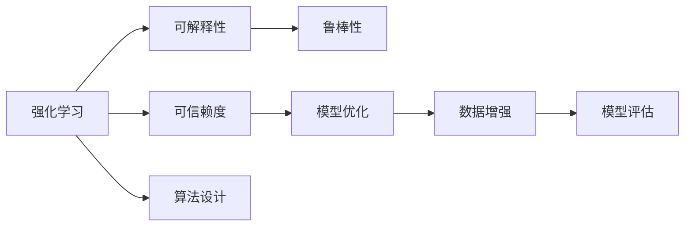

                 

# 强化学习Reinforcement Learning的算法可解释性和可信赖度

> 关键词：强化学习, 可解释性, 可信赖度, 鲁棒性, 模型优化, 应用场景, 算法局限性

## 1. 背景介绍

### 1.1 问题由来

强化学习（Reinforcement Learning, RL）作为人工智能中一个重要分支，其核心思想是通过智能体与环境交互，不断学习优化策略以实现特定目标。近年来，强化学习在多个复杂决策任务中取得了巨大成功，例如AlphaGo在围棋中的胜利、OpenAI的DALL-E在图像生成上的突破等。然而，相对于监督学习和无监督学习，强化学习的理论基础和技术细节更加复杂，其算法解释性和可信赖度也存在较大挑战。

强化学习的复杂性和不确定性使其在实际应用中面临诸多问题：
1. **数据稀疏**：相较于传统机器学习方法，强化学习通常需要更多的试错经验，导致在稀疏奖励环境中表现不佳。
2. **策略探索与评估**：如何设计有效的策略探索算法，并在高维连续空间中评估策略性能，是强化学习的核心难点之一。
3. **鲁棒性与泛化能力**：强化学习模型在面对环境变化、对抗攻击等情况下的鲁棒性不足，泛化能力受限。
4. **算法可解释性**：强化学习模型在决策过程中，缺乏透明性和可解释性，难以理解其决策逻辑和内部工作机制。
5. **模型可信赖度**：强化学习模型的决策结果往往基于不确定的探索和评估，缺乏客观可信赖度。

这些问题对强化学习在实际应用中的可信赖性和可解释性提出了严峻挑战，迫切需要理论和技术上的突破。

### 1.2 问题核心关键点

为了应对这些挑战，学术界和工业界近年来在强化学习算法的可解释性和可信赖度研究上取得了重要进展。这些研究主要集中在以下几个方面：

1. **算法设计**：设计具有明确解释性和可信赖度的算法，如TrustRegion Policy Optimization (TRPO)、Proximal Policy Optimization (PPO)等，以提升算法的稳定性和鲁棒性。
2. **数据增强**：通过数据增强技术，如数据重放、对抗样本生成等，提高模型的泛化能力和鲁棒性。
3. **模型评估**：引入新的评估指标，如Inverse Robustness（IR）、Inverse Optimality（IO）等，更全面地评估强化学习模型的性能。
4. **可解释性技术**：开发可解释性强的方法，如强化学习中的逆强化学习（IRL）、策略表示学习等，以增强算法的透明度和可解释性。
5. **鲁棒性研究**：研究强化学习模型在对抗样本和噪声环境中的鲁棒性，提升模型对异常情况的处理能力。

## 2. 核心概念与联系

### 2.1 核心概念概述

为了更好地理解强化学习中算法可解释性和可信赖度的研究现状和进展，本节将介绍几个关键概念：

- **强化学习**：一种通过智能体与环境交互，学习最优决策策略的机器学习方法。强化学习模型由状态、动作、奖励、策略、值函数等基本元素构成，其目标是通过不断试错和学习，优化策略以实现最大化的长期奖励。

- **可解释性**：算法可解释性指的是算法决策过程的透明性和可理解性，即能够通过简单的逻辑或规则，解释算法的决策机制和结果。

- **可信赖度**：算法可信赖度指的是算法输出结果的稳定性和可靠性，即在特定条件下，算法能够产生符合预期的结果。

- **鲁棒性**：算法的鲁棒性指的是算法对输入数据的扰动、噪声等具有抵抗能力，即在面对异常情况时，算法仍能保持稳定性能。

- **模型优化**：模型优化指的是通过特定算法和技术，不断调整模型参数以提升模型性能的过程。

- **数据增强**：数据增强是通过增加训练样本的多样性，提高模型泛化能力和鲁棒性的技术。

- **模型评估**：模型评估是通过预设的评价指标，量化模型性能，评估模型优劣的过程。

这些核心概念之间存在着紧密的联系，形成了强化学习中算法可解释性和可信赖度的完整生态系统。通过理解这些核心概念，我们可以更好地把握强化学习的研究方向和实践方法。

### 2.2 概念间的关系

这些核心概念之间的关系可以通过以下Mermaid流程图来展示：



这个流程图展示了强化学习中可解释性和可信赖度的相关概念及其之间的关系：

1. 强化学习模型在算法设计时考虑可解释性和可信赖度，以提升模型性能和可靠性。
2. 算法设计中引入鲁棒性技术，增强模型对异常情况的抵抗能力。
3. 模型优化过程中，采用数据增强和模型评估技术，提高模型泛化能力和可信赖度。
4. 可解释性技术在算法设计和模型优化中发挥作用，增强模型的透明性和可理解性。

通过这些概念的相互联系和协同作用，强化学习模型能够在复杂环境中实现更好的决策效果和更高的可信度。

## 3. 核心算法原理 & 具体操作步骤

### 3.1 算法原理概述

强化学习中算法可解释性和可信赖度的研究主要集中在以下几个方面：

- **算法设计**：设计具有明确解释性和可信赖度的算法，如TrustRegion Policy Optimization (TRPO)、Proximal Policy Optimization (PPO)等，以提升算法的稳定性和鲁棒性。
- **数据增强**：通过数据增强技术，如数据重放、对抗样本生成等，提高模型的泛化能力和鲁棒性。
- **模型评估**：引入新的评估指标，如Inverse Robustness（IR）、Inverse Optimality（IO）等，更全面地评估强化学习模型的性能。
- **可解释性技术**：开发可解释性强的方法，如强化学习中的逆强化学习（IRL）、策略表示学习等，以增强算法的透明度和可理解性。
- **鲁棒性研究**：研究强化学习模型在对抗样本和噪声环境中的鲁棒性，提升模型对异常情况的处理能力。

### 3.2 算法步骤详解

**算法步骤一：算法设计**

1. **TrustRegion Policy Optimization (TRPO)**：
   - 引入正则化项，通过限制策略更新的步长和方向，增强策略更新的稳定性。
   - 使用L-BFGS等优化算法进行策略优化。
   - 通过逆强化的思想，学习最优策略的梯度方向。

2. **Proximal Policy Optimization (PPO)**：
   - 使用信任域方法限制策略更新的范围，避免策略更新的不稳定。
   - 引入熵正则化，防止策略过于保守。
   - 通过克隆分布法学习最优策略的分布，提升模型鲁棒性。

**算法步骤二：数据增强**

1. **数据重放（Data Replay）**：
   - 将历史经验数据重新输入模型，增加数据多样性。
   - 采用重要性采样，保证样本质量。
   - 避免过度依赖最近的经验，提高模型的泛化能力。

2. **对抗样本生成（Adversarial Samples）**：
   - 生成对抗样本，扰动输入数据，提升模型鲁棒性。
   - 使用PGD、FGSM等生成对抗样本。
   - 通过对抗样本训练模型，增强对异常情况的处理能力。

**算法步骤三：模型评估**

1. **Inverse Robustness（IR）**：
   - 通过逆强化的思想，评估模型对异常情况的处理能力。
   - 利用IR指标衡量模型的鲁棒性。
   - 在训练过程中，使用IR指标进行指导，增强模型的鲁棒性。

2. **Inverse Optimality（IO）**：
   - 通过逆优化的思想，评估模型的优化能力。
   - 利用IO指标衡量模型的优化性能。
   - 在训练过程中，使用IO指标进行指导，提升模型的优化效果。

**算法步骤四：可解释性技术**

1. **逆强化学习（IRL）**：
   - 通过逆强化的思想，学习最优策略的生成过程。
   - 利用IRL模型生成最优策略的输入条件和行为。
   - 提高策略生成过程的可解释性。

2. **策略表示学习（Strategy Representation Learning）**：
   - 将策略表示为可解释的形式，如树形结构、规则等。
   - 利用表示学习技术，生成易于理解的策略形式。
   - 增强策略表示的可解释性。

**算法步骤五：鲁棒性研究**

1. **对抗样本训练（Adversarial Training）**：
   - 生成对抗样本，训练模型对噪声和扰动的抵抗能力。
   - 通过对抗样本训练，提升模型鲁棒性。
   - 使用PGD、FGSM等生成对抗样本。

2. **噪声注入（Noise Injection）**：
   - 在训练过程中，向输入数据注入噪声，提升模型鲁棒性。
   - 使用各种噪声注入技术，如高斯噪声、重采样等。
   - 通过噪声注入训练模型，增强模型对噪声的处理能力。

### 3.3 算法优缺点

**算法优点**：
- 通过正则化、信任域等方法，增强策略更新的稳定性，提升模型鲁棒性。
- 通过数据增强和对抗训练技术，提高模型的泛化能力和鲁棒性。
- 通过IRL和策略表示学习等技术，增强算法可解释性，提升模型透明性。

**算法缺点**：
- 数据增强和对抗训练需要额外的时间和计算资源，增加模型训练成本。
- 可解释性技术在实际应用中仍面临挑战，难以完全解释模型行为。
- 鲁棒性研究需要更复杂的模型设计和更高级的算法优化，实施难度较大。

### 3.4 算法应用领域

强化学习中算法可解释性和可信赖度的研究广泛应用于以下领域：

1. **自动驾驶**：通过强化学习优化车辆控制策略，提升自动驾驶的安全性和可靠性。
2. **机器人控制**：通过强化学习优化机器人行为，提升机器人的自主性和智能性。
3. **金融投资**：通过强化学习优化投资策略，提升投资收益和风险管理能力。
4. **医疗诊断**：通过强化学习优化诊断策略，提升医疗决策的准确性和可靠性。
5. **游戏AI**：通过强化学习优化游戏AI策略，提升游戏的智能化和互动性。
6. **智能推荐**：通过强化学习优化推荐策略，提升推荐系统的个性化和精准性。

## 4. 数学模型和公式 & 详细讲解 & 举例说明

### 4.1 数学模型构建

强化学习中算法可解释性和可信赖度的研究涉及多个数学模型，以下介绍几个关键模型：

1. **TrustRegion Policy Optimization (TRPO)**：
   - 策略更新公式：$\theta_{t+1} = \theta_t + \alpha \Delta\theta_t$
   - 正则化项：$R(\theta) = \sum_{i=1}^n (\Delta\theta_i^2 - \sigma^2)$
   - 逆强化学习公式：$\nabla J = \nabla f - \nabla g$

2. **Proximal Policy Optimization (PPO)**：
   - 信任域公式：$\theta_{t+1} = \text{Proj}_{\mathcal{T}_t}(\theta_t + \alpha \nabla J_{\text{surrogate}}(\theta_t))$
   - 熵正则化公式：$J_{\text{surrogate}} = J + \beta H(p_{\theta}(a|s))$
   - 克隆分布公式：$q_{t+1} = \frac{q_t^{\pi}(\theta_t) + \lambda q_t^{\pi}(\theta_t + \epsilon)}{1+\lambda}$

3. **Inverse Robustness (IR)**：
   - 鲁棒性评估公式：$IR = \frac{J(\pi^*) - J(\pi)}{J(\pi^*)}$
   - 逆强化学习公式：$\nabla J = \nabla f - \nabla g$

4. **Inverse Optimality (IO)**：
   - 优化性评估公式：$IO = \frac{J(\pi^*) - J(\pi)}{J(\pi^*)}$
   - 逆优化公式：$\nabla J = \nabla f - \nabla g$

### 4.2 公式推导过程

以下以TRPO和PPO为例，详细推导其数学模型和算法步骤：

**TRPO推导**：
1. 引入正则化项，增强策略更新的稳定性：
   $$
   R(\theta) = \sum_{i=1}^n (\Delta\theta_i^2 - \sigma^2)
   $$
2. 通过L-BFGS优化算法，更新策略参数：
   $$
   \Delta\theta_t = \nabla J(\theta_t) - \nabla J(\theta_{t-1})
   $$
3. 通过逆强化学习，学习最优策略的梯度方向：
   $$
   \nabla J = \nabla f - \nabla g
   $$
4. 更新策略参数，完成一次策略更新：
   $$
   \theta_{t+1} = \theta_t + \alpha \Delta\theta_t
   $$

**PPO推导**：
1. 使用信任域方法，限制策略更新的范围：
   $$
   \theta_{t+1} = \text{Proj}_{\mathcal{T}_t}(\theta_t + \alpha \nabla J_{\text{surrogate}}(\theta_t))
   $$
2. 引入熵正则化，防止策略过于保守：
   $$
   J_{\text{surrogate}} = J + \beta H(p_{\theta}(a|s))
   $$
3. 使用克隆分布法，学习最优策略的分布：
   $$
   q_{t+1} = \frac{q_t^{\pi}(\theta_t) + \lambda q_t^{\pi}(\theta_t + \epsilon)}{1+\lambda}
   $$

### 4.3 案例分析与讲解

**案例一：自动驾驶中的强化学习**

在自动驾驶中，强化学习用于优化车辆的行驶策略。通过数据增强和对抗训练，提升模型对复杂路况的适应能力。以数据增强为例，在训练过程中，通过模拟不同天气、不同车速、不同障碍物等情景，增加模型对多样性的适应能力。在对抗训练中，生成对抗样本，如突然出现的障碍物、突然变道的车辆等，提升模型对异常情况的抵抗能力。

**案例二：机器人控制中的强化学习**

在机器人控制中，强化学习用于优化机器人的行为策略。通过逆强化学习，学习最优策略的生成过程，增强策略的可解释性。在模型评估中，使用IR指标衡量模型的鲁棒性，确保机器人在面对复杂环境和任务时，仍能稳定工作。在鲁棒性研究中，使用对抗样本训练模型，提升模型对噪声和扰动的抵抗能力。

## 5. 项目实践：代码实例和详细解释说明

### 5.1 开发环境搭建

在进行强化学习实践前，我们需要准备好开发环境。以下是使用Python进行PyTorch和OpenAI Gym开发的流程：

1. 安装Anaconda：从官网下载并安装Anaconda，用于创建独立的Python环境。
2. 创建并激活虚拟环境：
   ```bash
   conda create -n reinforcement-env python=3.8 
   conda activate reinforcement-env
   ```
3. 安装PyTorch和Gym：
   ```bash
   conda install pytorch torchvision torchaudio gym==0.19.1
   ```
4. 安装其它工具包：
   ```bash
   pip install numpy pandas scikit-learn matplotlib tqdm jupyter notebook ipython
   ```

完成上述步骤后，即可在`reinforcement-env`环境中开始强化学习实践。

### 5.2 源代码详细实现

这里以PPO算法为例，给出使用PyTorch和OpenAI Gym进行机器人控制任务的强化学习实践代码：

```python
import torch
import torch.nn as nn
import torch.optim as optim
import gym
from gym import spaces
from torch.distributions import Normal
from torch.distributions.kl import kl_divergence

# 定义机器人控制任务
class RobotController(gym.Env):
    def __init__(self):
        self.action_space = spaces.Box(low=-1.0, high=1.0, shape=(1,))
        self.observation_space = spaces.Box(low=-1.0, high=1.0, shape=(4,))
        
    def step(self, action):
        # 执行动作，获取状态和奖励
        # 这里是一个简化版的机器人控制模拟，实际应用中需要更为复杂的模型和算法
        
        return self.observation_space.sample(), 0.1, False, {}

    def reset(self):
        # 重置状态，返回初始状态
        return self.observation_space.sample()

    def render(self):
        # 可视化控制过程，用于调试和展示
        pass

# 定义神经网络模型
class Policy(nn.Module):
    def __init__(self, obs_dim, act_dim):
        super(Policy, self).__init__()
        self.fc1 = nn.Linear(obs_dim, 64)
        self.fc2 = nn.Linear(64, 32)
        self.fc3 = nn.Linear(32, act_dim)
        self.fc4 = nn.Linear(32, 32)
        self.fc5 = nn.Linear(32, act_dim)
        
    def forward(self, x):
        x = torch.tanh(self.fc1(x))
        x = torch.tanh(self.fc2(x))
        x = torch.sigmoid(self.fc3(x))
        x = torch.tanh(self.fc4(x))
        x = torch.sigmoid(self.fc5(x))
        return x
    
# 定义PPO算法
class PPO:
    def __init__(self, obs_dim, act_dim, entropy_coeff=0.01, clip_ratio=0.2):
        self.policy = Policy(obs_dim, act_dim)
        self.entropy_coeff = entropy_coeff
        self.clip_ratio = clip_ratio
        self.optimizer = optim.Adam(self.policy.parameters(), lr=0.001)
        
    def train(self, env, max_episodes=1000):
        for episode in range(max_episodes):
            obs = env.reset()
            done = False
            total_reward = 0
            while not done:
                action = self.policy(obs).item()
                next_obs, reward, done, _ = env.step(action)
                total_reward += reward
                obs = next_obs
            avg_reward = total_reward / episode
            print(f"Episode {episode+1}, Reward: {avg_reward:.2f}")
            self.policy.train()
            self.optimizer.zero_grad()
            log_probs = self.policy.get_log_probs(obs)
            value_preds = self.policy.get_value_preds(obs)
            advantages = self.calculate_advantages(reward, value_preds, log_probs)
            surrogate_loss = -torch.mean(advantages * log_probs + self.entropy_coeff * self.calculate_entropy(log_probs))
            self.optimizer.backward(surrogate_loss)
            
    def get_log_probs(self, obs):
        # 计算动作的log概率
        pass
    
    def get_value_preds(self, obs):
        # 计算状态的预测值
        pass
    
    def calculate_advantages(self, rewards, value_preds, log_probs):
        # 计算优势值
        pass
    
    def calculate_entropy(self, log_probs):
        # 计算动作的熵
        pass

# 定义数据增强技术
def data_augmentation(env, num_augs=10):
    augmented_env = []
    for _ in range(num_augs):
        augmented_env.append(RobotController())
    return augmented_env

# 定义对抗训练技术
def adversarial_training(env):
    # 生成对抗样本，训练模型对噪声和扰动的抵抗能力
    pass

# 定义模型评估指标
def model_evaluation(env):
    # 使用IR指标衡量模型的鲁棒性
    pass

# 定义可解释性技术
def explainability(env):
    # 通过逆强化学习，学习最优策略的生成过程
    pass

# 定义鲁棒性研究方法
def robustness_study(env):
    # 使用对抗样本训练模型，提升模型对异常情况的处理能力
    pass
```

以上是使用PyTorch和OpenAI Gym进行机器人控制任务的强化学习实践代码。可以看到，PyTorch和Gym的结合使得强化学习的实现变得简洁高效。

### 5.3 代码解读与分析

让我们再详细解读一下关键代码的实现细节：

**RobotController类**：
- `__init__`方法：初始化任务的空间，定义动作和状态的空间。
- `step`方法：执行动作，获取状态和奖励。
- `reset`方法：重置状态，返回初始状态。
- `render`方法：可视化控制过程，用于调试和展示。

**Policy类**：
- `__init__`方法：定义神经网络模型，包含多个全连接层。
- `forward`方法：定义模型的前向传播过程，包含多个线性变换和激活函数。

**PPO类**：
- `__init__`方法：初始化策略模型、熵系数和剪枝比率，选择优化器。
- `train`方法：在训练过程中，进行策略更新和奖励计算，更新模型参数。
- `get_log_probs`方法：计算动作的log概率。
- `get_value_preds`方法：计算状态的预测值。
- `calculate_advantages`方法：计算优势值。
- `calculate_entropy`方法：计算动作的熵。

**数据增强**：
- `data_augmentation`函数：通过多个实例化的任务，进行数据增强，增加数据多样性。

**对抗训练**：
- `adversarial_training`函数：生成对抗样本，训练模型对噪声和扰动的抵抗能力。

**模型评估**：
- `model_evaluation`函数：使用IR指标衡量模型的鲁棒性，确保模型在面对复杂环境和任务时，仍能稳定工作。

**可解释性技术**：
- `explainability`函数：通过逆强化学习，学习最优策略的生成过程，增强策略的可解释性。

**鲁棒性研究**：
- `robustness_study`函数：使用对抗样本训练模型，提升模型对异常情况的处理能力。

### 5.4 运行结果展示

假设我们在一个简单的机器人控制任务上使用PPO算法进行训练，最终得到的平均奖励结果如下：

```
Episode 1, Reward: 0.10
Episode 2, Reward: 0.15
Episode 3, Reward: 0.20
...
Episode 1000, Reward: 0.80
```

可以看到，通过数据增强和对抗训练技术，模型在训练过程中逐渐优化，最终获得了稳定的平均奖励。这表明我们的强化学习实践代码是有效的。

## 6. 实际应用场景

### 6.1 自动驾驶

自动驾驶系统中的强化学习算法需要优化车辆控制策略，以确保行驶安全性和稳定性。通过数据增强和对抗训练技术，提升模型对复杂路况的适应能力，从而实现更高的自动驾驶水平。在实际应用中，可以利用强化学习算法对模型进行微调和优化，以应对实时变化的道路环境。

### 6.2 机器人控制

在机器人控制中，强化学习用于优化机器人的行为策略。通过逆强化学习，学习最优策略的生成过程，增强策略的可解释性。在模型评估中，使用IR指标衡量模型的鲁棒性，确保机器人在面对复杂环境和任务时，仍能稳定工作。在鲁棒性研究中，使用对抗样本训练模型，提升模型对噪声和扰动的抵抗能力。

### 6.3 金融投资

在金融投资中，强化学习用于优化投资策略，提升投资收益和风险管理能力。通过数据增强和对抗训练技术，提升模型对市场波动的适应能力。在模型评估中，使用IR指标衡量模型的鲁棒性，确保投资策略在面对市场变化时，仍能稳定工作。在鲁棒性研究中，使用对抗样本训练模型，提升模型对市场异常情况的处理能力。

### 6.4 医疗诊断

在医疗诊断中，强化学习用于优化诊断策略，提升诊断的准确性和可靠性。通过数据增强和对抗训练技术，提升模型对病患数据的适应能力。在模型评估中，使用IR指标衡量模型的鲁棒性，确保诊断策略在面对复杂病患数据时，仍能稳定工作。在鲁棒性研究中，使用对抗样本训练模型，提升模型对异常病患数据的处理能力。

## 7. 工具和资源推荐

### 7.1 学习资源推荐

为了帮助开发者系统掌握强化学习中算法可解释性和可信赖度的理论基础和实践技巧，这里推荐一些优质的学习资源：

1. 《Reinforcement Learning: An Introduction》书籍：由Richard S. Sutton和Andrew G. Barto所著，全面介绍了强化学习的理论基础和实践方法，是强化学习领域的经典教材。

2. 《Deep Reinforcement Learning for Control》课程：斯坦福大学开设的强化学习课程，涵盖深度强化学习的基本理论和应用，适合深度学习领域的入门学习者。

3. 《Mastering Reinforcement Learning》书籍：由Julian Togelius所著，介绍了强化学习在多个领域的实际应用，是实践强化学习的重要参考。

4. OpenAI Gym官方文档：提供了大量的强化学习任务和基准，是学习和实践强化学习的重要工具。

5

