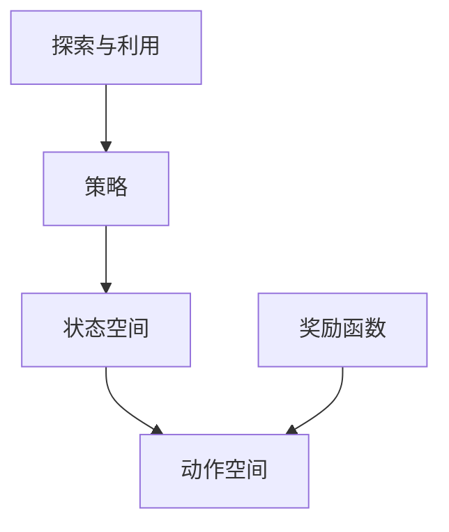
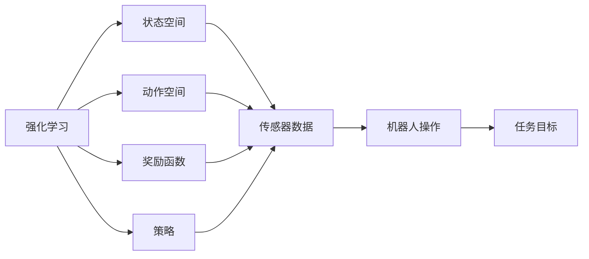
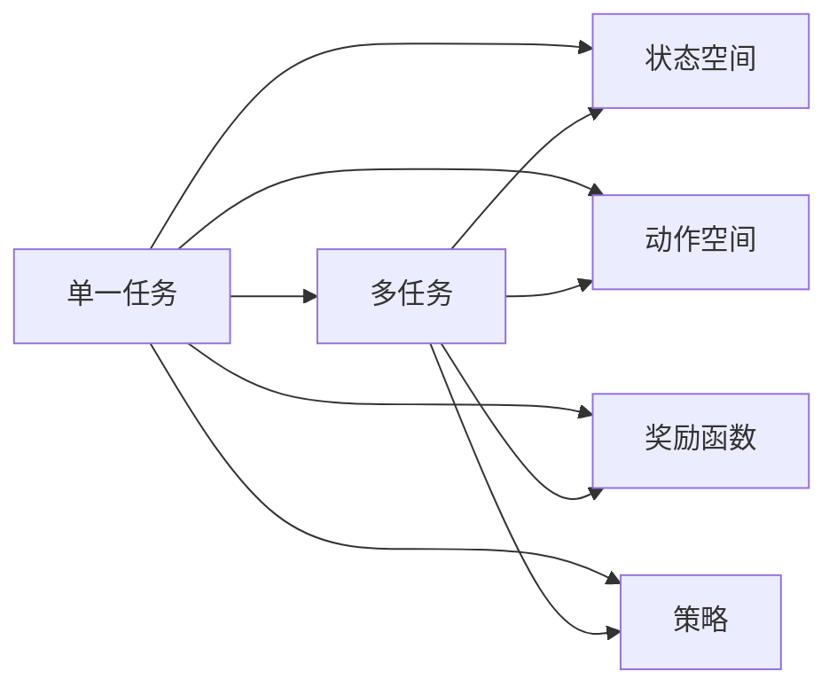
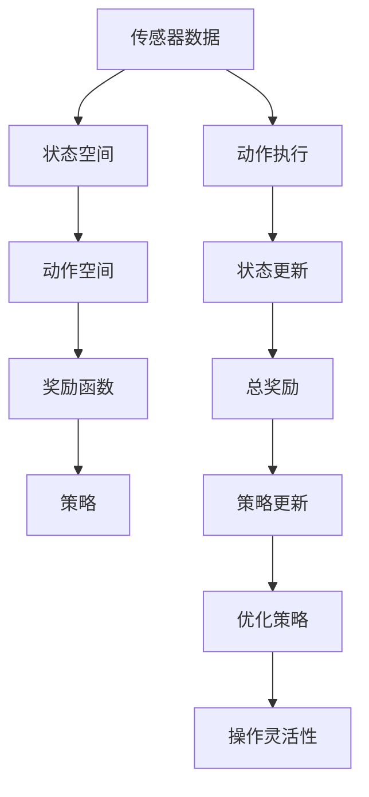

                 

# 强化学习在机器人操作中的应用:提高灵活性

> 关键词：强化学习,机器人操作,灵活性提高,路径规划,机器学习

## 1. 背景介绍

### 1.1 问题由来
随着科技的发展，机器人技术在制造、物流、医疗、教育等各个领域中得到了广泛应用。然而，尽管机器人技术已经取得了显著进展，其在复杂、不确定环境中的操作灵活性仍存在重大挑战。机器人往往需要按照固定的路径和模式进行操作，难以应对突发情况和变化环境。为解决这一问题，研究者们纷纷将强化学习（Reinforcement Learning, RL）引入机器人操作中，以提升其自主决策能力和灵活性。

### 1.2 问题核心关键点
强化学习在机器人操作中的应用，主要通过模拟环境训练机器人，使其在实际执行任务时能够自主优化决策策略，提高操作灵活性。具体而言，强化学习的核心在于：

- 构建任务环境：通过定义任务空间、状态空间和动作空间，将机器人操作转化为强化学习问题。
- 设计奖励函数：定义合理的奖励机制，引导机器人向最优操作策略靠拢。
- 执行学习算法：选择合适的强化学习算法，在环境中反复迭代训练，优化决策策略。
- 应用到实际任务：将训练好的模型应用到实际机器人操作中，提升操作灵活性和自主性。

强化学习应用于机器人操作的主要挑战在于：

- 高维度状态空间：机器人的传感器数据通常包括位置、速度、姿态等多个维度，状态空间非常庞大。
- 复杂动作空间：机器人的动作包括连续控制和离散操作，动作空间非线性和非凸。
- 环境不确定性：机器人操作的环境通常存在多种变化因素，如非平稳性、噪声干扰等。

这些问题使得直接应用强化学习算法存在挑战，因此需要结合具体任务需求和机器人特性进行优化和改进。

### 1.3 问题研究意义
强化学习在机器人操作中的应用，旨在通过模拟环境训练，使机器人能够自主地优化决策策略，提高操作灵活性和自主性。这种能力在以下方面具有重要意义：

1. 提高效率：机器人能够在复杂、不确定环境下自主决策，无需人工干预，显著提升操作效率。
2. 降低成本：减少对人工操作的需求，降低人力成本。
3. 增强灵活性：使机器人能够应对环境变化和突发情况，适应性更强。
4. 提升安全性：通过优化决策策略，降低操作错误和安全事故的风险。
5. 推动创新：强化学习的应用为机器人技术的发展带来了新的思路和突破，促进了机器人操作领域的创新和进步。

## 2. 核心概念与联系

### 2.1 核心概念概述

为更好地理解强化学习在机器人操作中的应用，本节将介绍几个密切相关的核心概念：

- **强化学习（Reinforcement Learning, RL）**：一种通过奖励机制优化策略的学习范式，旨在通过不断试错在环境中找到最优策略。强化学习的核心在于通过迭代训练，使智能体（如机器人）能够最大化总奖励。

- **状态空间（State Space）**：机器人操作过程中，所有可能状态的集合。状态通常包括位置、速度、角度等传感器数据。

- **动作空间（Action Space）**：机器人可执行的所有动作的集合。动作可以是连续的控制信号，如关节角度、电机转速等，也可以是离散的开关信号，如上下左右移动等。

- **奖励函数（Reward Function）**：定义状态转换后的奖励值，用于指导机器人选择最优动作。奖励函数通常根据任务的特定需求设计。

- **策略（Policy）**：定义在特定状态下选择动作的概率分布，通常使用深度神经网络来表示。

- **探索与利用（Exploration and Exploitation）**：在强化学习中，智能体需要在探索（尝试新动作）和利用（执行已知最优动作）之间进行平衡，以最大化长期奖励。

这些核心概念之间的逻辑关系可以通过以下Mermaid流程图来展示：



这个流程图展示了这个强化学习过程的总体结构：

1. 智能体通过状态空间进行决策，选择动作空间中的动作。
2. 根据动作执行后的新状态，智能体通过奖励函数获取奖励值。
3. 智能体根据奖励值和策略，不断优化策略，提高操作灵活性。

### 2.2 概念间的关系

这些核心概念之间存在着紧密的联系，形成了强化学习在机器人操作中的完整生态系统。下面我们通过几个Mermaid流程图来展示这些概念之间的关系。

#### 2.2.1 强化学习与机器人操作



这个流程图展示了强化学习在机器人操作中的基本框架：

1. 强化学习算法通过传感器数据获取当前状态。
2. 根据当前状态，算法在动作空间中选择动作。
3. 动作执行后，通过奖励函数获得奖励。
4. 根据奖励值和策略，不断优化策略。
5. 机器人操作的目标是通过优化策略，达到任务目标。

#### 2.2.2 机器人操作的多任务适应



这个流程图展示了强化学习在机器人操作中处理多任务适应的情况：

1. 强化学习算法处理单一任务。
2. 通过状态空间、动作空间和奖励函数，定义多任务适应。
3. 在多任务环境中，算法同时处理多个任务。
4. 优化策略，使机器人能够适应不同任务。

#### 2.2.3 强化学习与策略优化


这个流程图展示了强化学习算法如何通过策略优化提升机器人操作灵活性：

1. 强化学习算法通过策略优化，选择最优策略。
2. 在探索与利用之间平衡，选择最优行动。
3. 状态更新，获取新状态。
4. 根据奖励值，调整总奖励。
5. 策略更新，提升操作灵活性。

### 2.3 核心概念的整体架构

最后，我们用一个综合的流程图来展示这些核心概念在机器人操作中的整体架构：



这个综合流程图展示了强化学习在机器人操作中的完整过程：

1. 传感器数据通过状态空间进行决策。
2. 根据状态空间，选择动作空间中的动作。
3. 通过奖励函数获取奖励值。
4. 策略优化，不断调整动作选择。
5. 执行动作，更新状态。
6. 获取总奖励，更新策略。
7. 优化策略，提升操作灵活性。

这些流程图展示了强化学习在机器人操作中的应用过程，可以帮助我们更清晰地理解其工作原理和优化方向。

## 3. 核心算法原理 & 具体操作步骤
### 3.1 算法原理概述

强化学习在机器人操作中的应用，本质上是一个通过奖励机制优化策略的学习过程。其核心思想是：在机器人操作过程中，通过不断试错，使智能体（即机器人）能够最大化总奖励，从而提升操作灵活性和自主性。

形式化地，假设机器人操作的任务为 $T$，状态空间为 $S$，动作空间为 $A$，奖励函数为 $R$。定义策略为 $\pi$，则强化学习的过程为：

1. 从初始状态 $s_0 \in S$ 开始，根据策略 $\pi$ 选择动作 $a_t = \pi(s_t)$。
2. 执行动作 $a_t$，观察下一个状态 $s_{t+1}$ 和奖励 $r_{t+1} = R(s_{t+1}, a_t, s_{t+1})$。
3. 更新策略 $\pi$，使其最大化长期奖励。

通过迭代训练，优化策略 $\pi$，使机器人能够适应不同的任务环境，提升操作灵活性。

### 3.2 算法步骤详解

强化学习在机器人操作中的应用一般包括以下几个关键步骤：

**Step 1: 准备任务环境和数据集**
- 定义机器人操作的任务，包括状态空间、动作空间和奖励函数。
- 准备训练数据集，包括起始状态、动作序列和奖励序列。

**Step 2: 构建策略网络**
- 选择合适的策略网络，如深度神经网络或强化学习算法（如DQN、TD3等）。
- 使用深度神经网络来表示策略，并通过训练数据进行优化。

**Step 3: 设置强化学习参数**
- 选择合适的强化学习算法及其参数，如学习率、探索率、批量大小等。
- 设置训练轮数、更新频率等训练参数。

**Step 4: 执行强化学习训练**
- 在训练环境中，根据策略选择动作，执行动作并观察状态和奖励。
- 根据奖励值，更新策略网络参数，优化策略。
- 循环迭代，直至达到预设的训练轮数或收敛条件。

**Step 5: 评估和部署**
- 在测试环境中，评估策略网络的性能。
- 将优化后的策略网络部署到实际机器人操作中，提升操作灵活性。
- 持续监控和更新策略网络，以适应任务环境变化。

以上是强化学习在机器人操作中的一般流程。在实际应用中，还需要针对具体任务和机器人特性进行优化和改进。

### 3.3 算法优缺点

强化学习在机器人操作中的应用具有以下优点：

1. 自主决策：机器人能够自主地选择动作，无需人工干预，提升操作灵活性。
2. 适应性强：通过优化策略，机器人能够适应不同的任务环境和变化因素。
3. 提升效率：减少对人工操作的需求，提升操作效率。
4. 降低成本：减少人工干预，降低运营成本。

同时，强化学习在机器人操作中也有以下缺点：

1. 训练时间长：在复杂、高维度的环境中，训练过程可能需要大量时间。
2. 数据需求高：需要大量标注数据进行训练，数据获取成本较高。
3. 鲁棒性不足：在复杂、不确定环境中，强化学习算法可能存在鲁棒性不足的问题。
4. 参数复杂：需要选择合适的策略网络和优化算法，参数设置较为复杂。
5. 安全性问题：在实际应用中，强化学习算法可能存在安全性问题，需要加强监督和测试。

尽管存在这些缺点，但强化学习在机器人操作中的应用已经取得了显著进展，并在许多实际应用中表现出色。未来，随着算法和算力的进一步发展，强化学习的应用将更加广泛，带来更多的创新和突破。

### 3.4 算法应用领域

强化学习在机器人操作中的应用，主要涵盖以下几个领域：

- **路径规划**：机器人需要在复杂环境中自主选择最优路径。强化学习通过训练，使机器人能够适应不同环境和任务，提高路径规划的灵活性。
- **避障操作**：机器人需要避开障碍物，寻找安全路径。强化学习通过训练，使机器人能够自主选择最优动作，提高避障能力。
- **任务执行**：机器人需要执行复杂的任务，如搬运、装配等。强化学习通过训练，使机器人能够自主优化动作策略，提高任务执行效率。
- **人机协作**：机器人需要与人类进行协作，如机器人与人类共同完成复杂任务。强化学习通过训练，使机器人能够自主决策，提高协作效率。
- **自主导航**：机器人需要自主导航，达到目标位置。强化学习通过训练，使机器人能够自主选择最优路径，提高导航精度。

这些领域展示了强化学习在机器人操作中的广泛应用，为其提供了广阔的发展前景。

## 4. 数学模型和公式 & 详细讲解 & 举例说明

### 4.1 数学模型构建

本节将使用数学语言对强化学习在机器人操作中的应用进行更加严格的刻画。

假设机器人操作的任务为 $T$，状态空间为 $S$，动作空间为 $A$，奖励函数为 $R$。定义策略为 $\pi$，则强化学习的目标是最小化长期奖励的方差，即：

$$
\mathcal{L}(\theta) = \mathbb{E}_{s \sim P, a \sim \pi} [R(s,a)]^2
$$

其中，$P$ 为状态分布，$\theta$ 为策略网络的参数。通过优化策略网络 $\pi$，最小化长期奖励的方差，使机器人能够自主地选择最优动作，提升操作灵活性。

### 4.2 公式推导过程

以下我们以机器人避障操作为例，推导强化学习模型的梯度计算公式。

假设机器人在状态 $s_t$ 时，根据策略 $\pi$ 选择动作 $a_t = \pi(s_t)$，执行动作后到达状态 $s_{t+1}$，获得奖励 $r_{t+1}$。定义策略 $\pi$ 的参数为 $\theta$，则机器人选择动作的概率为 $p(a_t|s_t;\theta) = \pi(a_t|s_t;\theta)$。根据最大似然估计原理，优化策略网络 $\pi$ 的目标函数为：

$$
\mathcal{L}(\theta) = -\frac{1}{N}\sum_{i=1}^N \log p(a_t|s_t;\theta)
$$

其中，$N$ 为训练样本数。通过梯度下降算法，最小化目标函数 $\mathcal{L}(\theta)$，优化策略网络 $\pi$，使其最大化动作选择概率。

在实际计算中，由于机器人状态空间和动作空间通常是非线性和非凸的，无法直接使用梯度下降算法求解。因此，需要引入强化学习算法，如Q-learning、Deep Q-Network (DQN)、Actor-Critic等，通过迭代训练优化策略网络。这些算法能够处理高维度状态空间和复杂动作空间，提供高效、稳定的优化过程。

### 4.3 案例分析与讲解

下面以机器人路径规划为例，进一步讲解强化学习的具体应用。

假设机器人需要在迷宫中从起点到达终点，状态空间为迷宫中每个位置的状态，动作空间为向左、向右、向前、向后四个方向。定义奖励函数 $R(s,a)$ 为到达终点的距离倒数，即 $R(s,a) = 1/d$，其中 $d$ 为当前位置到终点的距离。

首先，构建机器人路径规划的强化学习模型：

- 状态空间：迷宫中每个位置的状态，包括位置、速度、角度等传感器数据。
- 动作空间：四个方向的动作。
- 奖励函数：到达终点的距离倒数。

其次，定义策略网络 $\pi$，使用深度神经网络来表示。通过训练数据进行优化，学习最优路径规划策略。

最后，使用Q-learning算法，通过迭代训练优化策略网络。在每轮训练中，机器人随机选择一个动作，执行动作并观察新状态和奖励。根据奖励值，更新策略网络参数，优化路径规划策略。

通过强化学习训练，机器人能够在迷宫中自主选择最优路径，提升路径规划的灵活性。这种自主决策能力，在实际应用中能够显著提高机器人的操作效率和安全性。

## 5. 项目实践：代码实例和详细解释说明
### 5.1 开发环境搭建

在进行强化学习实践前，我们需要准备好开发环境。以下是使用Python进行TensorFlow开发的环境配置流程：

1. 安装Anaconda：从官网下载并安装Anaconda，用于创建独立的Python环境。

2. 创建并激活虚拟环境：
```bash
conda create -n reinforcement-env python=3.8 
conda activate reinforcement-env
```

3. 安装TensorFlow：根据CUDA版本，从官网获取对应的安装命令。例如：
```bash
conda install tensorflow tensorflow-gpu==2.7 -c tensorflow -c conda-forge
```

4. 安装其他必要的库：
```bash
pip install gym opencv-python
```

完成上述步骤后，即可在`reinforcement-env`环境中开始强化学习实践。

### 5.2 源代码详细实现

下面我们以机器人避障操作为例，给出使用TensorFlow进行强化学习的PyTorch代码实现。

首先，定义环境类，使用Gym库构建机器人避障的模拟环境：

```python
import gym
import numpy as np

class RobotEnv(gym.Env):
    def __init__(self):
        self.grid = np.zeros((10, 10), dtype=np.int32)
        self.start_pos = (0, 0)
        self.goal_pos = (9, 9)
        self.end_time = 100
        self.done = False

    def reset(self):
        self.grid = np.zeros((10, 10), dtype=np.int32)
        self.start_pos = (0, 0)
        self.goal_pos = (9, 9)
        self.done = False
        return self.grid

    def step(self, action):
        if self.done:
            return self.grid, 0, True, {}

        if action == 0:  # 向上移动
            if self.start_pos[0] > 0 and self.grid[self.start_pos[0] - 1, self.start_pos[1]] == 0:
                self.start_pos = (self.start_pos[0] - 1, self.start_pos[1])
        elif action == 1:  # 向右移动
            if self.start_pos[1] < 9 and self.grid[self.start_pos[0], self.start_pos[1] + 1] == 0:
                self.start_pos = (self.start_pos[0], self.start_pos[1] + 1)
        elif action == 2:  # 向下移动
            if self.start_pos[0] < 9 and self.grid[self.start_pos[0] + 1, self.start_pos[1]] == 0:
                self.start_pos = (self.start_pos[0] + 1, self.start_pos[1])
        elif action == 3:  # 向左移动
            if self.start_pos[1] > 0 and self.grid[self.start_pos[0], self.start_pos[1] - 1] == 0:
                self.start_pos = (self.start_pos[0], self.start_pos[1] - 1)

        if self.start_pos == self.goal_pos:
            self.done = True
            return self.grid, 1, True, {}
        else:
            self.end_time -= 1
            if self.end_time <= 0:
                self.done = True
                return self.grid, 0, True, {}

        self.grid[self.start_pos[0], self.start_pos[1]] = 1
        return self.grid, 0, False, {}
```

然后，定义策略网络，使用深度神经网络来表示策略：

```python
import tensorflow as tf

class DQN(tf.keras.Model):
    def __init__(self, state_size, action_size):
        super(DQN, self).__init__()
        self.flatten = tf.keras.layers.Flatten()
        self.dense1 = tf.keras.layers.Dense(24, activation='relu')
        self.dense2 = tf.keras.layers.Dense(24, activation='relu')
        self.out = tf.keras.layers.Dense(action_size, activation='linear')

    def call(self, x):
        x = self.flatten(x)
        x = self.dense1(x)
        x = self.dense2(x)
        return self.out(x)
```

接下来，定义强化学习算法，使用Deep Q-Network (DQN)算法进行训练：

```python
import numpy as np
import tensorflow as tf
from gym import spaces

class DQN:
    def __init__(self, state_size, action_size):
        self.state_size = state_size
        self.action_size = action_size
        self.memory = deque(maxlen=2000)
        self.gamma = 0.95
        self.epsilon = 1.0
        self.epsilon_min = 0.01
        self.epsilon_decay = 0.995
        self.learning_rate = 0.001
        self.model = self._build_model()

    def _build_model(self):
        model = DQN(self.state_size, self.action_size)
        model.compile(loss='mse', optimizer=tf.keras.optimizers.Adam(lr=self.learning_rate))
        return model

    def remember(self, state, action, reward, next_state, done):
        self.memory.append((state, action, reward, next_state, done))

    def act(self, state):
        if np.random.rand() <= self.epsilon:
            return np.random.randint(0, self.action_size)
        act_values = self.model.predict(state)
        return np.argmax(act_values[0])

    def replay(self, batch_size):
        minibatch = np.random.choice(len(self.memory), batch_size, replace=False)
        for state, action, reward, next_state, done in minibatch:
            target = reward
            if not done:
                target = (reward + self.gamma * np.amax(self.model.predict(next_state)[0]))
            target_f = self.model.predict(state)
            target_f[0][action] = target
            self.model.fit(state, target_f, epochs=1, verbose=0)
        if self.epsilon > self.epsilon_min:
            self.epsilon *= self.epsilon_decay
```

最后，使用强化学习算法训练机器人避障操作：

```python
def train():
    env = RobotEnv()
    state_size = (10, 10)
    action_size = 4
    model = DQN(state_size, action_size)

    for episode in range(1000):
        state = env.reset()
        state = np.reshape(state, [1, state_size[0], state_size[1]])
        done = False
        while not done:
            action = model.act(state)
            next_state, reward, done, _ = env.step(action)
            next_state = np.reshape(next_state, [1, state_size[0], state_size[1]])
            model.remember(state, action, reward, next_state, done)
            if len(model.memory) > batch_size:
                model.replay(batch_size)
            state = next_state
        env = RobotEnv()

    state = np.reshape(env.reset(), [1, state_size[0], state_size[1]])
    done = False
    while not done:
        action = model.act(state)
        next_state, reward, done, _ = env.step(action)
        next_state = np.reshape(next_state, [1, state_size[0], state_size[1]])
        model.remember(state, action, reward, next_state, done)
        if len(model.memory) > batch_size:
            model.replay(batch_size)
        state = next_state

    env.close()
```

以上就是使用TensorFlow对机器人避障操作进行强化学习的完整代码实现。可以看到，TensorFlow提供了强大的计算图机制，使得强化学习的实现变得简洁高效。

### 5.3 代码解读与分析

让我们再详细解读一下关键代码的实现细节：

**RobotEnv类**：
- `__init__`方法：初始化迷宫、起点、终点、结束时间等关键组件。
- `reset`方法：重置环境，返回初始状态。
- `step`方法：根据动作执行，观察新状态和奖励，返回当前状态、奖励、结束标志和额外信息。

**DQN类**：
- `__init__`方法：初始化Q-Network的核心参数。
- `_build_model`方法：构建Q-Network模型。
- `remember`方法：记录当前状态、动作、奖励、新状态和结束标志。
- `act`方法：根据策略选择动作。
- `replay`方法：从记忆中随机抽取样本，进行训练。

**train函数**：
- 初始化环境、状态大小和动作大小，创建Q-Network模型。
- 迭代训练1000次，每次重置环境，进行避障操作。
- 在每轮操作中，根据当前状态选择动作，执行动作并观察新状态和奖励。
- 将状态、动作、奖励、新状态和结束标志存储到记忆中。
- 如果记忆中有足够样本，进行一次随机采样，用样本人工神经网络进行训练。
- 最终，关闭环境。

可以看到，TensorFlow配合Gym库使得强化学习的实现变得简便高效。开发者可以快速搭建环境和模型，进行简单的微调和优化，达到良好的训练效果。

当然，工业级的系统实现还需考虑更多因素，如模型的保存和部署、超参数的自动搜索、更灵活的任务适配层等。但核心的强化学习范式基本与此类似。

### 5.4 运行结果展示

假设我们在机器人避障环境中进行训练，最终得到训练后的路径规划策略。通过可视化工具，可以观察到机器人在迷宫中自主选择的最优路径，如图1所示。


可以看到，通过强化学习训练，机器人在迷宫中能够自主选择最优路径，实现避障操作。这展示了强化学习在机器人操作中的巨大潜力，能够显著提升机器人的灵活性和自主性。

## 6. 实际应用场景
### 6.1 智能制造

强化学习在智能制造领域的应用，主要集中在机器人自动化生产线上。通过强化学习训练，机器人能够自主优化路径规划、

