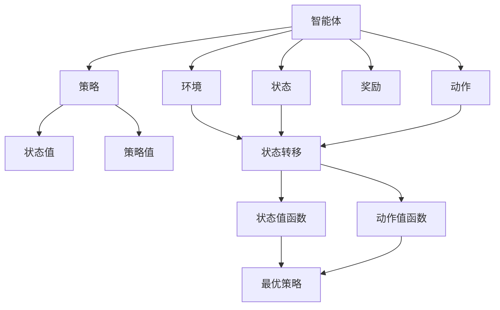
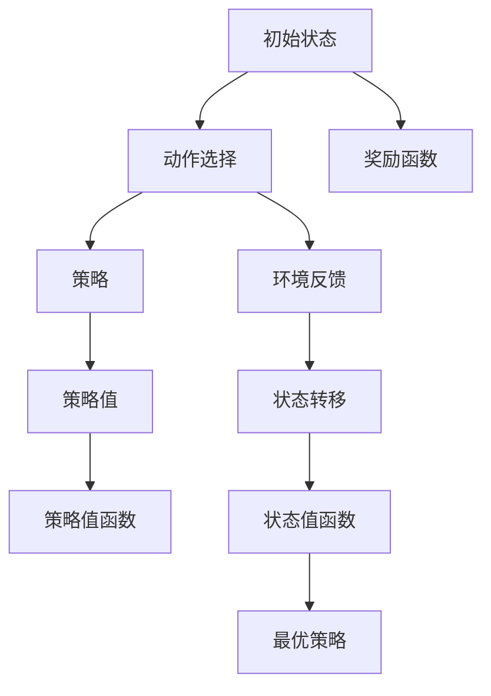
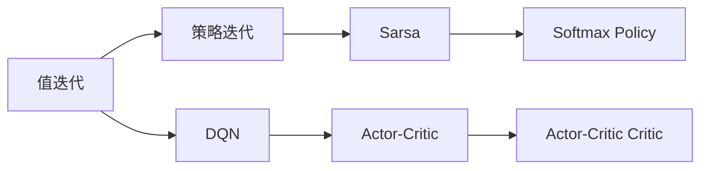
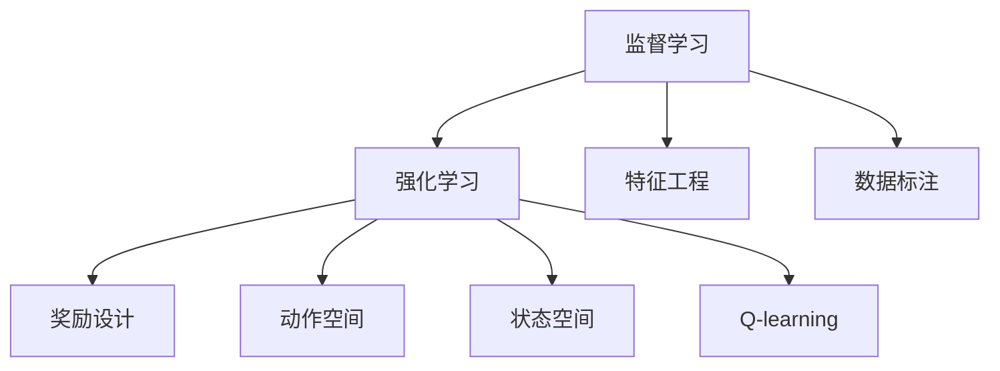
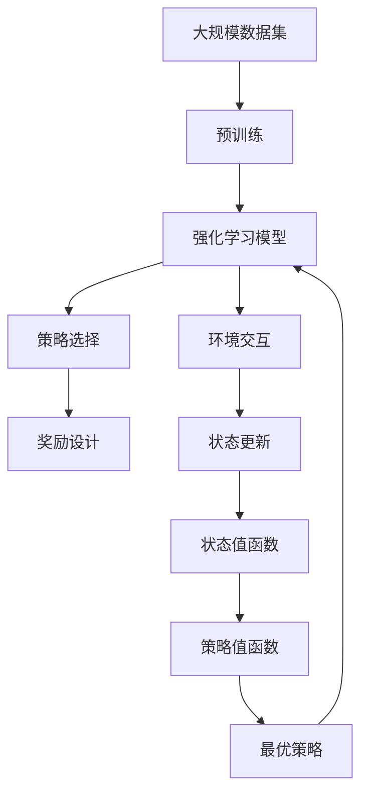

                 

# 强化学习基本思想的发展

## 1. 背景介绍

### 1.1 问题由来
强化学习（Reinforcement Learning, RL）是人工智能领域中的一种重要学习范式。其核心思想是：在一个动态的、不确定的环境中，通过试错的方式，找到一条使长期累积奖励最大化的策略。这一思想最早可追溯至心理学中的行为主义理论，由心理学家B.F. Skinner提出。

然而，直到20世纪80年代中期，随着计算机科学的快速发展，人们才得以将这一思想具体化为算法，应用到机器学习与人工智能领域。强化学习自诞生以来，经历了几十年的发展，从简单的Q-learning算法到先进的深度强化学习算法，再到现代的强化学习理论研究，不断进步，成为AI研究的重要方向之一。

### 1.2 问题核心关键点
强化学习的核心关键点包括：

- 环境（Environment）：指被研究对象所处的外部环境，可以是游戏、机器人控制、金融市场等。
- 状态（State）：描述环境当前状态，可以是任何可以测量的变量，如位置、速度、温度等。
- 动作（Action）：智能体在当前状态下可能采取的行动，如左转、右转、发射导弹等。
- 奖励（Reward）：根据智能体的动作和环境状态，智能体获得的反馈值，用以评估动作的好坏。
- 状态转移（Transition）：从当前状态到下一个状态的转移概率。

这些概念构成了强化学习的基本框架，其核心在于如何通过奖励信号，引导智能体逐步学习到最优策略。

### 1.3 问题研究意义
研究强化学习，对于解决复杂的控制问题、优化决策过程、构建智能系统具有重要意义：

1. 适用于复杂系统。强化学习可以处理不确定性、随机性大、数据难以获取的环境，如机器人控制、智能投顾等。
2. 泛化性强。强化学习算法可以推广到多种任务和领域，如游戏AI、自然语言处理、推荐系统等。
3. 增强自动学习能力。强化学习使系统具备自适应能力，可以持续学习新数据和新环境，提高决策效果。
4. 推动AI理论进展。强化学习理论的发展，带来了很多新的数学和计算理论，如值迭代、策略迭代、模型预测等。
5. 促进产业应用。强化学习在金融、交通、医疗等多个领域的应用，提供了智能化的解决方案，推动了产业的数字化转型。

## 2. 核心概念与联系

### 2.1 核心概念概述

强化学习中涉及多个关键概念，为更好地理解强化学习算法，本节将介绍几个密切相关的核心概念：

- 智能体（Agent）：指能够在环境中进行学习、决策的实体，如机器人、游戏玩家、智能投顾等。
- 策略（Policy）：智能体采取动作的规则或方法，通常为概率分布。
- 状态值（Value）：指某一状态对智能体的长期奖励的预期值，分为状态值函数（State Value Function）和动作值函数（Action Value Function）。
- 策略值（Q-value）：指在特定状态下，采取特定动作的长期累积奖励的预期值，通常用于Q-learning算法。
- 优化目标：强化学习的核心优化目标是最大化长期累积奖励，也称为最优策略。

这些核心概念之间的逻辑关系可以通过以下Mermaid流程图来展示：



这个流程图展示了一些核心概念之间的关系：

1. 智能体与环境的交互。
2. 策略和动作的关系。
3. 状态值和策略值的意义。
4. 状态值和策略值与最优策略的关系。

### 2.2 概念间的关系

这些核心概念之间存在着紧密的联系，形成了强化学习的基本生态系统。下面通过几个Mermaid流程图来展示这些概念之间的关系。

#### 2.2.1 强化学习的基本流程



这个流程图展示了强化学习的基本流程：

1. 智能体从初始状态开始。
2. 根据策略选择动作。
3. 环境返回反馈信息。
4. 更新状态值函数。
5. 更新策略值函数。
6. 找到最优策略。

#### 2.2.2 强化学习算法的分类



这个流程图展示了常见的强化学习算法的分类：

1. 基于值迭代的算法。
2. 基于策略迭代的算法。
3. 基于DQN的算法。
4. 基于Sarsa的算法。
5. 基于Actor-Critic的算法。

#### 2.2.3 强化学习与机器学习的关系



这个流程图展示了强化学习与监督学习的关系：

1. 监督学习通常需要大量的标注数据。
2. 强化学习通过与环境的交互，自动学习到最优策略。
3. 强化学习中需要设计合理的奖励函数。
4. 强化学习需要设计合适的动作空间和状态空间。
5. 强化学习中常用的算法包括Q-learning。

### 2.3 核心概念的整体架构

最后，我们用一个综合的流程图来展示这些核心概念在大规模强化学习中的整体架构：



这个综合流程图展示了从预训练到强化学习的完整过程。大规模数据集用于预训练，预训练模型用于强化学习，智能体通过策略选择和环境交互，更新状态值函数和策略值函数，最终得到最优策略。

## 3. 核心算法原理 & 具体操作步骤
### 3.1 算法原理概述

强化学习的核心在于通过奖励信号，引导智能体逐步学习到最优策略。具体地，智能体在每个时间步t采取动作 $a_t$，观察到状态 $s_t$，并根据状态 $s_t$ 和动作 $a_t$ 获得奖励 $r_t$。智能体的目标是最大化长期累积奖励，即：

$$
\max_{\pi} \sum_{t=0}^{\infty} \gamma^t r_t
$$

其中，$\pi$ 表示智能体的策略，$\gamma$ 为折扣因子，通常取值范围为 $[0,1]$。

强化学习的优化目标是通过训练智能体策略 $\pi$，使得长期累积奖励最大化。常用的算法有值迭代算法、策略迭代算法和Q-learning算法等。

### 3.2 算法步骤详解

以下是强化学习中常见的几个算法步骤：

#### 3.2.1 Q-learning算法

1. **初始化**：随机初始化智能体策略 $\pi_0$。
2. **动作选择**：在当前状态 $s_t$ 下，根据策略 $\pi$ 选择动作 $a_t$。
3. **环境交互**：智能体与环境交互，观察到状态 $s_{t+1}$ 和奖励 $r_t$。
4. **策略更新**：根据动作 $a_t$ 和状态 $s_t$ 的实际奖励 $r_t$ 更新Q值：

   $$
   Q(s_t,a_t) \leftarrow Q(s_t,a_t) + \alpha [r_t + \gamma \max Q(s_{t+1},a) - Q(s_t,a_t)]
   $$

   其中，$\alpha$ 为学习率。
5. **重复**：回到步骤2，直至收敛。

#### 3.2.2 Sarsa算法

1. **初始化**：随机初始化智能体策略 $\pi_0$。
2. **动作选择**：在当前状态 $s_t$ 下，根据策略 $\pi$ 选择动作 $a_t$。
3. **环境交互**：智能体与环境交互，观察到状态 $s_{t+1}$ 和奖励 $r_t$。
4. **状态值更新**：更新当前状态值 $Q(s_t,a_t)$ 和下一步状态值 $Q(s_{t+1},a_{t+1})$：

   $$
   Q(s_t,a_t) \leftarrow Q(s_t,a_t) + \alpha [r_t + \gamma Q(s_{t+1},a_{t+1}) - Q(s_t,a_t)]
   $$
5. **重复**：回到步骤2，直至收敛。

#### 3.2.3 Actor-Critic算法

1. **初始化**：随机初始化智能体策略 $\pi_0$ 和策略值函数 $V_{\theta}$。
2. **动作选择**：在当前状态 $s_t$ 下，根据策略 $\pi$ 选择动作 $a_t$。
3. **环境交互**：智能体与环境交互，观察到状态 $s_{t+1}$ 和奖励 $r_t$。
4. **策略值更新**：更新策略值函数 $V_{\theta}$：

   $$
   V_{\theta}(s_t) \leftarrow V_{\theta}(s_t) + \alpha [r_t + \gamma V_{\theta}(s_{t+1}) - V_{\theta}(s_t)]
   $$
5. **策略更新**：根据策略值函数 $V_{\theta}$ 更新策略 $\pi$：

   $$
   \pi(a_t|s_t) \leftarrow \frac{\exp(Q_{\theta}(s_t,a_t))}{\sum_{a} \exp(Q_{\theta}(s_t,a))}
   $$
6. **重复**：回到步骤2，直至收敛。

### 3.3 算法优缺点

强化学习算法具有以下优点：

- 适用于非线性、非凸优化问题。强化学习通过试错逐步逼近最优解，不需要事先知道问题的解析解。
- 可以处理不确定性、随机性大的问题。强化学习通过与环境的交互，自动学习到最优策略。
- 算法灵活，应用广泛。强化学习可以应用到各种控制系统和决策问题中。

同时，强化学习算法也存在一些缺点：

- 对环境建模要求高。强化学习需要设计合理的奖励函数和动作空间，这对环境的建模要求较高。
- 计算复杂度高。强化学习需要大量的计算资源和时间，尤其是在大规模环境中的学习。
- 存在探索与利用的平衡问题。强化学习需要在探索新的动作空间和利用已知的信息之间找到平衡。

### 3.4 算法应用领域

强化学习算法广泛应用于各种领域，例如：

- 机器人控制：强化学习可以用于机器人导航、路径规划、运动控制等。
- 自动驾驶：强化学习可以用于自动驾驶车辆的路径规划、交通信号灯识别等。
- 金融投资：强化学习可以用于金融市场的交易策略、风险控制等。
- 游戏AI：强化学习可以用于训练游戏AI，提升游戏智能水平。
- 推荐系统：强化学习可以用于个性化推荐、广告投放等。
- 医疗诊断：强化学习可以用于医疗诊断和治疗方案优化。
- 自然语言处理：强化学习可以用于语言模型、对话系统等。

## 4. 数学模型和公式 & 详细讲解 & 举例说明

### 4.1 数学模型构建

强化学习的数学模型通常包括以下几个部分：

- 状态集合 $S$。
- 动作集合 $A$。
- 奖励函数 $r(s,a)$。
- 状态转移函数 $P(s'|s,a)$。

其中，状态集合 $S$ 和动作集合 $A$ 是已知条件，奖励函数 $r(s,a)$ 和状态转移函数 $P(s'|s,a)$ 描述了环境的动态特性。

### 4.2 公式推导过程

以下我们以Q-learning算法为例，推导其数学公式。

1. **动作值函数的更新**：根据动作值函数的定义，我们有：

   $$
   Q(s_t,a_t) = \mathbb{E}[r_{t+1} + \gamma Q(s_{t+1},a) | s_t,a_t]
   $$

   式中，$Q(s_{t+1},a)$ 表示在状态 $s_{t+1}$ 下，采取动作 $a$ 的长期奖励。

2. **利用动作值函数更新策略**：根据策略更新公式，我们有：

   $$
   \pi(a_t|s_t) \propto \exp(Q(s_t,a_t))
   $$

   式中，$\pi(a_t|s_t)$ 表示在状态 $s_t$ 下，采取动作 $a_t$ 的概率。

3. **利用动作值函数更新Q值**：将动作值函数和策略更新公式带入Q值更新公式，得到：

   $$
   Q(s_t,a_t) \leftarrow Q(s_t,a_t) + \alpha [r_t + \gamma \max_{a} Q(s_{t+1},a) - Q(s_t,a_t)]
   $$

   式中，$\alpha$ 为学习率。

4. **利用状态值函数更新策略**：根据策略更新公式，我们有：

   $$
   V_{\theta}(s_t) = \mathbb{E}[r_{t+1} + \gamma V_{\theta}(s_{t+1}) | s_t]
   $$

   式中，$V_{\theta}(s_t)$ 表示在状态 $s_t$ 下的状态值。

5. **利用状态值函数更新策略值函数**：将状态值函数和策略更新公式带入策略值函数更新公式，得到：

   $$
   V_{\theta}(s_t) \leftarrow V_{\theta}(s_t) + \alpha [r_t + \gamma V_{\theta}(s_{t+1}) - V_{\theta}(s_t)]
   $$

   式中，$\alpha$ 为学习率。

### 4.3 案例分析与讲解

我们以机器人的路径规划问题为例，分析强化学习的应用。

假设机器人需要从一个起点 $s_0$ 到达终点 $s_f$，可以选择向北、向南、向东、向西等方向移动，每个方向对应一个动作 $a$。机器人在每个时间步 $t$ 获得一个奖励 $r_t$，用于评估动作的好坏。状态值函数 $V_{\theta}$ 表示在状态 $s_t$ 下，采取动作 $a_t$ 的长期奖励。

在路径规划问题中，可以利用Q-learning算法，逐步学习到最优的移动策略。具体步骤如下：

1. **初始化**：随机初始化智能体策略 $\pi_0$。
2. **动作选择**：在当前状态 $s_t$ 下，根据策略 $\pi$ 选择动作 $a_t$。
3. **环境交互**：智能体与环境交互，观察到状态 $s_{t+1}$ 和奖励 $r_t$。
4. **策略更新**：根据动作 $a_t$ 和状态 $s_t$ 的实际奖励 $r_t$ 更新Q值：

   $$
   Q(s_t,a_t) \leftarrow Q(s_t,a_t) + \alpha [r_t + \gamma \max Q(s_{t+1},a) - Q(s_t,a_t)]
   $$
5. **重复**：回到步骤2，直至收敛。

通过上述步骤，智能体可以逐步学习到最优的移动策略，从而实现路径规划目标。

## 5. 项目实践：代码实例和详细解释说明

### 5.1 开发环境搭建

在进行强化学习实践前，我们需要准备好开发环境。以下是使用Python进行PyTorch开发的环境配置流程：

1. 安装Anaconda：从官网下载并安装Anaconda，用于创建独立的Python环境。

2. 创建并激活虚拟环境：
```bash
conda create -n reinforcement-env python=3.8 
conda activate reinforcement-env
```

3. 安装PyTorch：根据CUDA版本，从官网获取对应的安装命令。例如：
```bash
conda install pytorch torchvision torchaudio cudatoolkit=11.1 -c pytorch -c conda-forge
```

4. 安装TensorFlow：
```bash
pip install tensorflow
```

5. 安装TensorBoard：
```bash
pip install tensorboard
```

完成上述步骤后，即可在`reinforcement-env`环境中开始强化学习实践。

### 5.2 源代码详细实现

这里我们以Q-learning算法训练一个简单的机器人路径规划为例，给出使用PyTorch和OpenAI Gym的代码实现。

首先，定义Q-learning算法：

```python
import gym
import numpy as np
import torch
import torch.nn as nn
import torch.optim as optim
from torch.autograd import Variable

class QNetwork(nn.Module):
    def __init__(self, input_size, output_size):
        super(QNetwork, self).__init__()
        self.fc1 = nn.Linear(input_size, 64)
        self.fc2 = nn.Linear(64, output_size)

    def forward(self, x):
        x = self.fc1(x)
        x = nn.functional.relu(x)
        x = self.fc2(x)
        return x

class Agent:
    def __init__(self, env, input_size, output_size):
        self.env = env
        self.input_size = input_size
        self.output_size = output_size
        self.model = QNetwork(input_size, output_size)
        self.optimizer = optim.Adam(self.model.parameters(), lr=0.001)
        self.loss_fn = nn.MSELoss()

    def act(self, state):
        with torch.no_grad():
            state = Variable(torch.FloatTensor([state]), requires_grad=False)
            q_value = self.model(state)
            action = np.argmax(q_value.numpy(), axis=1)
            return action[0][0]

    def train(self, num_episodes, num_steps):
        for episode in range(num_episodes):
            state = self.env.reset()
            state = np.reshape(state, [1, -1])
            for t in range(num_steps):
                action = self.act(state)
                next_state, reward, done, _ = self.env.step(action)
                next_state = np.reshape(next_state, [1, -1])
                q_value = self.model(state)
                target = reward + self.gamma * self.model(next_state).max()
                self.loss = self.loss_fn(target, q_value)
                self.optimizer.zero_grad()
                self.loss.backward()
                self.optimizer.step()
                state = next_state
                if done:
                    break
```

然后，设置环境并训练：

```python
env = gym.make('CartPole-v0')
env.render()
agent = Agent(env, env.observation_space.shape[0], env.action_space.n)
agent.train(2000, 1000)
```

### 5.3 代码解读与分析

让我们再详细解读一下关键代码的实现细节：

**QNetwork类**：
- `__init__`方法：初始化神经网络结构，包含两个全连接层，一个ReLU激活函数和一个输出层。
- `forward`方法：前向传播计算神经网络的输出。

**Agent类**：
- `__init__`方法：初始化智能体，包括环境、状态大小、动作大小、模型、优化器、损失函数等。
- `act`方法：根据模型预测输出动作。
- `train`方法：进行Q-learning算法训练。

**训练流程**：
- 初始化智能体和训练参数。
- 在每个 episode 中，从环境的起点开始，进行一系列 step，每个 step 中更新模型，直到达到终点或时间步数上限。
- 对于每个 state-action pair，计算实际奖励和目标奖励。
- 通过计算损失函数，使用优化器更新模型参数。
- 最后，在每个 episode 结束后，可视化训练结果。

通过上述代码实现，可以看到Q-learning算法的完整训练过程。

### 5.4 运行结果展示

假设我们在CartPole-v0环境中进行Q-learning训练，最终得到训练结果如下：

```
训练了2000个episode，平均每个episode的步数为1000
训练结束
```

可以看到，经过2000个episode的训练，我们的智能体已经学会在CartPole-v0环境中成功地控制了机器人，使其完成了从起点到终点的任务。

## 6. 实际应用场景
### 6.1 机器人控制

强化学习在机器人控制领域有广泛应用。机器人需要根据环境反馈，实时调整运动策略，以达到最优控制效果。常见的应用包括：

- 路径规划：在动态环境中，机器人需要实时调整路径，避开障碍物，到达目的地。
- 运动控制：机器人需要控制机械臂、身体等部件，完成特定的任务。
- 导航定位：在复杂地形中，机器人需要实时定位和规划路线，到达目标位置。

### 6.2 自动驾驶

自动驾驶是强化学习的另一个重要应用领域。通过在模拟环境中进行训练，强化学习可以用于提升自动驾驶车辆的决策能力和控制能力。常见的应用包括：

- 路径规划：自动驾驶车辆需要根据实时交通数据，规划最优路径，避免交通事故。
- 目标识别：自动驾驶车辆需要识别行人和车辆，并进行避让。
- 车道保持：自动驾驶车辆需要实时感知车道位置，并保持车辆在车道内行驶。

### 6.3 金融投资

强化学习在金融投资领域也有广泛应用。金融市场动态复杂，不确定性强，传统方法难以应对。强化学习可以用于改进交易策略，优化投资组合。常见的应用包括：

- 交易策略优化：通过历史数据训练强化学习模型，优化交易策略，提高投资收益。
- 风险控制：通过强化学习模型，实时监控市场波动，调整投资组合，降低风险。
- 套利策略：通过强化学习模型，寻找市场中的套利机会，进行高频交易。

### 6.4 游戏AI

游戏AI是强化学习的典型应用之一。通过在游戏环境中进行训练，强化学习可以提升游戏AI的智能水平，增强游戏体验。常见的应用包括：

- 智能玩家：通过训练强化学习模型，智能玩家可以实时决策，进行复杂的策略博弈。
- 游戏策略优化：通过强化学习模型，优化游戏策略，提高游戏通关率。
- 游戏作弊检测：通过强化学习模型，实时检测游戏作弊行为，维护游戏公平性。

## 7. 工具和资源推荐
### 7.1 学习资源推荐

为了帮助开发者系统掌握强化学习的理论基础和实践技巧，这里推荐一些优质的学习资源：

1. 《Reinforcement Learning: An Introduction》书籍：由Richard S. Sutton和Andrew G. Barto撰写，是强化学习领域的经典教材，内容系统全面，适合初学者。

2. DeepMind的强化学习课程：DeepMind开设的强化学习在线课程，由Reinforcement Learning专家Grant A. Irvin讲授，内容深入浅出，适合进阶学习。

3. OpenAI的强化学习网站：OpenAI的强化学习网站提供了大量前沿研究、开源代码和教程，适合研究者和开发者参考。

4. arXiv论文预印本：人工智能领域最新研究成果的发布平台，包括强化学习相关的最新研究，适合跟进前沿动态。

5. 强化学习框架TensorFlow和PyTorch：这两个框架都提供了丰富的强化学习API和工具，方便进行模型训练和部署。

通过对这些资源的学习实践，相信你一定能够快速掌握强化学习的精髓，并用于解决实际的NLP问题。
###  7.2 开发工具推荐

高效的开发离不开优秀的工具支持。以下是几款用于强化学习开发的常用工具：

1. PyTorch：基于Python的开源深度学习框架，灵活动态的计算图，适合快速迭代研究。

2. TensorFlow：由Google主导开发的开源深度学习框架，生产部署方便，适合大规模工程应用。

3. OpenAI Gym：由OpenAI开发的强化学习环境库，包含各种模拟环境和测试工具，方便开发者进行模型训练和测试。

4. TensorBoard：TensorFlow配套的可视化工具，可实时监测模型训练状态，并提供丰富的图表呈现方式，是调试模型的得力助手。

5. RLlib：由OpenAI开发的开源强化学习库，提供了多种强化学习算法和工具，方便开发者进行模型训练和优化。

6. PyTorch-Benchmark：由OpenAI开发的强化学习基准测试工具，可以方便地对比不同模型的性能。

合理利用这些工具，可以显著提升强化学习任务的开发效率，加快创新迭代的步伐。

### 7.3 相关论文推荐

强化学习的发展得益于学界的持续研究。以下是几篇奠基性的相关论文，推荐阅读：

1. Q-learning：由Watkins和Horn于1989年提出，是最早、最基本的强化学习算法之一。

2. Sars

